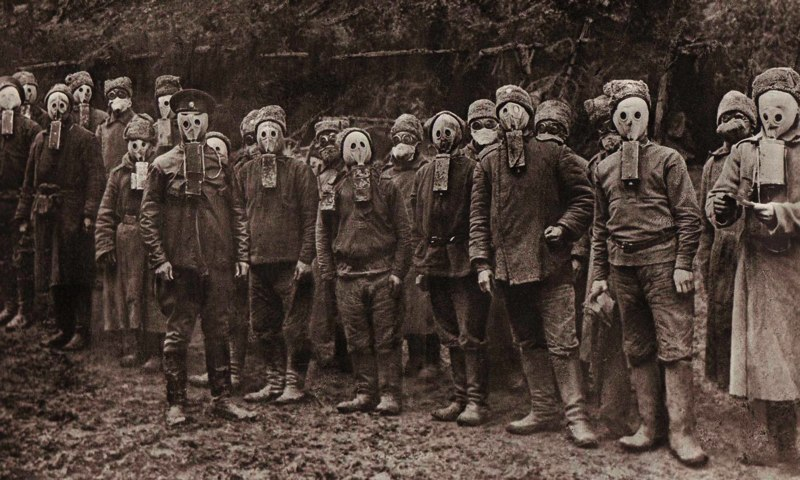

## Российская наука и техника в начале XX века. Влияние революции на развитие науки

### Российское инженерное образование в начале XX века

После реформ Александра II появилось несколько научных обществ:

* В 1866 году учреждение Русского технического общества (создание рабочих школ на предприятиях, выпуск журнала "Техник")
* В 1868 году было основано по инициативе Д. И. Менделеева _Русского физико-химического общества_
* В 1895 году был основан Российский археологический институт в Константинополе

Вместе с тем правительство осознавало недостаток в количестве выпускаемых инженеров. На начало XX века качество образование и количество выпускаемых инженеров коррелировало с темпами роста экономики

В России в период с 1900 по 1914 года количество выпускаемых инженеров в год выросло с 1000 до 2000

Первые Политехи в 1898 году появились в Киеве и в Варшаве, затем в 1902 в Санкт-Петербурге и в 1907 в Новочеркасске.Преимуществом было наличие новейших лабораторий

Политехнические институты сочетали техническое и ествественно-научное образование с экономическим, благодаря чему инженеры умели коммерциализировать свои изобретения

В то время правительство усовершенствовало и упростило системы выдачи патентов, создало благоприятные условия для иностранных инвестиций. Были сделаны государственные инвестиции в науку и инфраструктуру

В 1878 году инженером В. Г. Шуховым был построен первый в России нефтепровод и цилиндрические резервуары

### Достижения российской науки в предвоенный период

**Петр Николаевич Лебедев** - русский физик-экспериментатор, в 1900 году экспериментально обнаружил давление света - до этого оно было предсказано Максвеллом. Создатель первой в России научной физической школы при московском университете (одним из его учеников был Сергей Иванович Вавилов). В 1911 году, протестуя против самоуправства министра просвещения, Лебедев присоединился к ученым, ушедшим из университета

**Николай Алексеевич Умов** - физик, после смерти А. Г. Столетова возглавил кафедру физики Московского университета. Умов ввел понятие о потоке энергии ("вектор Умова"), создал ряд важных работ по земному магнетизму, решил в общем виде задачу о распределении электрических токов по поверхности проводников, которую завершил Кирхгоф

**Иван Петрович Павлов** разрабатывал основные принципы деятельности мозга: формирование ассоциативных связей при выработке условных рефлексов, закономерстости закрепления и угасания условно-рефлекторной деятельности, торможение нервных процессов.  
В 1904 году был удостоен Нобелевской премии

**Жуковский Николай Егорович** начал исследования воздухоплавания при кабинете прикладной механики с 1889 года. В докладе Московскому математическому обществу Жуковский в ноябре 1905 года дал знаменитую формулу для определения подъемной силы самолета. Жуковский создал вихревую теорию гребного винта (пропеллера) самолета и вертолета.  
В 1918 году Жуковским был основан Центральный аэрогидродинамический институт.

### Отечественная наука и техника в Первой мировой войне

В годы Первой мировой войны Россия сильно оставала по производству вооружения от остальных участников. В 1915 году Академия наук создала Комиссию по изучению естественных производительных сил России под председательством В. И. Вернандского, в составе которой работали выдающиеся геологи, химики, физики, биологи. Результаты работы - материалы по исследованию природных ископаемых и методов их использования - были использованы уже советским правительством.

Война привела к централизации управления наукой. Советская модель управления наукой основывалась на модели управления в Первой мировой

В это время С. И. Мосин возглавил комиссию по перевооружению. В течение войны военная промышленность России изготовила 3.2 млн винтовок Мосина

Поражение в Русско-Японской войне ослабило российский флот. После нее появились линкоры-дредноуты "Севастополь". Однако они не так часто использовались в Первой мировой из-за угрозы потопления торпедами.

Химик Зелинский в 1915 году разработал конструкцию угольного противогаза. В течение 1916-1917 годов было выпущено свыше 11 миллионов этих противогазов в ответ на применение газового оружия Германской империей

В сентябре 1915 года начались испытания ранцевых огнеметов образца Горбова. В феврале 1916 года был выдан заказ на производство 1.5 тысячи таких огнеметов

### Революция и наука в России

После Февральской революции 1917 года Университеты обрели самоуправление, а Академия наук впервые самостоятельно избрала президента - геолога А. П. Карпинского

С приходом к власти большевиков в октябре 1917 года Академия наук воздерживалась от политических заявлений и приступила к сотрудничеству с новой властью, что спасло ее от преследований. После революции ученые степени в Советской России были ликвидированы; восстановлены лишь в 1938 году

В августе 1922 года из страны было выслано около 160 оппозиционно настроенных деятелей наук и культуры

В июне 1918 года геолог Александр Ферсман от имени группы ученых Академии предложил план создания Союза ученых, который собрал бы под одну крышу всех ученых и все научные организации Советской России. Академический проект предполагал создать организацию по функциональному, а не дисциплинарному принципу, а главной функцией Союза ученых должно было стать обеспечение механизма государственной финансовой поддержки науки, а не внутренний контроль над научными исследованиями

В июне 1918 года была основана Социалистическая (позднее Коммунистическая) Академия. В начале Академия занималась гуманитарными науками с марксистской точки зрения, позднее обрела и небольшое естественнонаучное отделение. Постановлением от 7 февраля 1936 года параллельное существование Академии Наук и Коммунистической Академии стало нецелесообразным, поэтому учреждения Коммунистической Академии были переведены в Академию наук СССР

На базе Коммунистической академии с 1969 года возник Институт научной информации по общественным наукам АН СССР

### Судьбы российских ученых и инженеров в эмиграции

Русский научный институт в Белграде в 1931 году сделал попытку массового анкетирования эмигрантов и получил ответ от 472 русских ученых (в том числе 5 академиков) и 1140 бывших преподавателей университетов и высших школ. Таким образом, всего откликнулось 1612 человек.

В начале 1920-ых Русская академическая группа основала в Берлине Русский институт. После 1924 года многие русские эмигранты перебрались в Прагу, где был открыт целый ряд учебных заведений с преподаванием на русском языке. В Париже также появился Народный университет для русских эмигрантов. Научный институт русских эмигрантов был создан и в Белграде

Знаменитыми учеными в эмиграции стали В. К. Зворыкин, изобретатель цветного телевидения, П. А. Сорокин, социолог, И. И. Сикорский, авиаконструктор.
