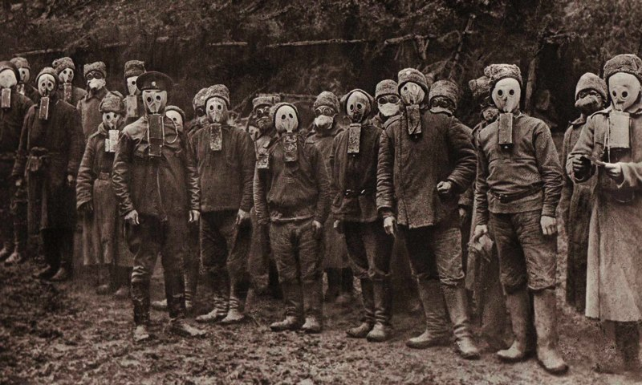

#  История российской науки и техники

* [История российской науки и техники](#%D0%B8%D1%81%D1%82%D0%BE%D1%80%D0%B8%D1%8F-%D1%80%D0%BE%D1%81%D1%81%D0%B8%D0%B9%D1%81%D0%BA%D0%BE%D0%B9-%D0%BD%D0%B0%D1%83%D0%BA%D0%B8-%D0%B8-%D1%82%D0%B5%D1%85%D0%BD%D0%B8%D0%BA%D0%B8)
  * [Научные знания и источники в Древней Руси](#%D0%BD%D0%B0%D1%83%D1%87%D0%BD%D1%8B%D0%B5-%D0%B7%D0%BD%D0%B0%D0%BD%D0%B8%D1%8F-%D0%B8-%D0%B8%D1%81%D1%82%D0%BE%D1%87%D0%BD%D0%B8%D0%BA%D0%B8-%D0%B2-%D0%B4%D1%80%D0%B5%D0%B2%D0%BD%D0%B5%D0%B9-%D1%80%D1%83%D1%81%D0%B8)
    * [Лекция](#%D0%BB%D0%B5%D0%BA%D1%86%D0%B8%D1%8F)
    * [Семинар](#%D1%81%D0%B5%D0%BC%D0%B8%D0%BD%D0%B0%D1%80)
  * [Научные и технические знания в Московской Руси](#%D0%BD%D0%B0%D1%83%D1%87%D0%BD%D1%8B%D0%B5-%D0%B8-%D1%82%D0%B5%D1%85%D0%BD%D0%B8%D1%87%D0%B5%D1%81%D0%BA%D0%B8%D0%B5-%D0%B7%D0%BD%D0%B0%D0%BD%D0%B8%D1%8F-%D0%B2-%D0%BC%D0%BE%D1%81%D0%BA%D0%BE%D0%B2%D1%81%D0%BA%D0%BE%D0%B9-%D1%80%D1%83%D1%81%D0%B8)
    * [Последствия монголо-татарского нашествия](#%D0%BF%D0%BE%D1%81%D0%BB%D0%B5%D0%B4%D1%81%D1%82%D0%B2%D0%B8%D1%8F-%D0%BC%D0%BE%D0%BD%D0%B3%D0%BE%D0%BB%D0%BE-%D1%82%D0%B0%D1%82%D0%B0%D1%80%D1%81%D0%BA%D0%BE%D0%B3%D0%BE-%D0%BD%D0%B0%D1%88%D0%B5%D1%81%D1%82%D0%B2%D0%B8%D1%8F)
    * [Начало книгопечатния](#%D0%BD%D0%B0%D1%87%D0%B0%D0%BB%D0%BE-%D0%BA%D0%BD%D0%B8%D0%B3%D0%BE%D0%BF%D0%B5%D1%87%D0%B0%D1%82%D0%BD%D0%B8%D1%8F)
    * [Уровень научных знаний в допетровской Руси](#%D1%83%D1%80%D0%BE%D0%B2%D0%B5%D0%BD%D1%8C-%D0%BD%D0%B0%D1%83%D1%87%D0%BD%D1%8B%D1%85-%D0%B7%D0%BD%D0%B0%D0%BD%D0%B8%D0%B9-%D0%B2-%D0%B4%D0%BE%D0%BF%D0%B5%D1%82%D1%80%D0%BE%D0%B2%D1%81%D0%BA%D0%BE%D0%B9-%D1%80%D1%83%D1%81%D0%B8)
  * [Петровские реформы и их влияние на развитие российской науки и техники](#%D0%BF%D0%B5%D1%82%D1%80%D0%BE%D0%B2%D1%81%D0%BA%D0%B8%D0%B5-%D1%80%D0%B5%D1%84%D0%BE%D1%80%D0%BC%D1%8B-%D0%B8-%D0%B8%D1%85-%D0%B2%D0%BB%D0%B8%D1%8F%D0%BD%D0%B8%D0%B5-%D0%BD%D0%B0-%D1%80%D0%B0%D0%B7%D0%B2%D0%B8%D1%82%D0%B8%D0%B5-%D1%80%D0%BE%D1%81%D1%81%D0%B8%D0%B9%D1%81%D0%BA%D0%BE%D0%B9-%D0%BD%D0%B0%D1%83%D0%BA%D0%B8-%D0%B8-%D1%82%D0%B5%D1%85%D0%BD%D0%B8%D0%BA%D0%B8)
    * [Реформы в системе образования](#%D1%80%D0%B5%D1%84%D0%BE%D1%80%D0%BC%D1%8B-%D0%B2-%D1%81%D0%B8%D1%81%D1%82%D0%B5%D0%BC%D0%B5-%D0%BE%D0%B1%D1%80%D0%B0%D0%B7%D0%BE%D0%B2%D0%B0%D0%BD%D0%B8%D1%8F)
    * [Создание музеев и библиотек](#%D1%81%D0%BE%D0%B7%D0%B4%D0%B0%D0%BD%D0%B8%D0%B5-%D0%BC%D1%83%D0%B7%D0%B5%D0%B5%D0%B2-%D0%B8-%D0%B1%D0%B8%D0%B1%D0%BB%D0%B8%D0%BE%D1%82%D0%B5%D0%BA)
    * [Организация Академии наук](#%D0%BE%D1%80%D0%B3%D0%B0%D0%BD%D0%B8%D0%B7%D0%B0%D1%86%D0%B8%D1%8F-%D0%B0%D0%BA%D0%B0%D0%B4%D0%B5%D0%BC%D0%B8%D0%B8-%D0%BD%D0%B0%D1%83%D0%BA)
    * [Географические и естественнонаучные экспедиции](#%D0%B3%D0%B5%D0%BE%D0%B3%D1%80%D0%B0%D1%84%D0%B8%D1%87%D0%B5%D1%81%D0%BA%D0%B8%D0%B5-%D0%B8-%D0%B5%D1%81%D1%82%D0%B5%D1%81%D1%82%D0%B2%D0%B5%D0%BD%D0%BD%D0%BE%D0%BD%D0%B0%D1%83%D1%87%D0%BD%D1%8B%D0%B5-%D1%8D%D0%BA%D1%81%D0%BF%D0%B5%D0%B4%D0%B8%D1%86%D0%B8%D0%B8)
    * [Технический новшества Петровской эпохи](#%D1%82%D0%B5%D1%85%D0%BD%D0%B8%D1%87%D0%B5%D1%81%D0%BA%D0%B8%D0%B9-%D0%BD%D0%BE%D0%B2%D1%88%D0%B5%D1%81%D1%82%D0%B2%D0%B0-%D0%BF%D0%B5%D1%82%D1%80%D0%BE%D0%B2%D1%81%D0%BA%D0%BE%D0%B9-%D1%8D%D0%BF%D0%BE%D1%85%D0%B8)
  * [Российская наука и техника во второй половине XVIII веке](#%D1%80%D0%BE%D1%81%D1%81%D0%B8%D0%B9%D1%81%D0%BA%D0%B0%D1%8F-%D0%BD%D0%B0%D1%83%D0%BA%D0%B0-%D0%B8-%D1%82%D0%B5%D1%85%D0%BD%D0%B8%D0%BA%D0%B0-%D0%B2%D0%BE-%D0%B2%D1%82%D0%BE%D1%80%D0%BE%D0%B9-%D0%BF%D0%BE%D0%BB%D0%BE%D0%B2%D0%B8%D0%BD%D0%B5-xviii-%D0%B2%D0%B5%D0%BA%D0%B5)
    * [Михаил Васильевич Ломоносов](#%D0%BC%D0%B8%D1%85%D0%B0%D0%B8%D0%BB-%D0%B2%D0%B0%D1%81%D0%B8%D0%BB%D1%8C%D0%B5%D0%B2%D0%B8%D1%87-%D0%BB%D0%BE%D0%BC%D0%BE%D0%BD%D0%BE%D1%81%D0%BE%D0%B2)
    * [Великая северная экспедиция](#%D0%B2%D0%B5%D0%BB%D0%B8%D0%BA%D0%B0%D1%8F-%D1%81%D0%B5%D0%B2%D0%B5%D1%80%D0%BD%D0%B0%D1%8F-%D1%8D%D0%BA%D1%81%D0%BF%D0%B5%D0%B4%D0%B8%D1%86%D0%B8%D1%8F)
    * [Реформы в сфере образования второй половины XVIII века](#%D1%80%D0%B5%D1%84%D0%BE%D1%80%D0%BC%D1%8B-%D0%B2-%D1%81%D1%84%D0%B5%D1%80%D0%B5-%D0%BE%D0%B1%D1%80%D0%B0%D0%B7%D0%BE%D0%B2%D0%B0%D0%BD%D0%B8%D1%8F-%D0%B2%D1%82%D0%BE%D1%80%D0%BE%D0%B9-%D0%BF%D0%BE%D0%BB%D0%BE%D0%B2%D0%B8%D0%BD%D1%8B-xviii-%D0%B2%D0%B5%D0%BA%D0%B0)
    * [Технологические прорывы России XVIII века](#%D1%82%D0%B5%D1%85%D0%BD%D0%BE%D0%BB%D0%BE%D0%B3%D0%B8%D1%87%D0%B5%D1%81%D0%BA%D0%B8%D0%B5-%D0%BF%D1%80%D0%BE%D1%80%D1%8B%D0%B2%D1%8B-%D1%80%D0%BE%D1%81%D1%81%D0%B8%D0%B8-xviii-%D0%B2%D0%B5%D0%BA%D0%B0)
  * [Российская наука и техника в первой половине XIX века](#%D1%80%D0%BE%D1%81%D1%81%D0%B8%D0%B9%D1%81%D0%BA%D0%B0%D1%8F-%D0%BD%D0%B0%D1%83%D0%BA%D0%B0-%D0%B8-%D1%82%D0%B5%D1%85%D0%BD%D0%B8%D0%BA%D0%B0-%D0%B2-%D0%BF%D0%B5%D1%80%D0%B2%D0%BE%D0%B9-%D0%BF%D0%BE%D0%BB%D0%BE%D0%B2%D0%B8%D0%BD%D0%B5-xix-%D0%B2%D0%B5%D0%BA%D0%B0)
    * [Российское образование и Академия наук в первой половине XIX века](#%D1%80%D0%BE%D1%81%D1%81%D0%B8%D0%B9%D1%81%D0%BA%D0%BE%D0%B5-%D0%BE%D0%B1%D1%80%D0%B0%D0%B7%D0%BE%D0%B2%D0%B0%D0%BD%D0%B8%D0%B5-%D0%B8-%D0%B0%D0%BA%D0%B0%D0%B4%D0%B5%D0%BC%D0%B8%D1%8F-%D0%BD%D0%B0%D1%83%D0%BA-%D0%B2-%D0%BF%D0%B5%D1%80%D0%B2%D0%BE%D0%B9-%D0%BF%D0%BE%D0%BB%D0%BE%D0%B2%D0%B8%D0%BD%D0%B5-xix-%D0%B2%D0%B5%D0%BA%D0%B0)
    * [Успехи русских ученых в математике. Геометрия Лобачевского](#%D1%83%D1%81%D0%BF%D0%B5%D1%85%D0%B8-%D1%80%D1%83%D1%81%D1%81%D0%BA%D0%B8%D1%85-%D1%83%D1%87%D0%B5%D0%BD%D1%8B%D1%85-%D0%B2-%D0%BC%D0%B0%D1%82%D0%B5%D0%BC%D0%B0%D1%82%D0%B8%D0%BA%D0%B5.-%D0%B3%D0%B5%D0%BE%D0%BC%D0%B5%D1%82%D1%80%D0%B8%D1%8F-%D0%BB%D0%BE%D0%B1%D0%B0%D1%87%D0%B5%D0%B2%D1%81%D0%BA%D0%BE%D0%B3%D0%BE)
    * [Достижения в астрономии, физике и химии](#%D0%B4%D0%BE%D1%81%D1%82%D0%B8%D0%B6%D0%B5%D0%BD%D0%B8%D1%8F-%D0%B2-%D0%B0%D1%81%D1%82%D1%80%D0%BE%D0%BD%D0%BE%D0%BC%D0%B8%D0%B8%2C-%D1%84%D0%B8%D0%B7%D0%B8%D0%BA%D0%B5-%D0%B8-%D1%85%D0%B8%D0%BC%D0%B8%D0%B8)
    * [Географические исследования. Открытие Антарктиды](#%D0%B3%D0%B5%D0%BE%D0%B3%D1%80%D0%B0%D1%84%D0%B8%D1%87%D0%B5%D1%81%D0%BA%D0%B8%D0%B5-%D0%B8%D1%81%D1%81%D0%BB%D0%B5%D0%B4%D0%BE%D0%B2%D0%B0%D0%BD%D0%B8%D1%8F.-%D0%BE%D1%82%D0%BA%D1%80%D1%8B%D1%82%D0%B8%D0%B5-%D0%B0%D0%BD%D1%82%D0%B0%D1%80%D0%BA%D1%82%D0%B8%D0%B4%D1%8B)
    * [Инженерное дело и технический прогресс](#%D0%B8%D0%BD%D0%B6%D0%B5%D0%BD%D0%B5%D1%80%D0%BD%D0%BE%D0%B5-%D0%B4%D0%B5%D0%BB%D0%BE-%D0%B8-%D1%82%D0%B5%D1%85%D0%BD%D0%B8%D1%87%D0%B5%D1%81%D0%BA%D0%B8%D0%B9-%D0%BF%D1%80%D0%BE%D0%B3%D1%80%D0%B5%D1%81%D1%81)
  * [Российская наука и техника во второй половине XIX века](#%D1%80%D0%BE%D1%81%D1%81%D0%B8%D0%B9%D1%81%D0%BA%D0%B0%D1%8F-%D0%BD%D0%B0%D1%83%D0%BA%D0%B0-%D0%B8-%D1%82%D0%B5%D1%85%D0%BD%D0%B8%D0%BA%D0%B0-%D0%B2%D0%BE-%D0%B2%D1%82%D0%BE%D1%80%D0%BE%D0%B9-%D0%BF%D0%BE%D0%BB%D0%BE%D0%B2%D0%B8%D0%BD%D0%B5-xix-%D0%B2%D0%B5%D0%BA%D0%B0)
    * [Образование](#%D0%BE%D0%B1%D1%80%D0%B0%D0%B7%D0%BE%D0%B2%D0%B0%D0%BD%D0%B8%D0%B5)
    * [Достижения в науке](#%D0%B4%D0%BE%D1%81%D1%82%D0%B8%D0%B6%D0%B5%D0%BD%D0%B8%D1%8F-%D0%B2-%D0%BD%D0%B0%D1%83%D0%BA%D0%B5)
    * [Географические открытия](#%D0%B3%D0%B5%D0%BE%D0%B3%D1%80%D0%B0%D1%84%D0%B8%D1%87%D0%B5%D1%81%D0%BA%D0%B8%D0%B5-%D0%BE%D1%82%D0%BA%D1%80%D1%8B%D1%82%D0%B8%D1%8F)
    * [Другие достижения](#%D0%B4%D1%80%D1%83%D0%B3%D0%B8%D0%B5-%D0%B4%D0%BE%D1%81%D1%82%D0%B8%D0%B6%D0%B5%D0%BD%D0%B8%D1%8F)
  * [Российская наука и техника в начале XX века. Влияние революции на развитие науки](#%D1%80%D0%BE%D1%81%D1%81%D0%B8%D0%B9%D1%81%D0%BA%D0%B0%D1%8F-%D0%BD%D0%B0%D1%83%D0%BA%D0%B0-%D0%B8-%D1%82%D0%B5%D1%85%D0%BD%D0%B8%D0%BA%D0%B0-%D0%B2-%D0%BD%D0%B0%D1%87%D0%B0%D0%BB%D0%B5-xx-%D0%B2%D0%B5%D0%BA%D0%B0.-%D0%B2%D0%BB%D0%B8%D1%8F%D0%BD%D0%B8%D0%B5-%D1%80%D0%B5%D0%B2%D0%BE%D0%BB%D1%8E%D1%86%D0%B8%D0%B8-%D0%BD%D0%B0-%D1%80%D0%B0%D0%B7%D0%B2%D0%B8%D1%82%D0%B8%D0%B5-%D0%BD%D0%B0%D1%83%D0%BA%D0%B8)
    * [Российское инженерное образование в начале XX века](#%D1%80%D0%BE%D1%81%D1%81%D0%B8%D0%B9%D1%81%D0%BA%D0%BE%D0%B5-%D0%B8%D0%BD%D0%B6%D0%B5%D0%BD%D0%B5%D1%80%D0%BD%D0%BE%D0%B5-%D0%BE%D0%B1%D1%80%D0%B0%D0%B7%D0%BE%D0%B2%D0%B0%D0%BD%D0%B8%D0%B5-%D0%B2-%D0%BD%D0%B0%D1%87%D0%B0%D0%BB%D0%B5-xx-%D0%B2%D0%B5%D0%BA%D0%B0)
    * [Достижения российской науки в предвоенный период](#%D0%B4%D0%BE%D1%81%D1%82%D0%B8%D0%B6%D0%B5%D0%BD%D0%B8%D1%8F-%D1%80%D0%BE%D1%81%D1%81%D0%B8%D0%B9%D1%81%D0%BA%D0%BE%D0%B9-%D0%BD%D0%B0%D1%83%D0%BA%D0%B8-%D0%B2-%D0%BF%D1%80%D0%B5%D0%B4%D0%B2%D0%BE%D0%B5%D0%BD%D0%BD%D1%8B%D0%B9-%D0%BF%D0%B5%D1%80%D0%B8%D0%BE%D0%B4)
    * [Отечественная наука и техника в Первой мировой войне](#%D0%BE%D1%82%D0%B5%D1%87%D0%B5%D1%81%D1%82%D0%B2%D0%B5%D0%BD%D0%BD%D0%B0%D1%8F-%D0%BD%D0%B0%D1%83%D0%BA%D0%B0-%D0%B8-%D1%82%D0%B5%D1%85%D0%BD%D0%B8%D0%BA%D0%B0-%D0%B2-%D0%BF%D0%B5%D1%80%D0%B2%D0%BE%D0%B9-%D0%BC%D0%B8%D1%80%D0%BE%D0%B2%D0%BE%D0%B9-%D0%B2%D0%BE%D0%B9%D0%BD%D0%B5)
    * [Революция и наука в России](#%D1%80%D0%B5%D0%B2%D0%BE%D0%BB%D1%8E%D1%86%D0%B8%D1%8F-%D0%B8-%D0%BD%D0%B0%D1%83%D0%BA%D0%B0-%D0%B2-%D1%80%D0%BE%D1%81%D1%81%D0%B8%D0%B8)
    * [Судьбы российских ученых и инженеров в эмиграции](#%D1%81%D1%83%D0%B4%D1%8C%D0%B1%D1%8B-%D1%80%D0%BE%D1%81%D1%81%D0%B8%D0%B9%D1%81%D0%BA%D0%B8%D1%85-%D1%83%D1%87%D0%B5%D0%BD%D1%8B%D1%85-%D0%B8-%D0%B8%D0%BD%D0%B6%D0%B5%D0%BD%D0%B5%D1%80%D0%BE%D0%B2-%D0%B2-%D1%8D%D0%BC%D0%B8%D0%B3%D1%80%D0%B0%D1%86%D0%B8%D0%B8)
  * [Советское образование и наука в 1920-1930 годы](#%D1%81%D0%BE%D0%B2%D0%B5%D1%82%D1%81%D0%BA%D0%BE%D0%B5-%D0%BE%D0%B1%D1%80%D0%B0%D0%B7%D0%BE%D0%B2%D0%B0%D0%BD%D0%B8%D0%B5-%D0%B8-%D0%BD%D0%B0%D1%83%D0%BA%D0%B0-%D0%B2-1920-1930-%D0%B3%D0%BE%D0%B4%D1%8B)
    * [Становление советской системы образования](#%D1%81%D1%82%D0%B0%D0%BD%D0%BE%D0%B2%D0%BB%D0%B5%D0%BD%D0%B8%D0%B5-%D1%81%D0%BE%D0%B2%D0%B5%D1%82%D1%81%D0%BA%D0%BE%D0%B9-%D1%81%D0%B8%D1%81%D1%82%D0%B5%D0%BC%D1%8B-%D0%BE%D0%B1%D1%80%D0%B0%D0%B7%D0%BE%D0%B2%D0%B0%D0%BD%D0%B8%D1%8F)
    * [Полярные и геологические исследования](#%D0%BF%D0%BE%D0%BB%D1%8F%D1%80%D0%BD%D1%8B%D0%B5-%D0%B8-%D0%B3%D0%B5%D0%BE%D0%BB%D0%BE%D0%B3%D0%B8%D1%87%D0%B5%D1%81%D0%BA%D0%B8%D0%B5-%D0%B8%D1%81%D1%81%D0%BB%D0%B5%D0%B4%D0%BE%D0%B2%D0%B0%D0%BD%D0%B8%D1%8F)
    * [Советская физика и математика на заре своей истории](#%D1%81%D0%BE%D0%B2%D0%B5%D1%82%D1%81%D0%BA%D0%B0%D1%8F-%D1%84%D0%B8%D0%B7%D0%B8%D0%BA%D0%B0-%D0%B8-%D0%BC%D0%B0%D1%82%D0%B5%D0%BC%D0%B0%D1%82%D0%B8%D0%BA%D0%B0-%D0%BD%D0%B0-%D0%B7%D0%B0%D1%80%D0%B5-%D1%81%D0%B2%D0%BE%D0%B5%D0%B9-%D0%B8%D1%81%D1%82%D0%BE%D1%80%D0%B8%D0%B8)
    * [Биомедицинские науки и судьбы советской генетики](#%D0%B1%D0%B8%D0%BE%D0%BC%D0%B5%D0%B4%D0%B8%D1%86%D0%B8%D0%BD%D1%81%D0%BA%D0%B8%D0%B5-%D0%BD%D0%B0%D1%83%D0%BA%D0%B8-%D0%B8-%D1%81%D1%83%D0%B4%D1%8C%D0%B1%D1%8B-%D1%81%D0%BE%D0%B2%D0%B5%D1%82%D1%81%D0%BA%D0%BE%D0%B9-%D0%B3%D0%B5%D0%BD%D0%B5%D1%82%D0%B8%D0%BA%D0%B8)
    * [Индустриализация и технический прогресс](#%D0%B8%D0%BD%D0%B4%D1%83%D1%81%D1%82%D1%80%D0%B8%D0%B0%D0%BB%D0%B8%D0%B7%D0%B0%D1%86%D0%B8%D1%8F-%D0%B8-%D1%82%D0%B5%D1%85%D0%BD%D0%B8%D1%87%D0%B5%D1%81%D0%BA%D0%B8%D0%B9-%D0%BF%D1%80%D0%BE%D0%B3%D1%80%D0%B5%D1%81%D1%81)
  * [Советское образование и наука в годы Великой Отечественной войны](#%D1%81%D0%BE%D0%B2%D0%B5%D1%82%D1%81%D0%BA%D0%BE%D0%B5-%D0%BE%D0%B1%D1%80%D0%B0%D0%B7%D0%BE%D0%B2%D0%B0%D0%BD%D0%B8%D0%B5-%D0%B8-%D0%BD%D0%B0%D1%83%D0%BA%D0%B0-%D0%B2-%D0%B3%D0%BE%D0%B4%D1%8B-%D0%B2%D0%B5%D0%BB%D0%B8%D0%BA%D0%BE%D0%B9-%D0%BE%D1%82%D0%B5%D1%87%D0%B5%D1%81%D1%82%D0%B2%D0%B5%D0%BD%D0%BD%D0%BE%D0%B9-%D0%B2%D0%BE%D0%B9%D0%BD%D1%8B)
    * [Образование и наука в годы войны 1941-1945](#%D0%BE%D0%B1%D1%80%D0%B0%D0%B7%D0%BE%D0%B2%D0%B0%D0%BD%D0%B8%D0%B5-%D0%B8-%D0%BD%D0%B0%D1%83%D0%BA%D0%B0-%D0%B2-%D0%B3%D0%BE%D0%B4%D1%8B-%D0%B2%D0%BE%D0%B9%D0%BD%D1%8B-1941-1945)
    * [Атомный проект](#%D0%B0%D1%82%D0%BE%D0%BC%D0%BD%D1%8B%D0%B9-%D0%BF%D1%80%D0%BE%D0%B5%D0%BA%D1%82)
    * ["Мичуринская агробиология" и "Лысенковщина"](#%22%D0%BC%D0%B8%D1%87%D1%83%D1%80%D0%B8%D0%BD%D1%81%D0%BA%D0%B0%D1%8F-%D0%B0%D0%B3%D1%80%D0%BE%D0%B1%D0%B8%D0%BE%D0%BB%D0%BE%D0%B3%D0%B8%D1%8F%22-%D0%B8-%22%D0%BB%D1%8B%D1%81%D0%B5%D0%BD%D0%BA%D0%BE%D0%B2%D1%89%D0%B8%D0%BD%D0%B0%22)
  * [Советская наука и техника в 1950-1970 годах](#%D1%81%D0%BE%D0%B2%D0%B5%D1%82%D1%81%D0%BA%D0%B0%D1%8F-%D0%BD%D0%B0%D1%83%D0%BA%D0%B0-%D0%B8-%D1%82%D0%B5%D1%85%D0%BD%D0%B8%D0%BA%D0%B0-%D0%B2-1950-1970-%D0%B3%D0%BE%D0%B4%D0%B0%D1%85)
    * [Инфраструктура науки и гонка вооружений](#%D0%B8%D0%BD%D1%84%D1%80%D0%B0%D1%81%D1%82%D1%80%D1%83%D0%BA%D1%82%D1%83%D1%80%D0%B0-%D0%BD%D0%B0%D1%83%D0%BA%D0%B8-%D0%B8-%D0%B3%D0%BE%D0%BD%D0%BA%D0%B0-%D0%B2%D0%BE%D0%BE%D1%80%D1%83%D0%B6%D0%B5%D0%BD%D0%B8%D0%B9)
    * [Советская космическая программа](#%D1%81%D0%BE%D0%B2%D0%B5%D1%82%D1%81%D0%BA%D0%B0%D1%8F-%D0%BA%D0%BE%D1%81%D0%BC%D0%B8%D1%87%D0%B5%D1%81%D0%BA%D0%B0%D1%8F-%D0%BF%D1%80%D0%BE%D0%B3%D1%80%D0%B0%D0%BC%D0%BC%D0%B0)
    * [Открытие нефтяных месторождений Западной Сибири](#%D0%BE%D1%82%D0%BA%D1%80%D1%8B%D1%82%D0%B8%D0%B5-%D0%BD%D0%B5%D1%84%D1%82%D1%8F%D0%BD%D1%8B%D1%85-%D0%BC%D0%B5%D1%81%D1%82%D0%BE%D1%80%D0%BE%D0%B6%D0%B4%D0%B5%D0%BD%D0%B8%D0%B9-%D0%B7%D0%B0%D0%BF%D0%B0%D0%B4%D0%BD%D0%BE%D0%B9-%D1%81%D0%B8%D0%B1%D0%B8%D1%80%D0%B8)
    * [Достижения СССР в области термоядерного синтеза и квантовой электроники](#%D0%B4%D0%BE%D1%81%D1%82%D0%B8%D0%B6%D0%B5%D0%BD%D0%B8%D1%8F-%D1%81%D1%81%D1%81%D1%80-%D0%B2-%D0%BE%D0%B1%D0%BB%D0%B0%D1%81%D1%82%D0%B8-%D1%82%D0%B5%D1%80%D0%BC%D0%BE%D1%8F%D0%B4%D0%B5%D1%80%D0%BD%D0%BE%D0%B3%D0%BE-%D1%81%D0%B8%D0%BD%D1%82%D0%B5%D0%B7%D0%B0-%D0%B8-%D0%BA%D0%B2%D0%B0%D0%BD%D1%82%D0%BE%D0%B2%D0%BE%D0%B9-%D1%8D%D0%BB%D0%B5%D0%BA%D1%82%D1%80%D0%BE%D0%BD%D0%B8%D0%BA%D0%B8)
    * [Советская кибернетика и вычислительная техника](#%D1%81%D0%BE%D0%B2%D0%B5%D1%82%D1%81%D0%BA%D0%B0%D1%8F-%D0%BA%D0%B8%D0%B1%D0%B5%D1%80%D0%BD%D0%B5%D1%82%D0%B8%D0%BA%D0%B0-%D0%B8-%D0%B2%D1%8B%D1%87%D0%B8%D1%81%D0%BB%D0%B8%D1%82%D0%B5%D0%BB%D1%8C%D0%BD%D0%B0%D1%8F-%D1%82%D0%B5%D1%85%D0%BD%D0%B8%D0%BA%D0%B0)
  * [Кризис российских и советских науки и техники в 1980-1990 годах](#%D0%BA%D1%80%D0%B8%D0%B7%D0%B8%D1%81-%D1%80%D0%BE%D1%81%D1%81%D0%B8%D0%B9%D1%81%D0%BA%D0%B8%D1%85-%D0%B8-%D1%81%D0%BE%D0%B2%D0%B5%D1%82%D1%81%D0%BA%D0%B8%D1%85-%D0%BD%D0%B0%D1%83%D0%BA%D0%B8-%D0%B8-%D1%82%D0%B5%D1%85%D0%BD%D0%B8%D0%BA%D0%B8-%D0%B2-1980-1990-%D0%B3%D0%BE%D0%B4%D0%B0%D1%85)
    * [Реформа Академии наук](#%D1%80%D0%B5%D1%84%D0%BE%D1%80%D0%BC%D0%B0-%D0%B0%D0%BA%D0%B0%D0%B4%D0%B5%D0%BC%D0%B8%D0%B8-%D0%BD%D0%B0%D1%83%D0%BA)
    * [Поддержка науки в России](#%D0%BF%D0%BE%D0%B4%D0%B4%D0%B5%D1%80%D0%B6%D0%BA%D0%B0-%D0%BD%D0%B0%D1%83%D0%BA%D0%B8-%D0%B2-%D1%80%D0%BE%D1%81%D1%81%D0%B8%D0%B8)
* [X. Программа экзамена](#x.-%D0%BF%D1%80%D0%BE%D0%B3%D1%80%D0%B0%D0%BC%D0%BC%D0%B0-%D1%8D%D0%BA%D0%B7%D0%B0%D0%BC%D0%B5%D0%BD%D0%B0)

##  Научные знания и источники в Древней Руси

###  Лекция

Одним из важнейших артифактов для истории являются источники - памятники прошлого, способные нам рассказать о прошлом. Для истории науки самыми главными источниками являются письменные, такие как:

* Религиозная литература - богословские трактатыб агиографы

* Историческая литература - летописи (Повесть временных лет)

* Географическая литература - хождения, "казакцие сказки"

* Научные сочинения - труды XVIII века и позже

* Учебная литература

* Мемуары ученых и инженеров

А также другие вещественные источники:

* Памятники материальной культуры - инструменты, домашняя утварь, произведения ремесла

* Архитектурные сооружения - остатки крепостных стен, других сооружений

Все источники собираются в музеи. Старейшим музеем в России является Петербургская кунсткамера, основанная в 1714. Из всех этих источников становится ясно, что деятельность предков выходит за пределам жизнедеятельности выживания

В итоге письменность стала потребностью нарождающегося государства

Первая славянская письменность возникла на территории Великой Моравии (современная чешская Богемия). 

Князь Моравии Ростислав просит у Римского Папы монахов, которые могли бы перевести труды на славянский язык. Римский Папа отказал, но император Византии на запрос Ростислава отправил братьев Кирилла и Мефодия в Великую Моравию, где они создают _глаголицу_

Климент Охридский упростил начертание глаголицы, из которого произошла _кириллица_. 

Одним из древнейших найденных документов на кириллице является "Гнёздовская надпись", выполненная на глиняном кувшине

В ходе захват Римской империи знания оттуда в западную Европу, в итоге появлялись Болонский, Оксфордский и другие университеты. На Руси античные знания приходили позже - Византийская империя сама решала, какими знаниями делиться, и в первую очередь это были религия и культура

Книг до распространения бумаги в XVII-XVIII веках было мало: все они делались из пергамента - кожи телят.

В конце X века на Руси произошло Принятие Христианства. После этого при Ярославе Мудром появляется Переводческая школа при соборе Святой Софии в Киеве, где переводились книги с древнегреческого на церковнославянский, в особенности богослужебные. Это являлось предпосылкой для создания российской науки.

В Переводческой школы переводились:

* Хроника Иоанна Малалы (VI) - изложение истории от Сотворения мира до смерти Юстинианы. Цитаты этой хроники появлялись в Повести временных лет

* Хроника Георгия Амартола (IX) - история Сотворения мира до 867 г., в которой описывалась концепция смены царств

* Хроника Иоанна Зонары (конец XI - первая половина XII) - история Сотворения мира до 1118 г.

Иоанн Дамаскин в труде "Источник знания" предлагает такую классификацию наук:

* Практическая философия (этика, экономия, политика)

* Теоретическая философия (богословие, физиология (физика), математика)

* Философия в целом

Самый известный текст, который описывает точку зрения Аристотеля на устройство Земли как шарообразного тела, является "Шестоднев" Иоанна экзарха Болгарского. В "Шестодневе" приводятся сравнительные размеры Земли, Луны

Другими текстами являются летописи - описания событий, организованных по годам. Начало летописания относят ко времени Ярослава Мудрого и его сыновей. В начале XII века монахами Киево-Печерской лавры и игуменом Сильвестром было составлено несколько редакций "Повести временных лет"

Первым древнерусским математическим трактатом стало "Учение им же ведати человеку числа всех лет" в 1136 г. новгородца Кирика. Целью создания стала задача вычисления даты Пасхи. В те времена числа записывались кириллическими буквами

Медицинские знания: за период с XI века по XVII век в летописях упоминается более чем о 50 эпидемиях, понимание "прилипчивости" заразы побуждало к мерам ограничения зараженных мест - карантину. Агапит, считающийся первым лекарем Киевской Руси, прославился своей безвозмездной помощью больным, лечением травами и исцелением Владимира Мономаха

При этом примечательно, что никакие научные знания с Арабского мира на Русь не появлялись

Одним из распространных жанров древнерусской литературы были хождения - повествования о путешествиях в заморские страны. Среди хождений выделялось "Хождение игумена Даниила" XII века

###  Семинар

Что такое наука?

По Вернадскому наука произошла из религии. В религиозных представлениях отливались добытые в практической деятельности людей знания, который за счет этого входили в сознание людей.

Согласно другой точке зрения, наука произошла из магии.

Обе исходят из следующих принципов:

* одно событие неизбежно следует за другим 

* порядок и единообразие природных явлений

* стремление к установлению повторяющейся последовательности событий

Как считается, в VI веке до нашей эры в Греции появляется теоретическая наука - люди пытаются найти ответы на вопросы происхождения мира. Их назовут философами

Первым философом стал Фалес из Милета. Фалес первым попытался объяснить явления, не исходя из божьей силы. Фалес пытался объяснить происхождение мира, например, землятрясения он объяснял движением подземных вод.

Однако греки не признавали результаты экспериментов, но не все из них, например, Пифагор на экспериментах со струной связывал математику с музыкой.

Помимо Греции наука также зародилась в буддистской Индии (тригонометрия, числа) и конфуцианском Китае 

Философ Карс Ясперг называл VI век осевым временем

Экспериментальная наука - наука в современном смысле - появляется в XVI-XVII веках. Еще в XIII веке Роджер Бэкон говорил, что нужно проверять знания опытом. Галилео Галилей начал научные эксперименты - наблюдения для небесными телами и другие.

Техника - обобщающее наименование сложных устройств, механизмов, систем, а также методов, процессов и технологий упорядоченной искусной деятельности

Классификация наук:

* По предмету: естественные, математические, гуманитарные (общественные) и технические

* По целям: фундаментальные и прикладные, общие и специальные

* По методу: теоретические и эмпирические, конкретные и абстрактные

Науке характерны внеморальность, гласность, критичность, методологичность, незавершенность, обезличенность, объективность,
преемственность, рациональность, систематичность, теоретичность, специализированность, терминологичность, эмпиризм

Методы научного познания: индуктивный метод (от частного к общему) и дедуктивный метод (от общего в частному)

Методы эмпирических исследований:

* Наблюдение - не предусматривает выявления причины и следствия

* Эксперимент - ставит явление в особые условия с целью определения зависимости от влияния внешних факторов

* Измерение - позволяет выявить количественные характеристики изучаемой реальности

Наука - социальное явление

Рассмотрим _модели развития науки_:

* Кумулятивная

    Эта модель была сформулировал Огюстом Контом. Он выделил 3 стадии развития человечества: теологическая (причины явлений сверхъестественные), метафизическая (причины явлений - абстрактные сущности), позитивная (причины явлений - неизменные законы природы)

    По Конту рост науки является линейным по отношению ко времени

* Революционная

    Революционную модель сформулировал Александр Койре. Он считал, что рост науки является скачковым, когда происходят научная революция, с периодами застоя - накопления информации

    Научная революция - вид новаций в науке, который кардинально меняет основные научные традиции

    Разделяют 3 вида:

    1) Возникновение новых фундаментальных теорий

    2) Внедрение новых методов исследования

    3) Открытие новых "миров"

* Ситуационная 

    В 1970 годы в историографии науки начинают приобретать значимость так называемые "ситуационные исследования". В таких исследованиях ставится задача понять прошлое событие не как вписывающееся в единый ряд развития, не как обладающее какими-то общими с другими событиями чертами, а как своеобразное, невоспроизводимое в других условиях

##  Научные и технические знания в Московской Руси

На этой лекции будем разбирать:

* Последствия монголо-татарского нашествия для развития науки
* Начало книгопечатания
* Уровень научных знаний в допетровской Руси
* Техническое развитие русских земель в 16-17 веках
* Географические открытия русских первопроходцев 17 века

###  Последствия монголо-татарского нашествия

* Изоляция от Западной Европы и Византии - образование Золотой Орды и взятие Константинополя отдалило Россию от знаний Европы

* Упадок городской жизни и утрата многих ремесел (стеклоделие, мозаика, эмаль и другие)

* Прекращение каменного строительства во многих городах

* Гибель многих памятников письменности и упадок летописания

При этом монголы почти не тронули православную церковь, проявляя веротерпимость. Благодаря этому церковь уцелела и стала более мощным институтом

образование в основном было военным

в соборах культивировались книжные познания, но в те времена священников не хватало

священники, дары от родителей учащихся, запрет кормления

В 1553 году упоминается открытие новых училищ

Борис Годунов посылал дворян получать образование за границей, но ему помешала смута

###  Начало книгопечатния

Первом книгой считается "Апостол", напечатанный в Московской типографии Ивана Федорова, однако находятся более ранние памятники печатной письменности

Появление типографии связано с решениями Стоглавого собора об исправлении богослужебных книг. Непрерывное издание книг началось в России после учреждения патриаршества в 1589 году

Первые нецерковные книги являлись учебными: "Псалтирь учебная" (1568), "Грамматика" Мелетия Смотрицкого (1619), "Азбука" Василия Бурцова (1634), "Учение или хитрость ратного строения пехотных людей" (1647), "Арифметика" Леонтия Магницкого (1703)

При Петре I образуется типография в Санкт-Петербург, тогда начинается печать не только книг, но и газет "Санкт-Петербургские Ведомости"

В начале XVII века Московская Русь в ходе смуты потеряла некоторые свои земли. По итогам Переявлавской рады и русско-польской войны в 1654-1667 годах в состав России вошли земли Левобережной Украины с Киевом. Выходцами их Киево-Могилянской коллегии Симеоном Полоцким, Епифанием Славинецким и Сильвестром Медведевым были сделаны значимые переводы на русский язык

###  Уровень научных знаний в допетровской Руси

В 1687 году по инициативе Симеона Полоцкого возникло первое высшее учебное заведение России - Славяно-греко-латинская академия

Переводы на русский язык были в основном связаны с запросами общества или царей. Среди переводов были "Космография" Иоганна Блеу (изложение идей Коперника), "Анатомия" Андреаса Везалия (исправление античных представлений Галена), "Селенография" Я. Гевелия.

Развитие биологических знаний:

* В XVI-XVII веках появление новых культур (гречиха, орех, барбарис, виноград). 
* Покровский сад в селе Рубцове разбит при царе Михаиле Федоровиче Иваном Ковериным, где выращивались в том числе лекарственные растения. 
* Появление специальной литературы о растениях и животных

Первая аптека была учреждена в Москве при Иване Грозном (в 1581 году для этого был выписан английский аптекарь Дж. Френшам)

В 1620 году создан Аптекарский приказ, который обслуживал только царский двор. С 1654 года при приказе работала Лекарская школа

В Московской Руси также была развита архитектура, были построены Церковь Вознесения в Коломенском, Покровский Собор на рву

После появления огнестрельного оружия развивается фортификация - системы укрепления. Появится белокаменный Кремль в Москве в 1364 году, строятся красно-кирпичный Кремль в 1485-1495 годах, укрепления Китай-города в 1535-1538 годах, укрепляется Белый город между 1584 и 1591 годах под руководство Федора Коня

В 1551 году во время войны с Казанским ханством русские зодчие создают сборно-разборные укрепления для города Свияжск

Впервые артиллерийские орудия на Руси были применены при обороне Москвы против хана Тохтамыша в 1389 году. Как род войск артиллерия сформировалась при Иване Грозном и уже к 70-ым годам XVI века насчитывала более двух тысяч орудий. На Московским пушечном дворе в 1615 году была отлита первая пушка с винтовой нарезкой

В Соловецком монастыре были созданы железоделательное и кирпичное производства, сложная гидротехническая система для питания мельниц, конвейер для транспортировки обрабатываемых продуктов и "_квасопровод_"

В 1581-1585 годах начался Сибирский поход Ермака Тимофеевича, в 1598 году окончательное подчинение Западной Сибири Московскому государству, после этого состоялась в 1618-1619 годах первая русская официальная дипломатическая миссия в Китай

##  Петровские реформы и их влияние на развитие российской науки и техники

В 1697-1698 годах было организовано Великое посольство - путешествие Петра I по Европе

Задачи посольства:

* Поиск союзников в войне с Османской империей
* Обучение "волонтеров" из числа русских военному и морскому делу заграницей
* Найм иностранных специалистов (было нанято более 1000 человек)
* Закупка необходимого оборудования, вооружения, медикаментов, например, чучела крокодила Петра Первого
* Самообразование Петра и его знакомство с европейской культурой

В Кенигсберге Петр получил патент (диплом) бомбардира, в Нидерландах получил патент корабельного мастера

Во время Петровской эпохи начинается производство бумаги на Руси, по инициативе Петра проводилась реформа монет по образцу реформы Ньютона

Три нанятых математика будут преподавать в Школа математических и навигацких наук в Москве. Руководителем школы был шотландец Генри Фарварсон, профессор Абердинского университета.

После возвращения в Россию Петр начал заниматься военными делами 

###  Реформы в системе образования

28 февраля 1714 был подписан указ об открытии во всех губерниях при архиерейских домах и в больших монастырях цифирных школ.

Вводилось обязательное обучение для "дворянских и приказного чина, дьячих и подъческих детей от 10 до 15 лет". К концу правления Петра по многочисленным жалобам основные сословия были освобождены от "школьной повинности"

В 1721 по инициативе русского ученого и государственного деятеля В. Н. Татищева, управляющего уральскими горными заводами, октрылись горно-рудные Урала. Они стали функционировать на Алапаевском, Кунгурском и Уктусском заводах. Татищев явился также автором первого капитального труда по русской истории "История российская", а также видным географом - составителем первой географо-экономической анкеты, рассылавшейся по губерниям.

В период правления Петра был упрощен алфавит, этим алфавитом печатались "Букварь" Ф. Поликарпова, "Арифметика" Л. Магницкого, "Первое учение отрокам" Ф. Прокоповича. С 1703 года введены арабские цифры

Для подготовки к обучению в навигацкой школе были открыты два начальных класса: русская школа для обучения чтению и письму и цифирная школа для преподавания элементарной арифметики. В школе обучалось не менее 200 человек. _Побег из школы наказывался смертной казнью_😯😨😵. С бесчинствами на уроках боролись хлыстом

В итоге Петровских реформ после 20-ых годов почти все чины были заняты неиностранцами

В 1715 году старшие классы были переведены в Петербург, и на их базе была создана Морская академия (военно-учебное заведение). В Академии занимались 300 учеников. Учащиеся изучали арифметику, геометрию, артиллерию, навигацию, фортификацию, географию, корабельное дело, рисование, танцы.

В 1706 была создана Военная гошпиталь, где лечили нижние чины (солдатов). При ней создали Госпитальную школу, в которую царь приказал "из иностранцев и из русских всяких чинов людей набрать для аптекарской науки 50 человек". В 1798 году основанная Петром I Госпитальная школа была реорганизована в Московскую медико-хирургическую академию

###  Создание музеев и библиотек

В Голландии в 1698 году Петр приобрел собрание птиц, гадов и рыб, хранившиеся в нескольких сотнях банок. 1717 год - покупка коллекции голландского анатома Фредерика Рюйша и музейного собрания Альберта Себы.

Хранились эти экспонаты в Летнем Дворце в Государевом кабинете. Указом Петра от 17 февраля 1718 года было положено начало систематическому собранию редкостей из мира природы и по истории человека. В 1725-1746 годах при Кунсткамере работал Анатомический театр, с ней был связан и Физический кабинет. Руководителями Кунсткамеры были лейб-медики Петра I - в том числе Роберт Эрскин (создатель первого в России гербария) и Лаврентий Блюментрост (также первый президент Петербургской академии наук). 

Здание Кунсткамеры на Васильевском острове было достроено в 1734 году. В этом здании также располагалась императорская библиотека, в основу которой вошли книги, реквизированные в Прибалтике, в частности библиотека из 2500 томов, захваченная в Митаве. Позднее в нее поступили многие частные собрания, в том числе библиотека Арескина, Брюса, Петра Великого

###  Организация Академии наук

В 1711 году Лейбниц получает на русской службе должность тайного юстиц-советника. В письме Лейбница Петру тот считал, что наука в России строится "с чистого листа", что позволяет избежать многих ошибок.

8 февраля 1724 года была учреждена Петербургская Академия наук. В этой академии работали Яков Брюс (первый русский астроном, ответственный за книгопечатание в России при Петре I), Жозеф Делиль (астроном, основатель обсерватории и Географического кабин), Леонард Эйлер (математик, возглавлял работу по картографированию Российской Империи)

При Петре I в 1699 году были произведены геодезические работы по изучению русла Дона от Воронежа до устья с составлением карты, в 1701 году - "Чертежная карта Сибири" С. Ремезова по материалам путешествий русских первопроходцев. В 1704 году была составлены первая карта и описание Каспийского моря. 

###  Географические и естественнонаучные экспедиции

В 1719-1727 годах была проведена первая научная экспедиция в Сибирь во главе с Даниилом Мессершмидтом. В ходе экспедиции он делал чучела и зарисовки птиц и растений, вел метеорологические наблюдения, определял высоту полюса. 

Ботаник Буксбаум сыграл важную роль в изучении Петербургской флоры и описал около 500 растений, собрав богатый материал для Кунсткамеры.

В конце правления Петра реализуется первая Камчатская экспедиция под началом датского моряка на русской службе Витуса Беринга. Из камчатки бот Беринга смог выйти только 20 июля 1728 года - на подготовку ушло 3.5 года. Результаты экспедиции Беринга отразились на карте Сибири, составленной геодезистом М. Зиновьевым в 1727 г. и присланной тогда же в Петербург

Целью экспедиции было исследование северо-западного побережья Америки. Во время первой экспедиции Беринг не смог доплыть до Аляски

###  Технический новшества Петровской эпохи

Указом Петра от 15 февраля 1712 года была основана казенная оружейная фабрика, которая и стала основанием современного Тульского оружейного завода. Здесь применялись вододействующие машины, которые обтачивали и полировали стволы. Уже в 1720 году на Тульском заводе было выпущено 22 тысячи ружей

Личный механик Петра I Андрей Нартов изобрел станок токарно-копировальной работы, 44-ствольную мортирную батарею

##  Российская наука и техника во второй половине XVIII веке

###  Михаил Васильевич Ломоносов

После смерти матери у Ломоносова появляется мачеха, которая была против научных увлечений Ломоносова и хотела женить его. После этого Ломоносов сбегает и поступает в 1731 году на учебу в Славяно-греко-латинскую академию в Москве

В 1735 году вместе с 11 русскими студентами направлен в Санкт-Петербург в академический университет для изучения физики и математики.

В 1736 году в составе группы русских студентов направлен в университеты Марбурга и Фрайбурга для изучения химии и горного дела

В 1741 году Ломоносов возвращается в Россию, спустя год становится адъюнктом по физике, а еще спустя четыре года профессором по химии. В 1748 году организация первой в России химической лаборатории. В 1753 году Ломоносов основывает стекольную фабрику в деревне Усть-Рудица. В 1758 году Ломоносов становится руководителем Исторического собрания, Географического департамента, Академического университета и Академической гимназии.

В конце жизни Ломоносов был избран почётным членом Стокгольмской (1760) и Болонской (1764) академий наук.

В своем труде "Опыт теории упругости воздуха" Ломоносов исследует плотность воздуха

Немецкий химик и врач Георг Шталь попытался объяснить явление горения - согласно ему в процессе горения флогистон улетучивается, а воздух способствует горению лишь косвенно, так как служит переносчиком флогистона. В конце 1744 года Ломоносов представил в Академию свою диссертацию "О причинах теплоты и холода", где он усомнился в теории флогистона

В 1756 году Ломоносов сообщил Академии наук, что им "деланы опыты в заплавленных накрепко стеклянных сосуд, чтобы иссследовать, прибывает ли вес металлов от чистого жару; оными опытами нашлось, что славного Роберта Бойла мнение ложно, ибо без пропущения внешнего воздуха вес сожженного металла остается в одной мере"

В 1755 году Ломоносов предлагает идею Северного морского пути - маршрут из Европы на Дальний Восток через Северный Ледовитый океан

В 1761 году, наблюдая за Венерой, Ломоносов обнаруживает признаки атмосферы на Венере

###  Великая северная экспедиция

В 1733-1743 годах была организована Великая Северная экспедиция. Ее целью были обследование и нанесение на карту побережя России от устья Северной Двины до полуострова Таймыр, изучение флоры и фауны этих территорий, достижение моряками побережья Аляски и изучение североамериканского побережья. В ходе экспедиции моряки страдали цингой, но не Челюскин, который, как и местные жители северных регионов, питался олениной и строганиной

В 1725-1730 годах была проведена Вторая Камчатская экспедиция. Ее возглавляли В. Беринг и А. И. Чириков на кораблях "Святой Петр" и "Святой Павел" соответственно. В ходе экспедиции Георг Стеллер описал "стеллерову морскую корову", исчезнувшую как вид в XIX веке

В 1737 году Крашенинников отправился на Камчатку. Будучи ректором Академической гимназии пытался создать научную школу и оставил после себя учеников. Созданный им в 1756 труд "Описание земли Камчатки" стал классическим по страноведению и был вскоре переведен на несколько европейских языков

###  Реформы в сфере образования второй половины XVIII века

В 1755 году благодаря сотрудничеству Ломоносова с Шуваловым создание университета стало возможным. Московский университет был основан в составе трех факультетов: "базового" философского факультета и двух "высших" факультетов - юридического и медицинского

Выпускники университета получали аттестаты, по которым могли получить соответствующие профессии, а также табельный чин

И. И. Бецкой инициировал создание Смольного института (1764) и Воспитательных домов в Москве и Санкт-Петербурге с идеей закрытых "воспитательных училищ". В училища поступали дети некрепостных не старше 5-6 лет и находились там до 18-20 лет. Даже с ближайшими родственниками должны встречаться только в определенные дни и в присутствии воспитателей

В 1775 году появился указ "Учреждение о губерниях", по которому дело народного просвещения на местах получалось Приказам общественном призрения, возглавляемым губернаторами. 

Также во время правления Екатерины II появилась первая попытка создания общегосударственной системы начального образования. 
Учителям запрещалось применять телесные наказания и предъявлялись требования к санитарно-гигиеническому содержанию школьных помещений. Из-за отсутствия финансирования к началу 1782 году удалось организовать работу только 7 начальных школ в Петергурге, где обучалось до 500 учеников

Позже в России было учреждено два типа общеобразовательных школ: малых (двухклассные) и главных (четырехклассных)

###  Технологические прорывы России XVIII века

В специальной пристройке к дому Ломоносова на Васильевском острове открывается мастерская для набора мозаичных картин, где Ломоносов собирался возродить это ремесло после того, как оно было потеряно в ходе Татаро-Монгольского нашествия. В ней он начинает занятия с первыми своими учениками - художниками-мозаичистами Матвеем Васильевым и Ефимом Мельниковым

Д. И. Виноградов вместе с Ломоносовым изучал химию, металлургию, горное дело в Германии. Позже он разработал технологую производства фарфора и получил первые образцы из отечественного сырья. Стоял у истоков Императорского фарфорного завода

В 1763 году Ползуновым были представлены записка, расчеты и проект первой в мире универсальной паровой машины мощностью 1,8 лошадиных сил. Однако, проект, представленный Ползуновым, не был реализован. Ползунов также разработал силовую установку, предназначенную для подачи воздуха в металлургические печи, было проведено успешное ее испытание, но после смерти Ползунова эта работа была также заброшена

##  Российская наука и техника в первой половине XIX века

###  Российское образование и Академия наук в первой половине XIX века

Россия шла к промышленной революции, однако страна все еще была по большей части аграрной

В 1797 году процент грамотного населения 9.2% в городах, 2.7% в сельской местности. В 1802 году было создано министерство народного просвещения, который решал проблемы образования, и был открыт Дерптский университет (сейчас в городе Тарту). В 1803 году был открыт Виленский университет (сейчас в Вильнюсе)

Министерство народного просвещения в 1804 году выпустил "Устав университетов Российской империи" и "Устав учебных заведений, подведомственных университетам". Далее были открыты университеты в Казани (1804), Харькове (1804), был преобразован Главный Педагогический институт в Санкт-Петербургский университет (1819)

Новая система образования состояла из 4 ступеней:

* Приходские школы (1 год)

* Уездные школы (2 года, подготовка к поступлению в гимназию)

* Губерские гимназии (4 года, подготовка к поступлению в университет)

* Университеты (3 года, только после гимназии)

Школы имели приемственность программ: ученик мог окончить приходскую школу и поступить сразу же на второй курс уездной школы; также после 2 лет уездной школы можно поступить на третий курс гимназии

К 1825 году в 686 уездных городах было только 1095 низших учебных заведений. В то же время там находилось 12179 трактиров и питейных домов (!!!)

Реформа также закладывала бесплатное обучение и выплаты стипендий

После войны 1812 года Александр I переходит к более консервантивному курсу: солдаты, повидавшие плоды французской революции, стали более прогрессивно смотреть на ситуацию в российском обществе. Были пересмотрены учебные планы университетов (искорение западных политэкономических учений), гонения на либеральную профессуру В Казанском и Харьковском университетах. Министр просвещения А. Шишков говорил: "Все вредное в преподавании и воспитании остановить, искоренить и обратить к началам, основанным на чистоте веры, верности и долге государю и отечеству"

В 1830 году был закрыт Виленский университет, в 1848 году российским студентам было запрещено учиться в европейских университетах

Одновременно с этим Академию наук возглавил С. С. Уваров. С ним было зарождено техническое образование в России. Были созданы восточные факультуты и отделение Академии наук, был увеличен бюджет Академии, введен в ее состав ученых с мировым именем. Были возобновлены академические экспедиции.

В 1839 году Уваров руководил Пулковской астрономической обсерватории, в 1845 открыл Русское географическое общество

К 1824 году из 17 академиков девять были русскими.

В Академии наук работал академик Карл фон Бэр - основатель эмбриологии позвоночных. Карл фон Бэр был предшественником Дарвина в утверждении идеи эволюции, открыл законы онтогенеза, хорду у позвоночных, яйцо у млекопитающих

###  Успехи русских ученых в математике. Геометрия Лобачевского

Среди знаменитых русских математиков был Михаил Остроградский, который разработал метод для интегрирования рациональных функций, пытался разработывать статистические матоды браковки с целью облегчить проверку товаров, поставляемых армии, основанные на применении теории вероятности

Из-за непосещения лекций по богословию не получил диплом в Харьковском университете. Был вынужден эмигрировать во Францию, где учился у Коши

Также был знаменит математик Николай Лобачевский. Окончил Казанские губерскую гимназию и университет, стал одним и учеников немецкого математика Мартина Бартельса, которого пригласили после чистки профессоров. В 1822 году стал ординарным профессором Казанского университета в возрасте 30 лет, а спустя еще 5 лет его ректором. В 1826 году прочитал доклад о "новой геометрии" на физико-математическом факультете Казанского университета

Лобачевский исходил из гипотезы, что через точку, не лежащую на данной прямой, можно провести бесконечное число параллельных к этой прямой. Лишь публикация обзора новой геометрии в 1837 году в немецком журнале по чистой и прикладной математике привлекло к Лобачевскому внимание Гаусса

###  Достижения в астрономии, физике и химии

В 1839 году была основана Пулковская обсерватория. Первым директором стал Василий Струве (основатель династии астрономов). Она была снабжена крупнейшим в мире рефрактором Мерца и Малера с диаметром объектива 38 сантиметров. В обсерватории были составлены точные каталоги звездного неба и исследованы двойные звезды.

В 1844 году Пулковский меридиан был принят за точку отсчета географической долготы в Российской империи. Во второй половине XIX века обсерватория в Лиссабоне строилась по образцу Пулковской, а сотрудники проходили в Пулково стажировку. После революции за точку отсчета был принят Гринвичский меридиан

Василий Петров, физик-экспериментатор, академик, изготовил самую большую гальваническую медно-цинковую батарею из 2100 элементов с электродвижущей силой около 1700 вольт. В 1802 году публично продемонстрировал явления электрической дуги за 6 лет до Хэмфри Дэви, которому приписывается это открытие.

Другой физик, Эмилий Ленц, с 1830 году изучал электричество. До этого он участвовал в кругосветной экспедиции, где изучал вертикальное распределение температуры и солености воды в океанах. В 1863 году стал ректором Петербургского университета. В 1843 году обосновал чуть раньше выдвинутый Джоулем закон Джоуля-Ленца

В 1838 году Борис Якоби изобрел гальванопластику - формообразование из цветного металла при помощи осаждения его под действием электрического тока. При помощи гальванопластики были изготовлены бронзовые скульптуры Исаакиевского собора

В 1825 году химик Герман Гесс защитил докторскую диссертацию "Изучение химического состава и целебных вод России", открыл несколько новых минералов, описал теллурид серебра и указал способ извлечения теллура из этого минерала. Сформулировал закон постоянства теплоты химической реакции, создал учебник "Основания чистой химии"

Другой химик Николай Зимин описал способ получения анилина нагреванием нитробензола в присутствии железа с соляной кислотой или цинка с щелочью. Открыл возможности экономически выгодного промышленного производства и получения некоторых синтетических красителей, лекарств и душистых веществ

###  Географические исследования. Открытие Антарктиды

В XIX веке появляются более масштабные географические проекты.

В 1803-1806 годах было осуществлено кругосветное плавание Ивана Крузенштерна и Юрия Лисянского. Целью плавания была больше политика (поддержка колонии на Аляске, контакты с Японии и Китаем), чем географические открытия

В 1819-1821 годах была открыта Антарктида Ф. Ф. Беллинсгаузеном и М. П. Лазаревым. 

В середине XIX века Невельской проводил экспедиции на устья Амура, открыл, что Сахалин - это остров, а также утвердил российское влияние в Приамурье. Российская империя не трогала устья Амура, чтобы не провоцировать Китай и Японию. Но вопреки запретам Невельской основал Николаевский пост (ныне Николаевск-на-Амуре)

###  Инженерное дело и технический прогресс

В XVIII веке в России не существовало заведений для подготовки инженеров (помимо Горного училища в Петербурге). В 1809 году был основан Институт Корпуса инженеров путей сообщения, в 1828 году был основан Технологический институт в Петербурге, в 1830 году было основано Московское высшее технологическое училище (ныне МГТУ им. Баумана), в 1842 году был основан Институт гражданских инженеров (ныне СПбГАСУ)

В 1834-35 годах была разработка первых паровозов Ефима и Мирона Черепановых. В 1837 году открытие Царскосельской железной дороги. В 1851 году завершение строительства Николаевской железной дороги, соединившей Санкт-Петербург и Москву

В 1832 году Павел Шиллинг создал первый действующий электромагнитный телеграф и провел телеграфную линию в Петербурге между Зимним дворцом и зданием Министерства путей сообщения

##  Российская наука и техника во второй половине XIX века

###  Образование

В 1864 году выходит "Положение о начальных народных училищах".
После земской реформы появляются земские школы - школы для крестьян, регулировавшиеся "Положением". В школе преподавали русский язык и чистописание, арифметику в простейшем изложении

Средними учебными заведениями с 1864 года были гимназии (7-летний курс) и реальные училища (6-летний курс). Окончание гимназии давало право на поступление в университет

Университетский устав 1863 года - широкая автономия и самоуправление университетов. 

Были открыты высшие женские курсы в Москве и Санкт-Петербурге

При Александре III появились контрреформы в образовании. В 1887 году выходит циркуляр "О сокращении гимназического образования" (известный как "циркуляр о кухаркиных детях"), ограничивающий доступ в гимназии детям из нисших сословий. После убийства Александра II считалось, что реформа образования привела к этому.

В 1884 году выходит новый Университетский устав. Отмена ученой степени кандитата наук, сокращение автономии университетов (ректор и деканы отныне назначаются министерством)

К концу XIX века в России насчитывалось 63 высших учебных заведений, в которых обучалось 30 тысяч студентов. Примерно 20% населения империи было грамотным

###  Достижения в науке

**Александр Михайлович Бутлеров** родился в Казани. Еще в детстве его называли "великим химиком". В последствие Бутлеров защитил магистерскую диссертацию "Об окислении органических соединений" (1851), а после и докторскую "Об эфировых маслах" (1854).

Бутлеров синтезировал ряд органических соединений, открыл полимеризацию изобутилена. Осенью 1861 года Бутлеров изложил теорию химического строения, согласно которой свойства веществ зависят от порядка связей атомов в молекулах и их взаимного влияния

Другой знаменитый химик Менделеев окончил Главный Педагогический институт, работыл в Одессе, а в 1856 году защитил магистерскую диссертацию, где рассматривал отношения химических свойств и объемов

В 1859-1860 годах Менделеев работал в лаборатории Бунзена в Гейдельберге, но затем создал свою собственную лабораторию

В 1860 году он принял участие в Первом Международном Химическом конгрессе в Карлсруэ

В 1869 году он разработал периодическую таблицу ("Опыт системы элементов, основанной на их атомном весе и химическом свойстве")

Другим знаменитым ученым был **Василий Васильевич Докучаев**, который занимался почвоведением (разделом, изучающий почву), разработал классификацию почвенных покровов и изучал распространение почв

**Николай Иванович Пирогов**. В 1841 году получил кафедру в Санкт-Петербургской Медико-хирургической академии. Разработал оригинальные методы остеопластической хирургии, изобрел несколько новых хирургическх инструментов. Одним из первых хирургов в Европе использовал эфир в качестве анестезии

**Николай Васильевич Склифософский**. Внес большой вклад в изучение, распространение и внедрение в России антисептики и асептики, что помогло значительно снизить послеоперационную летальность в стране. В 1879 году он произвел первую в России успешную (с благоприятным исходом) гастростомию на человеке - прооперировал человека, больного раком пищевода

**Иван Михайлович Сеченов**. Его труд "Рефлексы головного мозга" (1863) вошла в ряды новаторских работ в естествознании. Выдающийся физиолог И. П. Павлов позднее назвал ее "гениальным взмахом русской научной мысли"

"Первоначальная причина всякого поступка лежит всегда во внешнем чувственном возбуждении потому что без него никакая мысль невозможна"

"Все акты сознательной и бессознательной жизни по способу происхождения суть рефлексы"

Первым стал на основе лабораторных опытов изучать нервную системы, психическую деятельность и организм как единое целое

**Илья Ильич Мечников**. Илья Ильич Мечников работал энтомологом в Полтавской земской управе. В 1883 году на съезде русских естествоиспытателей и врачей он сделал сообщение "О целебных силах организма". С 1888 года и до конца жизни Илья Ильич работал в парижском Пастеровском институте. За созданную им теорию фагоцитов в 1908 году был удостоен Нобелевской премии

**А. С. Фаминцын** в 1868 году впервые экспериментально доказал и научно обосновал применение искусственного освещения для выращивания растений, использовав керосиновые лампы вместо солнечного света

**К. А. Тимирязев** изучил спектры поглощения хлорофилла и показал, что именно поглощенные лучи позволяют повысить энергию системы, создав вместо слабых связей C-O и O-H высокоэнергетические C-C

###  Географические открытия

Много экспедиций было на горную систему Тянь-Шань, в том числе экспедиции **Петра Петровича Семенов** (который получил приставку к фамилии - Семенов-Тян-Шанский), экспедиции **Николая Михайлович Пржевальского**

Другим исследователем был **Николай Николаевич Миклухо-Маклай**, который изучал коренное население Юго-Восточной Азии, Австралии и Океании

###  Другие достижения

**Александр Григорьевич Столетов**. Стажировался в Германии под руководством Рудольфа Кирхгофа, называвшего его своим лучшим учеником. В первой своей научной работе установил, что диэлектрические свойства среды не влияют на электромагнитное взаимодействие проводников электрического тока

**Пафнутий Львович Чебышев** - основоположник Петербургской математической школы. Он получил фундаментальные результаты в теории чисел (распределение простых чисел) и теории вероятностей (центральная предельная теорема, закон больших чисел), построил общую теорию ортогональных многочленов, теорию равномерных приближений и многие другие. Основал математическую теорию синтеза механизмов и разработал ряд практически важных концепций механизмов.

Во второй половине XIX века **Лодыгином** и **Яблочников** были изобретены лампочки. 7 мая 1895 года на заседании Русского физико-химического общества **А. С. Попов** успешно продемонстрировал передачу и прием радиоволн. В 1900 году при помощи радио Попова был спасен броненосец "Генерал-адмирал Апраксин"

##  Российская наука и техника в начале XX века. Влияние революции на развитие науки

###  Российское инженерное образование в начале XX века

После реформ Александра II появилось несколько научных обществ:

* В 1866 году учреждение Русского технического общества (создание рабочих школ на предприятиях, выпуск журнала "Техник")
* В 1868 году было основано по инициативе Д. И. Менделеева _Русского физико-химического общества_
* В 1895 году был основан Российский археологический институт в Константинополе

Вместе с тем правительство осознавало недостаток в количестве выпускаемых инженеров. На начало XX века качество образование и количество выпускаемых инженеров коррелировало с темпами роста экономики

В России в период с 1900 по 1914 года количество выпускаемых инженеров в год выросло с 1000 до 2000

Первые Политехи в 1898 году появились в Киеве и в Варшаве, затем в 1902 в Санкт-Петербурге и в 1907 в Новочеркасске. Преимуществом было наличие новейших лабораторий

Политехнические институты сочетали техническое и ествественно-научное образование с экономическим, благодаря чему инженеры умели коммерциализировать свои изобретения

В то время правительство усовершенствовало и упростило системы выдачи патентов, создало благоприятные условия для иностранных инвестиций. Были сделаны государственные инвестиции в науку и инфраструктуру

В 1878 году инженером В. Г. Шуховым был построен первый в России нефтепровод и цилиндрические резервуары

###  Достижения российской науки в предвоенный период

**Петр Николаевич Лебедев** - русский физик-экспериментатор, в 1900 году экспериментально обнаружил давление света - до этого оно было предсказано Максвеллом. Создатель первой в России научной физической школы при московском университете (одним из его учеников был Сергей Иванович Вавилов). В 1911 году, протестуя против самоуправства министра просвещения, Лебедев присоединился к ученым, ушедшим из университета

**Николай Алексеевич Умов** - физик, после смерти А. Г. Столетова возглавил кафедру физики Московского университета. Умов ввел понятие о потоке энергии ("вектор Умова"), создал ряд важных работ по земному магнетизму, решил в общем виде задачу о распределении электрических токов по поверхности проводников, которую завершил Кирхгоф

**Иван Петрович Павлов** разрабатывал основные принципы деятельности мозга: формирование ассоциативных связей при выработке условных рефлексов, закономерстости закрепления и угасания условно-рефлекторной деятельности, торможение нервных процессов.  
В 1904 году был удостоен Нобелевской премии

**Жуковский Николай Егорович** начал исследования воздухоплавания при кабинете прикладной механики с 1889 года. В докладе Московскому математическому обществу Жуковский в ноябре 1905 года дал знаменитую формулу для определения подъемной силы самолета. Жуковский создал вихревую теорию гребного винта (пропеллера) самолета и вертолета.  
В 1918 году Жуковским был основан Центральный аэрогидродинамический институт.

###  Отечественная наука и техника в Первой мировой войне

В годы Первой мировой войны Россия сильно оставала по производству вооружения от остальных участников. В 1915 году Академия наук создала Комиссию по изучению естественных производительных сил России под председательством В. И. Вернадского, в составе которой работали выдающиеся геологи, химики, физики, биологи. Результаты работы - материалы по исследованию природных ископаемых и методов их использования - были использованы уже советским правительством.

Война привела к централизации управления наукой. Советская модель управления наукой основывалась на модели управления в Первой мировой

В это время С. И. Мосин возглавил комиссию по перевооружению. В течение войны военная промышленность России изготовила 3.2 млн винтовок Мосина

Поражение в Русско-Японской войне ослабило российский флот. После нее появились линкоры-дредноуты "Севастополь". Однако они не так часто использовались в Первой мировой из-за угрозы потопления торпедами.

Химик Зелинский в 1915 году разработал конструкцию угольного противогаза. В течение 1916-1917 годов было выпущено свыше 11 миллионов этих противогазов в ответ на применение газового оружия Германской империей

В сентябре 1915 года начались испытания ранцевых огнеметов образца Горбова. В феврале 1916 года был выдан заказ на производство 1.5 тысячи таких огнеметов

###  Революция и наука в России

После Февральской революции 1917 года Университеты обрели самоуправление, а Академия наук впервые самостоятельно избрала президента - геолога А. П. Карпинского

С приходом к власти большевиков в октябре 1917 года Академия наук воздерживалась от политических заявлений и приступила к сотрудничеству с новой властью, что спасло ее от преследований. После революции ученые степени в Советской России были ликвидированы; восстановлены лишь в 1938 году

В августе 1922 года из страны было выслано около 160 оппозиционно настроенных деятелей наук и культуры

В июне 1918 года геолог Александр Ферсман от имени группы ученых Академии предложил план создания Союза ученых, который собрал бы под одну крышу всех ученых и все научные организации Советской России. Академический проект предполагал создать организацию по функциональному, а не дисциплинарному принципу, а главной функцией Союза ученых должно было стать обеспечение механизма государственной финансовой поддержки науки, а не внутренний контроль над научными исследованиями

В июне 1918 года была основана Социалистическая (позднее Коммунистическая) Академия. В начале Академия занималась гуманитарными науками с марксистской точки зрения, позднее обрела и небольшое естественнонаучное отделение. Постановлением от 7 февраля 1936 года параллельное существование Академии Наук и Коммунистической Академии стало нецелесообразным, поэтому учреждения Коммунистической Академии были переведены в Академию наук СССР

На базе Коммунистической академии с 1969 года возник Институт научной информации по общественным наукам АН СССР

###  Судьбы российских ученых и инженеров в эмиграции

Русский научный институт в Белграде в 1931 году сделал попытку массового анкетирования эмигрантов и получил ответ от 472 русских ученых (в том числе 5 академиков) и 1140 бывших преподавателей университетов и высших школ. Таким образом, всего откликнулось 1612 человек.

В начале 1920-ых Русская академическая группа основала в Берлине Русский институт. После 1924 года многие русские эмигранты перебрались в Прагу, где был открыт целый ряд учебных заведений с преподаванием на русском языке. В Париже также появился Народный университет для русских эмигрантов. Научный институт русских эмигрантов был создан и в Белграде

Знаменитыми учеными в эмиграции стали В. К. Зворыкин, изобретатель цветного телевидения, П. А. Сорокин, социолог, И. И. Сикорский, авиаконструктор.

##  Советское образование и наука в 1920-1930 годы

###  Становление советской системы образования

30 сентября 1918 года ВЦИК утвердил Положение о единой трудовой школе РСФСР. На местах создавались пункты ликбеза (сокр. от "ликвидация безграмотности у населения"), где граждане в течение 3-4 месяцев могли проходить курсы элементарной грамотности

4 августа 1930 года вышло постановление СНК СССР о введении в стране всеобщего обязательного начального обучения

Была создана письменность для десятков ранее бесписьменных народов и опубликованы учебники на языках этих народов

К 1939 году значительно была преодолена безграмотность среди населения (примерно 90% были грамотными)

В школах широко вводились комплексное обучение, лабораторно-бригадный метод, метод проектов. История как школьный предмет была исключена из программы, она была заменена обществоведением. Осуществлялся эксперимент с отказом от классно-урочной системы обучения. Как итог, делегаты Первого всесоюзного съезда учителей в январе 1925 года отмечали, что у детей нет прочных знаний по русскому языку, чтению и математике. Со временем идея "отмирания школы" перестала быть популярной

В постановлении Наркомпроса РСФСР от 11 сентября 1919 года "Об организации рабочих факультетов" рабфак определен как автономное учебно-вспомагательное учреждение для подготочки в кратчайший срок рабочих и крестьян в высшую школу

21 июня 1921 года были утверждены новые правила приема в высшие учебные заведения, которые предусматривали, что в первую очередь будут приниматься лица, окончившие рабфаки, лица физического труда, члены РКП(б) и комсомольцы

Ранее абитуриентов набирали по классовому признаку и по их политической благонадежности. После выпуска рабфаковцев оказалось, что старых работников они заменить не могли. Тогда принципы поступления изменили

Главным источником развития ребенка является постоянно меняющаяся окружающая его социальная среда. Социальная ситуация развития - своеобразное специфическое для данного возраста, исключительное, единственное и неповторимое отношение между ребенком и окружающей его действительностью. Зона ближайшего развития ребенка - задачи, с которыми ребенок на данном уровне развития не может справиться сам, но которые способен решить с помощью взрослого.

Эти идеи, принадлежащие Льву Выготскому, легли в основу образовательной психологии в США в 1970-ых годов

В эпоху нэпа Советский Союз был очень динамичен в популяризации техники: основывались кружки на базе заводов, общества. 

###  Полярные и геологические исследования

Экспедиция С. В. Обручева исследовала малоизученные районы реки Колымы. В центре хребета Черского там нашлось озеро Эльгыгытгын, которое, как считается, образовалось от удара метеорита. Там же Обручев нашел золотоносность реки Колыма, что способствовало началу "русской золотой лихорадки" и эксплуатации заключенных там

21 мая 1937 года была выполнена высадка экспедиции на лед, которая создала первую в мире дрейфующую полярную станцию СП-1 (Северный полюс-1). Созданная в районе Северного полюса станция через 9 месяцев дрейфа (274 дня) была вынесена на юг, в Гренландское море, проплыв более 2500 км. Руководителем полярной станции стал И. Д. Папанин. Снятый Трояновским фильм "На северном полюсе"

###  Советская физика и математика на заре своей истории

В 1918 году А. Ф. Иоффе организовал Ленинградский физико-технический институт (ЛФТИ), ставшый колыбелью советской физики. Иоффе взял на себя инициативу организации 15 других научно-исследовательских институтов и более 100 заводских физических лабораторий. Членами школы Иоффе были А. П. Александров, А. И. Алиханов, Л. А. Арцимович, П. Л. Капица

А. А. Фридман в 1930 годах разработал первую нестационарную модель Вселенной. Модель Фридмана описывает однородную изотропную в общем случае нестационарную Вселенную с веществом, обладающую положительной, нулевой или отрицательной постоянной кривизной

В 1934 году П. А. Черенков, выполняя в лаборатории С. И. Вавилова исследования люминесценции жидкостей под воздействием гамма-излучения слабое голубое излучение неизвестной природы. Свечение наблюдалось у всех прозрачных жидкостей, причем яркость почти не зависела от их химического состава. Вавилов сделал вывод, что обнаруженное явление не является люминисненцией, а свет излучают движущиеся в жидкости быстрые электроны

Физик П. Л. Капица изучал свойства жидкого гелия и открыл явление его сверхтекучести - способность вещества в особом состоянии, возникающем при температурах, близких к абсолютному нулю, протекать через узкие щели и капилляры без трения

Диссертация Н. Н. Лузина "Интеграл и тригонометрический ряд" в 1915 определила дальнейшее развитие метрической теории функций. Из "Лузитании", московской математической школы, основанной Лузиным, вышли выдающиеся советские математики: А. Н. Колмогоров, П. С. Александров, И. М. Гельфанд и другие. 

###  Биомедицинские науки и судьбы советской генетики

После Октябрьской революции под руководством Н. А. Семашко проводилась работа по борьбе с эпидемиями, заложены основы советского здравоохранения, созданы системы охраны материнства и младенчества, охраны здоровья детей и подростков, сеть научно-исследовательских медицинский институтов. Были осуществлены попытки советского санпросвета внедрить режим дня, рассчитанный по минутам, включающий в себя 8-часовой сон, зарядку, 8-часовой рабочий день, обязательную прогулку и культурный досуг.

В 1936 году были запрещены аборты в СССР

В 1920-ых годах врач А. А. Богданов, практиковавший переливание крови, основывает Институт переливания крови (позднее НМИЦ гематологии). Умирает в 1928 году из-за переливания в себя крови с несовместимым резус-фактором

Генетик Н. И. Вавилов, состоявший во Всесоюзной академии сельскохозяйственных наук имени Ленина, вместе с сструдниками собрал крупнейшую в мире мировую коллекцию семян культурных растений, насчитывающую в 1940 году 250 тысяч образцов. 

Советские генетики впервые ввели понятие генофонда и провели первый генетический анализ естественных популяций мушки дрозофилы, чем положили начало экспериментальной популяционной генетике.

После разгрома советской школы генетики в 1940-ых многие ученые-генетики эммигрировали

###  Индустриализация и технический прогресс

План ГОЭЛРО (сокр от "Государственная комиссия по электрификации России") был принят СНК 22 декабря 1920 года в форме постановления "О плане электрификации России". План, в основном, был перевыполнен 1931 году. Выработка электроэнергии в 1932 году по сравнению с 1913 годом увеличилась не в 4.5 раза, как планировалось, а в 7 раз. Индустриализация росла невиданными темпами

##  Советское образование и наука в годы Великой Отечественной войны

###  Образование и наука в годы войны 1941-1945

В ходе войны была попытка введения раздельного обучения мальчиков и девочек, введены также военная подготовка и патриотическое воспитание в школах. Проблемы, присущие педагогике того времени, стали причиной создания в 1943 году Академии педагогических наук РСФСР. В 1944 году были введены пятибалльная система оценивания, всеобщее школьное обучение для детей, достигших семилетнего возраста, по окончании 7-ого и 10-ого классов устанавливались обязательные экзамены

Всего было эвакуировано 147 институтов и университетов страны. К началу 1942 года 196 вухов закрыли, а еще 87 слили с другими. В 1943 году в стране функционировало около половины от довоенного числа высших учебных заведений (к концу войны восстановлени 96%). В период войны выпускников школ принимали в вузы без вступительных экзаменов, сроки обучения были сокращены

В период войны также была организована эвакуация академических учреждений. Уполномоченным по эвакуации академических учреждений был назначен вице-президент АН СССР О. Ю. Шмидт, по эвакуации вузов и других научных учреждений - С. В. Кафтанов. С началом войны Президиум академии был эвакуирован в Свердловск (ныне Екатеринбург), где занялся активным переустройством организации работы и управления научной деятельностью всей научной системы страны. На фронт ушли свыше 2000 сотрудников академических учреждений (в довоенное время было около 5 тыс. сотрудников)

1 июля 1941 года АН СССР определила основные направления своей деятельности в военное время:

* разработка военно-технических проблем
* помощь промышленности
* мобилизация сырьевых ресурсов

Для координации созданы специальные комиссии: "Комиссия по научно-техническим военно-морским вопросам" (под руководством А. Ф. Иоффе), "Коммисия по геолого-географическому обслуживанию Красной армии" (под руководством А. Е. Ферсман), "Комиссия по пищевым ресурсам" (под руководством Л. А. Орбели)

29 августа 1941 года начала работу "Комиссия по мобилизации ресурсов Урала" на нужды обороны. В результате выработка электроэнергии была увеличена как минимум в 1.5 раза. За 1942-1944 годы были произведены дополнительно 350 тысяч тонн броневых сталей различного назначения. Были открыты на Урале и в Поволжье мощные нефтяные месторождения и начата их разработка

В годы войны фундаментальные исследования не прекратились:

* Открытие сверхтекучести жидкого гелия П. Л. Капицей позволило создать установки для производства жидкого кислорода для госпиталей и военных заводов
* Работы академика С. И. Вавилова в области оптики позволили провести модернизацию дальномеров надводных кораблей и перископов подводных лодок
* Академик А. Н. Колмогоров в своих трудах по теории стрельбы указал методы эффективной оценки рассеивания артиллерийских снарядов

В течение июля-августа 1941 года был разработан метод безобмоточного размагничивания подводных лодок и малых боевых кораблей

Также был сконструирован первый в СССР акустический трал и первый неконтактный торпедный взрыватель НИВ-5

Астрономы из Государственного астрономического института, эвакуированные осенью 1941 года в Свердловск, смогли обеспечить бесперебойную трансляцию радиосигналов

Лобовое сопротивление советских истребмтелей последних лет войны было на четверть меньшим, чем у последних модификаций "мессершмидтов". Профессором МГУ М. В. Келдышем были выполнены экспериментальные и теоретические исследования, разработаны практические приемы для исключения вибрации при любой скорости полета

А. В. Вишневский разработал метод местного обезболивания - новокаиновая блокада нервов и предложил масляно-бальзамическую повязку

Химики Лесотехнической академии создали специальную пасту для лечения ожогов, обморожений, огнестрельных ран, а также хвойный экстракт, богатый витамином C, для борьбы с цингой.

Физиобиолог Б. А. Кудряшов, профессор МГУ, разработал и внедрил в производство препарат тромбин

В 1942 году Зинаида Ермольева отправилась в Сталинград спасать советских солдат от эпидемии холеры, охватившей немецкую армию. Коллега Ермолаевой Тамара Балезина нашла вид грибка penicillum crustosum, на основании которого был создан в 1942 году "Пенициллин-ВИЭМ" или "Крустозин". Смертность от ран и инфекций в армии снизилась на 80%, а количество ампутаций конечностей - на 20-30%

###  Атомный проект

28 сентября 1942 года И. В. Сталин подписал распоряжение ГКО СССР "Об организации работ по урану". 10 марта 1943 года выходит постановление о назначении Игоря Курчатов научным руководителем работ по бомбе. 12 апреля 1943 года вышло постановление о создании Лаборатории №2 Академии наук СССР, главного научного подразделения атомного проекта

Начинку для бомбы предлагают делать не только из урана, но из плутоний. Для этого приходилось с нуля создавать промышленность

Большую роль сыграли разведчики. Только в архиве Минатома их насчитывается 13.5 тысяч страниц и 1200 чертежей, поступивших от советской разведки

Уже в 1945 году советская сторона располагали подробной схемой первой американской атомной (плутониевой) бомбы. Ю. Б. Харитон писал: "За обширную информацию, которую передавал для советских физиков Клаус Фукс, весь советский народ должен быть ему глубоко благодарен"

20 августа 1945 года создается Специальный комитет под руководством Л. П. Берии, а при нем Первое Главное управление.

Капитальные вложения ПГУ в 1947 году составляли 1.37 млрд рублей при госбюджете 66.3 млрд рублей

15 мая 1948 года был введен в действие завод "А", или так называемая "Аннушка", комбината №817, где начали нарабатывать оружейный плутоний

29 августа 1949 года была испытана советская атомная бомба. 12 августа 1953 года - были произведены испытания первой водородной бомбы. В начале 1954 года была написана статья И. В. Курчатова, посланная руководителям страны Н. С. Хрущеву, Г. М. Маленкову и В. М. Молотову с предупреждением об угрозе гибели человечества при применении термоядерного оружия

В 1954 году была запущена первая в мире АЭС в Обнинске, Калужская область. В настоящее время первая остановленная АЭС.

В 1973 году был запущен первый в мире реактор на быстрых нейтронах в Актау, Казахстан

###  "Мичуринская агробиология" и "Лысенковщина"

Иван Владимирович Мичурин (1855-1935) предложил метод ступенчатой акклиматизации, скрещивание географически отдаленных форм, способы преодоления генетического барьера нескрещиваемости, создал теорию подбора исходных форм для скрещивания.

На сессии ВАСХНИЛ в 1948 году академик Т. Д. Лысенко сделал свой знаменитый доклад "О положении в биологической науке". Постановление, принятое на сессии, имело следствием разгром классической генетики в СССР. Только к 1965 году в СССР было получено официальное заключение комисиий ВАСХНИЛ и АН СССР, что научная работа Т. Д. Лысенко проводилась недостоверно

##  Советская наука и техника в 1950-1970 годах

###  Инфраструктура науки и гонка вооружений

В период 1950-1970 образование бурно развивалось в СССР:

* С 1956 года была отменена плата за обучение в старших классах средней школы и вузах
* С 1958 года было введено обязательное восьмилетнее образования
* В 1970 году в СССР было 805 вузов, в которых обучались более 4.5 млн студентов
* Численность аспирантов за 1960-1975 года увеличилась в 2.6 раза, а численность всех научных работников увеличилась в 3.5 раза
* К 1975 году общее число научных работников в СССР составляло четвертую часть научных работников мира

К 1980-ым образование начало стагнировать, к 1985 расходы на образование опустились до уровня 1940 года

В Дубне при Объединенном институте ядерных исследований был сооружен синхрофазатрон под руководством академика АН СССР В. И. Векслера в конце 1950-ых годов, который позволил ускорять пучки протонов до энергии 10 ГэВ. Диаметр магнита достигал почти 60 м, вес был равен 36000 т, и общая мощность генераторов в импульсе - 140 МВт

29 августа 1951 года было принято решение СМ СССР о начале строительства первых ядерных баз, предназначенных для хранения атомных бомб. Советская водородная бомба РДС-6с, созданная в 1953 году, была полностью продуктом собственной разработки, так как шпионаж в США результатов не принес. На 1973 год МБР находились в 1398 шахтных пусковых установках 26 ракетных дивизий. Таким образом, был достигнут "стратегический ядерный паритет"

В 1970-ые годы началась политика "разрядки": накапливать дальше ядерные боеголовки не было смысла, так как они требовали дорогого обслуживания и могли быть вовсе не использованы, поэтому США и СССР начали обезоруживать свой арсенал

###  Советская космическая программа

В 1903 году в своей работе "Исследование мировых пространств реактивными приборами" Константин Циолковский указал на главные направления развития ракетной техники. Он изучил основные принципы баллистики ракет, предложил схежу жидкостного ракетного двигателя, установил закономерности, определяющие реактивную силу двигателя. Циолковским были предложены схемы первых космических кораблей

в 1924 году Сергей Павлович Королев поступает в Киевский Политехнический инстутут

В 1929 году Королев знакомится с Циолковским, который предлагаем ему работать с Фридрихом Цандером в Группе изучения реактивного движения. Там он работал на жидкостными баллистическими работами. После войны Королев изучал немецкие ракеты Фау-2 в институте Нордхаузен

Сейчас ракета - единственное на сегодняшний день средство для полетов в космическое пространство. Ракете необходимо не только топливо, но и окислитель, так как она совершает полет в безвоздушном пространстве. Скорость, развиваемая ракетой на активном участке пути, чрезвычайно высокая

4 октября 1957 года был осуществлен запуск первого искуственного спутника Земли. 12 апреля 1961 года был осуществлен первый космический полет Юрия Алексеевича Гагарина. 18 марта 1965 года был осущствлен первый выход человека в открытый космос Алексеем Леоновым. 16-24 июля 1969 года была осуществлена лунная экспедиция Н. Армстронга, Э. Олдрина и М. Коллинза

В середине 1960-ых годов конструкторское бюро Челомея, имея собственную тяжелую ракету-носитель "Протон", приступило к разработкам орбитальной станции и транспортного космического корабля. 

25 апреля 1971 года, после 5 часов 30 минут полета в сцепке комплекса Салют-1 - Союз-10 общей массой 26 тонн, корабль Союз-10 был отстыкован и совержил посадку

17 июля 1975 года в 19 часов 12 минут была совершена стыковка "Союза-19" и американского "Аполлона"

###  Открытие нефтяных месторождений Западной Сибири

За 1948-1950 годы на Западно-Сибирской плите было пробурено 50 глубоких скважин. Геофизики провели обследование земной коры по профилям общей протяженностью несколько десятков тысяч километров

Решающий успех пришел в 1961 году. В Среднем Приобье открыли Мегионское и Усть-Балыкское месторождения нефти. В апреле 1978 года был добыт первый миллиард тонн нефти с начала эксплуатации

###  Достижения СССР в области термоядерного синтеза и квантовой электроники

Андрей Сахаров и Игорь Тамм в 1951 году предложили модифицировать схему, предложив теоретическую основу термоядерного реактора, где плазма имела бы форму тора и удерживалась магнитным полем. Под руководством Л. А. Арцимовича в 1954 году были разработаны тороидальные камеры с магнитным полем, где происходил нагрев дейтерий-тритиевой плазмы до температуры порядка 100 млн градусов

Сейчас реактор термоядерного синтеза разрабатывается ITER во Франции с участием множества стран

В 1954 году Чарльзом Таунсом был разработан первый квантовый генератор излучения (мазера на аммиаке). В том же году Александру Прохорову и Николаю Басову удалось создать свой мазер. В 1964 году Таунс, Прохоров и Басов получили Нобелевскую премию по физике

Теодор Мейман создал первый в мире лазер. До этого Валентин Фабрикант изложил принцип действия лазера в докторской диссертации в 1939 году, а в 1951 году получил авторское свидетельство на свою работу

###  Советская кибернетика и вычислительная техника

В 1948 году постановлением СМ СССР создан Институт точной механими и вычислительной техники (ИТМ и ВТ) АН СССР. В 1948 году Патентным бюро госкомитета СМ СССР по внедрению передовой техники в народное хозяйство было зарегистрировано изобретение Б. И. Рамеевым и И. С. Бруком цифровой электронной вычислительной машины

В 1952 году кибернетика была заклеймена как псевдонаука, которая противоречит теории диалектического материализма Маркса

В 1948-1951 годах в городе Феофания Сергей Алексеевич Лебедев, 20 инженеров и 10 помощников разработали Малую электронно-счетную машину (МЭСМ) - одну из самых быстрых ЭВМ в тогдашнем мире. Ее архитектура была полностью оригинальная и не походила на архитектура американских ЭВМ

В 1952 году Лебедев создаем Быстродействующую ЭСМ (БЭСМ) - это была самая быстродействующая ЭВМ в Европе. БЭСМ-1 была выпущена в единственном экземпляре, но уже следующие модели, особенно БЭСМ-6, производились сотнями и использовались для разных целей

В 1976 году Стивом Возняком и Стивом Джобсом был создан первый ПК Apple I

В 1981 году выпуск серийного компьютера IBM-PC с 16-разрядным процессором Intel и операционной системой MS-DOS

В 1984 году был выпущен первый серийный ПК в СССР "Агат"

В 1978 была основана компьютерная сеть "Академсеть" для научных учреждений АН СССР

##  Кризис российских и советских науки и техники в 1980-1990 годах
### Наука и техника в 1980-1990

Лишь 1/5 часть изобретений внедрялась в производство

Разрыв между заработной платой исследователей и средней по экономике к концу 1980-ых снизился до 10%

Большая часть научной работы была ориентирована на оборонные цели. Поэтому к 1987 году военные расходы СССР возросли до 84,16 млрд долларов

Около трех миллионов человек были заняты в научных разработках

Советские разработки показывают сильную сторону советской науки. Однако трансфер разработок в гражданскую сферу был затруднителен

20 февраля 1986 года начала работать многомодульная обитаемая станция "Мир". За время ее работы проведено 23000 экспериментов. Станция завершила свою работу и была затоплена 23 марта 2001 года

60% научных учреждений и 70% научных работников перед распадом СССР были сосредоточены на территории РСФСР. По данным ЦИСН в 1989 году около 1,4 млн человек в РСФСР выполняли научные разработки, большинство из них было сосредоточено в технической сфере

К 1997 году военный бюджет сократился в 15 раз по сравнению с 1989 годом. Однако доля военного бюджета от расходов на науку была выше, чем у других развитых стран. Тем не менее, когда развитые экономики тратили 2-3% бюджета от ВВП
на науку, Россия после распада тратила меньше 1,5%

В 1990 годах произошла "утечка мозгов" - количество исследователей в России сократилось более чем в 2 раза. 25% научных разработок в 1990-ые велось по иностранным контрактам с безвозмездной передачей интеллектуальной собственности

Однако после распада с наукой в 90-ых происходили:

* деидеологизация научных исследований (особенное значение это имело для гуманитарных наук)
* ослабление бюрократических методов управления наукой
* демилитаризация российской науки
* возрастание открытости российской науки мировому научному сообществу

В условиях хронического кризиса многие ученые уходили в бизнес или эмигрировали из страны. Среди мотивов эмиграции выделялись низкий уровень научной аппаратуры, недооценка обществом роли науки, отсутствие возможностей лдя контактов с зарубежными учеными. Вместе с тем наука, разработки и ученые в 90-ых никак не популяризировались

Взрывной рост числа вуза, в том числе коммерческих, в 90-ых, а также коррупция в системе высшего образования приводят к падению престижа (девальвации) высшего образования

###  Реформа Академии наук

21 ноября 1991 года был издан указ Президента РСФСР №228 "Об организации Российской академии наук". Были приняты "Основные принципы организации и деятельности научно-исследовательского института":

* повышение роли Ученого совета института
* формулировка прав научного работника
* принципы совместного владения имуществом РАН

###  Поддержка науки в России

В рыночной экономике государство исполняет 5 ролей в сфере науки:

* законодатель
* источник финансирования
* субъект научной деятельности
* координатор совместных действий
* потребитель технической продукции
* политическая сила, способная обуславливать отношение и статус науки в обществе

В 1996 году был принят закон "О науке и научно-технической политике". Был создан институт научной экспертизы, созданы научные конкурсы при выполнении государственных программ

Вопросы науки затронуты в законах "О поставках продукции для федеральных нужд" и "О государственном прогнозировании программ соц.-экон.-развития"

Приоритетными направлениями развития науки России были информационные технологии и электроника, производственные технологии, новые материалы и химические продукты, технологии биологических и живых систем, транспорт, топливо и энергетика, экология и рациональное природопользование

В 1990-ых были осуществлены меры поддержки науки:

* Программа развития государственных научных центров, начатая с 22 июня 1993 года
* Организация региональных Советов по научно-технической политике
* Создание РФФИ в апреле 1992, в 1994 - создание РГНФ

По оценкам В. Е. Фортова в 1990-ых годах российская фундаментальная наука на 50% финансировалась международными фондами. В 1995 году создан фонд CRDF для содействия конверсии в научно-исследовательских областях

14 мая 1998 года появился Указ Президента РФ "О правовой защите результатов научно-исследовательских и технологических работ военного, специального и двойного назначения". Охраной интеллектуальной собственности занимается Роспатент

К 2000 году Россия продолжала делить 7-ое место с Италией в рейтинге стран, чей вклад в развитие науки был наибольшим в период 1993-1997 годах

Первый нобелевские лауреаты России:

* Жорес Иванович Алферов по физике - "За разработку полупроводниковых гетероструктур, используемых в высокочастотных схемах и оптоэлектронике" в 2000
* Гинзбург Виталий Лазаревич и Абрикосов Алексей Алексеевич по физике - "За пионерский вклад в теорию сверхпроводников и сверхтекучих жидкостей" в 2003

#  X. Программа экзамена

1. Источники по истории науки и техники в России.

2. Научные и технические знания Древней Руси.

3. Научные и технические знания Московской Руси.

4. Географические открытия русских первопроходцев XVII в.

5. Петровские реформы и их влияние на развитие науки в России.

6. Научная и организаторская деятельность М. В. Ломоносова.

7. Академия наук и ее роль в развитии науки в России XVIII в.

8. Образовательная реформа Александра I и русское образование первой половины

9. Русская школа математики XIX – нач. XX вв. (П. Л. Чебышев, Н. И. Лобачевский).

10. Русская школа химии в XIX – нач. XX вв. (Д. И. Менделеев, А. М. Бутлеров).

11. Русская школа физики в XIX – нач. XX вв. (А. Г. Столетов, Э. Х. Ленц, Б. С. Якоби)

12. Русская школа физиологии XIX – нач. XX вв. (И. М. Сеченов, И. И. Мечников, И. П. Павлов).

13. Русская школа геологии XIX – нач. XX вв. (В. В. Докучаев, В. И. Вернадский).

14. Географические открытия российских путешественников XVIII-XIX вв. (Камчатские экспедиции, Первое русское кругосветное плавание, Первая русская антарктическая экспедиция)

15. Образовательная реформа Александра II и русское образование во второй половине XIX в.

16. Российская наука и техника на рубеже XIX-XX веков.

17. Русская школа медицины в XIX – нач. XX веков (Н. И. Пирогов, С. П. Боткин, Н. В. Склифософский, В. М. Бехтерев).

18. Русские инженеры и изобретатели в эмиграции (И. И. Сикорский, В. К. Зворыкин, С. М. Прокудин-Горский).

19. Становление советской системы образования и советской науки в 1920-30-е гг.

20. Советская школа биологии и генетики (Н. И. Вавилов) и «Лысенковщина».

21. Советская школа ракетостроения (В. П. Глушко, С. П. Королев).

22. Советский атомный проект в 1940-1950-е гг.

23. Советская наука и техника в годы Великой Отечественной Войны.

24. Советская программа освоения космоса в 1960-1980-е гг.

25. Советская физика в 1950-70-х годах.

26. Астрономия в СССР.

27. Кибернетика в СССР.

28. Кризисные явления в советской науке в эпоху перестройки в 1985-1991 гг.

29. Проблемы становления российской науки в 1990-е гг.

30. Перспективы развития современной российской науки.

