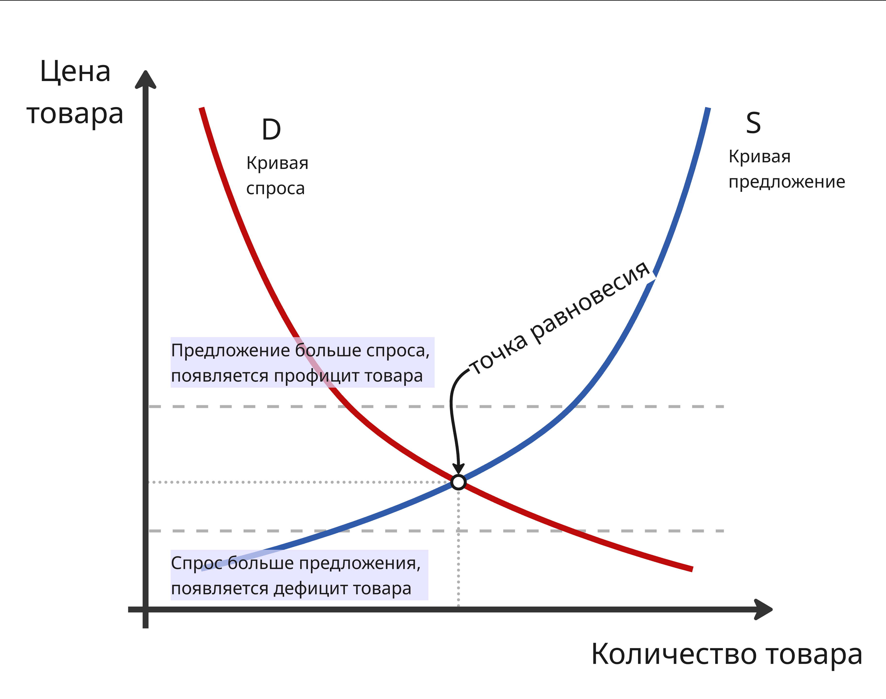

# Введение в технологическое предпринимательство

## Лекция 1. Основы рыночной экономики

**Экономика** - это:

1. хозяйственная система, обеспечивающая производство, распределение, обмен и потребление благ в условиях ограниченных ресурсов
2. наука, изучающая, как люди, фирмы и государство принимают решения по использованию ограниченных ресурсов

**Экономическая система** - это способ организации хозяйственной жизни общества, представляющий собой установленную и действующую совокупность принципов, правил, законов, определяющих форму и содержание основных экономических отношений, которые возникают в процессе производства, обмена и потребления экономического продукта

Всего выделяют 4 типа экономических систем:

* **Традиционная экономика** - способ организации экономической жизни, базирующийся на отсталой технологии, широком распространении ручного труда и общинной собственности

    Примеры стран с традиционной экономикой: Бурунди, Афганистан, Бангладеш, Непал, а также некоторые общины и племена в Африке (например, масаи), Азии (некоторые регионы Индии), Южной Америки и племена коренных народов Северной Америки (инуиты)

* **Командная** (она же плановая, командно-административная или директивная) **экономика** - способ организации экономической жизни, при котором капитал и земля, практически все экономические ресурсы находятся в государственной собственности. Примеры:

    * Северная Корея - единственная страна, где сохранилась почти чистая командная экономика с полным государственным контролем над всеми процессами, что приводит к дефициту товаров

    * Индия, Китай, Вьетнам - используют пятилетние планы для индикативного планирования, где государство устанавливает целевые показатели, а не жестко регламентирует все решения. Из-за этого считают, что в этих странах экономика переходит от командной к смешанной

    * Куба - страна предприняла реформы, но элементы централизованного планирования все еще используются

* **Рыночная экономика** - способ организации экономической жизни, при котором капитал и земля находятся в частной собственности отдельных лиц

    Примеры: США, Швейцария, Великобритания и другие промышленно развитые страны, такие как Канада, Австралия

* **Смешанная экономика** - экономическая система, где и государство, и частный сектор играют важную роль в производстве, распределении, обмене и потреблении всех ресурсов и материальных благ в стране

    Примеры: Россия, Германия, Франция, Япония и страны Северной Европы (Швеция, Норвегия, Дания)

    Особое место занимают особые экономические зоны (например, наукограды Дубна, Иннополис и туристическая зона "Эльбрус") которые представляют собой территории с особым юридическим и экономическим статусом, где государство создает льготные условия для предпринимательства, сочетая рыночные механизмы с государственной поддержкой

Рынок - это система взаимодействия, обеспечивающая обмен экономическими благами и услугами покупателей и продавцов

Функции рынка: регулирование общественного производства, определение затрат общества, связь производителей и потребителей, установление цен, дифференциация производителей

Субъектами рынка являются физические лица, домашнее хозяйство (то есть семья), фирма, государство. Объектами рынка являются товары и услуги, факторы производства, деньги, ценные бумаги и так далее

Инфраструктура рынка - это совокупность учреждений, государственных и коммерческих фирм, обеспечивающих функционирование рыночных отношений

---

Рассмотрим рыночную экономику. В рамках рыночной экономики более всего присуще два явления:

* Экономические циклы - периодически повторяющиеся колебания уровня экономической активности, при которых периоды роста сменяются периодами спада. Такие колебания определяются изменениями таких показателей, как реальный ВВП, уровень занятости, объемы производства и уровень инфляции

    Цикл делят на 4 фазы:

    1. Подъем (или экспансия, рост) - появляется рост производства, снижается уровень безработицы, растут доходы населения и потребительский спрос, что постепенно начинает подталкивать цены (то есть инфляцию) вверх
    2. Пик (высшая точка) - экономика работает на пределе своих производственных возможностей, безработица находится на минимальном уровне, а инфляция может достигать пиковых значений. В этот период центральные банки часто начинают повышать процентные ставки
    3. Спад (или рецессия, кризис) - начинается сокращение объемов производства и деловой активности, падает спрос на товары и услуги, снижаются инвестиции, компании сокращают штаты, из-за чего растет безработица
    4. Дно (низшая точка) - производство и занятость достигают своего минимального уровня, цены стабилизируются, а процентные ставки снижаются

    В экономике выделяют несколько типов циклов в зависимости от их причины возникновения:

    * Циклы Китчина (2–4 года) связаны с колебаниями мировых запасов золота и коммерческих запасов предприятий
    * Циклы Жюгляра (7–11 лет) вызваны периодичностью обновления основного капитала (оборудования и производственных мощностей)
    * Циклы Кузнеца (15–25 лет) обусловлены демографическими изменениями и обновлением инфраструктуры
    * Циклы Кондратьева (45–60 лет), вызванные радикальными изменениями в технологическом укладе (например, появление парового двигателя, электричества, компьютеров)

* А также закон спроса и предложения

Закон спроса и предложения - это принцип, определяющий формирование цен и объем товаров на рынке через взаимодействие покупателей и продавцов

Спрос - это количество товаров и услуг, которое покупатели готовы приобретать по определенной цене (в данном месте, в данное время и при прочих равных условиях)

Неценовые факторы, влияющие на спрос:

* Уровень доходов в обществе
* Размеры рынка (то есть число покупателей)
* Мода, сезонность
* Наличие товаров-заменителей
* Инфляционные ожидания

Предложение - это количество данного товара, которое продавцы готовы продать по данной цене (в данном месте, в данное время при прочих равных условиях)

Неценовые факторы, влияющие на предложение:

* Наличие товаров-заменителей
* Наличие товаров-комплементов (дополняющих)
* Уровень технологий
* Объём и доступность ресурсов
* Налоги и дотации
* и другие

Если спрос превышает предложение (то есть люди хотят купить больше товара, чем его существует, именно по этой цене), то цена начинает расти

Если предложение превышает спрос (меньше людей хотят покупать товар по этой цене), то продавцы начинают снижать цену, чтобы привлечь больше покупателей

Рыночное равновесие достигается, когда величина спроса равна величине предложения

Спрос и предложение обозначают в виде кривых на координатной плоскости цена-количество

При этом есть два эффекта, которые являются исключениями закон спроса:

* Эффект Веблена - спрос растет по мере увеличения цены на предметы роскоши, которые покупаются, чтобы подчеркнуть высокий социальный статус
* Эффект Гиффена - спрос растет по мере увеличения цены на малоценные товары, у которых нет заменителей, так как их потребление повышается за счет экономии на других товарах

Эластичность спроса - показатель того, как сильно меняется объем покупок товара, когда меняются цены, доходы людей или стоимость других продуктов. Спрос считается неэластичным, если покупатели слабо реагируют на изменение цены

---

Для изучения прогнозирования спроса есть несколько методов:

* Количественные методы:
    * Анализ временных рядов - изучение динамики спроса с помощью скользящих средних, экспоненциального сглаживания
    * Регрессионный анализ - изучение статистической зависимости между спросом и независимыми переменными (такими как цена, реклама и так далее)

* Качественные методы:
    * Метод Дельфи - структурированный сбор и агрегация анонимных мнений независимых экспертов
    * Опросы потребителей - прямое взаимодействие с целевой аудиторией (анкетирование, интервью, фокус-группы) для выяснения намерений, предпочтений и ожиданий
    * Метод экспертных оценок - привлечение специалистов с глубокими знаниями рынка и продукта для формирования прогнозов на основе опыта и интуиции

Ценовая дискриминация - это рыночная стратегия, когда один и тот же продавец продает одинаковые товары или услуги разным покупателям по разным ценам, причем эта разница не обоснована затратами на производство

Разделяют на 3 степени:

* Первая степень (совершенная) - продажа каждой единицы товара по максимальной цене, которую готов заплатить конкретный покупатель
* Вторая степень - цена меняется в зависимости от объема покупки или условий тарифа (например, оптовые скидки)
* Третья степень - деление рынка на группы по доходам, возрасту или статусу (например, скидки для студентов и пенсионеров)

Также для того, чтобы оценить ресурсы и способности компании, чтобы определить источник устойчивого конкурентного преимущества, применяют VRIO-анализ:

* Value (Ценность) - помогает ли ресурс использовать рыночные возможности или защищаться от угроз? Если ресурс не приносит пользы, он не имеет стратегической ценности
* Rarity (Редкость) - является ли этот ресурс уникальным или он есть у большинства конкурентов? Редкие ресурсы дают временное преимущество
* Inimitability (Неподражаемость / Воспроизводимость) - насколько тяжело и дорого конкурентам скопировать или воспроизвести данный ресурс (например, технологии, патенты)
* Organization (Организованность) - настроены ли внутренние процессы, управление и структура компании так, чтобы эффективно использовать этот ресурс и извлекать из него выгоду

При анализе также изучают факторы среды, которые делятся на три типа:

* Факторы внутренней среды: культура организации, маркетинг, кадры, имидж, технологии, менеджмент и другое
* Факторы внешней среды:
    * Факторы микросреды: посредники, конкуренты, партнеры, инвесторы, поставщики, клиенты, СМИ и другое
    * Факторы макросреды (на них, как правило, влияние со стороны компании мало): экономико-правовая среда, социально-демографическая среда, научно-техническая среда, политическая среда, культурно-образовательная среда, среда государственного регулирования, природно-экологическая среда, маркетинговая информационная среда
