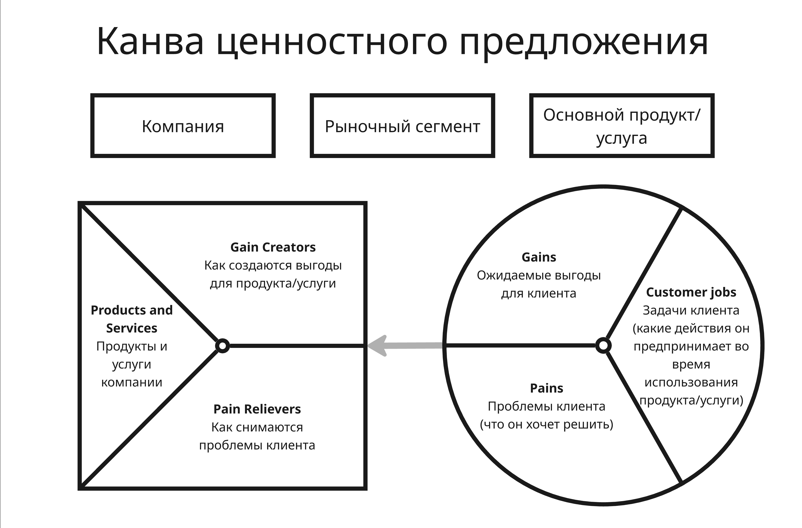
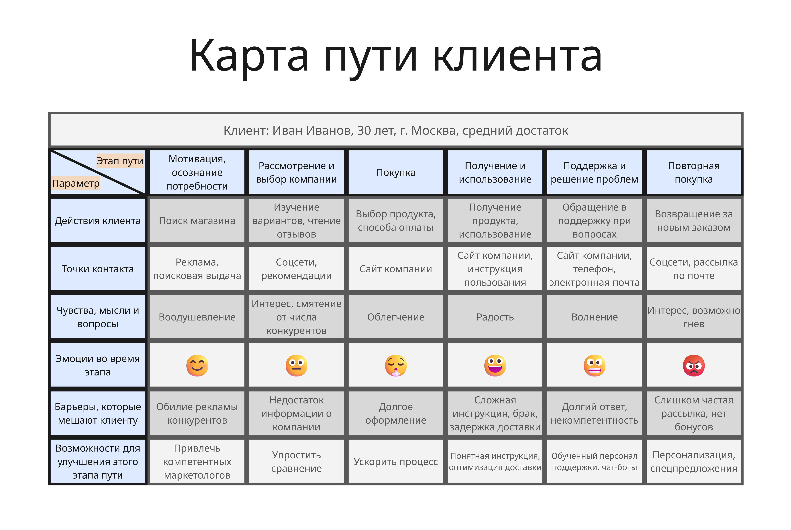
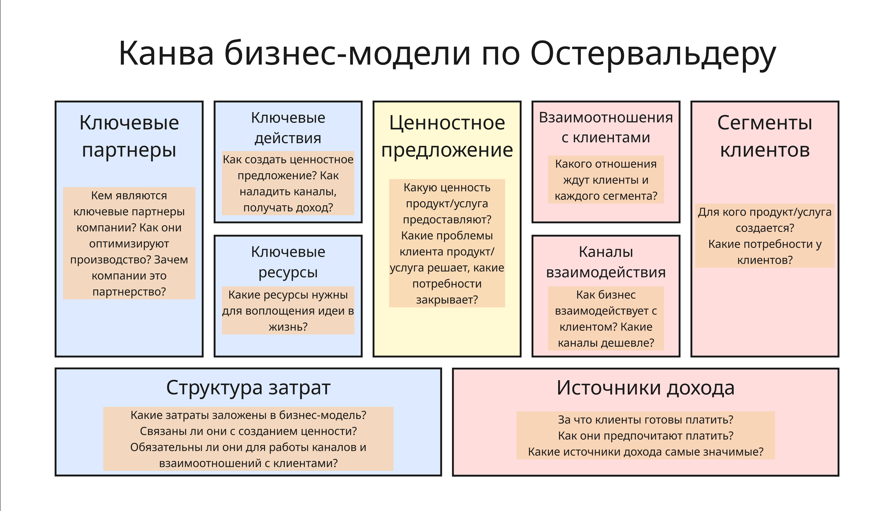

## Лекция 3

В 1910-ых с появлением конвейера и массового производства:

* Упор на управление людьми превращается в управление производственной линией
* Ценностью товара становится доступная цена
* Основные затраты уходят на масштабирование

Процесс производства становится важнее мастерства отдельного исполнителя, из-за чего ниже трудоемкость и себестоимость единицы - получается доступный стандартный продукт для массового рынка

Ценностью с тех пор является то, что стандарт превращает способ работы в повторяемый результат, что достигается благодаря:

* Развитию инструментов и документации для принятия управленческих решений в зависимости от частоты ошибок, погрешностей и так далее
* Фиксации всех ключевых процессов (из-за чего легко сменить персонал)
* Постоянного контроля качества

В этот момент число стандартов кратно возросло

Позже в конце 1940-ых после Второй мировой войны японская компания Toyota адаптировала конвейер Форда на производстве автомобилей. В 1950-1960-ых инженеры Тайити Оно, Эйдзи Тоёда, Киитиро Тоёда и Сигэо Синго разработали производственную систему Тойоты (Toyota Production System), которая строилась, чтобы уменьшить:

* Потери (Muda, 無駄 на японском) - любая деятельность, которая потребляет ресурсы, но не добавляет ценности для конечного потребителя. В системе выделяют 8 видов таких потерь:

    * Потери из-за перепроизводства (объём нереализованной продукции, оборачиваемость готовой продукции, точность прогноза спроса, уровень загрузки складов)
    * Потери времени из-за ожидания (время простоя, время ожидания в очереди, время переналадки)
    * Потери из-за излишней обработки (количество лишних этапов обработки, не влияющих на качество или цену для клиента)
    * Потери из-за лишних движений при выполнении операций (время на поиск инструмента, количество шагов, пройденное расстояние, количество наклонов и подъёмов)
    * Потери из-за лишних запасов (оборачиваемость запасов, дни запаса, стоимость хранения, площадь складов)
    * Потери при транспортировке (расстояние перемещений, время в пути, стоимость логистики, количество погрузо-разгрузочных операций)
    * Потери из-за выпуска дефектной продукции (уровень брака, стоимость переделок, потери от возвратов)
    * Потери из-за неиспользованного потенциала персонала (вовлеченность, текучесть кадров, использование квалификации, автономность)

* Неравномерность (Mura, 斑 на японском) - непостоянство, колебания или несогласованность в процессе работы. Устранение неравномерности позволяет стабилизировать поток
* И перегрузку (Muri, 無理 на японском) - чрезмерное напряжение людей или оборудования, когда работа выполняется на пределе, что ведет к браку, поломкам и выгоранию

Позднее система Тойоты превратилась в концепцию бережливого производства (Lean production), которая строится на 5 принципах:

1. **Ценность** - эффективная доставка того результата, который был нужен клиенту. Нужно выпускать ту продукцию, которая будет пользоваться спросом у клиента
2. **Цепочка создания ценности** - визуализация процесса от начала до конца. Все сотрудники компании должны быть заинтересованы в оптимизации
производства и принимать активное участие в решении проблем
3. **Поток** - непрерывное и плавное движение процесса
4. **Вытягивание** - производство только той продукции, которую уже заказали. Все ресурсы следует использовать рационально и своевременно.
Необходимо постоянно работать над снижением потерь на всех этапах
производства
5. **Совершенство** - постоянное стремление к улучшениям процесса. Увеличивать затраты при производстве товара можно, только повышая его ценность для потребителя. Желательно непрерывно совершенствовать качество продукции

---

В наше время же получили распространение:

* Массовая кастомизация: доступны как стандартные модули, так и индивидуальные сборки
* Платформы и экосистемы, где ценность создаётся сетью партнёров
* Четвертая индустриальная революция (Industry 4.0): цифровые двойники, Интернет вещей (Internet of Things, IoT), предиктивная аналитика
* Бережливые стартапы (Lean Startup), которые начинаются с минимально жизнеспособного продукта (Minimum Viable Product, MVP), используют цикл "Создать-Измерить-Обучиться" (Build-Measure-Learn) и валидированное обучение.
* Гибкая методология разработки (Agile) и практики DevOps, которые вносят гибкость, короткие циклы, непрерывные улучшения в разработку
* Сервитизация и подписка: доход от предоставления доступа или сервиса, а не от передачи владения
* Циркулярная экономика: устойчивость, переработка, снижение отходов

Поэтому появилось понятие **бизнес-модели** - того, как организация, используя все свои механизмы, планирует зарабатывать деньги на своих идеях, технологиях и ресурсах, преобразуя знания в экономические ценности для рынка

До понятия бизнес-модели использовали матрицу Boston Consulting Group (BCG). В ней все направления деятельности компании разделяют на 4 группы:

| Темп роста рынка | Доля рынка, которую занимает направление | |
|-|-|-|
| | Низкая | Высокая |
| Высокий | "Проблемные дети" | "Звезды" |
| Низкий | "Собаки" | "Дойные коровы" |

* "Дойные коровы" - модель, которая не требует больших инвестиций и "кормит" компанию. Из-за этого высокий уровень продаж, но рынок стабильный или спадающий
* "Звезды" - модель, в которой высокий потенциал прибыли, такая компания активно растет и приносит деньги, но требует больших затрат
* "Проблемные дети" - модель в быстрорастущей отрасли, но которая требует больших инвестиций и приносит мало прибыли
* "Собаки" - модель, которая не требует больших затрат и приносит мало прибыли

План действий развития по такой модели получается таким:

1) развивать сильные стороны "проблемных детей", чтобы они скорее превратились в "звёзд"
2) инвестировать в "звёзд" до их трансформации в "дойных коров"
3) как можно дольше сохранять за "дойными коровами" лидирующие позиции, пока они не превратятся в "собак"
4) как можно быстрее избавляться от "собак"

---

Потом появился SWOT-анализ (от Strengths, Weaknesses, Opportunities, Threats):

| | Положительное влияние | Отрицательное влияние |
|-|-|-|
| Внутренняя среда | Сильные стороны (Strengths) | Слабые стороны (Weaknesses) |
| Внешняя среда | Возможности (Opportunities) | Угрозы (Threats) |

SWOT-анализ приводит к TOWS-матрице, которая формирует стратегию развития:

| | Возможности | Угрозы |
|-|-|-|
| Сильные стороны | SO - использовать сильные стороны для роста | ST - использовать сильные стороны против угроз |
| Слабые стороны | WO - преодолеть слабости через возможности | WT - минимизировать слабости и избегать угроз |

SWOT помогает оценить внутренние и внешние факторы для выбора стратегических направлений

---

Бизнес-модель по О. Гассману представляет собой сумму ответов на 4 вопроса:

1. Кто является целевой аудиторией?
2. Какие продукты/услуги будут ценностным предложением и каково его конкурентное преимущество?
3. Как можно сделать это эффективно?
4. Почему это прибыльно?

Целевой клиент бизнеса - это элемент бизнес-модели. Три инструмента помогают проанализировать клиента и спроектировать бизнес-модель:

* Канва ценностного предложения (Value Proposition Canvas, VPC) - что мы обещаем и чем отличаемся

    Ценностное предложение - это четкое описание того, какую проблему клиента мы решаем и какую выгоду он получает

    Например: клиент хочет быстро и недорого доехать до работы. Такси-сервис А предлагает дешевую поездку, но придется долго ждать. Такси-сервис Б предлагает чуть дороже, но машина приезжает за 3 минуты. Если для клиента скорость важнее цены, он выберет сервис Б

    Важно, что ценностное предложение должно быть проверяемым: "эта компания решает конкретную боль конкретного сегмента лучше, чем
    альтернативы"

    

* Карта пути клиента (Customer Journey Map, CJM) - как клиент проживает путь к нам и после покупки

    Карта пути клиента - визуализация пути клиента с момента поиска товара или услуги вплоть до совершения покупки и во время использования, а также поддержку, повторную покупку и так далее

    CJM показывает, где и как клиент сталкивается с ценностным предложением компании. Если на этапе сравнения он не видит преимуществ, то он уходит, а если на этапе использования возникает боль, то скорее всего он не вернётся

    

    Число этапов зависит от рассматриваемого продукта/услуги и бизнес-модели

* Бизнес-модель Остервальдера - как всё это связано в единую систему

    Бизнес-моделирование - это не разовая задача, а циклический и итеративный процесс, состоящий из этапов:

    1. Исследование рынка, клиентов, конкурентов, трендов
    2. Генерация гипотез о ценности, каналах, отношениях, доходах,
    ресурсах и так далее
    3. Визуализация, использование шаблонов
    4. Тестирование и валидация с помощью интервью, минимально жизнеспособных продуктов, экспериментов
    5. Анализ и корректировка на основе обратной связи и данных
    6. Внедрение и масштабирование
    7. Постоянная адаптация

    Канва бизнес-модели (Business Model Canvas, BMC) - одностраничная схема, разработанная А. Остервальдером и И. Пинье

    Один из самых распространённых инструментов стратегического управления для описания бизнес-модели новых и действующих предприятий

    Канва позволяет визуализировать все ключевые элементы бизнеса и их взаимосвязи, что делает её незаменимой для командной работы и стратегических сессий

    

---

Монетизация - это способ, которым бизнес захватывает созданную ценность и получает доход. Важно не путать бизнес-модель (как компания создаёт, доставляет и извлекает ценность) с моделью монетизации (за что, с кого, когда и как компания получает доход)

Модель монетизации получается как ответ на 5 вопросов:

* Кто платит?
* За что платит?
* Когда платит?
* Как определяется цена?
* Как модель масштабируется?

Основные модели монетизации:

* Продажа товара или услуги - клиент платит за конкретный продукт или разовую услугу
* Подписка - регулярный платёж (например, раз в месяц) за доступ к продукту или сервису (например, Netflix)
* Freemium - базовая версия бесплатна, а платная - расширенная (например, Spotify)
* Комиссия или маркетплейс - платформа берёт процент со сделки (например, Amazon, Wildberries)
* Реклама - доход от рекламодателей за доступ к аудитории (например, YouTube, Google Ads)
* Лизинг вместо владения - клиент платит за фактическое использование, не покупает продукт целиком
* Открытая модель - компания делится данными для ускорения развития
* Бритва и лезвие (Razor and Blades) - продавать дешёвый носитель и дорогие расходники (например, принтеры, бритвы, игровые консоли)
* Франшиза - партнёр платит за бренд и модель (например, McDonald's)
* Длинный хвост (Long Tail) - продажа множества разнообразных нишевых товаров вместо модных (или совместно)
