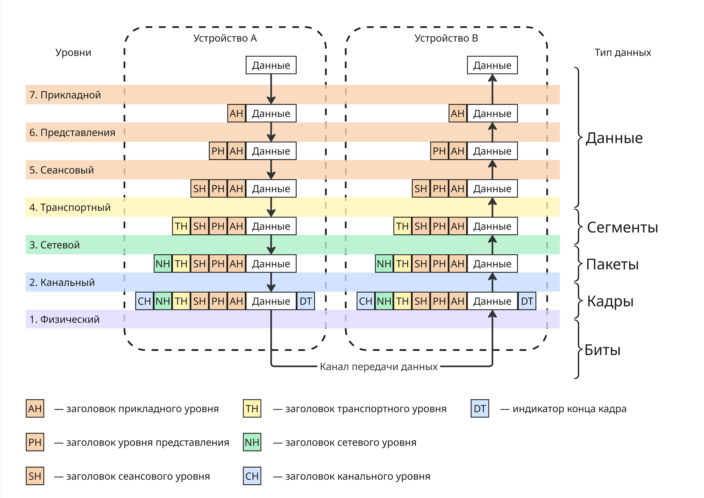
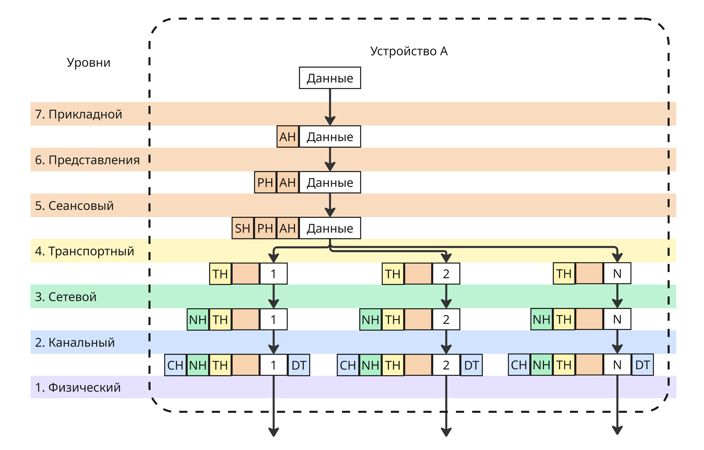

# Телекоммуникационные системы и технологии

Курс знакомит с сетевым мониторингом, конфигурацией сетевых интерфейсов, маршрутизацией, обработкой пакетов и прочим. Курс преимущественно сделан для работы с ОС GNU/Linux

## Задачи сетевой коммуникации. Модель OSI

В современных устройствах настройка сетевых интерфейсах сведена к минимуму для облегчения использования. На самом деле обеспечение производительной, надежной и безопасной коммуникации между разнородными системами - сложная задача. Во разработки сетевой коммуникации появляются:

* Необходимость обеспечить взаимодействие разнообразных систем вне зависимости от архитектуры ОС, кодировки символов, разрядности процессора и т.п.
* Необходимость работать через разное оборудование (ноутбук/телефон -> роутер -> коммутатор -> сервер) во время одного сеанса связи
* Необходимость организационно разграничивать управление в крупных сетях

Помимо этого надо учесть технические аспекты:

* Задержка (Latency) - переменное время, которое требуется для передачи данных от источника к приемнику
* Пропускная способность (Bandwidth) - передача объема данных за заданный промежуток времени, которая зависит от нагруженности узлов передачи, качества каналов
* Помехи (Interference) - явления, искажающие сигнал
* Потеря пакетов (Packet loss) во время их передачи
* Угрозы безопасности, такие как DoS (Denial of Service), возможность авторизации и аутентификации
* Проблемы с конфигурацией и совместимостью
* Проблемы масштабируемости

Для решения этой задачи нужны стандарты, которые согласуют интерфейсы, протоколы и оборудование для коммуникации. Несмотря на абстракцию от операционных систем и архитектур влияние сетевого стека на производительность приложения очень велика

В начале развития сетевых операционных систем большинство сетевых решений были проприетарными: компании продавали проприетарные оборудование и ПО для сетевого взаимодействия (то есть решения с монолитной архитектурой)

Военные США не желали зависеть от одного поставщика сетевого оборудования, поэтому Международной организацией по стандартизации (ISO) в конце 70-ых была разработана модель OSI - открытая модель сетевой коммуникации

Разработчики декомпозировали все этапы сетевого взаимодействия и стандартизировали все интерфейсы между этапами. Модель не регламентировала имплементацию, только интерфейсы. Получалась строгая процессная модель, этапы которой решали конкретную задачу. В модель входили 7 уровней:

1. Прикладной уровень
2. Уровень представлений
3. Сеансовый уровень
4. Транспортный уровень
5. Сетевой уровень
6. Канальный уровень
7. Физический уровень



Данные проходят через уровни, обрастая заголовками, содержащие такую информацию, как адрес отправителя, получателя и другое. После канального уровня в конце кадра (фрагмента данных) добавляется DT (Data Trailer), обозначающий конец кадра

Уровни из-за слоев абстракции не знают о реализации других уровней выше и ниже, что позволяет менять их и не изменять реализацию других

Большинство сетевых стеков реализуют эту похожую на эту модель. Например, в модели TCP/IP уровней 4: прикладной, транспортный, сетевой, канальный

Можно заметить, что размер пакета, пока он проходит через все уровни, увеличивается. В реальности на транспортном уровне пакет может сегментироваться на меньшие, чтобы избежать две проблемы:

* Не блокировать канал связи для других пользователей при передачи очень длинного сообщения
* Повторно загружать пакеты при неудачной загрузке 



Несмотря на достаточное абстрагирование от реализаций, модель OSI обладает недостатками:

* В модели OSI строгая инкапсуляция, строгий порядок уровней - в реальных сетевых стеков это не так
* Модель OSI чрезмерно избыточна, некоторые уровни можно объединить в один, как сделано в TCP/IP


Подробно поговорим про функции уровней:

* Прикладной уровень предоставляет командный интерфейс приложениям или пользователям, передача файлов, данных потоков

    Примером протоколов прикладного уровня могут быть HTTP, HTTPS, FTP, SMTP

* На уровне представления происходит сжатие, шифрование, символьная кодировка

    Это происходит благодаря протоколам SSL, TLS, алгоритмам шифрования и кодировки

* Сеансовый уровень устанавливает, управляет и завершает соединения между приложениями

    Технологии RPC (Remote Procedure Call, Удаленный вызов процедур) реализуют сеансовый уровень

* Транспортный уровень обеспечивает сегментацию и гарантии доставки данных в правильном порядке

    Протоколы TCP, UDP могут сегментировать большие фрагменты данных. Кроме того, TCP гарантирует, что пакеты дойдут до получателя

* Сетевой уровень решает задачу доставки данных по составной сети, межсетевую адресацию, трансляцию виртуальных адресов в физические

    Чаще всего сейчас сетевой уровень реализуется протоколами IPv4 и IPv6

* Канальный уровень отвечает за передачу кадров данных между узлами в локальной сети по физическому уровню, например, Ethernet, Bluetooth

* Физический уровень представляет спецификацию для разъемов, кабелей, назначение контактов и формат сигналов, например, RJ (Registered Jack) или USB


Модель OSI не дает полное описание сети и появилась позже других стандартов, поэтому в свое время не получила поддержку. Сейчас она является академической моделью, которая дает понимание работы различных компонентов компьютерных сетей и того, как они работают вместе

Также она дает общую терминологию и концепции для разработки и проектирования других сетевых продуктов и технологий

В программе [Wireshark](https://www.wireshark.org/) можно проанализировать сетевой трафик устройства. Если выбрать какой-нибудь кадр, то можно увидеть его заголовки:

```
Frame 722: 45 bytes on wire (360 bits), 45 bytes captured (360 bits) on interface \Device\NPF_{8B3A2192-8B36-11F0-8DE9-0242AC120002}, id 0
Ethernet II, Src: Router_98:92:f1 (4c:c6:4c:98:92:f1), Dst: 16:d2:51:89:f3:ab (16:d2:51:89:f3:ab)
Internet Protocol Version 4, Src: 198.51.100.68, Dst: 198.18.0.139
Transmission Control Protocol, Src Port: 60493, Dst Port: 443, Seq: 23254, Ack: 1, Len: 5
```

Здесь мы можем заметить IP и TCP протоколы, соответствующие сетевому и транспортному уровню


---

В наше время для большинства устройств определены два адреса:

* Физический адрес (или MAC-адрес, от Media Access Control), например, `16:52:91:ff:13:c4`. Такой адрес присваивается устройству на заводе изготовителя и является уникальным
* Сетевой адрес, чаще всего это IPv4 (например, `198.51.100.23`) или IPv6 (например, `3fff:0db8:11a3:09d7:1f34:8a2e:07a0:765d`)

Физический адрес нужен для идентификации устройства в пределах локальной сети, а сетевой - в пределах глобальной сети

На сетевом уровне пакету добавляются IP-адреса отправителя и получателя, а на канальном - MAC-адреса отправителя и получателя

Допустим, что есть 3 локальных сети, соединенных маршрутизаторами:


Для простоты здесь используется другой формат физических и сетевых адресов. Если мы хотим отправить пакет от `1.23` к `3.135`, то:

1. Пакет направляется в маршрутизатор `E4:5D:3A`. При первом подключении узла `AF:45:32` к маршрутизатору, узлу присваивается сетевой адрес `1.23`, в свою очередь узел запоминает, что, чтобы отправить пакет за пределы своей сети, нужно передать его маршрутизатору
2. Далее маршрутизатор смотрит на свою таблицу маршрутизации. Там описан следующий шаг в цепочке, чтобы достичь целевой узел. Пакет передается через другой интерфейс маршрутизатора `2.1` в маршрутизатор `2.2`
3. Там маршрутизатор `A3:1B:9E` понимает, что адрес узла находится в локальной сети и, используя физические адреса, передает нужному узлу пакет

Благодаря абстракции между сетевым и канальным уровнем пропадает надобность от уникальности физических адресов - в нашей системе два узла с адресом `AF:45:32`. Также в локальной сети 2.X физические адреса могут иметь другой формат

В реальности таблица маршрутизации устроена сложнее, например, в ней могут присутствовать веса следующих направлений, которые показывают, к каком узлу обратиться, если наилучший не доступен

