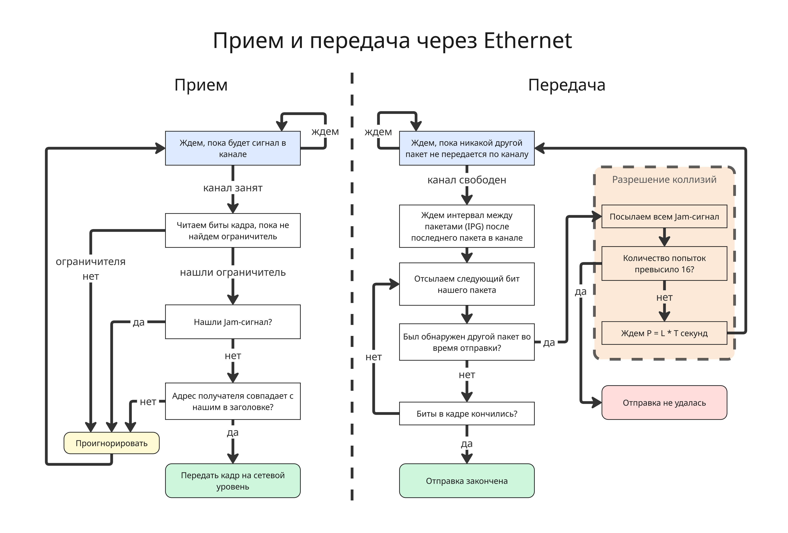

## Лекция 3. Локальные сети на примере Ethernet

Для чего же нужен канальный уровень?

* Целью канального уровня является управление доступом к каналу связи и обеспечение эффективной связи сетевых узлов
* Канал связи – общий разделяемый ресурс. Протокол канального уровня предотвращает или разрешает конфликт
* Адреса есть у каждого сетевого узла для 
идентификации источника и назначения сетевого трафика
* Канальный уровень должен регламентировать физическую топологию, управлять логической топологией и фильтрацией трафика
* Канальный уровень также должен обнаруживать и исправлять ошибки, например, с помощью контрольных сумм или проверки циклическим избыточным кодом 
* Протокол канального уровня согласует скорости передачи

Каналы разделяются по:

* Мультиплексированию с частотным разделением каналов (Frequency-Division Multiplexing, FDM) - полоса пропускания делится на непересекающиеся частотные диапазоны, обычно используется в радио или телевещании
* Мультиплексированию с временным разделением каналов (Time-Division Multiplexing, TDM) - канал делится на временные интервалы, каждый из которых присвоен отдельному сигналу, обычно используется в компьютерных сетях

Но если у нас к одному подключены несколько узлов, то встает вопрос, как отличать, кому какой пакет данных направляется. Для этого есть подходы к управлению передачей:

* Коммутация каналов (Circuit Switching) работает так: между определенными узлами происходит договоренность, что только они будут использовать этот канал
* Коммутация пакетов (Packet Switching) - внутри пакета хранится информация, какому узлу и от какого этот пакет идет. Минус такого подхода - мы передаем больше байт, поэтому скорость уменьшается

Как можно заметить, коммутация пакетов - универсальный подход, который работает, когда число узлов в одном канале неизвестно заранее, поэтому именно он используется в протоколе Ethernet

Считается, что Ethernet был разработан в 1973 году Робертом Меткалфом в компании Xerox. Далее Ethernet был подробно описан в стандарте IEEE 802.3, а именно кодирование, формат кадров и прочее

Ethernet использует технологию CSMA/CD (Carrier Sense Multiple Access with Collision Detection - множественный доступ с прослушиванием несущей частоты и обнаружением коллизий). Она подразумевает алгоритмы для приема и передачи пакетов, причем если один и тот же пакет пришел дважды, то он обрабатывается один раз.

Прием в CSMA/CD происходит так:

1. Приемник ждет, пока не обнаружит сигнал на линии
2. При обнаружении приемник устанавливает синхронизацию, читает данные с канала и ждет ограничителя (Data Trailer)
3. Если ограничитель обнаружен и адрес приема совпадает с тем, что в заголовке, то данные переходят наверх по уровню в стеке модели

Передача устроена сложнее:

1. Вводится параметр Interpacket gap (IPG) или Interframe gap (IFG) - минимальный интервал между передаваемыми пакетами. Для скорости 10 Мбит/с - это 9.6 мкс, для 100 Мбит/с - 0.96 мкс, для 1 Гбит/с - 96 нс и так далее
2. Далее пакет собирается, узел ждет, пока не закончится передача другого узла в канале, если такова есть
3. Ждем, пока не пройдет минимальный интервал IPG с момента последней передачи
4. Передаем биты кадра. Если во время передачи бита не был обнаружен прием другого пакета, то передавать следующие биты, пока они не закончатся
5. Если во время передачи был обнаружен прием, то есть произошла коллизия, то:

    * Всем узлам передается Jam-сигнал, чтобы все знали, что произошла коллизия
    * Далее вычисляется время ожидания до следующей отправки по формуле `P = L * T`, где `T` - количество времени для отправки 512 битов (для 10 Мбит/с - это 51.2 мкс), `L` - случайное число из диапазона от `0` до `2^N`, где `N` - текущее число попыток, при этом `L <= 1023`
    * После ожидания отправка повторяется заново

    Если количество попыток превысило 16, то отправка считается неудачной

Доменом коллизий в этом случае называют область локальной сети, где узлы могут вступать в коллизию пакетов. При этом при наличии коммутаторов домен коллизий может отличаться от домена широковещания

---

Для идентификации в локальной сети на канальном уровне у узла есть MAC-адрес, состоящий из 6 байт, то есть 6 октет, то есть 48 бит 

Первые три байта являются идентификатором производителя (OUI, Organizationally Unique Identifier или MFG от Manufacturing) - , а последние, NIC (Network Interface Controller), идентифицирует сам сетевой контроллер

Идентификатор производителя выдается институтом IEEE, а идентификатор контроллера - уникальный для устройств производителя, отсюда каждый MAC-адрес **глобально** уникален. В этом случае седьмой бит MAC-адреса будет равен 0. Пример такого адреса -  `54:f2:03:92:93:c9`

Большинство драйверов сетевых карт могут изменить MAC-адрес, но тогда седьмой бит обязан быть равен 1, что означает, что устройство с таким MAC-адресом администрируется локально. Пример такого адреса - `1e:1d:69:7e:51:22`

Если в адресе получателя восьмой бит равен 0, то передача происходит только узлу с этим адресом, все остальные узлы в домене коллизий обязаны проигнорировать кадр

Если же восьмой бит равен 1, то передача считается мультивещательной, и ее примут те узлы, которые настроены принимать кадры на этот адрес, таким образом, можно передавать кадры определенной группе узлов. Пример такого адреса - `51:ed:cb:0b:83:ba`

Адрес получателя `FF:FF:FF:FF:FF:FF` считается особым и означает, что кадр предназначен всем узлам в локальной сети

Современные устройства умеют рандомизировать MAC-адреса для большей безопасности

Разберем формат кадра Ethernet:

1. MAC-адрес получателя
2. MAC-адрес отправителя
3. Ethertype - тип формата кадра как двухбитное число
4. Полезная нагрузка размером от 42 байт до 1500 байт
5. 4 байт контрольной суммы, найденные через алгоритм циклического избыточного кода (CRC, cyclic redundancy check)

Всего существует несколько типов формата:

* Version 1 - больше не применяется
* Version 2, Ethernet II или еще называемый DIX (от первых букв производителей DEC, Intel, Xerox), чаще всего используется. Для него Ethertype - любое число, не меньшее 1536 или `0x0600`
* IEEE 802.2 Logical Link Control (LLC), используется меньше, для него Ethertype - любое число, не большее 1500, а полезная нагрузка не начинается с `0xffff` или `0xaaaa`
* Novell raw IEEE 802.3, почти не встречается, для него Ethertype - любое число, не большее 1500, а полезная нагрузка начинается с `0xffff`
* IEEE 802.2 Subnetwork Access Protocol (SNAP), почти не встречается, для него Ethertype - любое число, не большее 1500, а полезная нагрузка начинается с `0xaaaa`

Как можно заметить, протокол Ethernet почти не создает нагрузку на пропускную способность: из 1518 байт под полезную нагрузку выделено 1500, то есть 98.8%

---

Физических стандартов Ethernet существует много:

* Ранний стандарт 1BASE5
* 10 Мбит/с Ethernet - 10BASE2, 10BASE5, 10BASE-T, 10BASE-F
* 100 Мбит/с Ethernet - 100BASE-T, 100BASE-FX
* 1 Гбит/с Ethernet - 1000BASE-T, 1000BASE-SX, 1000BASE-LX
* 10 Гбит/с Ethernet - 10GBASE-T
* 40 Gigabit Ethernet - 40GBASE-CR4
* 100 Gigabit Ethernet - 100GBASE-CR10, 100GBASE-SR10

Суффикс означает вариант реализации, например T - витая пара (от Twisted pair)

В качестве оборудования используют

* На физическом уровне:
    * Концентраторы
    * Медиаконверторы
    * Повторители

* На канальном уровне:
    * Сетевые адаптеры
    * Коммутаторы

* На сетевом уровне:
    * Коммутаторы
    * Маршрутизаторы

Для повторения сигналов существуют два прибора:

* Концентратор (или повторитель, hub) берет сигнал с одного порта и транслирует его на все другие
* Коммутатор (switch) берет сигнал, читает MAC-адрес получателя и отправляет его на нужный порт. Но для того, чтобы соотнести порт к MAC-адрес, коммутатор имеет таблицу и действует так:
    * Если получен кадр с нового порта, то он записывает в таблицу адрес, полученный из заголовка кадра, и порт
    * Если адреса получателя, полученного в кадре, в таблице нет, то кадр пересылается всем устройствам, иначе кадр пересылается по нужному порту

    Для записи в таблице существует значение TTL (time-to-live), чтобы таблица была актуальной

