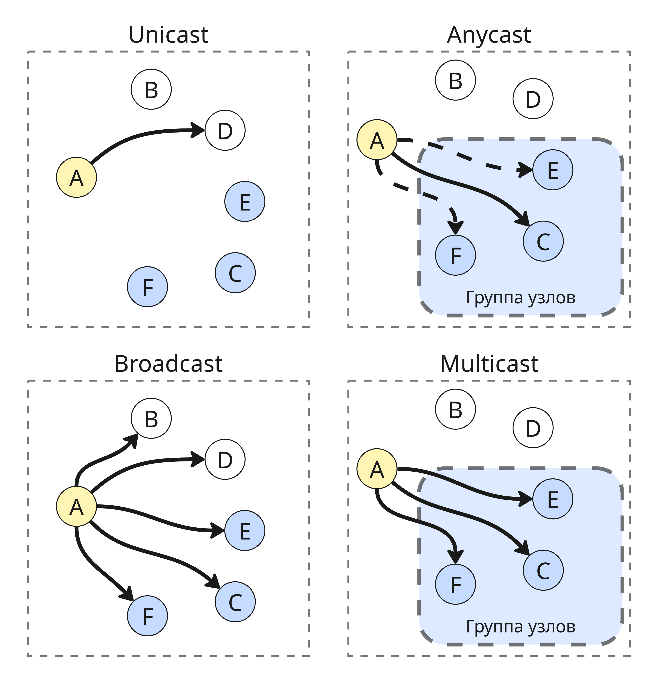

## Лекция 5. Стека TCP/IP

Стеком TCP/IP называют набор упорядоченных сетевых протоколов. Он был назван в честь двух широкораспространенных протоколов:

* TCP (Transmission Control Protocol)

* IP (Internet Protocol)

Стек TCP/IP является открытым и платформонезависимым, поэтому он получил такое широкое распространение

В 1967 году начался проект ARPA (Advanced Research Projects Agency), в 1972 году появился ARPANET - сеть, соединявшая 30 узлов. В 1980-1981 годах были опубликованы в рамках работы протоколы IP, TCP, UDP

Далее TCP/IP был переработан из монолитной архитектуры в слоенную (наподобие модели OSI), а его реализация была включена в операционную систему BSD

Так как BSD распространялась в университетах, стек TCP/IP получил распространение в университетах. К концу 80-ых годов ARPANET стала называется Internet (Interconnected networks) и объединяла университеты и научные центры США, Канады, Европы

В 1992 появляется WWW, World Wide Web, основанный на протоколе HTTP

В стек TCP/IP входят 4 уровня:

* Прикладной уровень - протоколы FTP, HTTP, telnet, SNMP, TFTP и прочие
* Транспортный уровень - протоколы UDP, TCP, SCTP, DCCP
* Сетевой уровень - протокол IP и вспомогательные ICMP, IGMP, ARP
* Канальный уровень - Ethernet, WLAN (то есть Wi-Fi) и другие

На транспортном уровне в основном используются два протокола:

* Протокол TCP - он за счет дополнительных рукопожатий гарантирует надежность канала связи, но из-за этого является менее быстрым
* Протокол UDP, который доставляет данные быстро, но не гарантирует доставку сообщений, используется для стриминга видео и сетевого взаимодействия в видеоиграх

Сейчас стек TCP/IP развивается благодаря комитету IETF (Internet Engineering Task Force, Инженерный совет Интернета) и документа RFC (Request for Comments)

В стеке TCP/IP адресация установлена на разных уровнях

| Уровень | Адрес | Пример |
|---------|-------|--------|
| Прикладной | Доменное имя из DNS | itmo.ru |
| Транспортный | Номер порта TCP или UDP | `443` |
| Сетевой | IP-адрес | `192.0.2.227` |
| Канальный | MAC-адрес | `16:52:91:ff:13:c4` |

Рассмотрим механизм установления соединения, например, при доступе к сайту google.com

1. Для начала компьютеру с браузером и серверу Google назначаются IP-адреса, пусть это будут `198.18.55.205` и `203.0.113.209`. Так как браузер использует TCP, то на сервере будет открыт порт TCP `80`, которые в операционной системе привязан к веб-приложению

2. Далее при отправке запроса браузер запрашивает случайный свободный порт у ОС выше 1024, пусть это будет `29384`

3. Библиотека, реализующая TCP, формирует пакет и включает в него порты отправителя `29384` и получателя `80`
4. Библиотека, реализующая IP, формирует пакет и включает в него адреса `198.18.55.205` и `203.0.113.209`
5. Далее пакет идет по протоколу Ethernet на сервер, там обрабатывается, аналогично формируется ответ на основе заголовков пришедшего пакета и отправляется обратно
6. После этого браузер получает пакет от сервера и отправляет еще один, заключив тем самым тройное рукопожатие и устойчивое соединение
7. Теперь в пакете можно передавать данные

Заметим, что у клиента порт случайный, а у сервера заранее был известен

---

В протоколе IP есть возможность указать тип рассылки:

* Unicast - данные отправляются от одного узла к другому, для этого используются и IP-адрес, и MAC-адрес

* Broadcast - данные отправляются ко всем узлам в сети. Для этого MAC-адрес в заголовке равен `FF:FF:FF:FF:FF:FF`, а IP-адрес составляет адрес сети, дополнены единицами в конце

    В IPv6 нет широковещания, вместо него используется Multicast

* Multicast - данные отправляются группе узлов в сети

* Anycast - данные отправляются к одному узлу из целевой группы

Долгое время популярным остается четвертая версия протокола IP - IPv4. IPv4-адрес состоит из 4 байтов (октетов) и записываются так: `W.X.Y.Z`, где `W`, `X`, `Y`, `Z` - числа от 0 до 255

Таким образом, пространство IPv4 адресов занимает 2^32 адресов (около 4 миллиардов)

Адрес делится на две части - адрес сети, до которой пакет надо доставить, и адрес конкретного узла внутри сети

Адреса делятся двумя способами:

* Классовая адресация - метод структурирования, при котором количество разрядов в адресе сети фиксировано и зависит от первых бит адреса. Есть

    * Класс A с адресами от `0.X.X.X` до `127.X.X.X` - всего 128 подсетей с 2^24 адресами
    * Класс B с адресами от `128.0.X.X` до `191.255.X.X` - всего 2^14 подсетей с 2^16 адресами
    * Класс C с адресами от `192.0.0.X` до `223.255.255.X` - всего 2^21 подсетей с 256 адресами
    * Класс D с адресами от `224.X.X.X` до `239.X.X.X` - 16 подсетей для назначения групп для многоадресной рассылки
    * Класс E с адресами от `240.X.X.X` до `255.X.X.X` - зарезервировано для использования в будущем, но есть мнение, что их так и не начнут использовать

    Сейчас такая схема не актуальна

* Бесклассовая адресация - метод, в котором вместо классов используется маска сети - количество бит, которые обозначают сеть

    Например, локальная сеть - это адреса `192.168.0.0` - `192.168.0.255`. Здесь сеть определяют первые 24 бита, поэтому можно диапазон записать как `192.168.0.0/24` или "`192.168.0.0` с маской `255.255.255.0`"

    Таким образом, можно любую подсеть разделить на удобные подсети с нужным количеством адресом

Также существуют специальные IP-адреса

* Адрес сети + все единицы - адрес широковещания
* Адрес сети + все нули - прямое указание на адрес сети, а не узла
* `255.255.255.255` - универсальный широковещательный адрес
* Все нули + адрес узла - конкретный узел в текущей сети
* `127.0.0.0/8` - адреса для коммуникаций внутри хоста и для тестирования (целых 2^24)
* `169.254.0.0/16` - самонастройка IPv4 с помощью DHCP

* Ну и еще многие для самых разных целей

Еще были зарезервированы несколько диапазонов адресов классов A, B и С, которые не маршрутизированы в Интернет. Такие адреса называют частными или серыми:

* Класс A `10.0.0.0/8`
* Класс B `172.16.0.0/12`
* Класс C `192.168.0.0/16`

Еще существует маска "wildcard mask" - 4 байта, с помощью которых можно настроить фильтрацию трафика на специальные адреса. В этой маске 0 значит, что разряд в адресе получателя должен совпадать с разрядом адреса-образца

---

Количество IPv4-адресов мало, поэтому появился IPv6

Адрес IPv6 представляет собой 128 бит, записанных в формате `x:x:x:x:x:x:x:x`, например, `2001:0DB8:00AF:ABCD:0000:0000:0000:0034`

Ведущие нули при этом убирают, а группы нулей сокращают до `::`: `2001:DB8:AF:ABCD::0034`

В IPv6 есть только префиксные маски, по умолчанию префикс - 64

Типы адресов делятся на:

* Unicast - идентифицируют только один сетевой интерфейс

    *  Global unicast - глобальные индивидуальные адреса, которые могут быть настроены статически или присвоены динамически. Начинается с `2` или с `3`, то есть `2000::/3`

        Из этой группы отдельно выделяется сеть `2001:0DB8::/32`, предназначенная для документации

    * Link-local - локальный адрес, позволяющий устройству обмениваться данными с другими устройствами под управлением IPv6 по одному и тому же каналу и только по данному каналу (подсети)
        Локальные IPv6 адреса канала находятся в диапазоне `FE80::/10`

    * Unique local - адреса, находящиеся в диапазоне от `FC00::/7`

        Хотя протокол IPv6 обеспечивает особую адресацию для сайтов, он не предназначен для того, чтобы скрывать внутренние устройства с IPv6-адресом от всемирной сети (аналогично серым IPv4-сетям)

* Anycast - пакет будет отправлен одному узлу из группы
* Multicast - пакет будет отправлен всем узлам в группе. Начинаются с `FF`, `FF02::1` - все узлы на канале, `FF02::2` - все роутеры

Адресов для широковещания нет, чтобы снизить нагрузку на сеть

Также специальные адреса:

* `::1/128` - адрес для отправки себе же (loopback)
* `::/64` - адреса для перехода с IPv4 (например, `::192:0:2:212`)
* Все нули или `::/128` - неопределенный адрес
