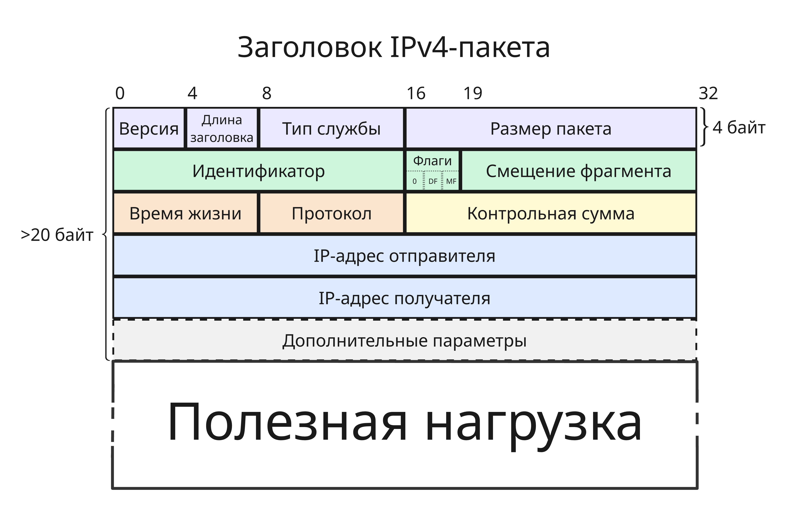

## Лекция 6. Протокол IPv4

Протокол IPv4 является протоколом сетевого уровня, поэтому ее задача - доставка данных между узлами, не находящимися в одной подсети

Для этого у узла должен быть IP-адрес. Для протокола IP четвертой версии адрес состоит из 4 байт, например, `240.19.64.22`

Далее при известных адресах получателя и отправителя для пакета формируется заголовок. Заголовок состоит из таких полей

* Версия протокола, 4 бита - ну то есть `0100`, 4-ая версия
* Длина заголовка, число 32-битных слов, 4 бита
* Тип службы, 8 бит

    Раньше это поле называлось тип обслуживания (Type of Service), теперь оно состоит из двух полей

    * Differentiated Services Code Point, 6 бит, используется для разделения трафика на классы обслуживания
    * Указатель перегрузки (Explicit Congestion Notification, ECN), 2 бита - предупреждение о перегрузке сети без потери пакетов (RFC 3168)

* Размер пакета, включая полезную нагрузку и заголовок, в байтах, 16 бит
* Идентификатор, 16 бит

    Нужно для сборки фрагментов в цельный пакет. Для конкретного фрагментированного пакета все фрагменты имеют одинаковый идентификатор
* Флаги, 3 бита

    Первый бит всегда равен нулю, второй бит DF (Don't Fragment) запрещает фрагментацию, а третий MF (More Fragments) показывает, не является ли этот фрагмент последним

* Смещение фрагмента, число 8-байтных блоков, 13 бит

    Смещение определяет позицию фрагмента относительно цельного пакета. Первый фрагмент имеет нулевое смещение

* Время жизни (или TTL, Time-to-live), 8 бит

    Обычно при отправке равно 64 (зависит от конфигурации ОС), но при прохождении маршрутизатор уменьшается на 1. Если к узлу пришел пакет с временем жизни 0, то он считается не актуальным и игнорируется

* Протокол, 8 бит - идентификатор протокол уровня выше, для TCP - это 6 (`00000110`), для UDP - 17 (`00010001`), полный список -    [iana.org/assignments/protocol-numbers/protocol-numbers.xhtml](https://www.iana.org/assignments/protocol-numbers/protocol-numbers.xhtml)
* Контрольная сумма, 16 бит

    Контрольная сумма вычисляется для заголовка пакета (это поле при вычислении принимается за 0) и используется на принимающей стороне для проверки целостности заголовка - если значения не совпадают, то пакет игнорируется (RFC 1071)

* IP-адрес отправителя, 32 бита
* IP-адрес получателя, 32 бита
* Дополнительные параметры, или опции (если размер заголовка больше 5)

    Такие параметры используются редко. Опции имеют такой формат:

    * Флаг "копировать", 1 бит - требование о копировании этой опции в заголовки всех фрагментов
    * Класс опции, 2 бита, `00` - это класс управляющих опций, `10` - класс опций измерений и отладки, `11` и `01` зарезервированы
    * Номер опции, 5 бит
    * Размер опции (с учетом этого поля), 8 бит, не указывается для опций без аргументов
    * Аргументы опции

    Например, можно заказать опцию "Запись маршрута" (Record Route, `00000111`) - маршрутизаторы будут в конце в аргументы писать свой IP-адрес

Заголовок дополняется нулями в конце так, чтобы занимаемое число байт было кратно 4

При маршрутизации время жизни пакета меняется, что заставляет маршрутизатор заново вычислять контрольную сумму. Поэтому при прохождении в заголовке IP-пакета изменяются минимум эти 2 поля

Также маршрутизатор можно иметь разную максимальную длину пакета (MTU, Maximum transmission unit). Чтобы уметь передавать большие пакеты до 65000 байт, нужно их фрагментировать - разделить на маленькие, которые можно передать, а на приемнике их собрать. Для этого в заголовке используются:

* Идентификатор
* Полная длина пакета
* Смещение фрагмента
* Флаги фрагментации

Например, есть пакет длиной 5140 байт, тогда он разобьется на 4 фрагмента (пусть MTU = 1500):

| Идентификатор | Размер пакета | Флаг DF | Флаг MF | Смещение пакета |
|-|-|-|-|-|
| 345 | 1500 | 0 | 1 | 0   | 
| 345 | 1500 | 0 | 1 | 185 | 
| 345 | 1500 | 0 | 1 | 370 | 
| 345 | 700  | 0 | 0 | 555 | 

Суммарно пакет вырос на 60 байт - 3 размера IP-заголовков дополнительных фрагментов

