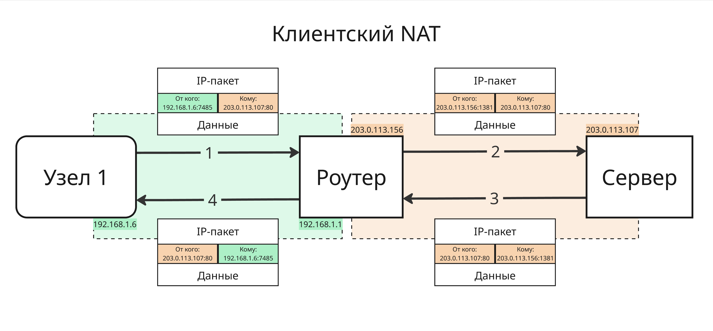

## Лекция 7. Соединение IP сетей

Как же пакеты узнают путь, через какой путь им идти, чтобы достичь узла назначения. Для решения этого есть 2 подхода:

1. Маршрутизация (Routing)
2. Трансляция адресов (NAT, Network Address Translation)

### Маршрутизация

Маршрутизация - процесс определения маршрута следования информации в сетях связи. Чтобы такое провернуть, нужно:

* определить то, как направлять пакеты
* обработать пакет при передаче в маршрутизаторе

Сеть представляет собой взвешенный граф, поэтому нужен наиболее оптимальный маршрут с наименьшими задержкой, потерей пакетов, длиной, нагруженностью и стоимостью

Маршрутизацией занимаются маршрутизатор, они бывают:

* Аппаратно-программными, например, домашний роутер

    Такие маршрутизаторы имеют:

    * Выделенный WAN-порт (Wide Area Network)
    * Поддержку различных соединений
    * Трансляцию адресов
    * DHCP и другое

    Более продвинутые SOHO-маршрутизаторы (от Small Office Home Office) умеют

    * Делать настраиваемую маршрутизацию
    * Осуществлять поддержку различных соединений
    * Гарантировать QoS (Quality-of-Service)
    * Делать VPN
    * SNMP (Simple Network Management Protocol) - протокол для управления устройствами
    * NetFlow - протокол Cisco для учета сетевого трафика

    Корпоративные (Enterprise) маршрутизатор имеют

    * Способность шифровать пакеты
    * Высокопроизводительное железо
    * Интеграцию
    
* Программные маршрутизаторы в ОС общего назначения умеют осуществлять маршрутизацию без специального оборудования 

Для осуществления маршрутизации маршрутизатор хранит таблицу маршрутизации, в основном она содержит:

* Адрес сети или узла назначения
* Маску сети назначения
* Шлюз, обозначающий адрес маршрутизатора в сети
* Физический интерфейс на маршрутизаторе, его номер или GUID
* Метрику, показатель того, насколько канал плохой (чем меньше, тем лучше)

В Windows такую таблицу можно посмотреть с помощью команды `route print`:

```
===========================================================================
Список интерфейсов
  2...0a 00 27 00 00 02 ......VirtualBox Host-Only Ethernet Adapter
  5...1c 15 e5 cc 68 99 ......Qualcomm WCN685x Wi-Fi 6E Dual Band Simultaneous (DBS) WiFiCx Network Adapter
 13...2e 15 e5 cc 68 98 ......Bluetooth Device (Personal Area Network)
  1...........................Software Loopback Interface 1
 57...fa 11 c7 9f 1e 89 ......Hyper-V Virtual Ethernet Adapter
===========================================================================

IPv4 таблица маршрута
===========================================================================
Активные маршруты:
Сетевой адрес           Маска сети      Адрес шлюза       Интерфейс  Метрика
          0.0.0.0          0.0.0.0      203.0.113.1    203.0.113.199   9257
          0.0.0.0          0.0.0.0     198.18.108.1     172.28.18.50     35
        127.0.0.0        255.0.0.0         On-link         127.0.0.1    331
        127.0.0.1  255.255.255.255         On-link         127.0.0.1    331
  127.255.255.255  255.255.255.255         On-link         127.0.0.1    331
        192.0.0.0    255.255.240.0         On-link        192.0.0.50    291
       192.0.0.50  255.255.255.255         On-link        192.0.0.50    291
      192.0.0.255  255.255.255.255         On-link        192.0.0.50    291
     198.18.108.0    255.255.255.0         On-link      198.18.108.1    281
     198.18.108.1  255.255.255.255         On-link      198.18.108.1    281
   198.18.108.255  255.255.255.255         On-link      198.18.108.1    281
      203.0.113.0        255.0.0.0         On-link     203.0.113.199    257
    203.0.113.199  255.255.255.255         On-link     203.0.113.199    257
    203.0.113.255  255.255.255.255         On-link     203.0.113.199    257
        224.0.0.0        240.0.0.0         On-link         127.0.0.1    331
        224.0.0.0        240.0.0.0         On-link      198.18.108.1    281
        224.0.0.0        240.0.0.0         On-link     203.0.113.199    257
  255.255.255.255  255.255.255.255         On-link         127.0.0.1    331
  255.255.255.255  255.255.255.255         On-link        192.0.0.50    291
  255.255.255.255  255.255.255.255         On-link      198.18.108.1    281
  255.255.255.255  255.255.255.255         On-link     203.0.113.199    257
===========================================================================
Постоянные маршруты:
  Сетевой адрес            Маска    Адрес шлюза      Метрика
          0.0.0.0          0.0.0.0      203.0.113.1    9256
===========================================================================

IPv6 таблица маршрута
===========================================================================
Активные маршруты:
 Метрика   Сетевой адрес            Шлюз
  1    331 ::1/128                  On-link
  1    331 ff00::/8                 On-link
===========================================================================
Постоянные маршруты:
  Отсутствует
```

В Linux такую таблицу можно посмотреть командой `route`. В ней будут присутствовать для каждой записи флаги:

* `U` указывает, что маршрут создан и является проходимым
* `H` указывает на маршрут к определенном узлу
* `G` - маршрут пролегает через внешний шлюз
* `R` - маршрут был создан динамическим протоколом маршрутизации
* `D` - маршрут был добавлен в результате получения сообщения перенаправления ICMP Redirect Message
* `В` - конечный пункт маршрута является широковещательный адрес

Маршруты при отправке выбираются так:

* По заголовку находится IP-адрес назначения
* Ищется маршрут на узел с этим адресом в поле "Сетевой адрес". Если его нет, то ищется маршрут к сети с префиксом `/31` с наилучшей метрикой. Далее ищется `/30` и так далее
* Если маршрут так и не нашелся, то берется маршрут по умолчанию

Далее по шлюзу выбранной записи из таблицы отправляется пакет

---

Таблицы бывают статическими, динамическими внутренними и динамическими внешними

* Статические таблицы формируются вручную сетевыми администраторами
* Динамическая маршрутизация формируется динамически на протяжении жизнь узла

    Как правило, Интернет можно разделить на несколько автоматических систем - систем IP-сетей и маршрутизаторов, управляемых одним (или более) операторов и имеющими единую политику маршрутизации с Интернетом. Такие автоматические системы имеют малое число внешних соединений и обладают сложной топологией

    * Внутренняя маршрутизация работает внутри автоматической системы. Маршрут внутри автоматической системы выбирается по критериям оптимальности

        Для их составления используются такие протоколы, как RIP2 (Routing Information Protocol) и OSPF (Open Shortest Path First)

    * Внешняя маршрутизации работает между автоматическими системами, поэтому маршрут может выбирать по коммерческим или политическим соображениям

        Для таблиц такого типа применяют протокол BGP (Border Gateway Protocol)

    Динамические таблицы составляются и актуализируются путем обмена маршрутами


Один из старых протоколов RIP2 используется для обмена таблиц маршрутизации между роутерами. Работает он довольно просто:

1. Роутеры подключаются, формируют базовую таблицу маршрутизации на основе соседей
2. Один из роутеров передает всем подключенным узлам свою таблицу
3. Далее другой роутер принимает ее, объединяет со своей и удаляет дубликаты с большей метрикой

Проблемой RIP2 является то, что любая связь имеет вес 1, то есть маршрут является коротким, если он состоит из меньшего числа узлов, а не из большей пропускающей способности каналов и нагруженности

Максимальная метрика равна 16 - тогда считается, что маршрут недоступен

Проблемы RIP2 решились протоколом OSPF, который использует алгоритм Дейкстры для поиска путей

### Трансляция адресов

Трансляция адресов (Network Address Translation, NAT) обеспечивает связь хостов из немаршрутизируемой сети во внешнюю IP-Сеть. Трансляция бывает:

* Симметричной - порты внутреннего адреса подсети транслируются на порты внешнего
* Динамической - порт внутреннего адреса случайным образом транслируется на порт одного из внешних адресов, причем для каждого нового соединения может быть использован отличающийся адрес
* Перегруженной - порты нескольких внутренних адресов транслируются на случайные порты единственного внешнего адреса

Трансляция также бывает в виде публикации адреса, клиентского NAT и публикации порта

* Публикация адреса работает так: адрес узла из внутренней подсети транслируется на маршрутизаторе на внешний адрес маршрутизатора. Внешних адресов может быть множество 

* Клиентский NAT подменяет внутренний адрес на единственный внешний адрес и меняет порт отправителя. Зная, что мы отправили пакет от имени внутреннего адреса с конкретным портом, можно при приеме ответного пакета подменить на нужный адрес

* Публикация портов работает так: специфический порт внешнего IP перенаправляется на конкретный порт внутреннего хоста




