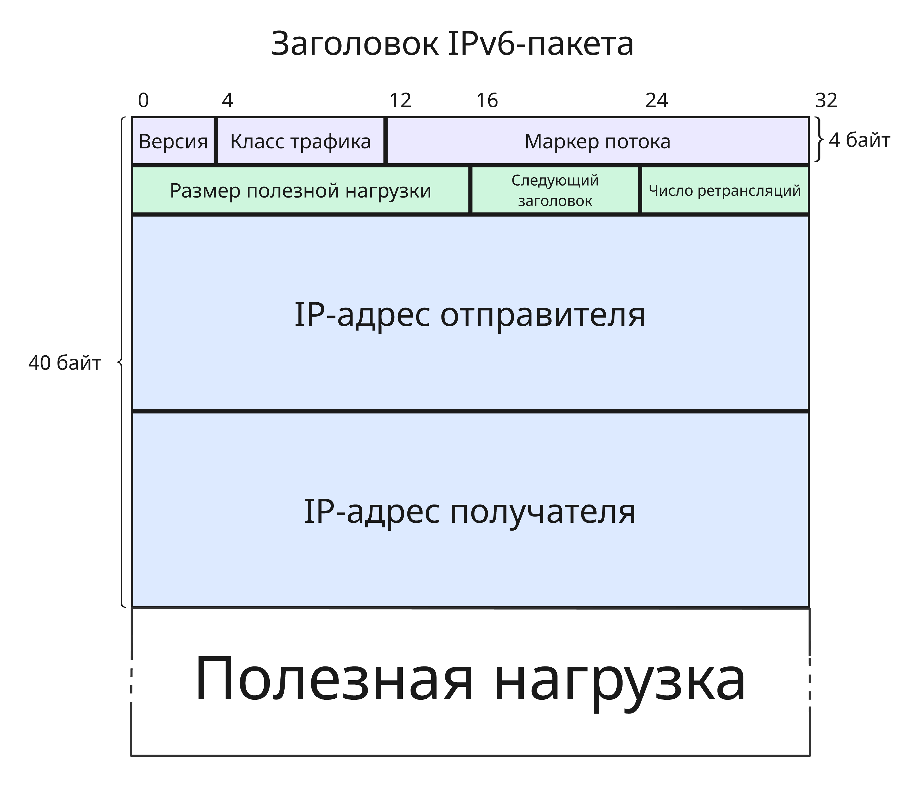

## Лекция 8. Протокол IPv6

Протокол IPv6 начал разрабатываться в 1996 году. В 1998 году был выпущен стандарт RFC 2460, в котором описан протокол IPv6. В 2010 году появилось четвертое поколение мобильной связи 4G 

В 2011 году последняя сеть `/8` была выдана комитетом IANA (Internet Assigned Numbers Authority). 6 июня 2012 года состоялся всемирный запуск Интернета IPv6

Переход на IPv6 нужен был, так как IPv4-адреса закончились (несмотря на то, что есть трансляция адресов) и протокол IPv4 имел свои недостатки

Рассмотрим, как IP адреса распределяются конечным пользователям. Белые IP-адреса выделяются комитетом IANA организациям RIR (Regional Internet Registry), привязанных к определенному региону

Всего организаций RIR пять:

* Asia-Pacific Network Information Center (APNIC) - Азия и Океания
* African Network Information Center (AFRINIC) - Африка
* American Registry for Internet Numbers (ARIN) - Северная Америка
* Latin American and Caribbean Network Information Center (LACNIC) - Латинская и Южная Америка
* Réseaux IP Européens Network Center (RIPE NCC) - Европа, Ближний Восток и Центральная Азия

Далее адреса от RIR раздаются LIR (Local Internet Registry) - локальным организациям (обычно это институты, провайдеры связи или корпорации), а от них провайдерам и конечным пользователям

Последняя сеть `/24` была выделена в 2019 году европейским RIPE NCC. Сейчас все IPv4-адреса (не считая зарезервированных и класса E) _заняты_ и _перераспределяются_ организаторами-операторами

Помимо малого числа адресов протокол IPv4 имеет еще недостатки:

* Много костылей, например, опции в заголовке, которые решают задачи других сетевых протоколов
* Фрагментация, которая увеличивает суммарный объем пакетов
* Изменение заголовка при прохождении через узел - поля "время жизни" и "контрольная сумма" меняются каждый раз
* Трансляция адресов, которая решает проблему нехватки адресов, но добавляет задержку при прохождении. Также трансляция адресов, изменяя адреса в заголовке, нарушает его целостность 

    Например, IP Security, который меняет изначальный заголовок, из-за чего принимающая сторона не принимает пакет. Также, трансляция адресов не позволяет установить соединение снаружи локальной сети в саму сеть

* Маршрутизация в IPv4 возникает каждый раз для отдельного пакета, несмотря на то, что для набора пакета маршрут между двумя узлами вряд ли измениться

* IPv4 не отвечает потребностям 5G и IoT (Internet of Things), так как множество устройств должны общаться между собой, из-за чего использование широковещания создает дополнительную нагрузки при обработке

---

Заголовок IPv6-пакета состоит из следующих полей:

* Версия, то есть `0110` (`0x6`), 4 бита
* Класс трафика, 8 бит

    Класс трафика - это поле "Тип службы" из IPv6-заголовка, содержащий:

    * DSCP (Differentiated Services Code Point), 6 бит - используется для разделения трафика на классы обслуживания
    * ECN (Explicit Congestion Notification), 2 бита - "Явное уведомление о перегрузке"

* Маркер потока, 20 бит

    Маркер потока - идентификатор маршрута, по которому нужно доставить этот пакет

    Маршрутизация IPv6 может осуществляется для каждого пакета, а может для потока из пакетов. Для этого в маршрутизаторах есть вторая таблица, в которой три столбца: маркер входного потока, маркер выходного потока и шлюз дальнейшей отправки

    Когда приходит пакет с каким-либо неизвестным ранее маркером потока, то для него в таблице маршрутизации (а она может быть огромной) ищется подходящий шлюз. Далее маркер потока меняется ради безопасности, пакет по нему передается, а во второй таблице делается запись

* Размер полезной нагрузки в октетах (8 бит), 16 бит
* Следующий заголовок, 8 бит

    Идентификатор протокола следующего уровня. Для TCP это `0x06`, для UDP - `0x11`, полный список - [iana.org/assignments/protocol-numbers/protocol-numbers.xhtml](https://iana.org/assignments/protocol-numbers/protocol-numbers.xhtml). Выполняет ту же функцию, что и поле "Протокол" в IPv4-заголовке

* Число ретрансляций, 8 бит

    Число ретрансляций заменяет поле "Время жизни" в IPv4-заголовке - при прохождении через узел уменьшается на 1. Если на промежуточный узел пришел пакет с числом ретрансляций, равном 0, то он отбрасывается 

* IP-адрес отправителя, 128 бит
* IP-адрес получателя, 128 бит

Помимо адреса, IPv6 также имеет такие изменения:

* Нет широковещания
* Нет фрагментации
* Нет надобности в трансляции адресов (но некоторые операторы все равно реализуют ее)
* Есть маршрутизация по меткам
* Есть автоконфигурирование
* Есть работа с несколькими маршрутизаторами

Адрес IPv6 состоит из 128 бит. Они бывают:

* Глобальные уникальные адреса (Global Unicast) - `2000::/3`

    Адреса для узлов в глобальной сети, выдаются провайдерами, начинаются с `2` или `3`

* Локальные адреса (Link-Local) - `fe80::/10`

    Адреса для использования в локальной сети (в пределах одного канала), используются для служебных протоколов, автоматически генерируются

* Уникальные локальные адреса (Unique Local) - `fc00::/7` (чаще используется подмножество `fd00::/8`)

    Такие адреса не маршрутизируются в Интернете, используются в частных сетях компаний и должны быть уникальными внутри организации

* Loopback-адрес - `::1/128` или `::1`

    Используется для локального тестирования, пакет приходит на сам хост

* Мультивещательные адреса (Multicast) - `ff00::/8`

    Заменяет широковещание и позволяет отправлять пакеты группе адресов. Среди них `ff02::1` - адрес для отправки всем локальным узлам, `ff02::2` - всем роутерам

* Неуказанный адрес (Unspecified address) - `::/128`

    Используется для обнаружения соседей (Neighbor Solicitation) или в протоколе DHCPv6

---

В отличии от IPv4, где автоконфигурирование осуществляется по протоколу DHCP, в IPv6 есть 3 варианта автоконфигурирования:

* Используя только SLAAC (Stateless Address Autoconfiguration)

    При подключении хоста к сети хост создает себе локальный адрес, начинающийся с `fe80::/10` и содержащий в себе MAC-адрес или случайный набор цифр

    Далее адрес проверяется на уникальность у соседей. Если коллизий не возникло, то отправляется запрос "Router Solicitation" роутерам на `ff02::2` по протоколу ICMPv6. Роутер отправляет пакет "Router Advertisement" протокола ICMPv6 с флагом `Autonomous` (то есть хосту нужно использовать SLAAC). Также в этом пакете есть предел числа ретрансляций, время актуальности маршрута и другие параметры
    
    Хост получает этот пакет и префикс сети, в которой находится, и создает глобальный уникальный адрес

    * С помощью MAC-адреса - префикс + первые 24 бита MAC (с инвертированным 7-ым битом) + `ff:fe` + последние 24 бита MAC
    * Случайным образом, чтобы скрыть устройство при смене сети, так как преобразованием с MAC-адресом является обратимым

    Далее адрес аналогично проверяется на коллизию

* Используя SLAAC и DHCPv6

    Так как по SLAAC нельзя получить адрес DNS-сервера, то используется такой подход:

    * IP-адрес получается при помощи SLAAC
    * Роутер отвечает пакетом с флагами `Autonomous` и `Other`
    * Хост самостоятельно отправляет запрос DHCP-серверу по адресу `ff02::1:2` с просьбой отправить список DNS-серверов
    * DHCP отвечает

    Такой подход используется чаще всего

* Используя только DHCPv6

    Такой подход полностью аналогичен тому, что используется в IPv4. При подключении роутер отправляет хосту ICMPv6-пакет с флагом `Managed`, далее хост делает запрос DHCP-серверу на получение IPv6-адреса, DNS-серверов и других данных

Также, с приходом DHCPv6 стало возможным выделять не один IPv6-адрес, а диапазон с префиксом. Роутер (обобщенно Customer Premises Equipment) подключается к сети провайдера, делает широковещательный запрос на делегацию IP-адресов самостоятельно. DHCP-сервер выдает префикс роутеру, а роутер сам может раздавать адреса узлам в сети. Такой подход называется Prefix Delegation

---

Если IPv6 такой потрясающий, то почему его везде не используют?

Используется, но:

* Нужны инвестиции для доработки инфраструктуры
* Нужна поддержка программ и операционных систем
* Срочности перехода нет

Однако важно учесть:

* Протокол IPv6 не передает данные быстрее, чем IPv4 (или разница незаметна)
* IPv6 не имеет собственного шифрования IP Security
* Несмотря на то, что адресов много, статический адрес IPv6 не дается бесплатно и навсегда
* IPv6 плохо работает при роуминге (переключении на другую сотовую вышку при передвижении) мобильных устройств 
* IPv6 скорее всего не заменит IPv4 в ближайшие годы
* В IPv6 проще обеспечить связность адресов, так как адреса не меняются в ходе прохождения пакета
* IPv6 не является менее безопасным из-за отсутствия трансляции адресов, несмотря на то, что трансляция адресов не обеспечивает безопасность
* IPv6 не является прям большим провалом
