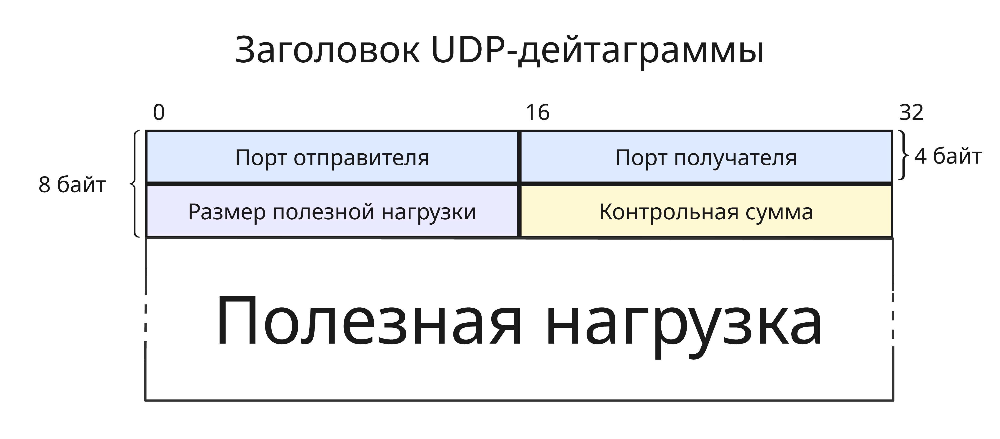
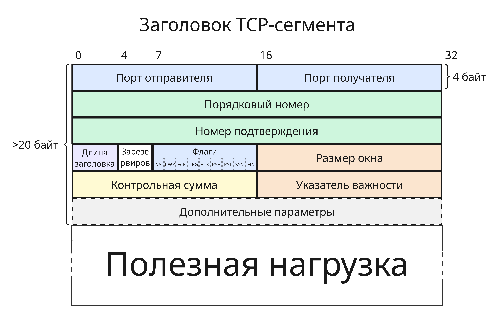
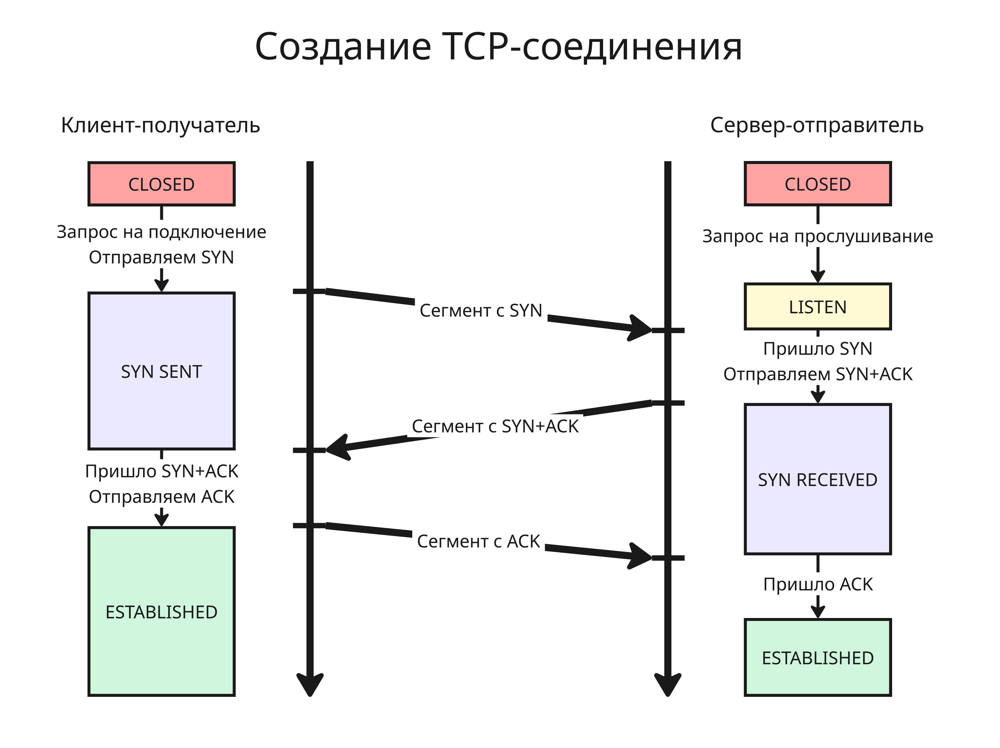
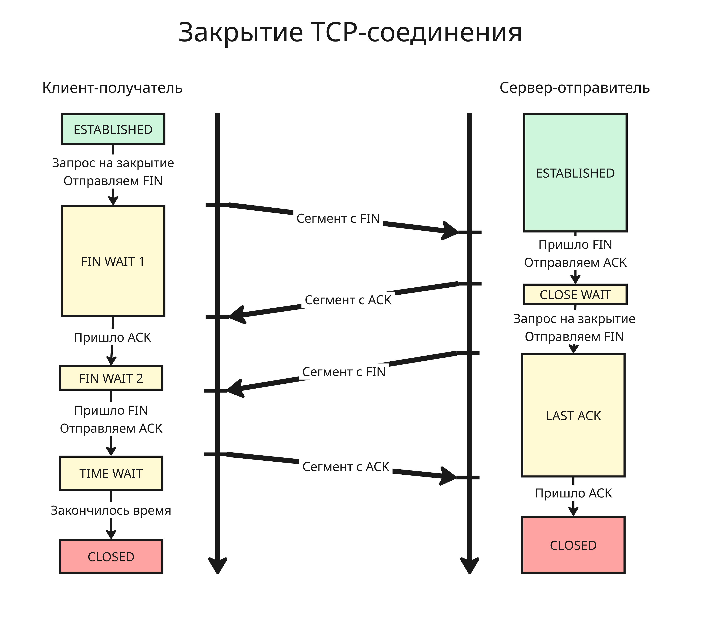
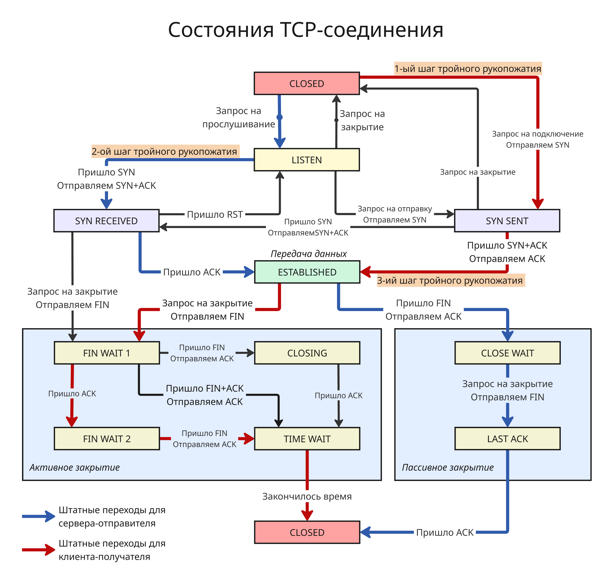
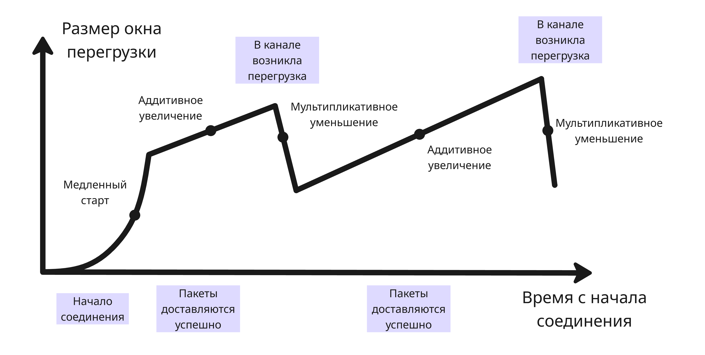
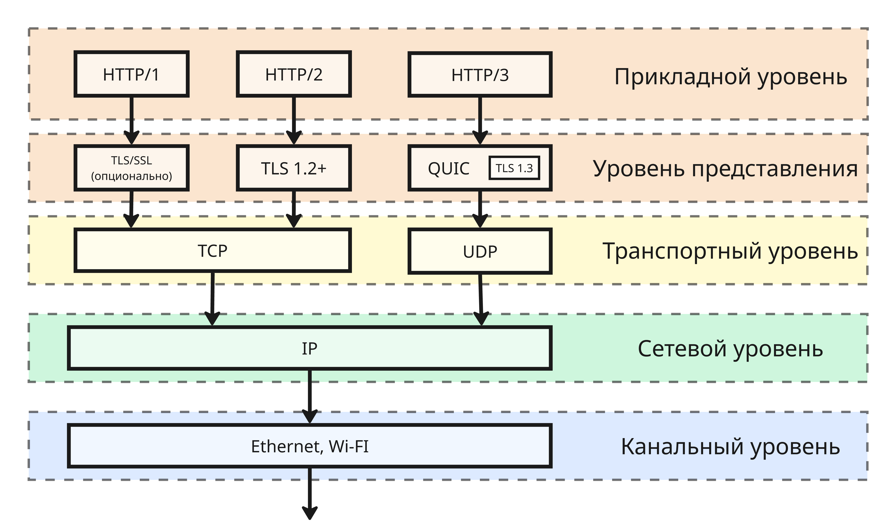

## Лекция 10. Транспортные протоколы UDP, TCP, QUIC

Задача транспортного уровня - это диспетчеризация данных между приложениями и обеспечение гарантий доставки

В TCP/IP эту роль выполняют протоколы TCP (Transmission Control Protocol) и UDP (User Datagram Protocol)

Адресов транспортного уровня в стеке TCP/IP является номер порта. Порты, как и сокеты, выдаются операционной системой, поэтому операционная система может свободно передать нужный пакет, если на узле есть два разных IP-адреса с одинаковыми портами. Порты для TCP и UDP могут совпадать. 

Номера портов для серверов фиксированы. Есть порты, определяемые стандартами RFC (такие как 80 для HTTP) и неофициальные. Номера портов для клиентов - произвольные и больше 1024

Порт с номером 0 разрешен для использования в UDP, но запрещен в TCP, хотя в операционных системах 0 означает, что сама ОС должна выбрать свободный порт

### UDP

Протокол UDP быстрый, но глупенький: он не требует подтверждений, но из-за этого обладает высокой скоростью. Заголовок UDP-дейтаграммы выглядит так:

* Порт отправителя, 16 бит
* Порт получателя, 16 бит
* Длина дейтаграммы, 16 бит
* Контрольная сумма, 16 бит

Контрольная сумма служит для проверки дейтаграммы и если она не совпадает, то дейтаграмма отбрасывается.

Так как UDP не гарантирует доставку, то при использовании этого протокола в системе должны учитываться ситуации, когда пакеты не будут доставлены

Протокол UDP используется протоколом DNS, для стриминга видео и аудио и в сетевых видеоиграх

### TCP

Протокол TCP описан множеством стандартов RFC и используется для:

* Установления и контроля соединения
* Деления данных пакета на сегменты
* Осуществления передачи с подтверждением

Заголовок TCP-сегмента выглядит так:

* Порт отправителя, 16 бит
* Порт получателя, 16 бит
* Порядковый номер, 32 бита

    Порядковый номер (Sequence Number) - порядковый номер первого октета этого сегмента во всём потоке данных, то есть смещение 

    Если установлен флаг `SYN`, то это начальный порядковый номер (Initial Sequence Number), который в целях безопасности выбирается случайно, далее при увеличении берется остаток по модулю `2^32`

* Номер подтверждения, 32 бита

    Номер подтверждения (Acknowledgment Sequence Number) используется при установленном флаге `ACK` и означает порядковый номер октета, который отправитель этого сегмента хочет получить. Из этого следует, что получающая пакеты сторона получила все предыдущие октеты до этого

* Длина заголовка в четверках байт, 4 бита
* 3 зарезервированных бита
* Флаги, 9 бит:

    * `NS` (ECN Nonce Sum) - проверка, что флаг `ECN` поставлен честно, сейчас не используется и по умолчанию 0
    * `CWR` (Congestion Window Reduced) - отправитель уведомляет, что окно перегрузки было уменьшено, после получения пакета с `ECE`
    * `ECE` (ECN Echo) - если установлен `SYN`, то TCP-соединение поддерживает Explicit Congestion Notification (ECN, Явное уведомление о перегруженности). Если `SYN` не установлен, то получатель принял пакет, в IP-заголовке которого установлены последние два бита в поле "Тип службы" на `11`, что означает, что промежуточные узлы перегружены (о перегрузке позже) 
    * `URG` (urgent) - срочное сообщение, нужно обратить внимание на поле "Указатель важности"
    * `ACK` (acknowledgement) - подтверждение приема, все пакеты получателя после начального `SYN`-пакета должны иметь этот флаг, а отправитель должен передать сегмента, порядковый октеты которого начинаются с "Номера подтверждения" 
    * `PSH` (push) - передать данные из сегмента приложению получателя немедленно
    * `RST` (reset) - немедленно сбросить соединение, очистить буферы
    * `SYN` (synchronize) - синхронизация порядковых номеров на сервере и клиенте. Только первый пакет с каждой стороны должен иметь этот флаг
    * `FIN` (final) - завершение соединения, отправление последнего пакета

* Размер окна в байтах, 16 бит
* Контрольная сумма, 16 бит
* Указатель важности, 16 бит

    Указатель важности указывает на порядковый номер октета, которым заканчиваются важные данные

* Дополнительные параметры, или опции

---

Но как же в TCP обеспечиваются гарантии доставки? Отправлять по одному пакету и ждать подтверждения не оптимально, так как задержка может быть большой. Поэтому отправляются несколько сегментов таких, что их размер не превышает размер окна. Как только сегмент подтверждается получателем, его объем вычитается из размера окна

Размер окна - это параметр операционной системы и обычно равен 64 кБ. Поздние RFC предполагают изменять окно на основе статистике: если подтверждения успешно доставляют, то окно увеличивается

Однако, если пакет потерялся, применяются следующие стратегии:

* Тройное признание

    Если получатель трижды отправил сегмент с флагом `ACK` с одним подтвержденным номером, то отправитель считает, что все октеты, начиная с этого номера, потеряны и будут отправлены повторно, а отправка текущих пакетов прекращается

* Реализация выборочных подтверждений (SACK, Selective Acknowledgement)

    Получатель может отправить `ACK` с первым октетом сегмента, который потерян, а в опциях указать, какие октеты получатель успешно получил, таким образом, сегменты с этими октетами не будут отправлены

---

Перед тем, как начать передавать пакеты, нужно заранее убедиться, что соединение надежно для передачи. Для этого используется алгоритм тройного рукопожатия:

* Клиент посылает сегмент с флагом `SYN` серверу с нужным портом, который прослушивается (находится в состоянии `LISTEN`)
* Сервер посылает сегмент с флагами `ACK` и `SYN`
* Клиент отправляет сегмент с флагом `ACK`

Из этого следует, что можно сделать DOS-атаку: просто посылать на сервер только первый сегмент и не отправлять последующий. У сервера заканчиваются открытые сокеты, ожидающие второй сегмент от клиента и он больше не может открывать последующие соединения. Решением этого является уменьшение таймера (еще один параметр ОС), после которого неустановленное соединение раньше сбрасывается

Соединение закрывается аналогично:

* Инициатор закрытия отправляет сегмент с флагом `FIN`
* Ответчик отправляет сегмент с флагами `FIN` и `ACK` (или 2 сегмента, один с `ACK`, другой с `FIN`)
* Далее инициатор подтверждает закрытие отправкой сегмента с флагом `ACK`

Таким образом, каждая сторона закрывает свою часть логического соединения

Однако соединение у получателя не сразу закрывается после получения FIN, чтобы успешно дошли заблудившиеся пакеты или чтобы восстановить соединение (сейчас восстановление не применяется). Обычно такое время составляет 30, 60 или 120 секунд

В общем, автомат состояний TCP-сокета выглядит так:

---

Самая мякотка протокола TCP - регулирование скорости. Чтобы все дошло, нужно ограничивать скорость, так как она меняется в зависимости от:

* времени от начала передачи
* успешности передачи
* состояния приемника
* состояния промежуточных узлов

Если передатчик или один их промежуточных узлов перегружены, то пакеты успешно не дойдут, поэтому нужно сделать так, чтобы получатель мог уведомлять о своей нагрузке отправителя

Если отправитель получает сообщение о повторной отправке, то считается, что наступила ситуация "перегрузки", и уменьшается интенсивность отправления, так называемое окно перегрузки (Congestion Window). Окно перегрузки позволяет согласовать полную загрузку виртуального соединения и текущие возможности канала, минимизируя потери пакетов при перегрузке

Когда роутер понимает, что буфер заканчивается, устанавливает флаг `ECN` в поле "Тип службы" в заголовке IP-пакета. Получатель получает его, понимает, что промежуточные узлы перегружены, поэтому в заголовке TCP-сегмента ставит флаг `ECN`

Алгоритмов контроля перегрузки множество: CUBIC TCP, BBR TCP, Highspeed TCP, H-TCP, TCP Hybla, TCP-Illinois, TCP Low Priority, TCP Vegas, TCP NewReno, TCP Veno, TCP Westwood+, YeAH-TCP

Увеличение окна перегрузки обычно происходит так:

* Медленный старт - окно перегрузки экспоненциально увеличивается до заданного порога. Делается это для того, чтобы не перегружать сеть такой интенсивностью, которую узлы не могут потянуть
* Если успешно приходят `ACK`, то окно аддитивно увеличивается
* Если какой-то пакет потерян или пришел сегмент с `ECN`, то окно мультипликативно уменьшается

Помимо этого, есть еще один механизм. Если у получателя буфер для TCP-сегментов почти заполнен, то в сегменте подтверждения отправляет в заголовке объем свободного буфера (поле "Размер окна"). Отправитель посылает ровно столько сегментов, сколько осталось в буфере, и, не посылая ничего, ждет, пока придут подтверждения

### QUIC

Проблемы TCP, в основном, заключается в том, что протокол был создан во времена медленных соединений. Поэтому TCP обладает такими недостаткам:

* Медленное открытие соединения
* Проблема медленного старта
* Слабая адаптация TCP к беспроводным сетям - TCP очень уязвим к нестабильным задержкам и потерям пакетов, что свойственно беспроводным сетям
* Критическое влияние задержки, а не пропускной способности канала

Перерабатывать TCP или делать что-то новое - слишком дорого из легаси-кода. Поэтому специалисты из Google решили сделать прослойку между быстрым UDP и прикладным уровнем - протокол QUIC

До этого в HTTP/1.0 применялась параллельная загрузка частей веб-страницы по разным TCP-соединениям. Такое активное взаимодействие создавало значительную нагрузку на сеть: избыточные рукопожатия, множества открытых сокетов у сервера обслуживают одного клиента и так далее

В HTTP/2.0 решили сделать одно TCP-соединение, но с мультиплексированием, то есть файлы веб-страницы передаются по одному TCP-соединению, а HTTP управляет, какие сегменты принадлежат каким файлам. Проблема появилась тогда, когда какой-либо пакет теряется (например, ненужная картинка), то окно перегрузки уменьшается, и скорость падает (проблема Head-of-line-blocking)

В Google решили сделать протокол QUIC, который находится в пользовательском пространстве ОС, является прокси над UDP и решает задачи TCP более проще. На его основе сделан HTTP/3.0. К тому же протокол QUIC понимает семантику данных, поэтому скорость не падает при потери второстепенных данных

Чтобы QUIC внедрить, нужна поддержка со стороны сервера и клиента. Со стороны клиента нужна поддержка приложения или браузера (QUIC поддерживается браузерами Firefox, Safari и на основе Chromium) и сервера (Nginx и другие, которые поддерживают HTTP/3.0)

