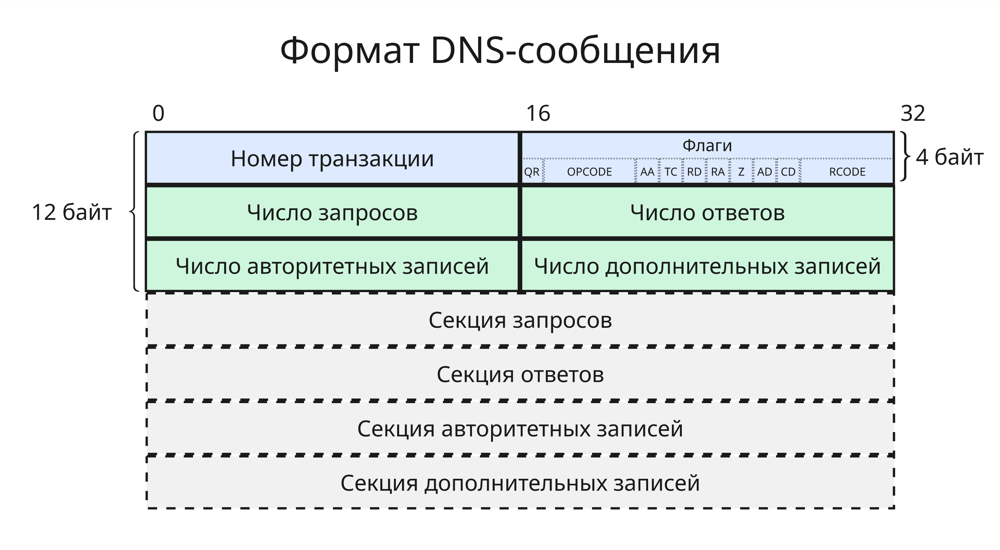
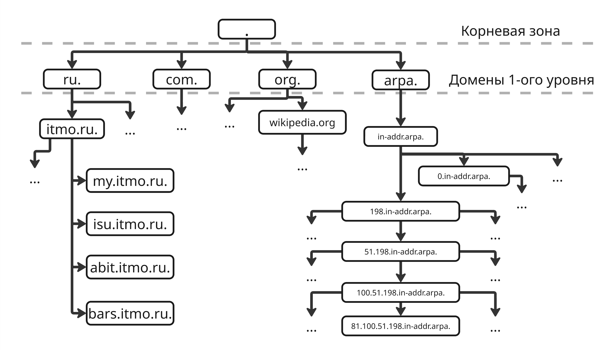

## Лекция 12. DNS

DNS (Domain Name System) - технология, позволяющая по доменному имени узнать IP-адрес сервера и наоборот

Домен (или доменное имя) - область пространства имён сети Интернет, которая обозначается уникальным доменным именем, обслуживается набором серверов доменных имён и централизованно администрируется

DNS была описана Полом Мокапетрисом в 1984 году стандартами RFC 882 и RFC 883. Позже выходило множество стандартов, описывающих DNS

DNS использует свой протокол, для передачи пакетов которого используется UDP или TCP и порт сервера 53. Формат DNS-пакет такой:

* Идентификатор транзакции, 16 бит
* Флаги, 16 бит
    * `QR` (Query Response), 1 бит - запрос (`0`) или ответ (`1`)
    * `OPCODE` (OPeration CODE), 4 бита - стандартный запрос (`QUERY` - `0`), обратный запрос (`IQUERY`, `1`) или статус (`STATUS`, `2`)
    * `AA` (Authoritative Answer): 1 bit - авторитетный ли ответ
    * `TC` (TrunCation): 1 bit - индикатор того, что сообщение урезано по длине
    * `RD` (Recursion Desired), 1 бит - запрос клиента на рекурсивный запрос
    * `RA` (Recursion Available), 1 бит - ответ сервера о возможности рекурсивного запроса
    * `Z` (Zero), 1 бит - зарезервировано, `0`
    * `AD` (Authentic Data), 1 бит - ответная информация проверена
    * `CD` (Checking Disabled), 1 бит - запрос на отключение проверки информации
    * `RCODE` (Response CODE), 4 бита - нет ошибки (`NOERROR` - `0`), ошибка формата (`FORMERR` - `1`), ошибка сервера (`SERVFAIL` - `2`), несуществующий домен (`NXDOMAIN` - `3`) и другие
* Число запросов, 16 бит
* Число ответов, 16 бит
* Число авторитетных записей, 16 бит
* Число дополнительных записей, 16 бит

Далее идут секции запросов, ответов, авторитетных и дополнительных записей

* Запросы записываются как "имя запрашиваемого ресурса" + "тип записи" (16 бит) + "код класса" (16 бит)
* Записи записываются в формате "имя запрашиваемого ресурса" + "тип записи" (16 бит) + "код класса" (16 бит) + "время жизни" (32 бита) + "длина дополнительных данных в октетах" (16 бит) + "дополнительные данные"

Имена запрашиваемых ресурсов передаются с нуль-терминатором



Чтобы DNS-клиенту получить запись о IP-адресе, ему нужно обратиться к DNS-серверу. DNS-сервера бывают:

* Основными, резервными
* Нерекурсивными - отдают оригиналы записей или их кеши, рекурсивные - при запросе спрашивают другие сервера
* Авторитетные - хранят оригинальные, всегда правильные записи, кеширующие - хранят записи определенное время, из-за чего

Сервера отвечают за зоны - пространства записей, где соотнесены IP-адреса и домена

Сами доменные имена представляют из себя дерево. Это дерево начинается с имени `.`, которое называют корневым доменом:



Эта точка в реальной жизни опускается в виду ее очевидности

От него идут домены первого уровня, они бывают национальными (ccTLD, country code Top Level Domain), определенные стандартом ISO 3166, такие как `.ru`, `.su`, `.рф`, и тематические, такие как `.com` (коммерция), `.gov` (government, правительство), `.net` (network, сеть) и другие

Дальше идут домены домены второго уровня, такие как `itmo.ru`, а за ними третьего, четвертого и так далее. 

На весь домен (так называемый FQDN, Fully Qualified Domain Name) действует ограничение в 255 октет, а длина имени между точками должна быть не меньше 63 октет

Помимо этого, существуют зарезервированные имена, такие как `example.com`, `example.org`, `example.net` и другие

Также существует зона обратного просмотра, созданная для разрешения доменного имени по IP-адресу: `Z.Y.X.W.in-addr.arpa.`, где `W.X.Y.Z` - IPv4-адрес

---

За корневую зону отвечают корневые сервера. Они управляются ICANN (Internet Corporation for Assigned Names and Numbers) и их всего 13:

| Имя | IPv4-адрес | IPv6-адрес | Компания | Местоположение |
|-|-|-|-|-|
| a.root-servers.net | 198.41.0.4 | 2001:503:ba3e::2:30 | Verisign Inc. | США |
| b.root-servers.net | 170.247.170.2 | 2801:1b8:10::b | University of Southern California, Information Sciences Institute | США |
| c.root-servers.net | 192.33.4.12 | 2001:500:2::c | Cogent Communications | США |
| d.root-servers.net | 199.7.91.13 | 2001:500:2d::d | University of Maryland | США |
| e.root-servers.net | 192.203.230.10 | 2001:500:a8::e | NASA (Ames Research Center) | США |
| f.root-servers.net | 192.5.5.241 | 2001:500:2f::f | Internet Systems Consortium, Inc. | США |
| g.root-servers.net | 192.112.36.4 | 2001:500:12::d0d | US Department of Defense (NIC) | США |
| h.root-servers.net | 198.97.190.53 | 2001:500:1::53 | US Army (Research Lab) | США |
| i.root-servers.net | 192.36.148.17 | 2001:7fe::53 | Netnod | Швеция |
| j.root-servers.net | 192.58.128.30 | 2001:503:c27::2:30 | Verisign, Inc. | США |
| k.root-servers.net | 193.0.14.129 | 2001:7fd::1 | RIPE NCC | Нидерланды |
| l.root-servers.net | 199.7.83.42 | 2001:500:9f::42 | ICANN | США |
| m.root-servers.net | 202.12.27.33 | 2001:dc3::35 | WIDE Project | Япония |

Помимо них, также есть реплики, копирующие записи этих серверов. Данные между репликами синхронизируются с помощью протокола TCP

IP-адреса корневых сервером записаны на каждом устройстве, которые способны разрешать доменные имя. Далее по полученным от них IP-адреса DNS-серверов зон ниже можно рекурсивно определить IP-адрес

На Linux утилита `dig` позволяет посмотреть DNS-записи. На Windows есть аналог `nslookup`. Всего существует множество типов записей:

* `SOA` (Start Of Authority) - начальная запись зоны, которая определяет серийный номер, контакты и так далее, пример:
    
    ```
    itmo.ru.                7200    IN      SOA     ns.itmo.ru. hostmaster.itmo.ru. 2025052299 3600 1800 86400 3600
    ```

    Здесь:

    * `TTL` - время жизни записи
    * `IN` - класс (то есть INternet)
    * `SOA` - тип записи
    * `ns.itmo.ru.` - первичный DNS-сервер для этой зоны (MNAME)
    * `hostmaster.itmo.ru.` - почтовый адрес администратора, здесь первая неэкранированная точка заменяется на `@`, получаем `hostmaster@itmo.ru` (RNAME)
    * `2025052299` - серийный номер, здесь обозначена дата 22.05.2025 (SERIAL)
    * `3600` - время обновления записи для вторичных серверов (REFRESH)
    * `1800` - время, через которое повторяется обновление записи при неполучении ответа от главного сервера (RETRY)
    * `86400` - время, через которое сервера прекращают запросы к главному серверу, если тот все еще не ответил (EXPIRE)
    * `3600` - минимальное время кэширования для записей без явного TTL (MINIMUM)

* `A` (Address record) - запись IPv4-адреса, пример:

    ```
    itmo.ru.                5058    IN      A       51.250.120.146
    ```

* `AAAA` (AAAAddress record) - запись IPv6-адреса (четыре A, потому что длина адреса в 4 раз больше)
* `CNAME` (Canonical NAME record) - запись, которая связывает домен с другим доменом, пример:

    ```
    ftp.itmo.ru.            7183    IN      CNAME   ocean.itmo.ru.
    ```

    Если домены образуют цепь, то `CNAME` выдаст конечный домен

* `MX` (Mail eXchange) - запись адреса почтового сервера, пример:

    ```
    itmo.ru.                6444    IN      MX      10 emx.mail.ru.
    ```

    Здесь `10` - приоритет использования, чем он ниже, тем более приоритетный сервер

* `NS` (Name Server) - записи DNS-серверов этой зоны, пример:

    ```
    itmo.ru.                7200    IN      NS      ns2.itmo.ru.
    itmo.ru.                7200    IN      NS      ns3.itmo.ru.
    itmo.ru.                7200    IN      NS      ns.itmo.ru.
    itmo.ru.                7200    IN      NS      ns5.itmo.ru.
    ```

    Здесь у зоны `itmo.ru.` 4 сервера

* `PTR` (PoinTeR) - запись, которая связывает домен с другим доменом, но в отличии от `CNAME` выдает следующий домен, а не конечный
* `SRV` (SeRVice locator) - поиск сервисов
* `TXT` (TeXT record) - текстовая запись

---

Чтобы зарегистрировать свой домен, нужно внести его в централизованную базу данных (реестр) и заплатить регистратору денежку

Такой реестр содержит информацию о зарегистрированных доменных именах, данные администраторов доменов и другую информацию, необходимую для функционирования доменов

Регистратором доменных имен является аккредитованная организация, уполномоченная вносить записи в реестр. Для доменов `.ru`, `.su` и `.рф` аккредитовано 38 регистраторов Координационным центром национального домена сети Интернет

Рекомендуется хостинг и домен заказывать у разных сервисов, чтобы при переезде на другой хостинг не регистрировать домен заново

Далее домен нужно разместить в DNS-сервере домена первого уровня, такой процесс называется делегированием. Делегирование обеспечивает, чтобы при запросе вашего домена DNS-система знала, какие серверы содержат информацию о нем


