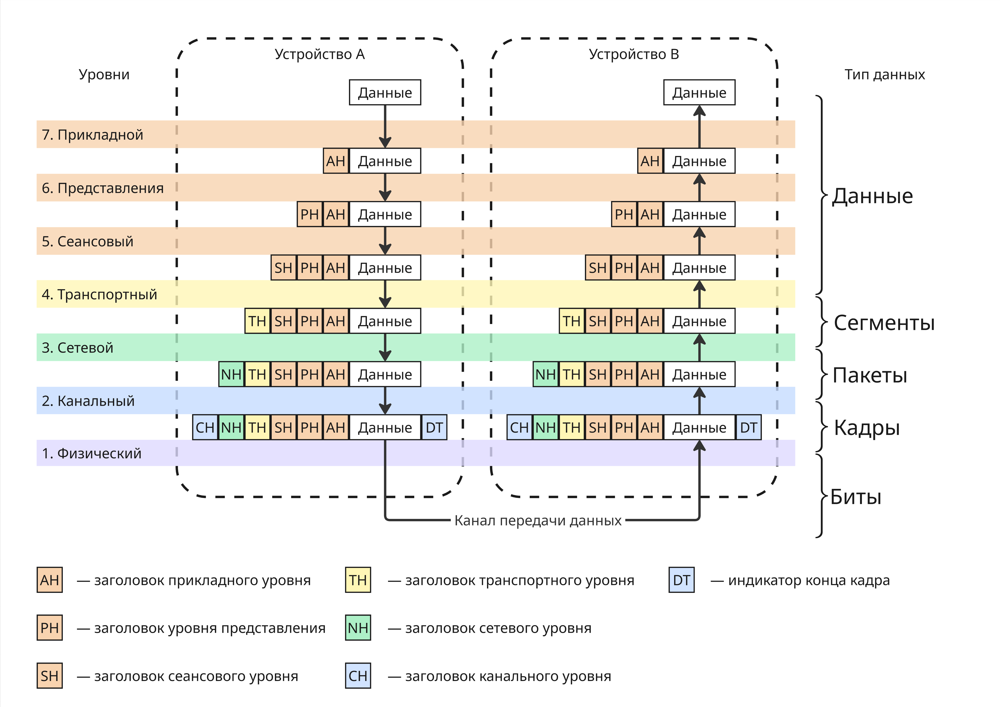
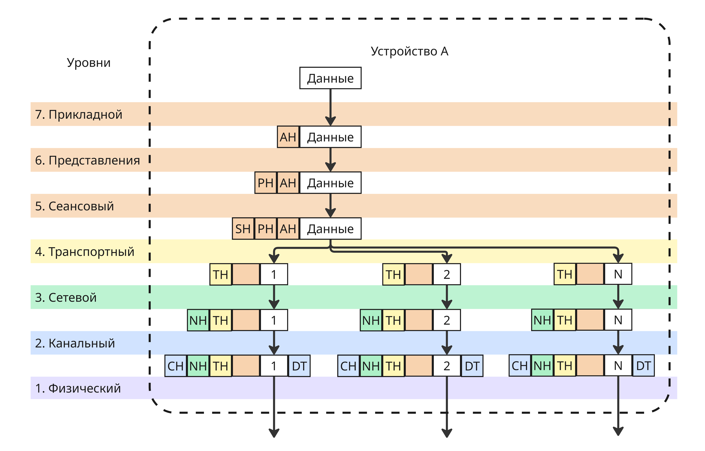
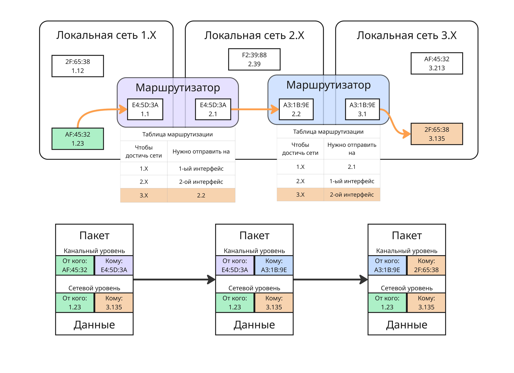
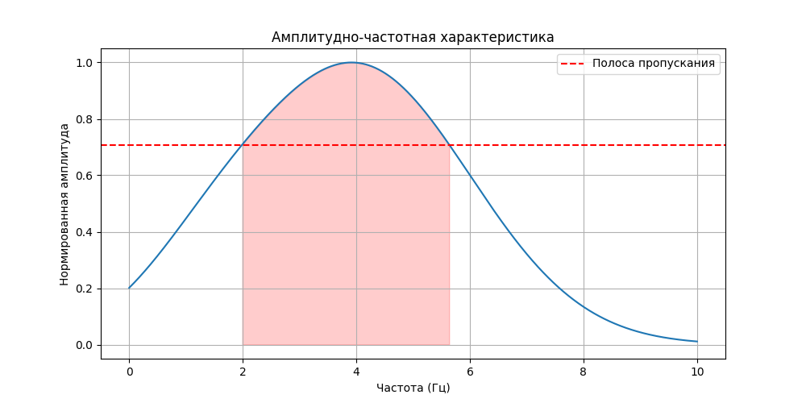
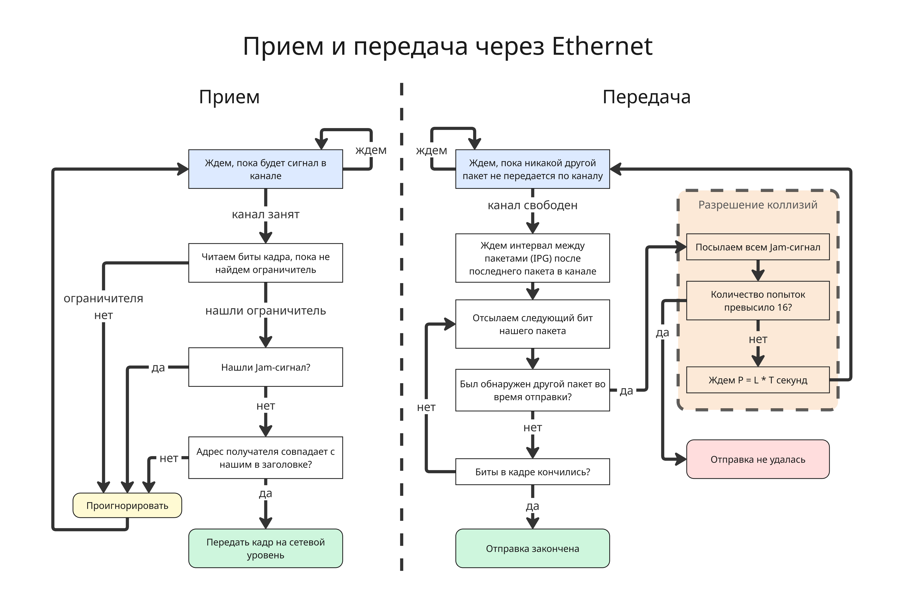
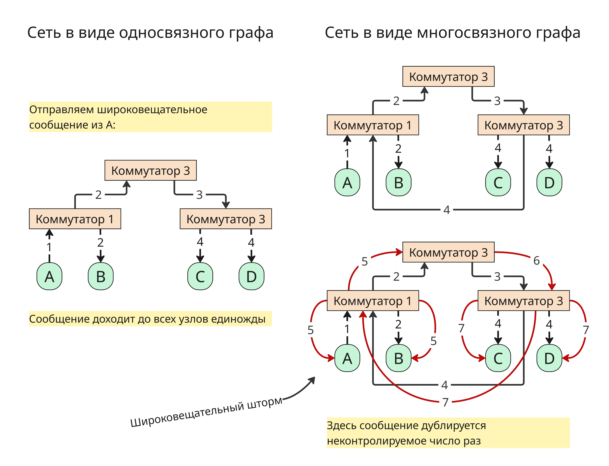
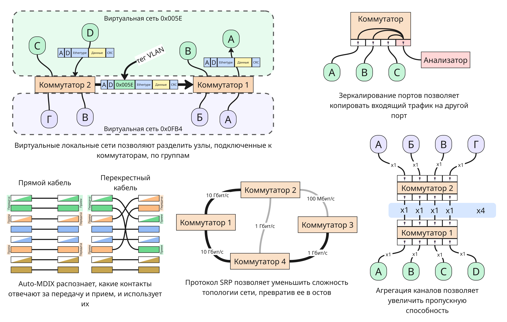
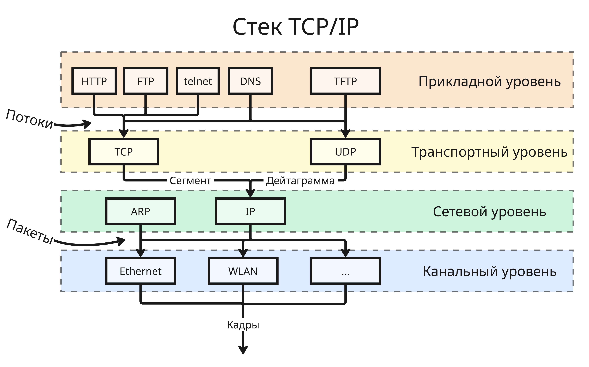
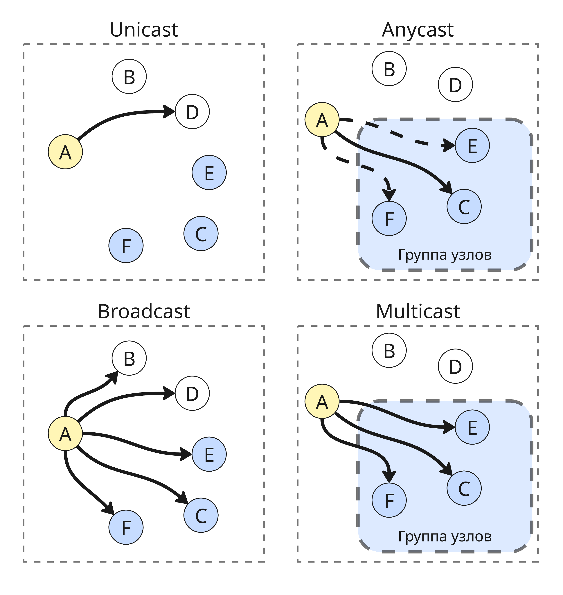

# <a name="%D1%82%D0%B5%D0%BB%D0%B5%D0%BA%D0%BE%D0%BC%D0%BC%D1%83%D0%BD%D0%B8%D0%BA%D0%B0%D1%86%D0%B8%D0%BE%D0%BD%D0%BD%D1%8B%D0%B5-%D1%81%D0%B8%D1%81%D1%82%D0%B5%D0%BC%D1%8B-%D0%B8-%D1%82%D0%B5%D1%85%D0%BD%D0%BE%D0%BB%D0%BE%D0%B3%D0%B8%D0%B8"></a> Телекоммуникационные системы и технологии


* [Телекоммуникационные системы и технологии](#%D1%82%D0%B5%D0%BB%D0%B5%D0%BA%D0%BE%D0%BC%D0%BC%D1%83%D0%BD%D0%B8%D0%BA%D0%B0%D1%86%D0%B8%D0%BE%D0%BD%D0%BD%D1%8B%D0%B5-%D1%81%D0%B8%D1%81%D1%82%D0%B5%D0%BC%D1%8B-%D0%B8-%D1%82%D0%B5%D1%85%D0%BD%D0%BE%D0%BB%D0%BE%D0%B3%D0%B8%D0%B8)
  * [Лекция 1. Задачи сетевой коммуникации. Модель OSI](#%D0%BB%D0%B5%D0%BA%D1%86%D0%B8%D1%8F-1.-%D0%B7%D0%B0%D0%B4%D0%B0%D1%87%D0%B8-%D1%81%D0%B5%D1%82%D0%B5%D0%B2%D0%BE%D0%B9-%D0%BA%D0%BE%D0%BC%D0%BC%D1%83%D0%BD%D0%B8%D0%BA%D0%B0%D1%86%D0%B8%D0%B8.-%D0%BC%D0%BE%D0%B4%D0%B5%D0%BB%D1%8C-osi)
  * [Лекция 2. Физический уровень сетевого стека](#%D0%BB%D0%B5%D0%BA%D1%86%D0%B8%D1%8F-2.-%D1%84%D0%B8%D0%B7%D0%B8%D1%87%D0%B5%D1%81%D0%BA%D0%B8%D0%B9-%D1%83%D1%80%D0%BE%D0%B2%D0%B5%D0%BD%D1%8C-%D1%81%D0%B5%D1%82%D0%B5%D0%B2%D0%BE%D0%B3%D0%BE-%D1%81%D1%82%D0%B5%D0%BA%D0%B0)
  * [Лекция 3. Локальные сети на примере Ethernet](#%D0%BB%D0%B5%D0%BA%D1%86%D0%B8%D1%8F-3.-%D0%BB%D0%BE%D0%BA%D0%B0%D0%BB%D1%8C%D0%BD%D1%8B%D0%B5-%D1%81%D0%B5%D1%82%D0%B8-%D0%BD%D0%B0-%D0%BF%D1%80%D0%B8%D0%BC%D0%B5%D1%80%D0%B5-ethernet)
  * [Лекция 4. Коммутаторы сетей Ethernet](#%D0%BB%D0%B5%D0%BA%D1%86%D0%B8%D1%8F-4.-%D0%BA%D0%BE%D0%BC%D0%BC%D1%83%D1%82%D0%B0%D1%82%D0%BE%D1%80%D1%8B-%D1%81%D0%B5%D1%82%D0%B5%D0%B9-ethernet)
  * [Лекция 5. Стека TCP/IP](#%D0%BB%D0%B5%D0%BA%D1%86%D0%B8%D1%8F-5.-%D1%81%D1%82%D0%B5%D0%BA%D0%B0-tcp%2Fip)


Курс знакомит с сетевым мониторингом, конфигурацией сетевых интерфейсов, маршрутизацией, обработкой пакетов и прочим. Курс преимущественно сделан для работы с ОС GNU/Linux

## <a name="%D0%BB%D0%B5%D0%BA%D1%86%D0%B8%D1%8F-1.-%D0%B7%D0%B0%D0%B4%D0%B0%D1%87%D0%B8-%D1%81%D0%B5%D1%82%D0%B5%D0%B2%D0%BE%D0%B9-%D0%BA%D0%BE%D0%BC%D0%BC%D1%83%D0%BD%D0%B8%D0%BA%D0%B0%D1%86%D0%B8%D0%B8.-%D0%BC%D0%BE%D0%B4%D0%B5%D0%BB%D1%8C-osi"></a> Лекция 1. Задачи сетевой коммуникации. Модель OSI

В современных устройствах настройка сетевых интерфейсах сведена к минимуму для облегчения использования. На самом деле обеспечение производительной, надежной и безопасной коммуникации между разнородными системами - сложная задача. Во разработки сетевой коммуникации появляются:

* Необходимость обеспечить взаимодействие разнообразных систем вне зависимости от архитектуры ОС, кодировки символов, разрядности процессора и т.п.
* Необходимость работать через разное оборудование (ноутбук/телефон -> роутер -> коммутатор -> сервер) во время одного сеанса связи
* Необходимость организационно разграничивать управление в крупных сетях

Помимо этого надо учесть технические аспекты:

* Задержка (Latency) - переменное время, которое требуется для передачи данных от источника к приемнику
* Пропускная способность (Bandwidth) - передача объема данных за заданный промежуток времени, которая зависит от нагруженности узлов передачи, качества каналов
* Помехи (Interference) - явления, искажающие сигнал
* Потеря пакетов (Packet loss) во время их передачи
* Угрозы безопасности, такие как DoS (Denial of Service), возможность авторизации и аутентификации
* Проблемы с конфигурацией и совместимостью
* Проблемы масштабируемости

Для решения этой задачи нужны стандарты, которые согласуют интерфейсы, протоколы и оборудование для коммуникации. Несмотря на абстракцию от операционных систем и архитектур влияние сетевого стека на производительность приложения очень велика

В начале развития сетевых операционных систем большинство сетевых решений были проприетарными: компании продавали проприетарные оборудование и ПО для сетевого взаимодействия (то есть решения с монолитной архитектурой)

Военные США не желали зависеть от одного поставщика сетевого оборудования, поэтому Международной организацией по стандартизации (ISO) в конце 70-ых была разработана модель OSI - открытая модель сетевой коммуникации

Разработчики декомпозировали все этапы сетевого взаимодействия и стандартизировали все интерфейсы между этапами. Модель не регламентировала имплементацию, только интерфейсы. Получалась строгая процессная модель, этапы которой решали конкретную задачу. В модель входили 7 уровней:

1. Прикладной уровень
2. Уровень представлений
3. Сеансовый уровень
4. Транспортный уровень
5. Сетевой уровень
6. Канальный уровень
7. Физический уровень



Данные проходят через уровни, обрастая заголовками, содержащие такую информацию, как адрес отправителя, получателя и другое. После канального уровня в конце кадра (фрагмента данных) добавляется DT (Data Trailer), обозначающий конец кадра

Уровни из-за слоев абстракции не знают о реализации других уровней выше и ниже, что позволяет менять их и не изменять реализацию других

Большинство сетевых стеков реализуют эту похожую на эту модель. Например, в модели TCP/IP уровней 4: прикладной, транспортный, сетевой, канальный

Можно заметить, что размер пакета, пока он проходит через все уровни, увеличивается. В реальности на транспортном уровне пакет может сегментироваться на меньшие, чтобы избежать две проблемы:

* Не блокировать канал связи для других пользователей при передачи очень длинного сообщения
* Повторно загружать пакеты при неудачной загрузке 



Несмотря на достаточное абстрагирование от реализаций, модель OSI обладает недостатками:

* В модели OSI строгая инкапсуляция, строгий порядок уровней - в реальных сетевых стеков это не так
* Модель OSI чрезмерно избыточна, некоторые уровни можно объединить в один, как сделано в TCP/IP


Подробно поговорим про функции уровней:

* Прикладной уровень предоставляет командный интерфейс приложениям или пользователям, передача файлов, данных потоков

    Примером протоколов прикладного уровня могут быть HTTP, HTTPS, FTP, SMTP

* На уровне представления происходит сжатие, шифрование, символьная кодировка

    Это происходит благодаря протоколам SSL, TLS, алгоритмам шифрования и кодировки

* Сеансовый уровень устанавливает, управляет и завершает соединения между приложениями

    Технологии RPC (Remote Procedure Call, Удаленный вызов процедур) реализуют сеансовый уровень

* Транспортный уровень обеспечивает сегментацию и гарантии доставки данных в правильном порядке

    Протоколы TCP, UDP могут сегментировать большие фрагменты данных. Кроме того, TCP гарантирует, что пакеты дойдут до получателя

* Сетевой уровень решает задачу доставки данных по составной сети, межсетевую адресацию, трансляцию виртуальных адресов в физические

    Чаще всего сейчас сетевой уровень реализуется протоколами IPv4 и IPv6

* Канальный уровень отвечает за передачу кадров данных между узлами в локальной сети по физическому уровню, например, Ethernet, Bluetooth

* Физический уровень представляет спецификацию для разъемов, кабелей, назначение контактов и формат сигналов, например, RJ (Registered Jack) или USB


Модель OSI не дает полное описание сети и появилась позже других стандартов, поэтому в свое время не получила поддержку. Сейчас она является академической моделью, которая дает понимание работы различных компонентов компьютерных сетей и того, как они работают вместе

Также она дает общую терминологию и концепции для разработки и проектирования других сетевых продуктов и технологий

В программе [Wireshark](https://www.wireshark.org/) можно проанализировать сетевой трафик устройства. Если выбрать какой-нибудь кадр, то можно увидеть его заголовки:

```
Frame 722: 45 bytes on wire (360 bits), 45 bytes captured (360 bits) on interface \Device\NPF_{8B3A2192-8B36-11F0-8DE9-0242AC120002}, id 0
Ethernet II, Src: Router_98:92:f1 (4c:c6:4c:98:92:f1), Dst: 16:d2:51:89:f3:ab (16:d2:51:89:f3:ab)
Internet Protocol Version 4, Src: 198.51.100.68, Dst: 198.18.0.139
Transmission Control Protocol, Src Port: 60493, Dst Port: 443, Seq: 23254, Ack: 1, Len: 5
```

Здесь мы можем заметить IP и TCP протоколы и Ethernet, соответствующие сетевому, транспортному и канальному уровням


---

В наше время для большинства устройств определены два адреса:

* Физический адрес (или MAC-адрес, от Media Access Control), например, `16:52:91:ff:13:c4`. Такой адрес присваивается устройству на заводе изготовителя и является уникальным
* Сетевой адрес, чаще всего это IPv4 (например, `198.51.100.23`) или IPv6 (например, `3fff:0db8:11a3:09d7:1f34:8a2e:07a0:765d`)

Физический адрес нужен для идентификации устройства в пределах локальной сети, а сетевой - в пределах глобальной сети

На сетевом уровне пакету добавляются IP-адреса отправителя и получателя, а на канальном - MAC-адреса отправителя и получателя

Допустим, что есть 3 локальных сети, соединенных маршрутизаторами:



Для простоты здесь используется другой формат физических и сетевых адресов. Если мы хотим отправить пакет от `1.23` к `3.135`, то:

1. Пакет направляется в маршрутизатор `E4:5D:3A`. При первом подключении узла `AF:45:32` к маршрутизатору, узлу присваивается сетевой адрес `1.23`, в свою очередь узел запоминает, что, чтобы отправить пакет за пределы своей сети, нужно передать его маршрутизатору
2. Далее маршрутизатор смотрит на свою таблицу маршрутизации. Там описан следующий шаг в цепочке, чтобы достичь целевой узел. Пакет передается через другой интерфейс маршрутизатора `2.1` в маршрутизатор `2.2`
3. Там маршрутизатор `A3:1B:9E` понимает, что адрес узла находится в локальной сети и, используя физические адреса, передает нужному узлу пакет

Благодаря абстракции между сетевым и канальным уровнем пропадает надобность от уникальности физических адресов - в нашей системе два узла с адресом `AF:45:32`. Также в локальной сети 2.X физические адреса могут иметь другой формат

В реальности таблица маршрутизации устроена сложнее, например, в ней могут присутствовать веса следующих направлений, которые показывают, к каком узлу обратиться, если наилучший не доступен


## <a name="%D0%BB%D0%B5%D0%BA%D1%86%D0%B8%D1%8F-2.-%D1%84%D0%B8%D0%B7%D0%B8%D1%87%D0%B5%D1%81%D0%BA%D0%B8%D0%B9-%D1%83%D1%80%D0%BE%D0%B2%D0%B5%D0%BD%D1%8C-%D1%81%D0%B5%D1%82%D0%B5%D0%B2%D0%BE%D0%B3%D0%BE-%D1%81%D1%82%D0%B5%D0%BA%D0%B0"></a> Лекция 2. Физический уровень сетевого стека

От чего зависит скорость передачи данных по кабелю? На скорость передачи могут влиять:

* На уровне приложения вычислительная мощность взаимодействующих узлов, особенности прикладных протоколов, кодировка, алгоритмы приложений, наличие механизмов безопасности и тому подобное
* На транспортном уровне особенности протоколов, размер буферов, статистика ошибок и перегрузки
* На сетевом уровне топология и загруженность сети, алгоритмы маршрутизации, а также скорость и качество сетевых устройств
* На канальном уровне характеристики сетевой карты, спецификация канального протокола, вид и загруженность коммуникационных устройств
* На физическом уровне тип используемого кабеля, характеристики и качество пассивного оборудования, качество прокладки кабелей и расстояние между компонентами сети

Фактор влияния на физическом уровне являются верхней границей для максимальной скорости передачи, поэтому, чтобы увеличить пропускную способность, логично начать с усовершенствования кабеля

На физическом уровне передаче могут мешать:

* Электромагнитные помехи (EMI) от других источников
* Радиочастотные помехи (RFI) от Wi-Fi или микроволновой печи
* Перекрестные помехи (Crosstalk) от рядом лежащего кабеля
* Тепловые помехи от компонентов в сети
* Поглощение или затухание средой передачи
* Дублирование сигнала

По проводу можно передавать два типа сигнала:

* аналоговый - диапазон напряжения от низкого уровня до высокого относительно земли
* цифровой (или дискретный) - конечное число уровней, например, низкий уровень сигнала либо высокий

Приемник сам решат, как обрабатывать сигнал, получаемый по проводу, поэтому тип сигнала - это всего лишь интерпретация

На аналоговый сигнал очень сильно влияют помехи и затухание, поэтому чаще всего используют цифровой сигнал. Чтобы увеличить скорость можно увеличить частоту сигнала или усложнить сигнал (увеличить дискретизацию, то есть число уровней)

По Шеннону скорость передачи данных равна `H log2(1 + S / N)`, где `H` - полоса пропускания фильтра, `S` - мощность сигнала, `N` - мощность шума

По Найквисту скорость `2H log2 V`, где `V` - количество дискретных уровней

Увеличение полосы пропускания фильтра (например, использование платиновых проводов) - дорого. Увеличение количества дискретных уровней делает невозможным их различать и приводит к проблемам с аналоговым сигналом

Однако, если разложить цифровой сигнал с помощью преобразования Фурье, то можно получить ряд гармоник - синусоид и косинусоид, которые в сумме повторяют форму цифрового сигнала


Таким образом, чтобы пропускать больше дискретных уровней, нужно пропускать больше гармоник через полосу пропускания

Если для линии связи измерить отношение мощность выходного сигнала от входного для разных частот сигнала, то можно получить такую зависимость



То есть канал связи эффективно переносит сигнал в определенных частотах (в так называемой полосе пропускания), а в более высоких он более быстрее теряет амплитуду. Поэтому нет смысла переносить все гармоники для имитации цифрового сигнала, главное, чтобы основные лежали в полосе пропускания

---

Теперь двоичный сигнал нужно закодировать. Если несколько методов физической кодировки:

* Код NRZ работает так: если бит равен 1, то уровень сигнала высокий, если 0, то низкий

    Тогда возникает проблема: как чередовать последовательности из нулей и единиц. Здесь приемник и передатчик должны работать на одной частоте

* Код Манчестер-II

    В Манчестер-II ноль кодируется сменой с низкого сигнала на высокий, а единица сменой с высокого на низкий

    Перед тем, как начать передачу сигналов, передатчик отправляет преамбулу синхронизации, чтобы приемник знал, в какой момент времени считать смену сигнала за бит информации и не путать 01 с 10

    Манчестер-II используется в технологии Ethernet

* Код PAM-5

    В PAM-5 различаются 4 уровня. В нем 00, 01, 10 и 11 кодируются разными уровнями сигнала
    
    PAM-5 используется в гигабитных каналах Ethernet

Помимо физического кодирования можно сделать логическое. Логическое кодирование нужно для обнаружения ошибок и улучшение условий передачи. Например, кодирование 4B/5B использует лишний бит для дополнительной информации:

| 16-ричная система | 2-чная система | 4B/5B код /
|-|-|-|
| 0 | 0000 | 11110 |
| 1 | 0001 | 01001 |
| 2 | 0010 | 10100 |
| 3 | 0011 | 10101 |
| 4 | 0100 | 01010 |
| 5 | 0101 | 01011 |
| 6 | 0110 | 01110 |
| 7 | 0111 | 01111 |
| 8 | 1000 | 10010 |
| 9 | 1001 | 10011 |
| A | 1010 | 10110 |
| B | 1011 | 10111 |
| C | 1100 | 11010 |
| D | 1101 | 11011 |
| E | 1110 | 11100 |
| F | 1111 | 11101 |

| Символ | 4B/5B код | Сообщение |
|-|-|-|
| H | 00100 | Ошибка передачи |
| I | 11111 | Ожидание |
| J | 11000 | Начало потока |
| K | 10001 | Начало потока |
| L | 00110 | Начало потока |
| Q | 00000 | Потеря сигнала |
| R | 00111 | Сброс |
| S | 11001 | Набор |
| T | 01101 | Конец потока |

Код 4B/5B сделан так, чтобы при передачи 4 бит хотя бы дважды происходила смена уровня сигнала

---

Структурированная кабельная система - универсальная кабельная система здания, объединяющая в себе множество информационных ...

С развитием качества коммуникаций отдельные кабельные системы для различных сервисов превратились в универсальные системы с гарантированной полосой пропускания, модифицируемостью, простотой эксплуатации

Появились различные стандарты (TIA/EIA-568, TIA/EIA-569, ISO/IEC 11801, ANSI/TIA-606), по который должны разрабатываться системы в зданиях. Они в основном определяют характеристики линий связи (амплитудно-частотная характеристика, полоса пропускания, затухание), правила монтажа и эксплуатации, требования к проектирования и тестированию

Далее появился термин СКС:

Структурированная кабельная система (СКС) - универсальная кабельная система здания, объединяющая в себе множество  информационных сервисов, таких как локально вычислительные, телефонные сети, системы видеонаблюдения и так далее

Для СКС существует ряд терминов:

* Рабочее место - область, где установлены технические 
средства пользователя, подключенные к кабельной 
сети здания.
* Горизонтальная кабельная проводка – кабельные 
линии, соединяющие рабочее место с 
коммутационным узлом этажа. 
* Вертикальная кабельная проводка - кабельные 
линии, соединяющие коммутационный узел этажа с 
коммутационным центром здания. 
* Магистральная подсистема - подсистема комплекса 
зданий, которая может строиться из медного и/или 
оптоволоконного типов кабеля, и которая объединяет 
кабельные системы зданий. 
* Коммутационный узел этажа - область, в которой 
сходятся линии горизонтальной кабельной проводки, 
размещается коммутационное оборудование и 
осуществляется администрирование кабельной 
системы этажа


Пассивным оборудованием СКС считаются кабели, сплайсы, шнуры и перемычки, соединительное оборудование (такое как коммутационные панели, коробки, телекоммуникационные розетки)

Кабели бывают:

* Симметричные электрические на основе витой пары

    Для витой пары есть категории:

    | Категория | Полоса пропускания | Описание |
    |-|-|-|
    | cat.5 | 100 МГц | 4 пары, передача до 100 Мбит/с |
    | cat.5e | 125 МГц | 4 пары, самый распространенный, передача до 1000 Мбит/с |
    | cat.6 | 250 МГц | 4 пары, передача до 10 Гбит/с на расстоянии не более 50 метров |
    | cat.7 | 600-700 МГц | 4 пары с экранированием, передача до 10 Гбит/с |

* Одномодовые и многомодовые оптические
* Коаксиальные (или твинкоаксиальные)

Также кабели бывают с разной оболочкой, разной толщины, для разной среды использования и так далее


## <a name="%D0%BB%D0%B5%D0%BA%D1%86%D0%B8%D1%8F-3.-%D0%BB%D0%BE%D0%BA%D0%B0%D0%BB%D1%8C%D0%BD%D1%8B%D0%B5-%D1%81%D0%B5%D1%82%D0%B8-%D0%BD%D0%B0-%D0%BF%D1%80%D0%B8%D0%BC%D0%B5%D1%80%D0%B5-ethernet"></a> Лекция 3. Локальные сети на примере Ethernet

Для чего же нужен канальный уровень?

* Целью канального уровня является управление доступом к каналу связи и обеспечение эффективной связи сетевых узлов
* Канал связи – общий разделяемый ресурс. Протокол канального уровня предотвращает или разрешает конфликт
* Адреса есть у каждого сетевого узла для 
идентификации источника и назначения сетевого трафика
* Канальный уровень должен регламентировать физическую топологию, управлять логической топологией и фильтрацией трафика
* Канальный уровень также должен обнаруживать и исправлять ошибки, например, с помощью контрольных сумм или проверки циклическим избыточным кодом 
* Протокол канального уровня согласует скорости передачи

Каналы разделяются по:

* Мультиплексированию с частотным разделением каналов (Frequency-Division Multiplexing, FDM) - полоса пропускания делится на непересекающиеся частотные диапазоны, обычно используется в радио или телевещании
* Мультиплексированию с временным разделением каналов (Time-Division Multiplexing, TDM) - канал делится на временные интервалы, каждый из которых присвоен отдельному сигналу, обычно используется в компьютерных сетях

Но если у нас к одному подключены несколько узлов, то встает вопрос, как отличать, кому какой пакет данных направляется. Для этого есть подходы к управлению передачей:

* Коммутация каналов (Circuit Switching) работает так: между определенными узлами происходит договоренность, что только они будут использовать этот канал
* Коммутация пакетов (Packet Switching) - внутри пакета хранится информация, какому узлу и от какого этот пакет идет. Минус такого подхода - мы передаем больше байт, поэтому скорость уменьшается

Как можно заметить, коммутация пакетов - универсальный подход, который работает, когда число узлов в одном канале неизвестно заранее, поэтому именно он используется в протоколе Ethernet

Считается, что Ethernet был разработан в 1973 году Робертом Меткалфом в компании Xerox. Далее Ethernet был подробно описан в стандарте IEEE 802.3, а именно кодирование, формат кадров и прочее

Ethernet использует технологию CSMA/CD (Carrier Sense Multiple Access with Collision Detection - множественный доступ с прослушиванием несущей частоты и обнаружением коллизий). Она подразумевает алгоритмы для приема и передачи пакетов, причем если один и тот же пакет пришел дважды, то он обрабатывается один раз.

Прием в CSMA/CD происходит так:

1. Приемник ждет, пока не обнаружит сигнал на линии
2. При обнаружении приемник устанавливает синхронизацию, читает данные с канала и ждет ограничителя (Data Trailer)
3. Если ограничитель обнаружен и адрес приема совпадает с тем, что в заголовке, то данные переходят наверх по уровню в стеке модели

Передача устроена сложнее:

1. Вводится параметр Interpacket gap (IPG) или Interframe gap (IFG) - минимальный интервал между передаваемыми пакетами. Для скорости 10 Мбит/с - это 9.6 мкс, для 100 Мбит/с - 0.96 мкс, для 1 Гбит/с - 96 нс и так далее
2. Далее пакет собирается, узел ждет, пока не закончится передача другого узла в канале, если такова есть
3. Ждем, пока не пройдет минимальный интервал IPG с момента последней передачи
4. Передаем биты кадра. Если во время передачи бита не был обнаружен прием другого пакета, то передавать следующие биты, пока они не закончатся
5. Если во время передачи был обнаружен прием, то есть произошла коллизия, то:

    * Всем узлам передается Jam-сигнал, чтобы все знали, что произошла коллизия
    * Далее вычисляется время ожидания до следующей отправки по формуле `P = L * T`, где `T` - количество времени для отправки 512 битов (для 10 Мбит/с - это 51.2 мкс), `L` - случайное число из диапазона от `0` до `2^N`, где `N` - текущее число попыток, при этом `L <= 1023`
    * После ожидания отправка повторяется заново

    Если количество попыток превысило 16, то отправка считается неудачной



Доменом коллизий в этом случае называют область локальной сети, где узлы могут вступать в коллизию пакетов. При этом при наличии коммутаторов домен коллизий может отличаться от домена широковещания

---

Для идентификации в локальной сети на канальном уровне у узла есть MAC-адрес, состоящий из 6 байт, то есть 6 октет, то есть 48 бит 

Первые три байта являются идентификатором производителя (OUI, Organizationally Unique Identifier или MFG от Manufacturing) - , а последние, NIC (Network Interface Controller), идентифицирует сам сетевой контроллер

Идентификатор производителя выдается институтом IEEE, а идентификатор контроллера - уникальный для устройств производителя, отсюда каждый MAC-адрес **глобально** уникален. В этом случае седьмой бит MAC-адреса будет равен 0. Пример такого адреса -  `54:f2:03:92:93:c9`

Большинство драйверов сетевых карт могут изменить MAC-адрес, но тогда седьмой бит обязан быть равен 1, что означает, что устройство с таким MAC-адресом администрируется локально. Пример такого адреса - `1e:1d:69:7e:51:22`

Если в адресе получателя восьмой бит равен 0, то передача происходит только узлу с этим адресом, все остальные узлы в домене коллизий обязаны проигнорировать кадр

Если же восьмой бит равен 1, то передача считается мультивещательной, и ее примут те узлы, которые настроены принимать кадры на этот адрес, таким образом, можно передавать кадры определенной группе узлов. Пример такого адреса - `51:ed:cb:0b:83:ba`

Адрес получателя `FF:FF:FF:FF:FF:FF` считается особым и означает, что кадр предназначен всем узлам в локальной сети

Современные устройства умеют рандомизировать MAC-адреса для большей безопасности

Разберем формат кадра Ethernet:

1. MAC-адрес получателя
2. MAC-адрес отправителя
3. Ethertype - тип формата кадра как двухбитное число
4. Полезная нагрузка размером от 42 байт до 1500 байт
5. 4 байт контрольной суммы, найденные через алгоритм циклического избыточного кода (CRC, cyclic redundancy check)

Всего существует несколько типов формата:

* Version 1 - больше не применяется
* Version 2, Ethernet II или еще называемый DIX (от первых букв производителей DEC, Intel, Xerox), чаще всего используется. Для него Ethertype - любое число, не меньшее 1536 или `0x0600`
* IEEE 802.2 Logical Link Control (LLC), используется меньше, для него Ethertype - любое число, не большее 1500, а полезная нагрузка не начинается с `0xffff` или `0xaaaa`
* Novell raw IEEE 802.3, почти не встречается, для него Ethertype - любое число, не большее 1500, а полезная нагрузка начинается с `0xffff`
* IEEE 802.2 Subnetwork Access Protocol (SNAP), почти не встречается, для него Ethertype - любое число, не большее 1500, а полезная нагрузка начинается с `0xaaaa`

Как можно заметить, протокол Ethernet почти не создает нагрузку на пропускную способность: из 1518 байт под полезную нагрузку выделено 1500, то есть 98.8%

---

Физических стандартов Ethernet существует много:

* Ранний стандарт 1BASE5
* 10 Мбит/с Ethernet - 10BASE2, 10BASE5, 10BASE-T, 10BASE-F
* 100 Мбит/с Ethernet - 100BASE-T, 100BASE-FX
* 1 Гбит/с Ethernet - 1000BASE-T, 1000BASE-SX, 1000BASE-LX
* 10 Гбит/с Ethernet - 10GBASE-T
* 40 Gigabit Ethernet - 40GBASE-CR4
* 100 Gigabit Ethernet - 100GBASE-CR10, 100GBASE-SR10

Суффикс означает вариант реализации, например T - витая пара (от Twisted pair)

В качестве оборудования используют

* На физическом уровне:
    * Концентраторы
    * Медиаконверторы
    * Повторители

* На канальном уровне:
    * Сетевые адаптеры
    * Коммутаторы

* На сетевом уровне:
    * Коммутаторы
    * Маршрутизаторы

Для повторения сигналов существуют два прибора:

* Концентратор (или повторитель, hub) берет сигнал с одного порта и транслирует его на все другие
* Коммутатор (switch) берет сигнал, читает MAC-адрес получателя и отправляет его на нужный порт. Но для того, чтобы соотнести порт к MAC-адрес, коммутатор имеет таблицу и действует так:
    * Если получен кадр с нового порта, то он записывает в таблицу адрес, полученный из заголовка кадра, и порт
    * Если адреса получателя, полученного в кадре, в таблице нет, то кадр пересылается всем устройствам, иначе кадр пересылается по нужному порту

    Для записи в таблице существует значение TTL (time-to-live), чтобы таблица была актуальной


## <a name="%D0%BB%D0%B5%D0%BA%D1%86%D0%B8%D1%8F-4.-%D0%BA%D0%BE%D0%BC%D0%BC%D1%83%D1%82%D0%B0%D1%82%D0%BE%D1%80%D1%8B-%D1%81%D0%B5%D1%82%D0%B5%D0%B9-ethernet"></a> Лекция 4. Коммутаторы сетей Ethernet

Цель неуправляемого коммутатора, описанного ранее, - разделить домен коллизий при обеспечении связности узлов, подключенных к нему

Если домен коллизий меньше, то с меньшей вероятностью она случается, тем самым не занимая время канала на ожидание

Топология сети, построенной на неуправляемых коммутаторах, должна представлять собой односвязный граф. На такой сети отлично работает широковещательная трансляция 

Однако, если подсоединить два каких-то коммутаторов и отправить пакет, то этот пакет из одного коммутатора перейдет к другому, потом к самому же себе через другой путь и отправлен заново, то есть дублирован в сети

Неконтролируемое дублирование широковещательного сигнала называется широковещательным штормом



Поэтому для построения топологически сложных сетей нужно что-то более хитрое, чем простой коммутатор

---

Сетевой адаптер - ключевое устройство для доступа вычислительного узла к сети. Он характеризуется:

* Количеством портов, шиной
* PXE (Preboot eXecution Environment) - способность загружать через сеть операционную систему без использования накопителя
* WoL (Wake-on-LAN) - способность удаленно включать устройство через отправку в локальную сеть специальную последовательность байтов (так называемый magic packet)
* RDMA (Remote Direct Memory Access) - доступ к оперативной памяти узла через сеть
* VMMQ (Virtual Machine Multiple Queue) - масштабирование обработки трафика для виртуальных машин
* Поддержка VLAN - виртуальных локальных сетей
* GreenEthernet - экономия электроэнергии во время неиспользования адаптера

Концентраторы, повторители и медиаконверторы:

* работают на физическом уровне (например, медиаконвертер преобразует оптический сигнал в электрический)
* не имеют фильтрации, обработки, только усиливают или преобразуют сигнал
* не ограничивают широковещательные сообщения

Коммутаторы работают на более высоком уровне:

* Коммутатор L2 (второго уровня) работает на канальном уровне

    Поступающий на порт коммутатора кадр записывается только в тот порт, к которому подключено устройство с адресом назначения. Остальные порты коммутатора свободны и могут участвовать в обмене данными между друг другом. В случае, если в таблице нет данных об адресе назначения, кадр записывается во все порты устройства. Адресная информация в заголовке кадра канального уровня не изменяется

* Коммутатор L3 (третьего уровня) работает на сетевом уровне

    Он может работать в режиме коммутатора второго уровня. В режиме коммутатора третьего уровня осуществляет маршрутизацию, то есть передает пакеты на основании таблиц маршрутизации. В большинстве случаев работает быстрее маршрутизатора

    Также коммутатор L3 может фильтровать трафик

При этом маршрутизатор (или роутер) объединяет узлы на сетевом уровне, использую адресную информацию в заголовке сетевого уровня. При получении кадр раскрывается до содержимого на сетевом уровне, а затем заново упаковывается, используя другие адреса сетевого уровня

Коммутатор L3 нельзя полностью считать роутером, так как роутер способен работать с разными канальными протоколами и иметь более сложные функции (например, VPN)

Коммутаторы делятся также по конструкции: настольные, стоечные (rack mount, 19 дюймов в ширину), промышленные (на din-рейку). Коммутаторы могут иметь слоты расширения, например, по стандарту GBIC (Gigabit Interface Converters) или SFP (Small Form-factor Pluggable)

Коммутатор характеризуется:

* скоростью фильтрации (filtering)
* скоростью пересылки (forwarding)
* пропускной способностью (throughput)
* задержкой передачи кадра
* размером буфера (буферов) кадров
* производительностью внутренней шины
* производительностью процессора или процессоров 
* размером внутренней адресной таблицы

Скорость коммутатора могут ограничивать:

* Аппаратные характеристики
* Ограничение протокола
* Преодоление ограничений протокола, например, сокращение межпакетного интервала или метод обратного давления (эмуляция коллизий в случае переполнения буфера для его разгрузки)

---

Помимо коммутации коммутатор также может:

* Auto-MDIX - определение типа кабеля и автоматическая настройка пар контактов для передачи и приема
* Стандарт IEEE 802.3u определяет протокол, который позволяет двум узлам Ethernet на основе витой пары договариваться таким образом, что бы они одновременно использовали одинаковую скорость и параметры дуплекса (параметр кабеля, half-duplex значит, что канал работает только в одну любую сторону в какой-то момент времени, full-duplex - в две стороны)
* Объединение в стек - технология, которая позволяет физически соединить несколько отдельных коммутаторов и управлять ими как единым логическим устройством
* Агрегация каналов (Link Aggregation) - технология объединения нескольких физических сетевых соединений в одно логическое для увеличения пропускной способности и обеспечения отказоустойчивости
* Зеркалирование портов (Port Mirroring) - функция сетевых коммутаторов, которая позволяет копировать весь сетевой трафик с одного или нескольких портов и перенаправлять его на другой специальный порт для анализа
* Технология PoE (Power over Ethernet, стандарты IEEE 802.3af-2003, IEEE 802.3at-2009 и IEEE 802.3bt-2018) позволяет передавать энергию для маломощных устройств по витой паре до 15.4 Вт
* Протоколы STP (Spanning Tree Protocol, стандарт IEEE 802.1d) и RSTP (Rapid Spanning Tree Protocol, стандарт IEEE 802.1w) позволяют из сложной топологии графа сети делать остовное дерево путем оценки весов соединений между коммутаторами и запрета дальнейшей передачи трафика по невыбранным ребрами, тем самым избегая широковещательного шторма
* Функции безопасности (фильтрация многоадресных рассылок, фильтрация по MAC-адресам и IP, IEEE 802.1x и другое)
* Виртуальные локальные сети (VLAN)

    Они делятся на VLAN на базе MAC, VLAN на базе порта и VLAN на базе тега (стандарт IEEE 802.1q) - в кадре Ethernet между адресом отправителя и Ethertype записывается тег виртуальной локальной сети



Также коммутаторы делятся на:

* _Коммутаторы доступа или рабочих групп_ - коммутаторы, соединяющие рабочие станции
    На этом уровне возможны угрозы: DHCP-snooping - получение адреса неизвестного DHCP-сервера; IP-spoofing - подмены IP-адреса источника; ARP-spoofing - перехвата трафика; подмены MAC-адресов
* _Коммутаторы распределения_ объединяют уровни доступа и предоставляют доступ к различным сервисам организации, осуществление маршрутизации трафика между VLAN
* _Коммутаторы ядра сети_ - объединяют уровни распределения в больших сетях

Они отражают уровни иерархии коммутаторов


## <a name="%D0%BB%D0%B5%D0%BA%D1%86%D0%B8%D1%8F-5.-%D1%81%D1%82%D0%B5%D0%BA%D0%B0-tcp%2Fip"></a> Лекция 5. Стека TCP/IP

Стеком TCP/IP называют набор упорядоченных сетевых протоколов. Он был назван в честь двух широкораспространенных протоколов:

* TCP (Transmission Control Protocol)

* IP (Internet Protocol)

Стек TCP/IP является открытым и платформонезависимым, поэтому он получил такое широкое распространение

В 1967 году начался проект ARPA (Advanced Research Projects Agency), в 1972 году появился ARPANET - сеть, соединявшая 30 узлов. В 1980-1981 годах были опубликованы в рамках работы протоколы IP, TCP, UDP

Далее TCP/IP был переработан из монолитной архитектуры в слоенную (наподобие модели OSI), а его реализация была включена в операционную систему BSD

Так как BSD распространялась в университетах, стек TCP/IP получил распространение в университетах. К концу 80-ых годов ARPANET стала называется Internet (Interconnected networks) и объединяла университеты и научные центры США, Канады, Европы

В 1992 появляется WWW, World Wide Web, основанный на протоколе HTTP

В стек TCP/IP входят 4 уровня:

* Прикладной уровень - протоколы FTP, HTTP, telnet, SNMP, TFTP и прочие
* Транспортный уровень - протоколы UDP, TCP, SCTP, DCCP
* Сетевой уровень - протокол IP и вспомогательные ICMP, IGMP, ARP
* Канальный уровень - Ethernet, WLAN (то есть Wi-Fi) и другие



На транспортном уровне в основном используются два протокола:

* Протокол TCP - он за счет дополнительных рукопожатий гарантирует надежность канала связи, но из-за этого является менее быстрым
* Протокол UDP, который доставляет данные быстро, но не гарантирует доставку сообщений, используется для стриминга видео и сетевого взаимодействия в видеоиграх

Сейчас стек TCP/IP развивается благодаря комитету IETF (Internet Engineering Task Force, Инженерный совет Интернета) и документа RFC (Request for Comments)

В стеке TCP/IP адресация установлена на разных уровнях

| Уровень | Адрес | Пример |
|---------|-------|--------|
| Прикладной | Доменное имя из DNS | itmo.ru |
| Транспортный | Номер порта TCP или UDP | `443` |
| Сетевой | IP-адрес | `192.0.2.227` |
| Канальный | MAC-адрес | `16:52:91:ff:13:c4` |

Рассмотрим механизм установления соединения, например, при доступе к сайту google.com

1. Для начала компьютеру с браузером и серверу Google назначаются IP-адреса, пусть это будут `198.18.55.205` и `203.0.113.209`. Так как браузер использует TCP, то на сервере будет открыт порт TCP `80`, которые в операционной системе привязан к веб-приложению

2. Далее при отправке запроса браузер запрашивает случайный свободный порт у ОС выше 1024, пусть это будет `29384`

3. Библиотека, реализующая TCP, формирует пакет и включает в него порты отправителя `29384` и получателя `80`
4. Библиотека, реализующая IP, формирует пакет и включает в него адреса `198.18.55.205` и `203.0.113.209`
5. Далее пакет идет по протоколу Ethernet на сервер, там обрабатывается, аналогично формируется ответ на основе заголовков пришедшего пакета и отправляется обратно
6. После этого браузер получает пакет от сервера и отправляет еще один, заключив тем самым тройное рукопожатие и устойчивое соединение
7. Теперь в пакете можно передавать данные

Заметим, что у клиента порт случайный, а у сервера заранее был известен

---

В протоколе IP есть возможность указать тип рассылки:

* Unicast - данные отправляются от одного узла к другому, для этого используются и IP-адрес, и MAC-адрес

* Broadcast - данные отправляются ко всем узлам в сети. Для этого MAC-адрес в заголовке равен `FF:FF:FF:FF:FF:FF`, а IP-адрес составляет адрес сети, дополнены единицами в конце

    В IPv6 нет широковещания, вместо него используется Multicast

* Multicast - данные отправляются группе узлов в сети

* Anycast - данные отправляются к одному узлу из целевой группы



Долгое время популярным остается четвертая версия протокола IP - IPv4. IPv4-адрес состоит из 4 байтов (октетов) и записываются так: `W.X.Y.Z`, где `W`, `X`, `Y`, `Z` - числа от 0 до 255

Таким образом, пространство IPv4 адресов занимает 2^32 адресов (около 4 миллиардов)

Адрес делится на две части - адрес сети, до которой пакет надо доставить, и адрес конкретного узла внутри сети

Адреса делятся двумя способами:

* Классовая адресация - метод структурирования, при котором количество разрядов в адресе сети фиксировано и зависит от первых бит адреса. Есть

    * Класс A с адресами от `0.X.X.X` до `127.X.X.X` - всего 128 подсетей с 2^24 адресами
    * Класс B с адресами от `128.0.X.X` до `191.255.X.X` - всего 2^14 подсетей с 2^16 адресами
    * Класс C с адресами от `192.0.0.X` до `223.255.255.X` - всего 2^21 подсетей с 256 адресами
    * Класс D с адресами от `224.X.X.X` до `239.X.X.X` - 16 подсетей для назначения групп для многоадресной рассылки
    * Класс E с адресами от `240.X.X.X` до `255.X.X.X` - зарезервировано для использования в будущем, но есть мнение, что их так и не начнут использовать

    Сейчас такая схема не актуальна

* Бесклассовая адресация - метод, в котором вместо классов используется маска сети - количество бит, которые обозначают сеть

    Например, локальная сеть - это адреса `192.168.0.0` - `192.168.0.255`. Здесь сеть определяют первые 24 бита, поэтому можно диапазон записать как `192.168.0.0/24` или "`192.168.0.0` с маской `255.255.255.0`"

    Таким образом, можно любую подсеть разделить на удобные подсети с нужным количеством адресом

Также существуют специальные IP-адреса

* Адрес сети + все единицы - адрес широковещания
* Адрес сети + все нули - прямое указание на адрес сети, а не узла
* `255.255.255.255` - универсальный широковещательный адрес
* Все нули + адрес узла - конкретный узел в текущей сети
* `127.0.0.0/8` - адреса для коммуникаций внутри хоста и для тестирования (целых 2^24)
* `169.254.0.0/16` - самонастройка IPv4 с помощью DHCP

* Ну и еще многие для самых разных целей


Еще были зарезервированы несколько диапазонов адресов классов A, B и С, которые не маршрутизированы в Интернет. Такие адреса называют частными или серыми:

* Класс A `10.0.0.0/8`
* Класс B `172.16.0.0/12`
* Класс C `192.168.0.0/16`

Еще существует маска "wildcard mask" - 4 байта, с помощью которых можно настроить фильтрацию трафика на специальные адреса. В этой маске 0 значит, что разряд в адресе получателя должен совпадать с разрядом адреса-образца

---

Количество IPv4-адресов мало, поэтому появился IPv6

Адрес IPv6 представляет собой 128 бит, записанных в формате `x:x:x:x:x:x:x:x`, например, `2001:0DB8:00AF:ABCD:0000:0000:0000:0034`

Ведущие нули при этом убирают, а группы нулей сокращают до `::`: `2001:DB8:AF:ABCD::0034`

В IPv6 есть только префиксные маски, по умолчанию префикс - 64

Типы адресов делятся на:

* Unicast - идентифицируют только один сетевой интерфейс

    *  Global unicast - глобальные индивидуальные адреса, которые могут быть настроены статически или присвоены динамически. Начинается с `2` или с `3`, то есть `2000::/3`

        Из этой группы отдельно выделяется сеть `2001:0DB8::/32`, предназначенная для документации

    * Link-local - локальный адрес, позволяющий устройству обмениваться данными с другими устройствами под управлением IPv6 по одному и тому же каналу и только по данному каналу (подсети)
        Локальные IPv6 адреса канала находятся в диапазоне `FE80::/10`

    * Unique local - адреса, находящиеся в диапазоне от `FC00::/7`

        Хотя протокол IPv6 обеспечивает особую адресацию для сайтов, он не предназначен для того, чтобы скрывать внутренние устройства с IPv6-адресом от всемирной сети (аналогично серым IPv4-сетям)

* Anycast - пакет будет отправлен одному узлу из группы
* Multicast - пакет будет отправлен всем узлам в группе. Начинаются с `FF`, `FF02::1` - все узлы на канале, `FF02::2` - все роутеры

Адресов для широковещания нет, чтобы снизить нагрузку на сеть

Также специальные адреса:

* `::1/128` - адрес для отправки себе же (loopback)
* `::/64` - адреса для перехода с IPv4 (например, `::192:0:2:212`)
* Все нули или `::/128` - неопределенный адрес


