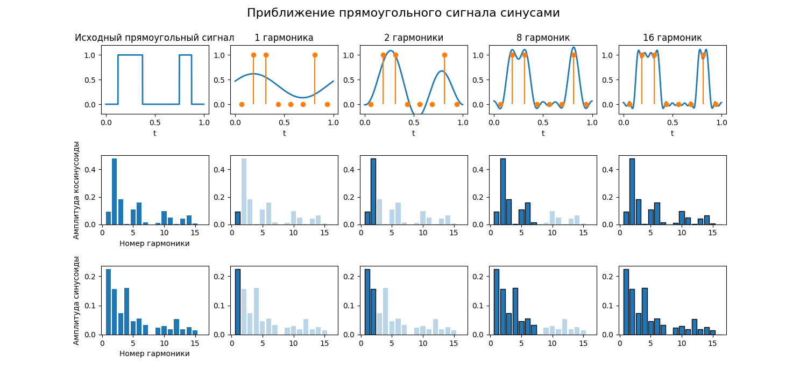

# <a name="%D1%82%D0%B5%D0%BB%D0%B5%D0%BA%D0%BE%D0%BC%D0%BC%D1%83%D0%BD%D0%B8%D0%BA%D0%B0%D1%86%D0%B8%D0%BE%D0%BD%D0%BD%D1%8B%D0%B5-%D1%81%D0%B8%D1%81%D1%82%D0%B5%D0%BC%D1%8B-%D0%B8-%D1%82%D0%B5%D1%85%D0%BD%D0%BE%D0%BB%D0%BE%D0%B3%D0%B8%D0%B8"></a> Телекоммуникационные системы и технологии


* [Телекоммуникационные системы и технологии](#%D1%82%D0%B5%D0%BB%D0%B5%D0%BA%D0%BE%D0%BC%D0%BC%D1%83%D0%BD%D0%B8%D0%BA%D0%B0%D1%86%D0%B8%D0%BE%D0%BD%D0%BD%D1%8B%D0%B5-%D1%81%D0%B8%D1%81%D1%82%D0%B5%D0%BC%D1%8B-%D0%B8-%D1%82%D0%B5%D1%85%D0%BD%D0%BE%D0%BB%D0%BE%D0%B3%D0%B8%D0%B8)
  * [Лекция 1. Задачи сетевой коммуникации. Модель OSI](#%D0%BB%D0%B5%D0%BA%D1%86%D0%B8%D1%8F-1.-%D0%B7%D0%B0%D0%B4%D0%B0%D1%87%D0%B8-%D1%81%D0%B5%D1%82%D0%B5%D0%B2%D0%BE%D0%B9-%D0%BA%D0%BE%D0%BC%D0%BC%D1%83%D0%BD%D0%B8%D0%BA%D0%B0%D1%86%D0%B8%D0%B8.-%D0%BC%D0%BE%D0%B4%D0%B5%D0%BB%D1%8C-osi)
  * [Лекция 2. Физический уровень сетевого стека](#%D0%BB%D0%B5%D0%BA%D1%86%D0%B8%D1%8F-2.-%D1%84%D0%B8%D0%B7%D0%B8%D1%87%D0%B5%D1%81%D0%BA%D0%B8%D0%B9-%D1%83%D1%80%D0%BE%D0%B2%D0%B5%D0%BD%D1%8C-%D1%81%D0%B5%D1%82%D0%B5%D0%B2%D0%BE%D0%B3%D0%BE-%D1%81%D1%82%D0%B5%D0%BA%D0%B0)


Курс знакомит с сетевым мониторингом, конфигурацией сетевых интерфейсов, маршрутизацией, обработкой пакетов и прочим. Курс преимущественно сделан для работы с ОС GNU/Linux

## <a name="%D0%BB%D0%B5%D0%BA%D1%86%D0%B8%D1%8F-1.-%D0%B7%D0%B0%D0%B4%D0%B0%D1%87%D0%B8-%D1%81%D0%B5%D1%82%D0%B5%D0%B2%D0%BE%D0%B9-%D0%BA%D0%BE%D0%BC%D0%BC%D1%83%D0%BD%D0%B8%D0%BA%D0%B0%D1%86%D0%B8%D0%B8.-%D0%BC%D0%BE%D0%B4%D0%B5%D0%BB%D1%8C-osi"></a> Лекция 1. Задачи сетевой коммуникации. Модель OSI

В современных устройствах настройка сетевых интерфейсах сведена к минимуму для облегчения использования. На самом деле обеспечение производительной, надежной и безопасной коммуникации между разнородными системами - сложная задача. Во разработки сетевой коммуникации появляются:

* Необходимость обеспечить взаимодействие разнообразных систем вне зависимости от архитектуры ОС, кодировки символов, разрядности процессора и т.п.
* Необходимость работать через разное оборудование (ноутбук/телефон -> роутер -> коммутатор -> сервер) во время одного сеанса связи
* Необходимость организационно разграничивать управление в крупных сетях

Помимо этого надо учесть технические аспекты:

* Задержка (Latency) - переменное время, которое требуется для передачи данных от источника к приемнику
* Пропускная способность (Bandwidth) - передача объема данных за заданный промежуток времени, которая зависит от нагруженности узлов передачи, качества каналов
* Помехи (Interference) - явления, искажающие сигнал
* Потеря пакетов (Packet loss) во время их передачи
* Угрозы безопасности, такие как DoS (Denial of Service), возможность авторизации и аутентификации
* Проблемы с конфигурацией и совместимостью
* Проблемы масштабируемости

Для решения этой задачи нужны стандарты, которые согласуют интерфейсы, протоколы и оборудование для коммуникации. Несмотря на абстракцию от операционных систем и архитектур влияние сетевого стека на производительность приложения очень велика

В начале развития сетевых операционных систем большинство сетевых решений были проприетарными: компании продавали проприетарные оборудование и ПО для сетевого взаимодействия (то есть решения с монолитной архитектурой)

Военные США не желали зависеть от одного поставщика сетевого оборудования, поэтому Международной организацией по стандартизации (ISO) в конце 70-ых была разработана модель OSI - открытая модель сетевой коммуникации

Разработчики декомпозировали все этапы сетевого взаимодействия и стандартизировали все интерфейсы между этапами. Модель не регламентировала имплементацию, только интерфейсы. Получалась строгая процессная модель, этапы которой решали конкретную задачу. В модель входили 7 уровней:

1. Прикладной уровень
2. Уровень представлений
3. Сеансовый уровень
4. Транспортный уровень
5. Сетевой уровень
6. Канальный уровень
7. Физический уровень


Данные проходят через уровни, обрастая заголовками, содержащие такую информацию, как адрес отправителя, получателя и другое. После канального уровня в конце кадра (фрагмента данных) добавляется DT (Data Trailer), обозначающий конец кадра

Уровни из-за слоев абстракции не знают о реализации других уровней выше и ниже, что позволяет менять их и не изменять реализацию других

Большинство сетевых стеков реализуют эту похожую на эту модель. Например, в модели TCP/IP уровней 4: прикладной, транспортный, сетевой, канальный

Можно заметить, что размер пакета, пока он проходит через все уровни, увеличивается. В реальности на транспортном уровне пакет может сегментироваться на меньшие, чтобы избежать две проблемы:

* Не блокировать канал связи для других пользователей при передачи очень длинного сообщения
* Повторно загружать пакеты при неудачной загрузке 


Несмотря на достаточное абстрагирование от реализаций, модель OSI обладает недостатками:

* В модели OSI строгая инкапсуляция, строгий порядок уровней - в реальных сетевых стеков это не так
* Модель OSI чрезмерно избыточна, некоторые уровни можно объединить в один, как сделано в TCP/IP


Подробно поговорим про функции уровней:

* Прикладной уровень предоставляет командный интерфейс приложениям или пользователям, передача файлов, данных потоков

    Примером протоколов прикладного уровня могут быть HTTP, HTTPS, FTP, SMTP

* На уровне представления происходит сжатие, шифрование, символьная кодировка

    Это происходит благодаря протоколам SSL, TLS, алгоритмам шифрования и кодировки

* Сеансовый уровень устанавливает, управляет и завершает соединения между приложениями

    Технологии RPC (Remote Procedure Call, Удаленный вызов процедур) реализуют сеансовый уровень

* Транспортный уровень обеспечивает сегментацию и гарантии доставки данных в правильном порядке

    Протоколы TCP, UDP могут сегментировать большие фрагменты данных. Кроме того, TCP гарантирует, что пакеты дойдут до получателя

* Сетевой уровень решает задачу доставки данных по составной сети, межсетевую адресацию, трансляцию виртуальных адресов в физические

    Чаще всего сейчас сетевой уровень реализуется протоколами IPv4 и IPv6

* Канальный уровень отвечает за передачу кадров данных между узлами в локальной сети по физическому уровню, например, Ethernet, Bluetooth

* Физический уровень представляет спецификацию для разъемов, кабелей, назначение контактов и формат сигналов, например, RJ (Registered Jack) или USB


Модель OSI не дает полное описание сети и появилась позже других стандартов, поэтому в свое время не получила поддержку. Сейчас она является академической моделью, которая дает понимание работы различных компонентов компьютерных сетей и того, как они работают вместе

Также она дает общую терминологию и концепции для разработки и проектирования других сетевых продуктов и технологий

В программе [Wireshark](https://www.wireshark.org/) можно проанализировать сетевой трафик устройства. Если выбрать какой-нибудь кадр, то можно увидеть его заголовки:

```
Frame 722: 45 bytes on wire (360 bits), 45 bytes captured (360 bits) on interface \Device\NPF_{8B3A2192-8B36-11F0-8DE9-0242AC120002}, id 0
Ethernet II, Src: Router_98:92:f1 (4c:c6:4c:98:92:f1), Dst: 16:d2:51:89:f3:ab (16:d2:51:89:f3:ab)
Internet Protocol Version 4, Src: 198.51.100.68, Dst: 198.18.0.139
Transmission Control Protocol, Src Port: 60493, Dst Port: 443, Seq: 23254, Ack: 1, Len: 5
```

Здесь мы можем заметить IP и TCP протоколы и Ethernet, соответствующие сетевому, транспортному и канальному уровням


---

В наше время для большинства устройств определены два адреса:

* Физический адрес (или MAC-адрес, от Media Access Control), например, `16:52:91:ff:13:c4`. Такой адрес присваивается устройству на заводе изготовителя и является уникальным
* Сетевой адрес, чаще всего это IPv4 (например, `198.51.100.23`) или IPv6 (например, `3fff:0db8:11a3:09d7:1f34:8a2e:07a0:765d`)

Физический адрес нужен для идентификации устройства в пределах локальной сети, а сетевой - в пределах глобальной сети

На сетевом уровне пакету добавляются IP-адреса отправителя и получателя, а на канальном - MAC-адреса отправителя и получателя

Допустим, что есть 3 локальных сети, соединенных маршрутизаторами:


Для простоты здесь используется другой формат физических и сетевых адресов. Если мы хотим отправить пакет от `1.23` к `3.135`, то:

1. Пакет направляется в маршрутизатор `E4:5D:3A`. При первом подключении узла `AF:45:32` к маршрутизатору, узлу присваивается сетевой адрес `1.23`, в свою очередь узел запоминает, что, чтобы отправить пакет за пределы своей сети, нужно передать его маршрутизатору
2. Далее маршрутизатор смотрит на свою таблицу маршрутизации. Там описан следующий шаг в цепочке, чтобы достичь целевой узел. Пакет передается через другой интерфейс маршрутизатора `2.1` в маршрутизатор `2.2`
3. Там маршрутизатор `A3:1B:9E` понимает, что адрес узла находится в локальной сети и, используя физические адреса, передает нужному узлу пакет

Благодаря абстракции между сетевым и канальным уровнем пропадает надобность от уникальности физических адресов - в нашей системе два узла с адресом `AF:45:32`. Также в локальной сети 2.X физические адреса могут иметь другой формат

В реальности таблица маршрутизации устроена сложнее, например, в ней могут присутствовать веса следующих направлений, которые показывают, к каком узлу обратиться, если наилучший не доступен


## <a name="%D0%BB%D0%B5%D0%BA%D1%86%D0%B8%D1%8F-2.-%D1%84%D0%B8%D0%B7%D0%B8%D1%87%D0%B5%D1%81%D0%BA%D0%B8%D0%B9-%D1%83%D1%80%D0%BE%D0%B2%D0%B5%D0%BD%D1%8C-%D1%81%D0%B5%D1%82%D0%B5%D0%B2%D0%BE%D0%B3%D0%BE-%D1%81%D1%82%D0%B5%D0%BA%D0%B0"></a> Лекция 2. Физический уровень сетевого стека

От чего зависит скорость передачи данных по кабелю? На скорость передачи могут влиять:

* На уровне приложения вычислительная мощность взаимодействующих узлов, особенности прикладных протоколов, кодировка, алгоритмы приложений, наличие механизмов безопасности и тому подобное
* На транспортном уровне особенности протоколов, размер буферов, статистика ошибок и перегрузки
* На сетевом уровне топология и загруженность сети, алгоритмы маршрутизации, а также скорость и качество сетевых устройств
* На канальном уровне характеристики сетевой карты, спецификация канального протокола, вид и загруженность коммуникационных устройств
* На физическом уровне тип используемого кабеля, характеристики и качество пассивного оборудования, качество прокладки кабелей и расстояние между компонентами сети

Фактор влияния на физическом уровне являются верхней границей для максимальной скорости передачи, поэтому, чтобы увеличить пропускную способность, логично начать с усовершенствования кабеля

На физическом уровне передаче могут мешать:

* Электромагнитные помехи (EMI) от других источников
* Радиочастотные помехи (RFI) от Wi-Fi или микроволновой печи
* Перекрестные помехи (Crosstalk) от рядом лежащего кабеля
* Тепловые помехи от компонентов в сети
* Поглощение или затухание средой передачи
* Дублирование сигнала

По проводу можно передавать два типа сигнала:

* аналоговый - диапазон напряжения от низкого уровня до высокого относительно земли
* цифровой (или дискретный) - конечное число уровней, например, низкий уровень сигнала либо высокий

Приемник сам решат, как обрабатывать сигнал, получаемый по проводу, поэтому тип сигнала - это всего лишь интерпретация

На аналоговый сигнал очень сильно влияют помехи и затухание, поэтому чаще всего используют цифровой сигнал. Чтобы увеличить скорость можно увеличить частоту сигнала или усложнить сигнал (увеличить дискретизацию, то есть число уровней)

По Шеннону скорость передачи данных равна `H log2(1 + S / N)`, где `H` - полоса пропускания фильтра, `S` - мощность сигнала, `N` - мощность шума

По Найквисту скорость `2H log2 V`, где `V` - количество дискретных уровней

Увеличение полосы пропускания фильтра (например, использование платиновых проводов) - дорого. Увеличение количества дискретных уровней делает невозможным их различать и приводит к проблемам с аналоговым сигналом

Однако, если разложить цифровой сигнал с помощью преобразования Фурье, то можно получить ряд гармоник - синусоид и косинусоид, которые в сумме повторяют форму цифрового сигнала



Таким образом, чтобы пропускать больше дискретных уровней, нужно пропускать больше гармоник через полосу пропускания

Если для линии связи измерить отношение мощность выходного сигнала от входного для разных частот сигнала, то можно получить такую зависимость


То есть канал связи эффективно переносит сигнал в определенных частотах (в так называемой полосе пропускания), а в более высоких он более быстрее теряет амплитуду. Поэтому нет смысла переносить все гармоники для имитации цифрового сигнала, главное, чтобы основные лежали в полосе пропускания

---

Теперь двоичный сигнал нужно закодировать. Если несколько методов физической кодировки:

* Код NRZ работает так: если бит равен 1, то уровень сигнала высокий, если 0, то низкий

    Тогда возникает проблема: как чередовать последовательности из нулей и единиц. Здесь приемник и передатчик должны работать на одной частоте

* Код Манчестер-II

    В Манчестер-II ноль кодируется сменой с низкого сигнала на высокий, а единица сменой с высокого на низкий

    Перед тем, как начать передачу сигналов, передатчик отправляет преамбулу синхронизации, чтобы приемник знал, в какой момент времени считать смену сигнала за бит информации и не путать 01 с 10

    Манчестер-II используется в технологии Ethernet

* Код PAM-5

    В PAM-5 различаются 4 уровня. В нем 00, 01, 10 и 11 кодируются разными уровнями сигнала
    
    PAM-5 используется в гигабитных каналах Ethernet

Помимо физического кодирования можно сделать логическое. Логическое кодирование нужно для обнаружения ошибок и улучшение условий передачи. Например, кодирование 4B/5B использует лишний бит для дополнительной информации:

| 16-ричная система | 2-чная система | 4B/5B код /
|-|-|-|
| 0 | 0000 | 11110 |
| 1 | 0001 | 01001 |
| 2 | 0010 | 10100 |
| 3 | 0011 | 10101 |
| 4 | 0100 | 01010 |
| 5 | 0101 | 01011 |
| 6 | 0110 | 01110 |
| 7 | 0111 | 01111 |
| 8 | 1000 | 10010 |
| 9 | 1001 | 10011 |
| A | 1010 | 10110 |
| B | 1011 | 10111 |
| C | 1100 | 11010 |
| D | 1101 | 11011 |
| E | 1110 | 11100 |
| F | 1111 | 11101 |

| Символ | 4B/5B код | Сообщение |
|-|-|-|
| H | 00100 | Ошибка передачи |
| I | 11111 | Ожидание |
| J | 11000 | Начало потока |
| K | 10001 | Начало потока |
| L | 00110 | Начало потока |
| Q | 00000 | Потеря сигнала |
| R | 00111 | Сброс |
| S | 11001 | Набор |
| T | 01101 | Конец потока |

Код 4B/5B сделан так, чтобы при передачи 4 бит хотя бы дважды происходила смена уровня сигнала

---

Структурированная кабельная система - универсальная кабельная система здания, объединяющая в себе множество информационных ...

С развитием качества коммуникаций отдельные кабельные системы для различных сервисов превратились в универсальные системы с гарантированной полосой пропускания, модифицируемостью, простотой эксплуатации

Появились различные стандарты (TIA/EIA-568, TIA/EIA-569, ISO/IEC 11801, ANSI/TIA-606), по который должны разрабатываться системы в зданиях. Они в основном определяют характеристики линий связи (амплитудно-частотная характеристика, полоса пропускания, затухание), правила монтажа и эксплуатации, требования к проектирования и тестированию

Далее появился термин СКС:

Структурированная кабельная система (СКС) - универсальная кабельная система здания, объединяющая в себе множество  информационных сервисов, таких как локально вычислительные, телефонные сети, системы видеонаблюдения и так далее

Для СКС существует ряд терминов:

* Рабочее место - область, где установлены технические 
средства пользователя, подключенные к кабельной 
сети здания.
* Горизонтальная кабельная проводка – кабельные 
линии, соединяющие рабочее место с 
коммутационным узлом этажа. 
* Вертикальная кабельная проводка - кабельные 
линии, соединяющие коммутационный узел этажа с 
коммутационным центром здания. 
* Магистральная подсистема - подсистема комплекса 
зданий, которая может строиться из медного и/или 
оптоволоконного типов кабеля, и которая объединяет 
кабельные системы зданий. 
* Коммутационный узел этажа - область, в которой 
сходятся линии горизонтальной кабельной проводки, 
размещается коммутационное оборудование и 
осуществляется администрирование кабельной 
системы этажа


Пассивным оборудованием СКС считаются кабели, сплайсы, шнуры и перемычки, соединительное оборудование (такое как коммутационные панели, коробки, телекоммуникационные розетки)

Кабели бывают:

* Симметричные электрические на основе витой пары

    Для витой пары есть категории:

    | Категория | Полоса пропускания | Описание |
    |-|-|-|
    | cat.5 | 100 МГц | 4 пары, передача до 100 Мбит/с |
    | cat.5e | 125 МГц | 4 пары, самый распространенный, передача до 1000 Мбит/с |
    | cat.6 | 250 МГц | 4 пары, передача до 10 Гбит/с на расстоянии не более 50 метров |
    | cat.7 | 600-700 МГц | 4 пары с экранированием, передача до 10 Гбит/с |

* Одномодовые и многомодовые оптические
* Коаксиальные (или твинкоаксиальные)

Также кабели бывают с разной оболочкой, разной толщины, для разной среды использования и так далее


