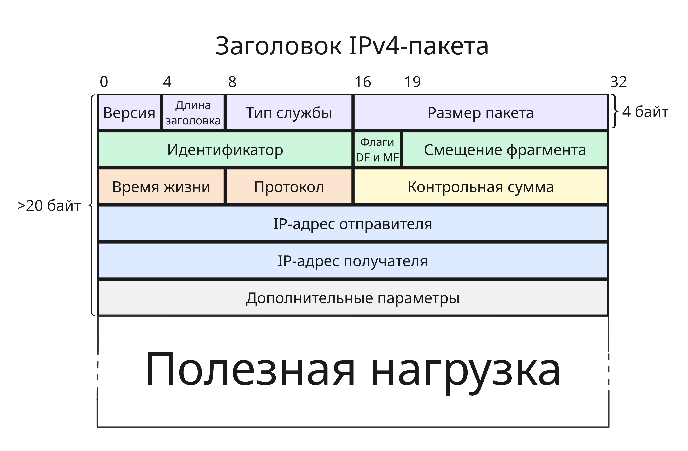
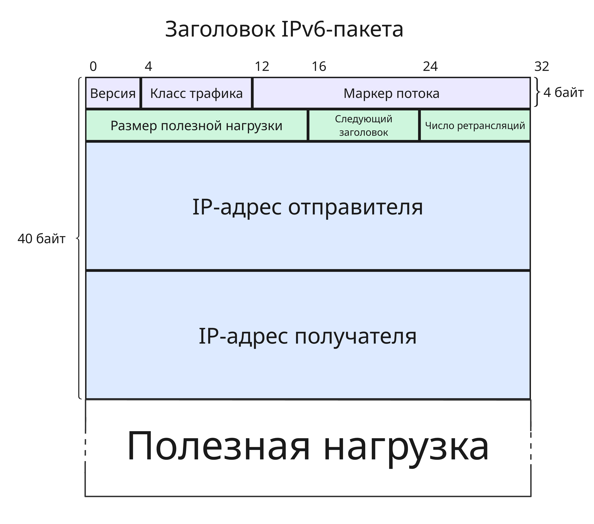

# <a name="%D1%82%D0%B5%D0%BB%D0%B5%D0%BA%D0%BE%D0%BC%D0%BC%D1%83%D0%BD%D0%B8%D0%BA%D0%B0%D1%86%D0%B8%D0%BE%D0%BD%D0%BD%D1%8B%D0%B5-%D1%81%D0%B8%D1%81%D1%82%D0%B5%D0%BC%D1%8B-%D0%B8-%D1%82%D0%B5%D1%85%D0%BD%D0%BE%D0%BB%D0%BE%D0%B3%D0%B8%D0%B8"></a> Телекоммуникационные системы и технологии


* [Телекоммуникационные системы и технологии](#%D1%82%D0%B5%D0%BB%D0%B5%D0%BA%D0%BE%D0%BC%D0%BC%D1%83%D0%BD%D0%B8%D0%BA%D0%B0%D1%86%D0%B8%D0%BE%D0%BD%D0%BD%D1%8B%D0%B5-%D1%81%D0%B8%D1%81%D1%82%D0%B5%D0%BC%D1%8B-%D0%B8-%D1%82%D0%B5%D1%85%D0%BD%D0%BE%D0%BB%D0%BE%D0%B3%D0%B8%D0%B8)
  * [Лекция 1. Задачи сетевой коммуникации. Модель OSI](#%D0%BB%D0%B5%D0%BA%D1%86%D0%B8%D1%8F-1.-%D0%B7%D0%B0%D0%B4%D0%B0%D1%87%D0%B8-%D1%81%D0%B5%D1%82%D0%B5%D0%B2%D0%BE%D0%B9-%D0%BA%D0%BE%D0%BC%D0%BC%D1%83%D0%BD%D0%B8%D0%BA%D0%B0%D1%86%D0%B8%D0%B8.-%D0%BC%D0%BE%D0%B4%D0%B5%D0%BB%D1%8C-osi)
  * [Лекция 2. Физический уровень сетевого стека](#%D0%BB%D0%B5%D0%BA%D1%86%D0%B8%D1%8F-2.-%D1%84%D0%B8%D0%B7%D0%B8%D1%87%D0%B5%D1%81%D0%BA%D0%B8%D0%B9-%D1%83%D1%80%D0%BE%D0%B2%D0%B5%D0%BD%D1%8C-%D1%81%D0%B5%D1%82%D0%B5%D0%B2%D0%BE%D0%B3%D0%BE-%D1%81%D1%82%D0%B5%D0%BA%D0%B0)
  * [Лекция 3. Локальные сети на примере Ethernet](#%D0%BB%D0%B5%D0%BA%D1%86%D0%B8%D1%8F-3.-%D0%BB%D0%BE%D0%BA%D0%B0%D0%BB%D1%8C%D0%BD%D1%8B%D0%B5-%D1%81%D0%B5%D1%82%D0%B8-%D0%BD%D0%B0-%D0%BF%D1%80%D0%B8%D0%BC%D0%B5%D1%80%D0%B5-ethernet)
  * [Лекция 4. Коммутаторы сетей Ethernet](#%D0%BB%D0%B5%D0%BA%D1%86%D0%B8%D1%8F-4.-%D0%BA%D0%BE%D0%BC%D0%BC%D1%83%D1%82%D0%B0%D1%82%D0%BE%D1%80%D1%8B-%D1%81%D0%B5%D1%82%D0%B5%D0%B9-ethernet)
  * [Лекция 5. Стек TCP/IP](#%D0%BB%D0%B5%D0%BA%D1%86%D0%B8%D1%8F-5.-%D1%81%D1%82%D0%B5%D0%BA-tcp%2Fip)
  * [Лекция 6. Протокол IPv4](#%D0%BB%D0%B5%D0%BA%D1%86%D0%B8%D1%8F-6.-%D0%BF%D1%80%D0%BE%D1%82%D0%BE%D0%BA%D0%BE%D0%BB-ipv4)
  * [Лекция 7. Соединение IP сетей](#%D0%BB%D0%B5%D0%BA%D1%86%D0%B8%D1%8F-7.-%D1%81%D0%BE%D0%B5%D0%B4%D0%B8%D0%BD%D0%B5%D0%BD%D0%B8%D0%B5-ip-%D1%81%D0%B5%D1%82%D0%B5%D0%B9)
    * [Маршрутизация](#%D0%BC%D0%B0%D1%80%D1%88%D1%80%D1%83%D1%82%D0%B8%D0%B7%D0%B0%D1%86%D0%B8%D1%8F)
    * [Трансляция адресов](#%D1%82%D1%80%D0%B0%D0%BD%D1%81%D0%BB%D1%8F%D1%86%D0%B8%D1%8F-%D0%B0%D0%B4%D1%80%D0%B5%D1%81%D0%BE%D0%B2)
  * [Лекция 8. Протокол IPv6](#%D0%BB%D0%B5%D0%BA%D1%86%D0%B8%D1%8F-8.-%D0%BF%D1%80%D0%BE%D1%82%D0%BE%D0%BA%D0%BE%D0%BB-ipv6)
  * [Лекция 9. Конфигурация с помощью DHCP и ICMP](#%D0%BB%D0%B5%D0%BA%D1%86%D0%B8%D1%8F-9.-%D0%BA%D0%BE%D0%BD%D1%84%D0%B8%D0%B3%D1%83%D1%80%D0%B0%D1%86%D0%B8%D1%8F-%D1%81-%D0%BF%D0%BE%D0%BC%D0%BE%D1%89%D1%8C%D1%8E-dhcp-%D0%B8-icmp)
    * [DHCPv4](#dhcpv4)
    * [DHCPv6](#dhcpv6)
  * [Лекция 10. Транспортные протоколы UDP, TCP, QUIC](#%D0%BB%D0%B5%D0%BA%D1%86%D0%B8%D1%8F-10.-%D1%82%D1%80%D0%B0%D0%BD%D1%81%D0%BF%D0%BE%D1%80%D1%82%D0%BD%D1%8B%D0%B5-%D0%BF%D1%80%D0%BE%D1%82%D0%BE%D0%BA%D0%BE%D0%BB%D1%8B-udp%2C-tcp%2C-quic)
    * [UDP](#udp)
    * [TCP](#tcp)
    * [QUIC](#quic)
  * [Лекция 11. Безопасность сети](#%D0%BB%D0%B5%D0%BA%D1%86%D0%B8%D1%8F-11.-%D0%B1%D0%B5%D0%B7%D0%BE%D0%BF%D0%B0%D1%81%D0%BD%D0%BE%D1%81%D1%82%D1%8C-%D1%81%D0%B5%D1%82%D0%B8)
    * [Физический уровень](#%D1%84%D0%B8%D0%B7%D0%B8%D1%87%D0%B5%D1%81%D0%BA%D0%B8%D0%B9-%D1%83%D1%80%D0%BE%D0%B2%D0%B5%D0%BD%D1%8C)
    * [Канальный уровень](#%D0%BA%D0%B0%D0%BD%D0%B0%D0%BB%D1%8C%D0%BD%D1%8B%D0%B9-%D1%83%D1%80%D0%BE%D0%B2%D0%B5%D0%BD%D1%8C)
    * [Сетевой уровень](#%D1%81%D0%B5%D1%82%D0%B5%D0%B2%D0%BE%D0%B9-%D1%83%D1%80%D0%BE%D0%B2%D0%B5%D0%BD%D1%8C)
    * [Другие механизмы](#%D0%B4%D1%80%D1%83%D0%B3%D0%B8%D0%B5-%D0%BC%D0%B5%D1%85%D0%B0%D0%BD%D0%B8%D0%B7%D0%BC%D1%8B)
  * [Лекция 12. DNS](#%D0%BB%D0%B5%D0%BA%D1%86%D0%B8%D1%8F-12.-dns)
* [X. Программа экзамена](#x.-%D0%BF%D1%80%D0%BE%D0%B3%D1%80%D0%B0%D0%BC%D0%BC%D0%B0-%D1%8D%D0%BA%D0%B7%D0%B0%D0%BC%D0%B5%D0%BD%D0%B0)


Курс знакомит с сетевым мониторингом, конфигурацией сетевых интерфейсов, маршрутизацией, обработкой пакетов и прочим. Курс преимущественно сделан для работы с ОС GNU/Linux

## <a name="%D0%BB%D0%B5%D0%BA%D1%86%D0%B8%D1%8F-1.-%D0%B7%D0%B0%D0%B4%D0%B0%D1%87%D0%B8-%D1%81%D0%B5%D1%82%D0%B5%D0%B2%D0%BE%D0%B9-%D0%BA%D0%BE%D0%BC%D0%BC%D1%83%D0%BD%D0%B8%D0%BA%D0%B0%D1%86%D0%B8%D0%B8.-%D0%BC%D0%BE%D0%B4%D0%B5%D0%BB%D1%8C-osi"></a> Лекция 1. Задачи сетевой коммуникации. Модель OSI

В современных устройствах настройка сетевых интерфейсах сведена к минимуму для облегчения использования. На самом деле обеспечение производительной, надежной и безопасной коммуникации между разнородными системами - сложная задача. Во разработки сетевой коммуникации появляются:

* Необходимость обеспечить взаимодействие разнообразных систем вне зависимости от архитектуры ОС, кодировки символов, разрядности процессора и т.п.
* Необходимость работать через разное оборудование (ноутбук/телефон -> роутер -> коммутатор -> сервер) во время одного сеанса связи
* Необходимость организационно разграничивать управление в крупных сетях

Помимо этого надо учесть технические аспекты:

* Задержка (Latency) - переменное время, которое требуется для передачи данных от источника к приемнику
* Пропускная способность (Bandwidth) - передача объема данных за заданный промежуток времени, которая зависит от нагруженности узлов передачи, качества каналов
* Помехи (Interference) - явления, искажающие сигнал
* Потеря пакетов (Packet loss) во время их передачи
* Угрозы безопасности, такие как DoS (Denial of Service), возможность авторизации и аутентификации
* Проблемы с конфигурацией и совместимостью
* Проблемы масштабируемости

Для решения этой задачи нужны стандарты, которые согласуют интерфейсы, протоколы и оборудование для коммуникации. Несмотря на абстракцию от операционных систем и архитектур влияние сетевого стека на производительность приложения очень велика

В начале развития сетевых операционных систем большинство сетевых решений были проприетарными: компании продавали проприетарные оборудование и ПО для сетевого взаимодействия (то есть решения с монолитной архитектурой)

Военные США не желали зависеть от одного поставщика сетевого оборудования, поэтому Международной организацией по стандартизации (ISO) в конце 70-ых была разработана модель OSI - открытая модель сетевой коммуникации

Разработчики декомпозировали все этапы сетевого взаимодействия и стандартизировали все интерфейсы между этапами. Модель не регламентировала имплементацию, только интерфейсы. Получалась строгая процессная модель, этапы которой решали конкретную задачу. В модель входили 7 уровней:

1. Прикладной уровень
2. Уровень представлений
3. Сеансовый уровень
4. Транспортный уровень
5. Сетевой уровень
6. Канальный уровень
7. Физический уровень


Данные проходят через уровни, обрастая заголовками, содержащие такую информацию, как адрес отправителя, получателя и другое. После канального уровня в конце кадра (фрагмента данных) добавляется DT (Data Trailer), обозначающий конец кадра

Уровни из-за слоев абстракции не знают о реализации других уровней выше и ниже, что позволяет менять их и не изменять реализацию других

Большинство сетевых стеков реализуют эту похожую на эту модель. Например, в модели TCP/IP уровней 4: прикладной, транспортный, сетевой, канальный

Можно заметить, что размер пакета, пока он проходит через все уровни, увеличивается. В реальности на транспортном уровне пакет может сегментироваться на меньшие, чтобы избежать две проблемы:

* Не блокировать канал связи для других пользователей при передачи очень длинного сообщения
* Повторно загружать пакеты при неудачной загрузке 


Несмотря на достаточное абстрагирование от реализаций, модель OSI обладает недостатками:

* В модели OSI строгая инкапсуляция, строгий порядок уровней - в реальных сетевых стеков это не так
* Модель OSI чрезмерно избыточна, некоторые уровни можно объединить в один, как сделано в TCP/IP


Подробно поговорим про функции уровней:

* Прикладной уровень предоставляет командный интерфейс приложениям или пользователям, передача файлов, данных потоков

    Примером протоколов прикладного уровня могут быть HTTP, HTTPS, FTP, SMTP

* На уровне представления происходит сжатие, шифрование, символьная кодировка

    Это происходит благодаря протоколам SSL, TLS, алгоритмам шифрования и кодировки

* Сеансовый уровень устанавливает, управляет и завершает соединения между приложениями

    Технологии RPC (Remote Procedure Call, Удаленный вызов процедур) реализуют сеансовый уровень

* Транспортный уровень обеспечивает сегментацию и гарантии доставки данных в правильном порядке

    Протоколы TCP, UDP могут сегментировать большие фрагменты данных. Кроме того, TCP гарантирует, что пакеты дойдут до получателя

* Сетевой уровень решает задачу доставки данных по составной сети, межсетевую адресацию, трансляцию виртуальных адресов в физические

    Чаще всего сейчас сетевой уровень реализуется протоколами IPv4 и IPv6

* Канальный уровень отвечает за передачу кадров данных между узлами в локальной сети по физическому уровню, например, Ethernet, Bluetooth

* Физический уровень представляет спецификацию для разъемов, кабелей, назначение контактов и формат сигналов, например, RJ (Registered Jack) или USB


Модель OSI не дает полное описание сети и появилась позже других стандартов, поэтому в свое время не получила поддержку. Сейчас она является академической моделью, которая дает понимание работы различных компонентов компьютерных сетей и того, как они работают вместе

Также она дает общую терминологию и концепции для разработки и проектирования других сетевых продуктов и технологий

В программе [Wireshark](https://www.wireshark.org/) можно проанализировать сетевой трафик устройства. Если выбрать какой-нибудь кадр, то можно увидеть его заголовки:

```
Frame 722: 45 bytes on wire (360 bits), 45 bytes captured (360 bits) on interface \Device\NPF_{8B3A2192-8B36-11F0-8DE9-0242AC120002}, id 0
Ethernet II, Src: Router_98:92:f1 (4c:c6:4c:98:92:f1), Dst: 16:d2:51:89:f3:ab (16:d2:51:89:f3:ab)
Internet Protocol Version 4, Src: 198.51.100.68, Dst: 198.18.0.139
Transmission Control Protocol, Src Port: 60493, Dst Port: 443, Seq: 23254, Ack: 1, Len: 5
```

Здесь мы можем заметить IP и TCP протоколы и Ethernet, соответствующие сетевому, транспортному и канальному уровням


---

В наше время для большинства устройств определены два адреса:

* Физический адрес (или MAC-адрес, от Media Access Control), например, `16:52:91:ff:13:c4`. Такой адрес присваивается устройству на заводе изготовителя и является уникальным
* Сетевой адрес, чаще всего это IPv4 (например, `198.51.100.23`) или IPv6 (например, `3fff:0db8:11a3:09d7:1f34:8a2e:07a0:765d`)

Физический адрес нужен для идентификации устройства в пределах локальной сети, а сетевой - в пределах глобальной сети

На сетевом уровне пакету добавляются IP-адреса отправителя и получателя, а на канальном - MAC-адреса отправителя и получателя

Допустим, что есть 3 локальных сети, соединенных маршрутизаторами:


Для простоты здесь используется другой формат физических и сетевых адресов. Если мы хотим отправить пакет от `1.23` к `3.135`, то:

1. Пакет направляется в маршрутизатор `E4:5D:3A`. При первом подключении узла `AF:45:32` к маршрутизатору, узлу присваивается сетевой адрес `1.23`, в свою очередь узел запоминает, что, чтобы отправить пакет за пределы своей сети, нужно передать его маршрутизатору
2. Далее маршрутизатор смотрит на свою таблицу маршрутизации. Там описан следующий шаг в цепочке, чтобы достичь целевой узел. Пакет передается через другой интерфейс маршрутизатора `2.1` в маршрутизатор `2.2`
3. Там маршрутизатор `A3:1B:9E` понимает, что адрес узла находится в локальной сети и, используя физические адреса, передает нужному узлу пакет

Благодаря абстракции между сетевым и канальным уровнем пропадает надобность от уникальности физических адресов - в нашей системе два узла с адресом `AF:45:32`. Также в локальной сети 2.X физические адреса могут иметь другой формат

В реальности таблица маршрутизации устроена сложнее, например, в ней могут присутствовать веса следующих направлений, которые показывают, к каком узлу обратиться, если наилучший не доступен


## <a name="%D0%BB%D0%B5%D0%BA%D1%86%D0%B8%D1%8F-2.-%D1%84%D0%B8%D0%B7%D0%B8%D1%87%D0%B5%D1%81%D0%BA%D0%B8%D0%B9-%D1%83%D1%80%D0%BE%D0%B2%D0%B5%D0%BD%D1%8C-%D1%81%D0%B5%D1%82%D0%B5%D0%B2%D0%BE%D0%B3%D0%BE-%D1%81%D1%82%D0%B5%D0%BA%D0%B0"></a> Лекция 2. Физический уровень сетевого стека

От чего зависит скорость передачи данных по кабелю? На скорость передачи могут влиять:

* На уровне приложения вычислительная мощность взаимодействующих узлов, особенности прикладных протоколов, кодировка, алгоритмы приложений, наличие механизмов безопасности и тому подобное
* На транспортном уровне особенности протоколов, размер буферов, статистика ошибок и перегрузки
* На сетевом уровне топология и загруженность сети, алгоритмы маршрутизации, а также скорость и качество сетевых устройств
* На канальном уровне характеристики сетевой карты, спецификация канального протокола, вид и загруженность коммуникационных устройств
* На физическом уровне тип используемого кабеля, характеристики и качество пассивного оборудования, качество прокладки кабелей и расстояние между компонентами сети

Фактор влияния на физическом уровне являются верхней границей для максимальной скорости передачи, поэтому, чтобы увеличить пропускную способность, логично начать с усовершенствования кабеля

На физическом уровне передаче могут мешать:

* Электромагнитные помехи (EMI) от других источников
* Радиочастотные помехи (RFI) от Wi-Fi или микроволновой печи
* Перекрестные помехи (Crosstalk) от рядом лежащего кабеля
* Тепловые помехи от компонентов в сети
* Поглощение или затухание средой передачи
* Дублирование сигнала

По проводу можно передавать два типа сигнала:

* аналоговый - диапазон напряжения от низкого уровня до высокого относительно земли
* цифровой (или дискретный) - конечное число уровней, например, низкий уровень сигнала либо высокий

Приемник сам решат, как обрабатывать сигнал, получаемый по проводу, поэтому тип сигнала - это всего лишь интерпретация

На аналоговый сигнал очень сильно влияют помехи и затухание, поэтому чаще всего используют цифровой сигнал. Чтобы увеличить скорость можно увеличить частоту сигнала или усложнить сигнал (увеличить дискретизацию, то есть число уровней)

По Шеннону скорость передачи данных равна `H log2(1 + S / N)`, где `H` - полоса пропускания фильтра, `S` - мощность сигнала, `N` - мощность шума

По Найквисту скорость `2H log2 V`, где `V` - количество дискретных уровней

Увеличение полосы пропускания фильтра (например, использование платиновых проводов) - дорого. Увеличение количества дискретных уровней делает невозможным их различать и приводит к проблемам с аналоговым сигналом

Однако, если разложить цифровой сигнал с помощью преобразования Фурье, то можно получить ряд гармоник - синусоид и косинусоид, которые в сумме повторяют форму цифрового сигнала


Таким образом, чтобы пропускать больше дискретных уровней, нужно пропускать больше гармоник через полосу пропускания

Если для линии связи измерить отношение мощность выходного сигнала от входного для разных частот сигнала, то можно получить такую зависимость


То есть канал связи эффективно переносит сигнал в определенных частотах (в так называемой полосе пропускания), а в более высоких он более быстро теряет амплитуду. Поэтому нет смысла переносить все гармоники для имитации цифрового сигнала, главное, чтобы основные лежали в полосе пропускания

---

Теперь двоичный сигнал нужно закодировать. Если несколько методов физической кодировки:

* Код NRZ работает так: если бит равен 1, то уровень сигнала высокий, если 0, то низкий

    Тогда возникает проблема: как чередовать последовательности из нулей и единиц. Здесь приемник и передатчик должны работать на одной частоте

* Код Манчестер-II

    В Манчестер-II ноль кодируется сменой с низкого сигнала на высокий, а единица сменой с высокого на низкий

    Перед тем, как начать передачу сигналов, передатчик отправляет преамбулу синхронизации, чтобы приемник знал, в какой момент времени считать смену сигнала за бит информации и не путать 01 с 10

    Манчестер-II используется в технологии Ethernet

* Код PAM-5

    В PAM-5 различаются 4 уровня. В нем 00, 01, 10 и 11 кодируются разными уровнями сигнала
    
    PAM-5 используется в гигабитных каналах Ethernet

Помимо физического кодирования можно сделать логическое. Логическое кодирование нужно для обнаружения ошибок и улучшение условий передачи. Например, кодирование 4B/5B использует лишний бит для дополнительной информации:

| 16-ричная система | 2-чная система | 4B/5B код /
|-|-|-|
| 0 | 0000 | 11110 |
| 1 | 0001 | 01001 |
| 2 | 0010 | 10100 |
| 3 | 0011 | 10101 |
| 4 | 0100 | 01010 |
| 5 | 0101 | 01011 |
| 6 | 0110 | 01110 |
| 7 | 0111 | 01111 |
| 8 | 1000 | 10010 |
| 9 | 1001 | 10011 |
| A | 1010 | 10110 |
| B | 1011 | 10111 |
| C | 1100 | 11010 |
| D | 1101 | 11011 |
| E | 1110 | 11100 |
| F | 1111 | 11101 |

| Символ | 4B/5B код | Сообщение |
|-|-|-|
| H | 00100 | Ошибка передачи |
| I | 11111 | Ожидание |
| J | 11000 | Начало потока |
| K | 10001 | Начало потока |
| L | 00110 | Начало потока |
| Q | 00000 | Потеря сигнала |
| R | 00111 | Сброс |
| S | 11001 | Набор |
| T | 01101 | Конец потока |

Код 4B/5B сделан так, чтобы при передачи 4 бит хотя бы дважды происходила смена уровня сигнала

---

С развитием качества коммуникаций отдельные кабельные системы для различных сервисов превратились в универсальные системы с гарантированной полосой пропускания, модифицируемостью, простотой эксплуатации

Появились различные стандарты (TIA/EIA-568, TIA/EIA-569, ISO/IEC 11801, ANSI/TIA-606), по который должны разрабатываться системы в зданиях. Они в основном определяют характеристики линий связи (амплитудно-частотная характеристика, полоса пропускания, затухание), правила монтажа и эксплуатации, требования к проектирования и тестированию

Далее появился термин СКС:

Структурированная кабельная система (СКС) - универсальная кабельная система здания, объединяющая в себе множество  информационных сервисов, таких как локально вычислительные, телефонные сети, системы видеонаблюдения и так далее

Для СКС существует ряд терминов:

* Рабочее место - область, где установлены технические 
средства пользователя, подключенные к кабельной 
сети здания.
* Горизонтальная кабельная проводка – кабельные 
линии, соединяющие рабочее место с 
коммутационным узлом этажа. 
* Вертикальная кабельная проводка - кабельные 
линии, соединяющие коммутационный узел этажа с 
коммутационным центром здания. 
* Магистральная подсистема - подсистема комплекса 
зданий, которая может строиться из медного и/или 
оптоволоконного типов кабеля, и которая объединяет 
кабельные системы зданий. 
* Коммутационный узел этажа - область, в которой 
сходятся линии горизонтальной кабельной проводки, 
размещается коммутационное оборудование и 
осуществляется администрирование кабельной 
системы этажа


Пассивным оборудованием СКС считаются кабели, сплайсы, шнуры и перемычки, соединительное оборудование (такое как коммутационные панели, коробки, телекоммуникационные розетки)

Кабели бывают:

* Симметричные электрические на основе витой пары

    Для витой пары есть категории:

    | Категория | Полоса пропускания | Описание |
    |-|-|-|
    | cat.5 | 100 МГц | 4 пары, передача до 100 Мбит/с |
    | cat.5e | 125 МГц | 4 пары, самый распространенный, передача до 1000 Мбит/с |
    | cat.6 | 250 МГц | 4 пары, передача до 10 Гбит/с на расстоянии не более 50 метров |
    | cat.7 | 600-700 МГц | 4 пары с экранированием, передача до 10 Гбит/с |

* Одномодовые и многомодовые оптические
* Коаксиальные (или твинкоаксиальные)

Также кабели бывают с разной оболочкой, разной толщины, для разной среды использования и так далее


## <a name="%D0%BB%D0%B5%D0%BA%D1%86%D0%B8%D1%8F-3.-%D0%BB%D0%BE%D0%BA%D0%B0%D0%BB%D1%8C%D0%BD%D1%8B%D0%B5-%D1%81%D0%B5%D1%82%D0%B8-%D0%BD%D0%B0-%D0%BF%D1%80%D0%B8%D0%BC%D0%B5%D1%80%D0%B5-ethernet"></a> Лекция 3. Локальные сети на примере Ethernet

Для чего же нужен канальный уровень?

* Целью канального уровня является управление доступом к каналу связи и обеспечение эффективной связи сетевых узлов
* Канал связи – общий разделяемый ресурс. Протокол канального уровня предотвращает или разрешает конфликт
* Адреса есть у каждого сетевого узла для 
идентификации источника и назначения сетевого трафика
* Канальный уровень должен регламентировать физическую топологию, управлять логической топологией и фильтрацией трафика
* Канальный уровень также должен обнаруживать и исправлять ошибки, например, с помощью контрольных сумм или проверки циклическим избыточным кодом 
* Протокол канального уровня согласует скорости передачи

Каналы разделяются по:

* Мультиплексированию с частотным разделением каналов (Frequency-Division Multiplexing, FDM) - полоса пропускания делится на непересекающиеся частотные диапазоны, обычно используется в радио или телевещании
* Мультиплексированию с временным разделением каналов (Time-Division Multiplexing, TDM) - канал делится на временные интервалы, каждый из которых присвоен отдельному сигналу, обычно используется в компьютерных сетях

Но если у нас к одному подключены несколько узлов, то встает вопрос, как отличать, кому какой пакет данных направляется. Для этого есть подходы к управлению передачей:

* Коммутация каналов (Circuit Switching) работает так: между определенными узлами происходит договоренность, что только они будут использовать этот канал
* Коммутация пакетов (Packet Switching) - внутри пакета хранится информация, какому узлу и от какого этот пакет идет. Минус такого подхода - мы передаем больше байт, поэтому скорость уменьшается

Как можно заметить, коммутация пакетов - универсальный подход, который работает, когда число узлов в одном канале неизвестно заранее, поэтому именно он используется в протоколе Ethernet

Считается, что Ethernet был разработан в 1973 году Робертом Меткалфом в компании Xerox. Далее Ethernet был подробно описан в стандарте IEEE 802.3, а именно кодирование, формат кадров и прочее

Ethernet использует технологию CSMA/CD (Carrier Sense Multiple Access with Collision Detection - множественный доступ с прослушиванием несущей частоты и обнаружением коллизий). Она подразумевает алгоритмы для приема и передачи пакетов, причем если один и тот же пакет пришел дважды, то он обрабатывается один раз.

Прием в CSMA/CD происходит так:

1. Приемник ждет, пока не обнаружит сигнал на линии
2. При обнаружении приемник устанавливает синхронизацию, читает данные с канала и ждет ограничителя (Data Trailer)
3. Если ограничитель обнаружен и адрес приема совпадает с тем, что в заголовке, то данные переходят наверх по уровню в стеке модели

Передача устроена сложнее:

1. Вводится параметр Interpacket gap (IPG) или Interframe gap (IFG) - минимальный интервал между передаваемыми пакетами. Для скорости 10 Мбит/с - это 9.6 мкс, для 100 Мбит/с - 0.96 мкс, для 1 Гбит/с - 96 нс и так далее
2. Далее пакет собирается, узел ждет, пока не закончится передача другого узла в канале, если такова есть
3. Ждем, пока не пройдет минимальный интервал IPG с момента последней передачи
4. Передаем биты кадра. Если во время передачи бита не был обнаружен прием другого пакета, то передавать следующие биты, пока они не закончатся
5. Если во время передачи был обнаружен прием, то есть произошла коллизия, то:

    * Всем узлам передается Jam-сигнал, чтобы все знали, что произошла коллизия
    * Далее вычисляется время ожидания до следующей отправки по формуле `P = L * T`, где `T` - количество времени для отправки 512 битов (для 10 Мбит/с - это 51.2 мкс), `L` - случайное число из диапазона от `0` до `2^N`, где `N` - текущее число попыток, при этом `L <= 1023`
    * После ожидания отправка повторяется заново

    Если количество попыток превысило 16, то отправка считается неудачной


Доменом коллизий в этом случае называют область локальной сети, где узлы могут вступать в коллизию пакетов. При этом при наличии коммутаторов домен коллизий может отличаться от домена широковещания

---

Для идентификации в локальной сети на канальном уровне у узла есть MAC-адрес, состоящий из 6 байт, то есть 6 октет, то есть 48 бит 

Первые три байта являются идентификатором производителя (OUI, Organizationally Unique Identifier или MFG от Manufacturing) - , а последние, NIC (Network Interface Controller), идентифицирует сам сетевой контроллер

Идентификатор производителя выдается институтом IEEE (их можно посмотреть на [standards-oui.ieee.org/oui/oui.txt](https://standards-oui.ieee.org/oui/oui.txt)), а идентификатор контроллера - уникальный для устройств производителя, отсюда каждый MAC-адрес **глобально** уникален. В этом случае седьмой бит MAC-адреса будет равен 0. Пример такого адреса -  `54:f2:03:92:93:c9`

Большинство драйверов сетевых карт могут изменить MAC-адрес, но тогда седьмой бит обязан быть равен 1, что означает, что устройство с таким MAC-адресом администрируется локально. Пример такого адреса - `1e:1d:69:7e:51:22`

Если в адресе получателя восьмой бит равен 0, то передача происходит только узлу с этим адресом, все остальные узлы в домене коллизий обязаны проигнорировать кадр

Если же восьмой бит равен 1, то передача считается мультивещательной, и ее примут те узлы, которые настроены принимать кадры на этот адрес, таким образом, можно передавать кадры определенной группе узлов. Пример такого адреса - `51:ed:cb:0b:83:ba`

Адрес получателя `FF:FF:FF:FF:FF:FF` считается особым и означает, что кадр предназначен всем узлам в локальной сети

Современные устройства умеют рандомизировать MAC-адреса для большей безопасности

Разберем формат кадра Ethernet:

1. MAC-адрес получателя
2. MAC-адрес отправителя
3. Ethertype - тип формата кадра как двухбитное число
4. Полезная нагрузка размером от 42 байт до 1500 байт
5. 4 байт контрольной суммы, найденные через алгоритм циклического избыточного кода (CRC, cyclic redundancy check)

Всего существует несколько типов формата:

* Version 1 - больше не применяется
* Version 2, Ethernet II или еще называемый DIX (от первых букв производителей DEC, Intel, Xerox), чаще всего используется. Для него Ethertype - любое число, не меньшее 1536 или `0x0600`
* IEEE 802.2 Logical Link Control (LLC), используется меньше, для него Ethertype - любое число, не большее 1500, а полезная нагрузка не начинается с `0xffff` или `0xaaaa`
* Novell raw IEEE 802.3, почти не встречается, для него Ethertype - любое число, не большее 1500, а полезная нагрузка начинается с `0xffff`
* IEEE 802.2 Subnetwork Access Protocol (SNAP), почти не встречается, для него Ethertype - любое число, не большее 1500, а полезная нагрузка начинается с `0xaaaa`


Как можно заметить, протокол Ethernet почти не создает нагрузку на пропускную способность: из 1518 байт под полезную нагрузку выделено 1500, то есть 98.8%

---

Физических стандартов Ethernet существует много:

* Ранний стандарт 1BASE5
* 10 Мбит/с Ethernet - 10BASE2, 10BASE5, 10BASE-T, 10BASE-F
* 100 Мбит/с Ethernet - 100BASE-T, 100BASE-FX
* 1 Гбит/с Ethernet - 1000BASE-T, 1000BASE-SX, 1000BASE-LX
* 10 Гбит/с Ethernet - 10GBASE-T
* 40 Gigabit Ethernet - 40GBASE-CR4
* 100 Gigabit Ethernet - 100GBASE-CR10, 100GBASE-SR10

Суффикс означает вариант реализации, например T - витая пара (от Twisted pair)

В качестве оборудования используют

* На физическом уровне:
    * Концентраторы
    * Медиаконверторы
    * Повторители

* На канальном уровне:
    * Сетевые адаптеры
    * Коммутаторы

* На сетевом уровне:
    * Коммутаторы
    * Маршрутизаторы

Для повторения сигналов существуют два прибора:

* Концентратор (или повторитель, hub) берет сигнал с одного порта и транслирует его на все другие
* Коммутатор (switch) берет сигнал, читает MAC-адрес получателя и отправляет его на нужный порт. Но для того, чтобы соотнести порт к MAC-адрес, коммутатор имеет таблицу и действует так:
    * Если получен кадр с нового порта, то он записывает в таблицу адрес, полученный из заголовка кадра, и порт
    * Если адреса получателя, полученного в кадре, в таблице нет, то кадр пересылается всем устройствам, иначе кадр пересылается по нужному порту

    Для записи в таблице существует значение TTL (time-to-live), чтобы таблица была актуальной


## <a name="%D0%BB%D0%B5%D0%BA%D1%86%D0%B8%D1%8F-4.-%D0%BA%D0%BE%D0%BC%D0%BC%D1%83%D1%82%D0%B0%D1%82%D0%BE%D1%80%D1%8B-%D1%81%D0%B5%D1%82%D0%B5%D0%B9-ethernet"></a> Лекция 4. Коммутаторы сетей Ethernet

Цель неуправляемого коммутатора, описанного ранее, - разделить домен коллизий при обеспечении связности узлов, подключенных к нему

Если домен коллизий меньше, то с меньшей вероятностью она случается, тем самым не занимая время канала на ожидание

Топология сети, построенной на неуправляемых коммутаторах, должна представлять собой односвязный граф. На такой сети отлично работает широковещательная трансляция 

Однако, если подсоединить два каких-то коммутаторов и отправить пакет, то этот пакет из одного коммутатора перейдет к другому, потом к самому же себе через другой путь и отправлен заново, то есть дублирован в сети

Неконтролируемое дублирование широковещательного сигнала называется широковещательным штормом


Поэтому для построения топологически сложных сетей нужно что-то более хитрое, чем простой коммутатор

---

Сетевой адаптер - ключевое устройство для доступа вычислительного узла к сети. Он характеризуется:

* Количеством портов, шиной
* PXE (Preboot eXecution Environment) - способность загружать через сеть операционную систему без использования накопителя
* WoL (Wake-on-LAN) - способность удаленно включать устройство через отправку в локальную сеть специальную последовательность байтов (так называемый magic packet)
* RDMA (Remote Direct Memory Access) - доступ к оперативной памяти узла через сеть
* VMMQ (Virtual Machine Multiple Queue) - масштабирование обработки трафика для виртуальных машин
* Поддержка VLAN - виртуальных локальных сетей
* GreenEthernet - экономия электроэнергии во время неиспользования адаптера

Концентраторы, повторители и медиаконверторы:

* работают на физическом уровне (например, медиаконвертер преобразует оптический сигнал в электрический)
* не имеют фильтрации, обработки, только усиливают или преобразуют сигнал
* не ограничивают широковещательные сообщения

Коммутаторы работают на более высоком уровне:

* Коммутатор L2 (второго уровня) работает на канальном уровне

    Поступающий на порт коммутатора кадр записывается только в тот порт, к которому подключено устройство с адресом назначения. Остальные порты коммутатора свободны и могут участвовать в обмене данными между друг другом. В случае, если в таблице нет данных об адресе назначения, кадр записывается во все порты устройства. Адресная информация в заголовке кадра канального уровня не изменяется

* Коммутатор L3 (третьего уровня) работает на сетевом уровне

    Он может работать в режиме коммутатора второго уровня. В режиме коммутатора третьего уровня осуществляет маршрутизацию, то есть передает пакеты на основании таблиц маршрутизации. В большинстве случаев работает быстрее маршрутизатора

    Также коммутатор L3 может фильтровать трафик

При этом маршрутизатор (или роутер) объединяет узлы на сетевом уровне, использую адресную информацию в заголовке сетевого уровня. При получении кадр раскрывается до содержимого на сетевом уровне, а затем заново упаковывается, используя другие адреса сетевого уровня

Коммутатор L3 нельзя полностью считать роутером, так как роутер способен работать с разными канальными протоколами и иметь более сложные функции (например, VPN)

Коммутаторы делятся также по конструкции: настольные, стоечные (rack mount, 19 дюймов в ширину), промышленные (на din-рейку). Коммутаторы могут иметь слоты расширения, например, по стандарту GBIC (Gigabit Interface Converters) или SFP (Small Form-factor Pluggable)

Коммутатор характеризуется:

* скоростью фильтрации (filtering)
* скоростью пересылки (forwarding)
* пропускной способностью (throughput)
* задержкой передачи кадра
* размером буфера (буферов) кадров
* производительностью внутренней шины
* производительностью процессора или процессоров 
* размером внутренней адресной таблицы

Скорость коммутатора могут ограничивать:

* Аппаратные характеристики
* Ограничение протокола
* Преодоление ограничений протокола, например, сокращение межпакетного интервала или метод обратного давления (эмуляция коллизий в случае переполнения буфера для его разгрузки)

---

Помимо коммутации коммутатор также может:

* Auto-MDIX - определение типа кабеля и автоматическая настройка пар контактов для передачи и приема
* Стандарт IEEE 802.3u определяет протокол, который позволяет двум узлам Ethernet на основе витой пары договариваться таким образом, что бы они одновременно использовали одинаковую скорость и параметры дуплекса (параметр кабеля, half-duplex значит, что канал работает только в одну любую сторону в какой-то момент времени, full-duplex - в две стороны)
* Объединение в стек - технология, которая позволяет физически соединить несколько отдельных коммутаторов и управлять ими как единым логическим устройством
* Агрегация каналов (Link Aggregation) - технология объединения нескольких физических сетевых соединений в одно логическое для увеличения пропускной способности и обеспечения отказоустойчивости
* Зеркалирование портов (Port Mirroring) - функция сетевых коммутаторов, которая позволяет копировать весь сетевой трафик с одного или нескольких портов и перенаправлять его на другой специальный порт для анализа
* Технология PoE (Power over Ethernet, стандарты IEEE 802.3af-2003, IEEE 802.3at-2009 и IEEE 802.3bt-2018) позволяет передавать энергию для маломощных устройств по витой паре до 15.4 Вт
* Протоколы STP (Spanning Tree Protocol, стандарт IEEE 802.1d) и RSTP (Rapid Spanning Tree Protocol, стандарт IEEE 802.1w) позволяют из сложной топологии графа сети делать остовное дерево путем оценки весов соединений между коммутаторами и запрета дальнейшей передачи трафика по невыбранным ребрами, тем самым избегая широковещательного шторма
* Функции безопасности (фильтрация многоадресных рассылок, фильтрация по MAC-адресам и IP, IEEE 802.1x и другое)
* Виртуальные локальные сети (VLAN)

    Они делятся на VLAN на базе MAC, VLAN на базе порта и VLAN на базе тега (стандарт IEEE 802.1q) - в кадре Ethernet между адресом отправителя и Ethertype записывается тег виртуальной локальной сети

    В коммутаторах Cisco для этого есть два типа портов: Trunk отвечает за передачу кадров с тегами, а Access - за передачу без тегов конечным потребителям


Также коммутаторы делятся на:

* _Коммутаторы доступа или рабочих групп_ - коммутаторы, соединяющие рабочие станции
    На этом уровне возможны угрозы: DHCP-snooping - получение адреса неизвестного DHCP-сервера; IP-spoofing - подмены IP-адреса источника; ARP-spoofing - перехвата трафика; подмены MAC-адресов
* _Коммутаторы распределения_ объединяют уровни доступа и предоставляют доступ к различным сервисам организации, осуществление маршрутизации трафика между VLAN
* _Коммутаторы ядра сети_ - объединяют уровни распределения в больших сетях

Они отражают уровни иерархии коммутаторов


## <a name="%D0%BB%D0%B5%D0%BA%D1%86%D0%B8%D1%8F-5.-%D1%81%D1%82%D0%B5%D0%BA-tcp%2Fip"></a> Лекция 5. Стек TCP/IP

Стеком TCP/IP называют набор упорядоченных сетевых протоколов. Он был назван в честь двух широкораспространенных протоколов:

* TCP (Transmission Control Protocol)

* IP (Internet Protocol)

Стек TCP/IP является открытым и платформонезависимым, поэтому он получил такое широкое распространение

В 1967 году начался проект ARPA (Advanced Research Projects Agency), в 1972 году появился ARPANET - сеть, соединявшая 30 узлов. В 1980-1981 годах были опубликованы в рамках работы протоколы IP, TCP, UDP

Далее TCP/IP был переработан из монолитной архитектуры в слоенную (наподобие модели OSI), а его реализация была включена в операционную систему BSD

Так как BSD распространялась в университетах, стек TCP/IP получил распространение в университетах. К концу 80-ых годов ARPANET стала называется Internet (Interconnected networks) и объединяла университеты и научные центры США, Канады, Европы

В 1992 появляется WWW, World Wide Web, основанный на протоколе HTTP

В стек TCP/IP входят 4 уровня:

* Прикладной уровень - протоколы FTP, HTTP, telnet, SNMP, TFTP и прочие
* Транспортный уровень - протоколы UDP, TCP, SCTP, DCCP
* Сетевой уровень - протокол IP и вспомогательные ICMP, IGMP, ARP
* Канальный уровень - Ethernet, WLAN (то есть Wi-Fi) и другие


На транспортном уровне в основном используются два протокола:

* Протокол TCP - он за счет дополнительных рукопожатий гарантирует надежность канала связи, но из-за этого является менее быстрым
* Протокол UDP, который доставляет данные быстро, но не гарантирует доставку сообщений, используется для стриминга видео и сетевого взаимодействия в видеоиграх

Сейчас стек TCP/IP развивается благодаря комитету IETF (Internet Engineering Task Force, Инженерный совет Интернета) и документа RFC (Request for Comments)

В стеке TCP/IP адресация установлена на разных уровнях

| Уровень | Адрес | Пример |
|---------|-------|--------|
| Прикладной | Доменное имя из DNS | itmo.ru |
| Транспортный | Номер порта TCP или UDP | `443` |
| Сетевой | IP-адрес | `192.0.2.227` |
| Канальный | MAC-адрес | `16:52:91:ff:13:c4` |

Рассмотрим механизм установления соединения, например, при доступе к сайту google.com

1. Для начала компьютеру с браузером и серверу Google назначаются IP-адреса, пусть это будут `198.18.55.205` и `203.0.113.209`. Так как браузер использует TCP, то на сервере будет открыт порт TCP `80`, которые в операционной системе привязан к веб-приложению

2. Далее при отправке запроса браузер запрашивает случайный свободный порт у ОС выше 1024, пусть это будет `29384`

3. Библиотека, реализующая TCP, формирует пакет и включает в него порты отправителя `29384` и получателя `80`
4. Библиотека, реализующая IP, формирует пакет и включает в него адреса `198.18.55.205` и `203.0.113.209`
5. Далее пакет идет по протоколу Ethernet на сервер, там обрабатывается, аналогично формируется ответ на основе заголовков пришедшего пакета и отправляется обратно
6. После этого браузер получает пакет от сервера и отправляет еще один, заключив тем самым тройное рукопожатие и устойчивое соединение
7. Теперь в пакете можно передавать данные

Заметим, что у клиента порт случайный, а у сервера заранее был известен

---

В протоколе IP есть возможность указать тип рассылки:

* Unicast - данные отправляются от одного узла к другому, для этого используются и IP-адрес, и MAC-адрес

* Broadcast - данные отправляются ко всем узлам в сети. Для этого MAC-адрес в заголовке равен `ff:ff:ff:ff:ff:ff`, а IP-адрес составляет адрес сети, дополнены единицами в конце

    В IPv6 нет широковещания, вместо него используется Multicast

* Multicast - данные отправляются группе узлов в сети

* Anycast - данные отправляются к одному узлу из целевой группы


Долгое время популярным остается четвертая версия протокола IP - IPv4. IPv4-адрес состоит из 4 байтов (октетов) и записываются так: `W.X.Y.Z`, где `W`, `X`, `Y`, `Z` - числа от 0 до 255

Таким образом, пространство IPv4 адресов занимает 2^32 адресов (около 4 миллиардов)

Адрес делится на две части - адрес сети, до которой пакет надо доставить, и адрес конкретного узла внутри сети

Адреса делятся двумя способами:

* Классовая адресация - метод структурирования, при котором количество разрядов в адресе сети фиксировано и зависит от первых бит адреса. Есть

    * Класс A с адресами от `0.X.X.X` до `127.X.X.X` - всего 128 подсетей с 2^24 адресами
    * Класс B с адресами от `128.0.X.X` до `191.255.X.X` - всего 2^14 подсетей с 2^16 адресами
    * Класс C с адресами от `192.0.0.X` до `223.255.255.X` - всего 2^21 подсетей с 256 адресами
    * Класс D с адресами от `224.X.X.X` до `239.X.X.X` - 16 подсетей для назначения групп для многоадресной рассылки
    * Класс E с адресами от `240.X.X.X` до `255.X.X.X` - зарезервировано для использования в будущем, но есть мнение, что их так и не начнут использовать

    Сейчас такая схема не актуальна

* Бесклассовая адресация - метод, в котором вместо классов используется маска сети - количество бит, которые обозначают сеть

    Например, локальная сеть - это адреса `192.168.0.0` - `192.168.0.255`. Здесь сеть определяют первые 24 бита, поэтому можно диапазон записать как `192.168.0.0/24` или "`192.168.0.0` с маской `255.255.255.0`"

    Таким образом, можно любую подсеть разделить на удобные подсети с нужным количеством адресом

Также существуют специальные IP-адреса

* Адрес сети + все единицы - адрес широковещания
* Адрес сети + все нули - прямое указание на адрес сети, а не узла
* `255.255.255.255` - универсальный широковещательный адрес
* Все нули + адрес узла - конкретный узел в текущей сети
* `127.0.0.0/8` - адреса для коммуникаций внутри хоста и для тестирования (целых 2^24)
* `169.254.0.0/16` - автоконфигурирование IPv4, если конфигурация по DHCP не работает

* Ну и еще многие для самых разных целей


Еще были зарезервированы несколько диапазонов адресов классов A, B и С, которые не маршрутизированы в Интернет. Такие адреса называют частными или серыми:

* Класс A `10.0.0.0/8`
* Класс B `172.16.0.0/12`
* Класс C `192.168.0.0/16`

Еще существует маска "wildcard mask" - 4 байта, с помощью которых можно настроить фильтрацию трафика на специальные адреса. В этой маске 0 значит, что разряд в адресе получателя должен совпадать с разрядом адреса-образца

---

Количество IPv4-адресов мало, поэтому появился IPv6

Адрес IPv6 представляет собой 128 бит, записанных в формате `x:x:x:x:x:x:x:x`, например, `2001:0db8:00af:abcd:0000:0000:0000:0034`

Ведущие нули при этом убирают, а группы нулей сокращают до `::`: `2001:db8:af:abcd::0034`

В IPv6 есть только префиксные маски, по умолчанию префикс - 64

Типы адресов делятся на:

* Unicast - идентифицируют только один сетевой интерфейс

    *  Global unicast - глобальные индивидуальные адреса, которые могут быть настроены статически или присвоены динамически. Начинается с `2` или с `3`, то есть `2000::/3`

        Из этой группы отдельно выделяется сеть `2001:0db8::/32`, предназначенная для документации

    * Link-local - локальный адрес, позволяющий устройству обмениваться данными с другими устройствами под управлением IPv6 по одному и тому же каналу и только по данному каналу (подсети)

        Локальные IPv6 адреса канала находятся в диапазоне `fe80::/10`

    * Unique local - адреса, находящиеся в диапазоне от `fc00::/7`

        Хотя протокол IPv6 обеспечивает особую адресацию для сайтов, он не предназначен для того, чтобы скрывать внутренние устройства с IPv6-адресом от всемирной сети (аналогично серым IPv4-сетям)

* Anycast - пакет будет отправлен одному узлу из группы
* Multicast - пакет будет отправлен всем узлам в группе. Начинаются с `FF`, `FF02::1` - все узлы на канале, `FF02::2` - все роутеры

Адресов для широковещания нет, чтобы снизить нагрузку на сеть

Также специальные адреса:

* `::1/128` - адрес для отправки себе же (loopback)
* `::/64` - адреса для перехода с IPv4 (например, `::192:0:2:212`)
* Все нули или `::/128` - неопределенный адрес


## <a name="%D0%BB%D0%B5%D0%BA%D1%86%D0%B8%D1%8F-6.-%D0%BF%D1%80%D0%BE%D1%82%D0%BE%D0%BA%D0%BE%D0%BB-ipv4"></a> Лекция 6. Протокол IPv4

Протокол IPv4 является протоколом сетевого уровня, поэтому ее задача - доставка данных между узлами, не находящимися в одной подсети

Для этого у узла должен быть IP-адрес. Для протокола IP четвертой версии адрес состоит из 4 байт, например, `240.19.64.22`

Далее при известных адресах получателя и отправителя для пакета формируется заголовок. Заголовок состоит из таких полей

* Версия протокола, 4 бита - ну то есть `0100`, 4-ая версия
* Длина заголовка, число 32-битных слов, 4 бита
* Тип службы, 8 бит

    Раньше это поле называлось тип обслуживания (Type of Service), теперь оно состоит из двух полей

    * Differentiated Services Code Point, 6 бит, используется для разделения трафика на классы обслуживания
    * Указатель перегрузки (Explicit Congestion Notification, ECN), 2 бита - предупреждение о перегрузке сети без потери пакетов (RFC 3168)

* Размер пакета, включая полезную нагрузку и заголовок, в байтах, 16 бит
* Идентификатор, 16 бит

    Нужно для сборки фрагментов в цельный пакет. Для конкретного фрагментированного пакета все фрагменты имеют одинаковый идентификатор
* Флаги, 3 бита

    Первый бит всегда равен нулю, второй бит DF (Don't Fragment) запрещает фрагментацию, а третий MF (More Fragments) показывает, не является ли этот фрагмент последним

* Смещение фрагмента, число 8-байтных блоков, 13 бит

    Смещение определяет позицию фрагмента относительно цельного пакета. Первый фрагмент имеет нулевое смещение

* Время жизни (или TTL, Time-to-live), 8 бит

    Обычно при отправке равно 64 (зависит от конфигурации ОС), но при прохождении маршрутизатор уменьшается на 1. Если к узлу пришел пакет с временем жизни 0, то он считается не актуальным и игнорируется

* Протокол, 8 бит - идентификатор протокол уровня выше, для TCP - это 6 (`00000110`), для UDP - 17 (`00010001`), полный список -    [iana.org/assignments/protocol-numbers/protocol-numbers.xhtml](https://www.iana.org/assignments/protocol-numbers/protocol-numbers.xhtml)
* Контрольная сумма, 16 бит

    Контрольная сумма вычисляется для заголовка пакета (это поле при вычислении принимается за 0) и используется на принимающей стороне для проверки целостности заголовка - если значения не совпадают, то пакет игнорируется (RFC 1071)

* IP-адрес отправителя, 32 бита
* IP-адрес получателя, 32 бита
* Дополнительные параметры, или опции (если размер заголовка больше 5)

    Такие параметры используются редко. Опции имеют такой формат:

    * Флаг "копировать", 1 бит - требование о копировании этой опции в заголовки всех фрагментов
    * Класс опции, 2 бита, `00` - это класс управляющих опций, `10` - класс опций измерений и отладки, `11` и `01` зарезервированы
    * Номер опции, 5 бит
    * Размер опции (с учетом этого поля), 8 бит, не указывается для опций без аргументов
    * Аргументы опции

    Например, можно заказать опцию "Запись маршрута" (Record Route, `00000111`) - маршрутизаторы будут в конце в аргументы писать свой IP-адрес

Заголовок дополняется нулями в конце так, чтобы занимаемое число байт было кратно 4




При маршрутизации время жизни пакета меняется, что заставляет маршрутизатор заново вычислять контрольную сумму. Поэтому при прохождении в заголовке IP-пакета изменяются минимум эти 2 поля

Также маршрутизатор можно иметь разную максимальную длину пакета (MTU, Maximum transmission unit). Чтобы уметь передавать большие пакеты до 65000 байт, нужно их фрагментировать - разделить на маленькие, которые можно передать, а на приемнике их собрать. Для этого в заголовке используются:

* Идентификатор
* Полная длина пакета
* Смещение фрагмента
* Флаги фрагментации

Например, есть пакет длиной 5140 байт, тогда он разобьется на 4 фрагмента (пусть MTU = 1500):

| Идентификатор | Размер пакета | Флаг DF | Флаг MF | Смещение пакета |
|-|-|-|-|-|
| 345 | 1500 | 0 | 1 | 0   | 
| 345 | 1500 | 0 | 1 | 185 | 
| 345 | 1500 | 0 | 1 | 370 | 
| 345 | 700  | 0 | 0 | 555 | 

Суммарно пакет вырос на 60 байт - 3 размера IP-заголовков дополнительных фрагментов


## <a name="%D0%BB%D0%B5%D0%BA%D1%86%D0%B8%D1%8F-7.-%D1%81%D0%BE%D0%B5%D0%B4%D0%B8%D0%BD%D0%B5%D0%BD%D0%B8%D0%B5-ip-%D1%81%D0%B5%D1%82%D0%B5%D0%B9"></a> Лекция 7. Соединение IP сетей

Как же пакеты узнают путь, через какой путь им идти, чтобы достичь узла назначения. Для решения этого есть 2 подхода:

1. Маршрутизация (Routing)
2. Трансляция адресов (NAT, Network Address Translation)

### <a name="%D0%BC%D0%B0%D1%80%D1%88%D1%80%D1%83%D1%82%D0%B8%D0%B7%D0%B0%D1%86%D0%B8%D1%8F"></a> Маршрутизация

Маршрутизация - процесс определения маршрута следования информации в сетях связи. Чтобы такое провернуть, нужно:

* определить то, как направлять пакеты
* обработать пакет при передаче в маршрутизаторе

Сеть представляет собой взвешенный граф, поэтому нужен наиболее оптимальный маршрут с наименьшими задержкой, потерей пакетов, длиной, нагруженностью и стоимостью

Маршрутизацией занимаются маршрутизатор, они бывают:

* Аппаратно-программными, например, домашний роутер

    Такие маршрутизаторы имеют:

    * Выделенный WAN-порт (Wide Area Network)
    * Поддержку различных соединений
    * Трансляцию адресов
    * DHCP и другое

    Более продвинутые SOHO-маршрутизаторы (от Small Office Home Office) умеют

    * Делать настраиваемую маршрутизацию
    * Осуществлять поддержку различных соединений
    * Гарантировать QoS (Quality-of-Service)
    * Делать VPN
    * SNMP (Simple Network Management Protocol) - протокол для управления устройствами
    * NetFlow - протокол Cisco для учета сетевого трафика

    Корпоративные (Enterprise) маршрутизатор имеют

    * Способность шифровать пакеты
    * Высокопроизводительное железо
    * Интеграцию
    
* Программные маршрутизаторы в ОС общего назначения умеют осуществлять маршрутизацию без специального оборудования 

Для осуществления маршрутизации маршрутизатор хранит таблицу маршрутизации, в основном она содержит:

* Адрес сети или узла назначения
* Маску сети назначения
* Шлюз, обозначающий адрес маршрутизатора в сети
* Физический интерфейс на маршрутизаторе, его номер или GUID
* Метрику, показатель того, насколько канал плохой (чем меньше, тем лучше)

В Windows такую таблицу можно посмотреть с помощью команды `route print`:

```
===========================================================================
Список интерфейсов
  2...0a 00 27 00 00 02 ......VirtualBox Host-Only Ethernet Adapter
  5...1c 15 e5 cc 68 99 ......Qualcomm WCN685x Wi-Fi 6E Dual Band Simultaneous (DBS) WiFiCx Network Adapter
 13...2e 15 e5 cc 68 98 ......Bluetooth Device (Personal Area Network)
  1...........................Software Loopback Interface 1
 57...fa 11 c7 9f 1e 89 ......Hyper-V Virtual Ethernet Adapter
===========================================================================

IPv4 таблица маршрута
===========================================================================
Активные маршруты:
Сетевой адрес           Маска сети      Адрес шлюза       Интерфейс  Метрика
          0.0.0.0          0.0.0.0      203.0.113.1    203.0.113.199   9257
          0.0.0.0          0.0.0.0     198.18.108.1     172.28.18.50     35
        127.0.0.0        255.0.0.0         On-link         127.0.0.1    331
        127.0.0.1  255.255.255.255         On-link         127.0.0.1    331
  127.255.255.255  255.255.255.255         On-link         127.0.0.1    331
        192.0.0.0    255.255.240.0         On-link        192.0.0.50    291
       192.0.0.50  255.255.255.255         On-link        192.0.0.50    291
      192.0.0.255  255.255.255.255         On-link        192.0.0.50    291
     198.18.108.0    255.255.255.0         On-link      198.18.108.1    281
     198.18.108.1  255.255.255.255         On-link      198.18.108.1    281
   198.18.108.255  255.255.255.255         On-link      198.18.108.1    281
      203.0.113.0        255.0.0.0         On-link     203.0.113.199    257
    203.0.113.199  255.255.255.255         On-link     203.0.113.199    257
    203.0.113.255  255.255.255.255         On-link     203.0.113.199    257
        224.0.0.0        240.0.0.0         On-link         127.0.0.1    331
        224.0.0.0        240.0.0.0         On-link      198.18.108.1    281
        224.0.0.0        240.0.0.0         On-link     203.0.113.199    257
  255.255.255.255  255.255.255.255         On-link         127.0.0.1    331
  255.255.255.255  255.255.255.255         On-link        192.0.0.50    291
  255.255.255.255  255.255.255.255         On-link      198.18.108.1    281
  255.255.255.255  255.255.255.255         On-link     203.0.113.199    257
===========================================================================
Постоянные маршруты:
  Сетевой адрес            Маска    Адрес шлюза      Метрика
          0.0.0.0          0.0.0.0      203.0.113.1    9256
===========================================================================

IPv6 таблица маршрута
===========================================================================
Активные маршруты:
 Метрика   Сетевой адрес            Шлюз
  1    331 ::1/128                  On-link
  1    331 ff00::/8                 On-link
===========================================================================
Постоянные маршруты:
  Отсутствует
```

В Linux такую таблицу можно посмотреть командой `route`. В ней будут присутствовать для каждой записи флаги:

* `U` указывает, что маршрут создан и является проходимым
* `H` указывает на маршрут к определенном узлу
* `G` - маршрут пролегает через внешний шлюз
* `R` - маршрут был создан динамическим протоколом маршрутизации
* `D` - маршрут был добавлен в результате получения сообщения перенаправления ICMP Redirect Message
* `В` - конечный пункт маршрута является широковещательный адрес

Маршруты при отправке выбираются так:

* По заголовку находится IP-адрес назначения
* Ищется маршрут на узел с этим адресом в поле "Сетевой адрес". Если его нет, то ищется маршрут к сети с префиксом `/31` с наилучшей метрикой. Далее ищется `/30` и так далее
* Если маршрут так и не нашелся, то берется маршрут по умолчанию

Далее по шлюзу выбранной записи из таблицы отправляется пакет

---

Таблицы бывают статическими, динамическими внутренними и динамическими внешними

* Статические таблицы формируются вручную сетевыми администраторами
* Динамическая маршрутизация формируется динамически на протяжении жизнь узла

    Как правило, Интернет можно разделить на несколько автоматических систем - систем IP-сетей и маршрутизаторов, управляемых одним (или более) операторов и имеющими единую политику маршрутизации с Интернетом. Такие автоматические системы имеют малое число внешних соединений и обладают сложной топологией

    * Внутренняя маршрутизация работает внутри автоматической системы. Маршрут внутри автоматической системы выбирается по критериям оптимальности

        Для их составления используются такие протоколы, как RIP2 (Routing Information Protocol) и OSPF (Open Shortest Path First)

    * Внешняя маршрутизации работает между автоматическими системами, поэтому маршрут может выбирать по коммерческим или политическим соображениям

        Для таблиц такого типа применяют протокол BGP (Border Gateway Protocol)

    Динамические таблицы составляются и актуализируются путем обмена маршрутами


Один из старых протоколов RIP2 используется для обмена таблиц маршрутизации между роутерами. Работает он довольно просто:

1. Роутеры подключаются, формируют базовую таблицу маршрутизации на основе соседей
2. Один из роутеров передает всем подключенным узлам свою таблицу
3. Далее другой роутер принимает ее, объединяет со своей и удаляет дубликаты с большей метрикой

Проблемой RIP2 является то, что любая связь имеет вес 1, то есть маршрут является коротким, если он состоит из меньшего числа узлов, а не из большей пропускающей способности каналов и нагруженности

Максимальная метрика равна 16 - тогда считается, что маршрут недоступен

Проблемы RIP2 решились протоколом OSPF, который использует алгоритм Дейкстры для поиска путей

### <a name="%D1%82%D1%80%D0%B0%D0%BD%D1%81%D0%BB%D1%8F%D1%86%D0%B8%D1%8F-%D0%B0%D0%B4%D1%80%D0%B5%D1%81%D0%BE%D0%B2"></a> Трансляция адресов

Трансляция адресов (Network Address Translation, NAT) обеспечивает связь хостов из немаршрутизируемой сети во внешнюю IP-Сеть. Трансляция бывает:

* Симметричной - порты внутреннего адреса подсети транслируются на порты внешнего
* Динамической - порт внутреннего адреса случайным образом транслируется на порт одного из внешних адресов, причем для каждого нового соединения может быть использован отличающийся адрес
* Перегруженной - порты нескольких внутренних адресов транслируются на случайные порты единственного внешнего адреса

Трансляция также бывает в виде публикации адреса, клиентского NAT и публикации порта

* Публикация адреса работает так: адрес узла из внутренней подсети транслируется на маршрутизаторе на внешний адрес маршрутизатора. Внешних адресов может быть множество 

* Клиентский NAT подменяет внутренний адрес на единственный внешний адрес и меняет порт отправителя. Зная, что мы отправили пакет от имени внутреннего адреса с конкретным портом, можно при приеме ответного пакета подменить на нужный адрес

* Публикация портов работает так: специфический порт внешнего IP перенаправляется на конкретный порт внутреннего хоста


## <a name="%D0%BB%D0%B5%D0%BA%D1%86%D0%B8%D1%8F-8.-%D0%BF%D1%80%D0%BE%D1%82%D0%BE%D0%BA%D0%BE%D0%BB-ipv6"></a> Лекция 8. Протокол IPv6

Протокол IPv6 начал разрабатываться в 1996 году. В 1998 году был выпущен стандарт RFC 2460, в котором описан протокол IPv6. В 2010 году появилось четвертое поколение мобильной связи 4G 

В 2011 году последняя сеть `/8` была выдана комитетом IANA (Internet Assigned Numbers Authority). 6 июня 2012 года состоялся всемирный запуск Интернета IPv6

Переход на IPv6 нужен был, так как IPv4-адреса закончились (несмотря на то, что есть трансляция адресов) и протокол IPv4 имел свои недостатки

Рассмотрим, как IP адреса распределяются конечным пользователям. Белые IP-адреса выделяются комитетом IANA организациям RIR (Regional Internet Registry), привязанных к определенному региону

Всего организаций RIR пять:

* Asia-Pacific Network Information Center (APNIC) - Азия и Океания
* African Network Information Center (AFRINIC) - Африка
* American Registry for Internet Numbers (ARIN) - Северная Америка
* Latin American and Caribbean Network Information Center (LACNIC) - Латинская и Южная Америка
* Réseaux IP Européens Network Center (RIPE NCC) - Европа, Ближний Восток и Центральная Азия

Далее адреса от RIR раздаются LIR (Local Internet Registry) - локальным организациям (обычно это институты, провайдеры связи или корпорации), а от них провайдерам и конечным пользователям

Последняя сеть `/24` была выделена в 2019 году европейским RIPE NCC. Сейчас все IPv4-адреса (не считая зарезервированных и класса E) _заняты_ и _перераспределяются_ организаторами-операторами

Помимо малого числа адресов протокол IPv4 имеет еще недостатки:

* Много костылей, например, опции в заголовке, которые решают задачи других сетевых протоколов
* Фрагментация, которая увеличивает суммарный объем пакетов
* Изменение заголовка при прохождении через узел - поля "время жизни" и "контрольная сумма" меняются каждый раз
* Трансляция адресов, которая решает проблему нехватки адресов, но добавляет задержку при прохождении. Также трансляция адресов, изменяя адреса в заголовке, нарушает его целостность 

    Например, IP Security, который меняет изначальный заголовок, из-за чего принимающая сторона не принимает пакет. Также, трансляция адресов не позволяет установить соединение снаружи локальной сети в саму сеть

* Маршрутизация в IPv4 возникает каждый раз для отдельного пакета, несмотря на то, что для набора пакета маршрут между двумя узлами вряд ли измениться

* IPv4 не отвечает потребностям 5G и IoT (Internet of Things), так как множество устройств должны общаться между собой, из-за чего использование широковещания создает дополнительную нагрузки при обработке

---

Заголовок IPv6-пакета состоит из следующих полей:

* Версия, то есть `0110` (`0x6`), 4 бита
* Класс трафика, 8 бит

    Класс трафика - это поле "Тип службы" из IPv6-заголовка, содержащий:

    * DSCP (Differentiated Services Code Point), 6 бит - используется для разделения трафика на классы обслуживания
    * ECN (Explicit Congestion Notification), 2 бита - "Явное уведомление о перегрузке"

* Маркер потока, 20 бит

    Маркер потока - идентификатор маршрута, по которому нужно доставить этот пакет

    Маршрутизация IPv6 может осуществляется для каждого пакета, а может для потока из пакетов. Для этого в маршрутизаторах есть вторая таблица, в которой три столбца: маркер входного потока, маркер выходного потока и шлюз дальнейшей отправки

    Когда приходит пакет с каким-либо неизвестным ранее маркером потока, то для него в таблице маршрутизации (а она может быть огромной) ищется подходящий шлюз. Далее маркер потока меняется ради безопасности, пакет по нему передается, а во второй таблице делается запись

* Размер полезной нагрузки в октетах (8 бит), 16 бит
* Следующий заголовок, 8 бит

    Идентификатор протокола следующего уровня. Для TCP это `0x06`, для UDP - `0x11`, полный список - [iana.org/assignments/protocol-numbers/protocol-numbers.xhtml](https://iana.org/assignments/protocol-numbers/protocol-numbers.xhtml). Выполняет ту же функцию, что и поле "Протокол" в IPv4-заголовке

* Число ретрансляций, 8 бит

    Число ретрансляций заменяет поле "Время жизни" в IPv4-заголовке - при прохождении через узел уменьшается на 1. Если на промежуточный узел пришел пакет с числом ретрансляций, равном 0, то он отбрасывается 

* IP-адрес отправителя, 128 бит
* IP-адрес получателя, 128 бит



Помимо адреса, IPv6 также имеет такие изменения:

* Нет широковещания
* Нет фрагментации
* Нет надобности в трансляции адресов (но некоторые операторы все равно реализуют ее)
* Есть маршрутизация по меткам
* Есть автоконфигурирование
* Есть работа с несколькими маршрутизаторами

Адрес IPv6 состоит из 128 бит. Они бывают:

* Глобальные уникальные адреса (Global Unicast) - `2000::/3`

    Адреса для узлов в глобальной сети, выдаются провайдерами, начинаются с `2` или `3`

* Локальные адреса (Link-Local) - `fe80::/10`

    Адреса для использования в локальной сети (в пределах одного канала), используются для служебных протоколов, автоматически генерируются

* Уникальные локальные адреса (Unique Local) - `fc00::/7` (чаще используется подмножество `fd00::/8`)

    Такие адреса не маршрутизируются в Интернете, используются в частных сетях компаний и должны быть уникальными внутри организации

* Loopback-адрес - `::1/128` или `::1`

    Используется для локального тестирования, пакет приходит на сам хост

* Мультивещательные адреса (Multicast) - `ff00::/8`

    Заменяет широковещание и позволяет отправлять пакеты группе адресов. Среди них `ff02::1` - адрес для отправки всем локальным узлам, `ff02::2` - всем роутерам

* Неуказанный адрес (Unspecified address) - `::/128`

    Используется для обнаружения соседей (Neighbor Solicitation) или в протоколе DHCPv4

---

В отличии от IPv4, где автоконфигурирование осуществляется по протоколу DHCP, в IPv6 есть 3 варианта автоконфигурирования:

* Используя только SLAAC (Stateless Address Autoconfiguration)

    При подключении хоста к сети хост создает себе локальный адрес, начинающийся с `fe80::/10` и содержащий в себе MAC-адрес или случайный набор цифр

    Далее адрес проверяется на уникальность у соседей. Если коллизий не возникло, то отправляется запрос "Router Solicitation" роутерам на `ff02::2` по протоколу ICMPv6. Роутер отправляет пакет "Router Advertisement" протокола ICMPv6 с флагом `Autonomous` (то есть хосту нужно использовать SLAAC). Также в этом пакете есть предел числа ретрансляций, время актуальности маршрута и другие параметры
    
    Хост получает этот пакет и префикс сети, в которой находится, и создает глобальный уникальный адрес

    * С помощью MAC-адреса - префикс + первые 24 бита MAC (с инвертированным 7-ым битом) + `ff:fe` + последние 24 бита MAC
    * Случайным образом, чтобы скрыть устройство при смене сети, так как преобразованием с MAC-адресом является обратимым

    Далее адрес аналогично проверяется на коллизию

* Используя SLAAC и DHCPv6

    Так как по SLAAC нельзя получить адрес DNS-сервера, то используется такой подход:

    * IP-адрес получается при помощи SLAAC
    * Роутер отвечает пакетом с флагами `Autonomous` и `Other`
    * Хост самостоятельно отправляет запрос DHCP-серверу по адресу `ff02::1:2` с просьбой отправить список DNS-серверов
    * DHCP отвечает

    Такой подход используется чаще всего

* Используя только DHCPv6

    Такой подход полностью аналогичен тому, что используется в IPv4. При подключении роутер отправляет хосту ICMPv6-пакет с флагом `Managed`, далее хост делает запрос DHCP-серверу на получение IPv6-адреса, DNS-серверов и других данных

Также, с приходом DHCPv6 стало возможным выделять не один IPv6-адрес, а диапазон с префиксом. Роутер (обобщенно Customer Premises Equipment) подключается к сети провайдера, делает широковещательный запрос на делегацию IP-адресов самостоятельно. DHCP-сервер выдает префикс роутеру, а роутер сам может раздавать адреса узлам в сети. Такой подход называется Prefix Delegation

---

Если IPv6 такой потрясающий, то почему его везде не используют?

Используется, но:

* Нужны инвестиции для доработки инфраструктуры
* Нужна поддержка программ и операционных систем
* Срочности перехода нет

Однако важно учесть:

* Протокол IPv6 не передает данные быстрее, чем IPv4 (или разница незаметна)
* IPv6 не имеет собственного шифрования IP Security
* Несмотря на то, что адресов много, статический адрес IPv6 не дается бесплатно и навсегда
* IPv6 плохо работает при роуминге (переключении на другую сотовую вышку при передвижении) мобильных устройств 
* IPv6 скорее всего не заменит IPv4 в ближайшие годы
* В IPv6 проще обеспечить связность адресов, так как адреса не меняются в ходе прохождения пакета
* IPv6 не является менее безопасным из-за отсутствия трансляции адресов, несмотря на то, что трансляция адресов не обеспечивает безопасность
* IPv6 не является прям большим провалом


## <a name="%D0%BB%D0%B5%D0%BA%D1%86%D0%B8%D1%8F-9.-%D0%BA%D0%BE%D0%BD%D1%84%D0%B8%D0%B3%D1%83%D1%80%D0%B0%D1%86%D0%B8%D1%8F-%D1%81-%D0%BF%D0%BE%D0%BC%D0%BE%D1%89%D1%8C%D1%8E-dhcp-%D0%B8-icmp"></a> Лекция 9. Конфигурация с помощью DHCP и ICMP

Для работы сетевого узла ему нужно знать:

* Его собственный IP-адрес, маску сети
* IP-адрес шлюз, к которому нужно отправлять пакеты
* IP-адреса DNS-серверов
* имя домена
* время аренды адреса
* и так далее

Чтобы базово настроить узел, а именно присвоить ему IP-адрес в сети, можно применить один из трех подходов:

* Ручная конфигурация: вручную задается IP-адрес узла, маска сети и IP-адрес шлюза
* Автоконфигурирование: 

    * в IPv4-сети по стандарту RFC 3927, задающий link-local адрес в диапазоне `169.254.0.0/16`, сформированный на основе MAC-адреса
    * в IPv6-сети используется механизм SLAAC и протокол ICMPv6

* Централизованная конфигурация с помощью протокола DHCP

Для централизованной конфигурации и создали протокол DHCP (Dynamic Host Configuration Protocol), основным назначением которого является управление адресным пространством сети

Чтобы сетевому клиенту выдать узел, в сети должен быть подключен центральный DHCP-сервер, который управляет пулом (то есть пространством) адресов

Протокол DHCP создавался как расширение протокола BOOTP, использовавшегося ранее для IP-конфигурации сетевых узлов, поэтому DHCP-сервер использует порт UDP 67, а DHCP-клиент - 68

Алгоритм работы протокола DHCP таков:

* Клиент, подключившись к сети, посылает широковещательный пакет с сообщением `DHCPDISCOVER`. В заголовке пакета адрес и порт отправителя указаны как `0.0.0.0:68`, а получателя - `255.255.255.255:67`
* Сервер выделяет свободный IP-адрес и отвечает клиенту пакетом с сообщением `DHCPOFFER`, в заголовке которого указан адрес сервера как адрес отправителя и `255.255.255.255` как адрес получателя
* Клиент получает пакет, узнает адрес сервера и отвечает пакетом с сообщением `DHCPREQUEST`
* Сервер отправляет пакет с подтверждением `DHCPACK`


Всего осуществляется 4 отправки сообщений между узлами вместо 2, чтобы убедиться, что узел работоспособен к моменту пользования адресом

В последнем пакете сервера указано время аренды адреса `T`. После времени `T` адрес становится недействительным и его нужно заново запрашивать. Однако его можно продлить:

* После времени `T/2` можно напрямую обратиться к DHCP-серверу, который выдал адрес, с сообщением `DHCPREQUEST`
* Если после нескольких попыток сервер не ответил до времени `7T/8`, то после времени `7T/8` клиент отправляет широковещательное сообщение `DHCPREQUEST`, и любой доступный сервер продлевает текущий адрес

### <a name="dhcpv4"></a> DHCPv4

Формат DHCPv4-пакета выглядит так:


Он имеет следующие поля:

* Тип сообщения, 8 бит - либо `0x01`, если это запрос от клиента, либо `0x02`, если запрос от сервера клиенту
* Тип аппаратного адреса, 8 бит. Значения определены в RFC 1700, для MAC-адреса это `0x01`
* Длина аппаратного адреса в байтах, 8 бит (для MAC-адреса это `0x06`)
* Количество промежуточных маршрутизаторов (агентов ретрансляции DHCP), 8 бит
* Уникальный идентификатор транзакции, 32 бита, генерируется на стороне клиента. Благодаря нему, широковещательные пакеты различаются между разными DHCP-клиентами
* Время в секундах с момента начала процесса получения адреса, 16 бит, опционально
* Флаги, 16 бит
* IP-адрес клиента, если он имеется, 32 бита
* Новый, предложенный сервером IP-адрес клиента, 32 бита
* IP-адрес следующего сервера в цепочки сервисов, 32 бита. Если такового нет, то адрес этого DHCP-сервера
* IP-адрес агента ретрансляции, если таковой участвовал, 32 бита
* Аппаратный адрес (обычно MAC-адрес) клиента, 128 бит
* Опциональное имя сервера с нуль-терминатором, 64 байт
* Опциональное имя файла на сервере с нуль-терминатором для бездисковых узлов, 128 байт
* Опции, которые начинаются с магического числа `0x63825363`. Опции указываются списком в формате номер опции и данные. 
    
    * В опции 53 указывается тип сообщения: 1 - `DHCPDISCOVER`, 2 - `DHCPOFFER`, 3 - `DHCPREQUEST`, 4 - `DHCPDECLINE`, 5 - `DHCPACK`, 6 - `DHCPNAK`, 7 - `DHCPRELEASE`, 8 - `DHCPINFORM`
    * В опции 51 - время аренды адреса в секундах 
    * В опции 1 - маска сети
    * В опции 6 - список DNS-серверов

Помимо `DHCPDISCOVER`, `DHCPOFFER`, `DHCPREQUEST` и `DHCPACK` существуют другие сообщения:

* `DHCPNAK` - сообщение сервера клиенту о том, что адрес больше недействителен (например, при смене подсети)
* `DHCPDECLINE` - клиент отказывается от адреса, так как он уже используется соседним узлом в подсети, и просит другой адрес
* `DHCPRELEASE` - отказ клиента от использования адреса
* `DHCPINFORM` - просьба клиента о получении дополнительных параметрах сети
* и другие, определенные стандартами RFC 3203, RFC 4388, RFC 6926, RFC 7724

---

В локальной сети может не оказаться DHCP-сервера, а, так как широковещание не маршрутизируется, используют агенты ретрансляции DHCP (DCHP relay), которые пересылаются пакеты DHCP-серверам

Агенты ретрансляции могут знать про сервера, поэтому адреса в IP-пакете заменяться на те, маршрутизация к которым возможна, поэтому достаточно одного в локальной сети и в маршруте до DHCP-сервера

### <a name="dhcpv6"></a> DHCPv6

Для работы в IPv6-сетях протокол DHCP доработали, и появился DHCPv6. В нем:

* Отказались от BOOTP
* Вместо широковещания используется мультивещание по адресу `ff02::1:2`
* Адрес агента ретрансляции указывается как `ff05::1:3`
* Изменились порты UDP, 546 для клиента и 547 для сервера

Также появились два режима работы:

* Режим сохранения состояния клиента - Stateful DHCPv6 

    Такой режим аналогичен DHCPv4. В нем цель - это получить арендованный IPv6-адрес, маску сети и опции (DNS-сервера, время с помощью протокола NTP и так далее)

* Режим без сохранения состояния клиента - Stateless DHCPv6 

    Этот режим используется, когда IP-адрес настроен и нужно получить только опции

Также изменились сообщения:

1. `SOLICIT` - используется клиентом для поиска серверов (аналог `DHCPDISCOVER`)
2. `ADVERTISE` - DHCPv6-сервер сообщает о себе в ответ на `SOLICIT` (аналог `DHCPOFFER`)
3. `REQUEST` - клиент запрашивает параметры у конкретного сервера
4. `CONFIRM` - клиент подтверждает, что получил адрес
5. `RENEW` - клиент просит сервер, от которого уже получил параметры, продлить время их действия
6. `REPLY` - ответ сервера с параметрами или подтверждение ранее 
выданных параметров (аналог `DHCPACK`)
7. `RELEASE` - клиент сообщает серверу об освобождении ранее полученного адреса
8. `DECLINE` - клиент отклонил предложенный адрес, так как его уже кто-то использует
9. `INFORMATION-REQUEST` - запрос от клиента к серверу на выдачу 
опций, но не адреса

Также помимо `SOLICIT` -> `ADVERTISE` -> `REQUEST` -> `REPLY` появился механизм ускоренной выдачи адресов (Rapid Commit) `SOLICIT` -> `REPLY`, которая включается опцией в заголовке

Как было упомянуто, DHCPv6 позволяет выделять диапазон сети роутеру клиента (то есть Customer Premises Equipment), чтобы сам роутер мог делегировать адреса узлам в подсети

Также в DHCPv6 стало возможным несколькими способами производить конфигурацию:

* Используя только SLAAC (Stateless Address Autoconfiguration)
* Используя SLAAC и Stateless DHCPv6
* Используя Stateful DHCPv6


## <a name="%D0%BB%D0%B5%D0%BA%D1%86%D0%B8%D1%8F-10.-%D1%82%D1%80%D0%B0%D0%BD%D1%81%D0%BF%D0%BE%D1%80%D1%82%D0%BD%D1%8B%D0%B5-%D0%BF%D1%80%D0%BE%D1%82%D0%BE%D0%BA%D0%BE%D0%BB%D1%8B-udp%2C-tcp%2C-quic"></a> Лекция 10. Транспортные протоколы UDP, TCP, QUIC

Задача транспортного уровня - это диспетчеризация данных между приложениями и обеспечение гарантий доставки

В TCP/IP эту роль выполняют протоколы TCP (Transmission Control Protocol) и UDP (User Datagram Protocol)

Адресов транспортного уровня в стеке TCP/IP является номер порта. Порты, как и сокеты, выдаются операционной системой, поэтому операционная система может свободно передать нужный пакет, если на узле есть два разных IP-адреса с одинаковыми портами. Порты для TCP и UDP могут совпадать. 

Номера портов для серверов фиксированы. Есть порты, определяемые стандартами RFC (такие как 80 для HTTP) и неофициальные. Номера портов для клиентов - произвольные и больше 1024

Порт с номером 0 разрешен для использования в UDP, но запрещен в TCP, хотя в операционных системах 0 означает, что сама ОС должна выбрать свободный порт

### <a name="udp"></a> UDP

Протокол UDP быстрый, но глупенький: он не требует подтверждений, но из-за этого обладает высокой скоростью. Заголовок UDP-дейтаграммы выглядит так:


* Порт отправителя, 16 бит
* Порт получателя, 16 бит
* Длина дейтаграммы, 16 бит
* Контрольная сумма, 16 бит

Контрольная сумма служит для проверки дейтаграммы и если она не совпадает, то дейтаграмма отбрасывается.

Так как UDP не гарантирует доставку, то при использовании этого протокола в системе должны учитываться ситуации, когда пакеты не будут доставлены

Протокол UDP используется протоколом DNS, для стриминга видео и аудио и в сетевых видеоиграх

### <a name="tcp"></a> TCP

Протокол TCP описан множеством стандартов RFC и используется для:

* Установления и контроля соединения
* Деления данных пакета на сегменты
* Осуществления передачи с подтверждением

Заголовок TCP-сегмента выглядит так:


* Порт отправителя, 16 бит
* Порт получателя, 16 бит
* Порядковый номер, 32 бита

    Порядковый номер (Sequence Number) - порядковый номер первого октета этого сегмента во всём потоке данных, то есть смещение 

    Если установлен флаг `SYN`, то это начальный порядковый номер (Initial Sequence Number), который в целях безопасности выбирается случайно, далее при увеличении берется остаток по модулю `2^32`

* Номер подтверждения, 32 бита

    Номер подтверждения (Acknowledgment Sequence Number) используется при установленном флаге `ACK` и означает порядковый номер октета, который отправитель этого сегмента хочет получить. Из этого следует, что получающая пакеты сторона получила все предыдущие октеты до этого

* Длина заголовка в четверках байт, 4 бита
* 3 зарезервированных бита
* Флаги, 9 бит:

    * `NS` (ECN Nonce Sum) - проверка, что флаг `ECN` поставлен честно, сейчас не используется и по умолчанию 0
    * `CWR` (Congestion Window Reduced) - отправитель уведомляет, что окно перегрузки было уменьшено, после получения пакета с `ECE`
    * `ECE` (ECN Echo) - если установлен `SYN`, то TCP-соединение поддерживает Explicit Congestion Notification (ECN, Явное уведомление о перегруженности). Если `SYN` не установлен, то получатель принял пакет, в IP-заголовке которого установлены последние два бита в поле "Тип службы" на `11`, что означает, что промежуточные узлы перегружены (о перегрузке позже) 
    * `URG` (urgent) - срочное сообщение, нужно обратить внимание на поле "Указатель важности"
    * `ACK` (acknowledgement) - подтверждение приема, все пакеты получателя после начального `SYN`-пакета должны иметь этот флаг, а отправитель должен передать сегмента, порядковый октеты которого начинаются с "Номера подтверждения" 
    * `PSH` (push) - передать данные из сегмента приложению получателя немедленно
    * `RST` (reset) - немедленно сбросить соединение, очистить буферы
    * `SYN` (synchronize) - синхронизация порядковых номеров на сервере и клиенте. Только первый пакет с каждой стороны должен иметь этот флаг
    * `FIN` (final) - завершение соединения, отправление последнего пакета

* Размер окна в байтах, 16 бит
* Контрольная сумма, 16 бит
* Указатель важности, 16 бит

    Указатель важности указывает на порядковый номер октета, которым заканчиваются важные данные

* Дополнительные параметры, или опции

---

Но как же в TCP обеспечиваются гарантии доставки? Отправлять по одному пакету и ждать подтверждения не оптимально, так как задержка может быть большой. Поэтому отправляются несколько сегментов таких, что их размер не превышает размер окна. Как только сегмент подтверждается получателем, его объем вычитается из размера окна

Размер окна - это параметр операционной системы и обычно равен 64 кБ. Поздние RFC предполагают изменять окно на основе статистике: если подтверждения успешно доставляют, то окно увеличивается

Однако, если пакет потерялся, применяются следующие стратегии:

* Тройное признание

    Если получатель трижды отправил сегмент с флагом `ACK` с одним подтвержденным номером, то отправитель считает, что все октеты, начиная с этого номера, потеряны и будут отправлены повторно, а отправка текущих пакетов прекращается

* Реализация выборочных подтверждений (SACK, Selective Acknowledgement)

    Получатель может отправить `ACK` с первым октетом сегмента, который потерян, а в опциях указать, какие октеты получатель успешно получил, таким образом, сегменты с этими октетами не будут отправлены

---

Перед тем, как начать передавать пакеты, нужно заранее убедиться, что соединение надежно для передачи. Для этого используется алгоритм тройного рукопожатия:

* Клиент посылает сегмент с флагом `SYN` серверу с нужным портом, который прослушивается (находится в состоянии `LISTEN`)
* Сервер посылает сегмент с флагами `ACK` и `SYN`
* Клиент отправляет сегмент с флагом `ACK`


Из этого следует, что можно сделать DOS-атаку: просто посылать на сервер только первый сегмент и не отправлять последующий. У сервера заканчиваются открытые сокеты, ожидающие второй сегмент от клиента и он больше не может открывать последующие соединения. Решением этого является уменьшение таймера (еще один параметр ОС), после которого неустановленное соединение раньше сбрасывается


Соединение закрывается аналогично:

* Инициатор закрытия отправляет сегмент с флагом `FIN`
* Ответчик отправляет сегмент с флагами `FIN` и `ACK` (или 2 сегмента, один с `ACK`, другой с `FIN`)
* Далее инициатор подтверждает закрытие отправкой сегмента с флагом `ACK`

Таким образом, каждая сторона закрывает свою часть логического соединения


Однако соединение у получателя не сразу закрывается после получения FIN, чтобы успешно дошли заблудившиеся пакеты или чтобы восстановить соединение (сейчас восстановление не применяется). Обычно такое время составляет 30, 60 или 120 секунд

В общем, автомат состояний TCP-сокета выглядит так:


---

Самая мякотка протокола TCP - регулирование скорости. Чтобы все дошло, нужно ограничивать скорость, так как она меняется в зависимости от:

* времени от начала передачи
* успешности передачи
* состояния приемника
* состояния промежуточных узлов

Если передатчик или один их промежуточных узлов перегружены, то пакеты успешно не дойдут, поэтому нужно сделать так, чтобы получатель мог уведомлять о своей нагрузке отправителя

Если отправитель получает сообщение о повторной отправке, то считается, что наступила ситуация "перегрузки", и уменьшается интенсивность отправления, так называемое окно перегрузки (Congestion Window). Окно перегрузки позволяет согласовать полную загрузку виртуального соединения и текущие возможности канала, минимизируя потери пакетов при перегрузке

Когда роутер понимает, что буфер заканчивается, устанавливает флаг `ECN` в поле "Тип службы" в заголовке IP-пакета. Получатель получает его, понимает, что промежуточные узлы перегружены, поэтому в заголовке TCP-сегмента ставит флаг `ECN`

Алгоритмов контроля перегрузки множество: CUBIC TCP, BBR TCP, Highspeed TCP, H-TCP, TCP Hybla, TCP-Illinois, TCP Low Priority, TCP Vegas, TCP NewReno, TCP Veno, TCP Westwood+, YeAH-TCP

Увеличение окна перегрузки обычно происходит так:

* Медленный старт - окно перегрузки экспоненциально увеличивается до заданного порога. Делается это для того, чтобы не перегружать сеть такой интенсивностью, которую узлы не могут потянуть
* Если успешно приходят `ACK`, то окно аддитивно увеличивается
* Если какой-то пакет потерян или пришел сегмент с `ECN`, то окно мультипликативно уменьшается


Помимо этого, есть еще один механизм. Если у получателя буфер для TCP-сегментов почти заполнен, то в сегменте подтверждения отправляет в заголовке объем свободного буфера (поле "Размер окна"). Отправитель посылает ровно столько сегментов, сколько осталось в буфере, и, не посылая ничего, ждет, пока придут подтверждения

### <a name="quic"></a> QUIC

Проблемы TCP, в основном, заключается в том, что протокол был создан во времена медленных соединений. Поэтому TCP обладает такими недостаткам:

* Медленное открытие соединения
* Проблема медленного старта
* Слабая адаптация TCP к беспроводным сетям - TCP очень уязвим к нестабильным задержкам и потерям пакетов, что свойственно беспроводным сетям
* Критическое влияние задержки, а не пропускной способности канала

Перерабатывать TCP или делать что-то новое - слишком дорого из легаси-кода. Поэтому специалисты из Google решили сделать прослойку между быстрым UDP и прикладным уровнем - протокол QUIC

До этого в HTTP/1.0 применялась параллельная загрузка частей веб-страницы по разным TCP-соединениям. Такое активное взаимодействие создавало значительную нагрузку на сеть: избыточные рукопожатия, множества открытых сокетов у сервера обслуживают одного клиента и так далее

В HTTP/2.0 решили сделать одно TCP-соединение, но с мультиплексированием, то есть файлы веб-страницы передаются по одному TCP-соединению, а HTTP управляет, какие сегменты принадлежат каким файлам. Проблема появилась тогда, когда какой-либо пакет теряется (например, ненужная картинка), то окно перегрузки уменьшается, и скорость падает (проблема Head-of-line-blocking)

В Google решили сделать протокол QUIC, который находится в пользовательском пространстве ОС, является прокси над UDP и решает задачи TCP более проще. На его основе сделан HTTP/3.0. К тому же протокол QUIC понимает семантику данных, поэтому скорость не падает при потери второстепенных данных

Чтобы QUIC внедрить, нужна поддержка со стороны сервера и клиента. Со стороны клиента нужна поддержка приложения или браузера (QUIC поддерживается браузерами Firefox, Safari и на основе Chromium) и сервера (Nginx и другие, которые поддерживают HTTP/3.0)


## <a name="%D0%BB%D0%B5%D0%BA%D1%86%D0%B8%D1%8F-11.-%D0%B1%D0%B5%D0%B7%D0%BE%D0%BF%D0%B0%D1%81%D0%BD%D0%BE%D1%81%D1%82%D1%8C-%D1%81%D0%B5%D1%82%D0%B8"></a> Лекция 11. Безопасность сети

Сетевая безопасность является комплексным процессом, реализующимся на нескольких уровнях сетевого стека

На этой лекции будут рассмотрены технические решения, однако безопасность также представляет из себя работу с нормативными актами и организационную безопасность

### <a name="%D1%84%D0%B8%D0%B7%D0%B8%D1%87%D0%B5%D1%81%D0%BA%D0%B8%D0%B9-%D1%83%D1%80%D0%BE%D0%B2%D0%B5%D0%BD%D1%8C"></a> Физический уровень

На физическом уровне в первую очередь реализуется ограничение доступа к оборудованию. Большинство операционных систем предоставляют (например, Windows хранит хеши паролей без соли)

В конечном итоге, как с угоном машины, для профессионального специалиста это всего лишь замедляет проникновение злоумышленника

Также применяют ЭМ-защита для защиты Wi-Fi сигнала и физическое отключение неактивных портов оборудования в структурированной кабельной системе

Физические протоколы не предполагают шифрования (помимо Wi-Fi, но Wi-Fi не ограничен кабелем), поэтому передаваемые по медным или оптическим кабелям данные на этом уровне изначально уязвимы к перехвату

### <a name="%D0%BA%D0%B0%D0%BD%D0%B0%D0%BB%D1%8C%D0%BD%D1%8B%D0%B9-%D1%83%D1%80%D0%BE%D0%B2%D0%B5%D0%BD%D1%8C"></a> Канальный уровень

На канальном уровне можно:

* Фильтровать подключенные устройства по MAC-адресу
* В корпоративной среде настроить виртуальную локальную сеть или расширенную виртуальную сеть (Virtual eXtensible LAN, VXLAN), работающую на сетевом уровне
* Сделать привязку MAC-адреса к IP-адресу
* Антиспуфинг на коммутаторах позволяет не пропускать трафик к новым устройствам, которые имеют тот же MAC- или IP-адрес, что и существующие устройства
* Аутентификация устройств по стандарту IEEE 802.1X

    С помощью протокола EAP (Extensible Authentication Protocol) клиент отправляет логин и пароль для аутентификации коммутатору, который сверяет их с сервером аутентификации по протоколу RADIUS (Remote Authentication Dial-In User Service)

    

    Вместо логина и пароль можно использовать сертификат

### <a name="%D1%81%D0%B5%D1%82%D0%B5%D0%B2%D0%BE%D0%B9-%D1%83%D1%80%D0%BE%D0%B2%D0%B5%D0%BD%D1%8C"></a> Сетевой уровень

На сетевом уровне применяются:

* Файрволл (Firewall)

* VPN (Virtual Private Network). С помощью VPN осуществляются IP-туннелирование, тоннели транспортного уровня и инкапсуляция прикладного уровня

Файрволл (или Брандмауэр, сетевой экран, сетевой фильтр) получил название от кирпичной стены, защищавшей деревянное здание от огня другого горящего здания

С помощью файрволла осуществляется ограничение подключений, фильтрация транзитного трафика и активная защита

Файрволл представляет из себя 

* Сервис ядра ОС - в этом случае правила фильтрации хранятся в динамической структуре в памяти
* Или модуль ядра в Linux, который компилируется 

Правила могут храниться как 

* Цепочки, как в `iptables` или `nftables`, правила описываются как последовательно выполняющаяся программа
* Зоны, как в Windows Firewall или `firewalld`, правило описывается как предикат для зоны (зона - это вид сети: общественная, домашняя и так далее)

Также помимо файрволла применяют механизм демилитаризованной зоны (DMZ, Demilitarized Zone) - изолированного сетевого сегмента, расположенного между внутренней доверенной сетью (например, корпоративной локальной сетью) и внешней ненадежной сетью (например, Интернетом). Демилитаризованная зона не дает злоумышленнику, скомпрометировавшему такой сервер, сразу же попасть во внутреннюю сеть с конфиденциальными данными

Пакет в файрволле проверяется по значения в полях заголовков протоколов IP, TCP, UPD и других, а потом к нему применяются действия, такие как:

* Разрешить
* Запретить с уведомлением
* Запретить без уведомления
* Модификация пакета
* Трансляция адресов
* Пересылка на другую цепочку

Правила в цепочке выполняются до первого срабатывания, что позволяется статистически оптимизировать фильтрацию, поставив распространенное нарушающееся правило в начало. Также не следует забывать о политике по умолчанию для пакетов

Самая распространенная утилита `iptables` работает так: есть 5 таблиц

* `raw` - управление системой отслеживания соединений
* `mangle` - изменение служебных полей пакетов, таких как TTL или QoS
* `filter` - фильтрация пакетов, то есть принятие решение о пропуске пакета дальше или игнорирования
* `nat` - реализация трансляции адресов, то есть изменение IP-адреса, порта, используется для проброса портов, балансировки нагрузки
* `security` - интеграция с системами мандатного контроля доступа (такими как SELinux)

Каждая таблица имеет свой ряд цепочек, которые применяются в ходе обработки пакетов


Фильтры для `iptables` настраиваются так:

```sh
# для таблицы filter и цепочки INPUT
# TCP-сегменты от отправителя 8.8.8.8:53 получателю 192.168.1.1
# ПРИНИМАТЬ
iptables -t filter -A INPUT -p tcp -s 8.8.8.8 --sport 53 -d 192.168.1.1 -j ACCEPT

# для таблицы filter и цепочки INPUT
# TCP-сегменты от отправителя 10.0.0.1/32:8080
# ПРИНИМАТЬ
iptables -t filter -A INPUT -p tcp -s 10.0.0.1/32 --dport 8080 -j ACCEPT

# для таблицы filter и цепочки INPUT
# TCP-сегменты на порты 18070 и 18081
# ПРИНИМАТЬ
iptables -t filter -A INPUT -p tcp --dport 18070:18081 -j ACCEPT

# для таблицы filter и цепочки INPUT
# TCP-сегменты на порт 8080
# ПРИНИМАТЬ
iptables -A INPUT -p tcp --dport 8080 -j ACCEPT

# для таблицы filter и цепочки OUTPUT
# TCP-сегменты на порт 8080
# ПРИНИМАТЬ
iptables -A OUTPUT -p tcp --dport 8080 -j ACCEPT

# для таблицы filter и цепочки INPUT
# TCP-сегменты, пришедшие на интерфейс eth1 на порт 3306,
# СБРАСЫВАТЬ
iptables -A INPUT -i eth1 -p tcp --dport 3306 -j DROP

# для таблицы filter и цепочки INPUT
# TCP-сегменты, пришедшие на интерфейс eth1 на порт 22
# и не с адреса 10.0.0.4,
# СБРАСЫВАТЬ
iptables -A INPUT -i eth1 -p tcp -s !10.0.0.4 --dport 22 -j DROP
```

Также `iptables` может проверять флаги протокола TCP, например, чтобы инициатором соединения был только один из хостов:

```bash
# для таблицы filter и цепочки INPUT
# TCP-сегменты, в которых из флагов FIN, SYN, RST и ACK 
# есть только флаг SYN, на порт 80
# ПРИНИМАТЬ
iptables -A INPUT -p tcp --tcp-flags FIN,SYN,RST,ACK SYN --dport 80 -j ACCEPT

# для таблицы filter и цепочки INPUT
# TCP-сегменты, в которых из флагов SYN и ACK 
# есть только флаг ACK, на порт 80
# ПРИНИМАТЬ
iptables -A INPUT -p tcp --tcp-flags SYN,ACK ACK --dport 80 -j ACCEPT
```

Вместо списка можно указать все флаги, `ALL`, или ни одного, `NONE`. Также для TCP-сегментов есть специальные состояния: состояние `NEW` - это только флаг `SYN`, состояние `ESTABLISHED` - флаги `SYN+ACK`, `ACK` или `FIN+ACK` и другие

```bash
iptables -A INPUT -m state --state NEW,ESTABLISHED -j ACCEPT
iptables -A INPUT -i venet0 -p udp-m state --state NEW,ESTABLISHED --dport 10206 -j ACCEPT
iptables -A OUTPUT -o venet0 -p udp-m state --state ESTABLISHED --sport 10206 -j ACCEPT
```


`iptables` позволяет пометить пакеты (например, по флагам), что упрощает дальнейшую фильтрацию:

Помимо этого `iptables` позволяет делать трансляцию адресов. Для этого в операционной системе Linux, нужно включить пересылку IPv4-пакетов:

```bash
sysctl -w net.ipv4.ip_forward=1
```

Далее применяются правила

* для клиентской трансляции адресов (Client NAT):

    ```bash
    iptables -t nat -A POSTROUTING -o eth1 -p tcp --dport 80 -d 192.168.1.2 -j SNAT --to-source 192.168.1.1
    iptables -t nat -A PREROUTING -i eth0 -p tcp --dport 80 -j DNAT --to-destination 192.168.1.2
    ```

* для публикации портов (Destination NAT):

    ```bash
    iptables -t nat -A POSTROUTING -o eth1 -p tcp --dport 80 -d 192.168.1.2 -j SNAT --to-source 192.168.1.1
    iptables -t nat -A PREROUTING -i eth0 -p tcp --dport 80 -j DNAT --to-destination 192.168.1.2
    ```

---

Сохранять правила можно так:

```bash
iptables-save > /etc/iptables/rules.v4
ip6tables-save > /etc/iptables/rules.v6
```

Как можно заметить, правила для IPv4 и для IPv6 разные, за что iptables критикуют. Далее правила можно применить из файла:

```bash
iptables-restore < /etc/iptables/rules.v4
```

Пакет `iptables-persistent` позволяет автоматически загружать при включении системы правила из файлов `/etc/iptables/rules.v4` и `/etc/iptables/rules.v6`

### <a name="%D0%B4%D1%80%D1%83%D0%B3%D0%B8%D0%B5-%D0%BC%D0%B5%D1%85%D0%B0%D0%BD%D0%B8%D0%B7%D0%BC%D1%8B"></a> Другие механизмы

Другая утилита, fail2ban, считывает логи подключений, обнаруживает подозрительные случаи и блокирует доступ для этих IP-адресов

Помимо защиты основного сервера можно поставить приманку (Honeypot, горшок с медом) - сервер, который выдает себя за реальный, и, из-за чрезмерного доступа к которому, злоумышленник обнаруживается

Такие механизмы называются системами обнаружения вторжений (IDS, Intrusion Detection System). Более продвинутые системы, системы предотвращения вторжений (IPS, Intrusion Prevention System), способны автоматически защищаться от вторжений и нарушения безопасности

Широкое распространения имеют DoS-атаки (Denial-of-service, отказ в обслуживание), в которых целью является довести сетевой узел до отказа, то есть ситуации, в которых добросовестные пользователи не смогут получить к ней доступ

DoS-атаки от одного узла легко распознать, а с нескольких сотен намного тяжелее - такие имеют имя распределенных DoS-атак (или DDoS, Distributed DoS)

DoS-атаки могут проводиться на разные уровни сетевого стека:

* Атаки на сетевые ресурсы - исчерпание канальной ёмкости как самой атакуемой системы, так и её поставщиков доступа в сеть Интернет (например, ICMP- и UDP-флуд)
* Атаки на инфраструктуру, целью которых является нарушение нормального функционирования промежуточного и служебного оборудования: маршрутизаторов, межсетевых экранов и т.д. (SYN-флуд, Route Loop DDoS)
* Атаки на транспортный уровень (L4-атаки) - использование различных этапов TCP-соединения
* Атаки на встроенные механизмы протоколов SSL/TLS
* Атаки на сервис прикладного уровня (L7-атаки) – взаимодействие с приложением (HTTP, HTTPS, DNS, VoIP, SMTP, FTP)
    * Медленные атаки малого объема, так называемые "Low and Slow"
    * Атаки, основанные на значительном числе произвольных "мусорных" запросов
    * Атаки, имитирующие поведение легитимного пользователя


## <a name="%D0%BB%D0%B5%D0%BA%D1%86%D0%B8%D1%8F-12.-dns"></a> Лекция 12. DNS

DNS (Domain Name System) - технология, позволяющая по доменному имени узнать IP-адрес сервера и наоборот

Домен (или доменное имя) - область пространства имён сети Интернет, которая обозначается уникальным доменным именем, обслуживается набором серверов доменных имён и централизованно администрируется

DNS была описана Полом Мокапетрисом в 1984 году стандартами RFC 882 и RFC 883. Позже выходило множество стандартов, описывающих DNS

DNS использует свой протокол, для передачи пакетов которого используется UDP или TCP и порт сервера 53. Формат DNS-пакет такой:

* Идентификатор транзакции, 16 бит
* Флаги, 16 бит
    * `QR` (Query Response), 1 бит - запрос (`0`) или ответ (`1`)
    * `OPCODE` (OPeration CODE), 4 бита - стандартный запрос (`QUERY` - `0`), обратный запрос (`IQUERY`, `1`) или статус (`STATUS`, `2`)
    * `AA` (Authoritative Answer): 1 bit - авторитетный ли ответ
    * `TC` (TrunCation): 1 bit - индикатор того, что сообщение урезано по длине
    * `RD` (Recursion Desired), 1 бит - запрос клиента на рекурсивный запрос
    * `RA` (Recursion Available), 1 бит - ответ сервера о возможности рекурсивного запроса
    * `Z` (Zero), 1 бит - зарезервировано, `0`
    * `AD` (Authentic Data), 1 бит - ответная информация проверена
    * `CD` (Checking Disabled), 1 бит - запрос на отключение проверки информации
    * `RCODE` (Response CODE), 4 бита - нет ошибки (`NOERROR` - `0`), ошибка формата (`FORMERR` - `1`), ошибка сервера (`SERVFAIL` - `2`), несуществующий домен (`NXDOMAIN` - `3`) и другие
* Число запросов, 16 бит
* Число ответов, 16 бит
* Число авторитетных записей, 16 бит
* Число дополнительных записей, 16 бит

Далее идут секции запросов, ответов, авторитетных и дополнительных записей

* Запросы записываются как "имя запрашиваемого ресурса" + "тип записи" (16 бит) + "код класса" (16 бит)
* Записи записываются в формате "имя запрашиваемого ресурса" + "тип записи" (16 бит) + "код класса" (16 бит) + "время жизни" (32 бита) + "длина дополнительных данных в октетах" (16 бит) + "дополнительные данные"

Имена запрашиваемых ресурсов передаются с нуль-терминатором


Чтобы DNS-клиенту получить запись о IP-адресе, ему нужно обратиться к DNS-серверу. DNS-сервера бывают:

* Основными, резервными
* Нерекурсивными (или авторитетные) - отдают оригиналы записей, рекурсивные - при запросе спрашивают другие сервера
* Кеширующие - хранят ответы на запросы определенное время

Сервера отвечают за зоны - пространства записей, где соотнесены IP-адреса и домена

Сами доменные имена представляют из себя дерево. Это дерево начинается с имени `.`, которое называют корневым доменом:


Эта точка в реальной жизни опускается в виде ее очевидности

От него идут домены первого уровня, они бывают национальными (ccTLD, country code Top Level Domain), определенные стандартом ISO 3166, такие как `.ru`, `.su`, `.рф`, и тематические, такие как `.com` (коммерция), `.gov` (government, правительство), `.net` (network, сеть) и другие

Дальше идут домены домены второго уровня, такие как `itmo.ru`, а за ними третьего, четвертого и так далее. 

На весь домен (так называемый FQDN, Fully Qualified Domain Name) действует ограничение в 255 октет, а длина имени между точками должна быть не меньше 63 октет

Помимо этого, существуют зарезервированные имена, такие как `example.com`, `example.org`, `example.net` и другие

Также существует зона обратного просмотра, созданная для разрешения доменного имени по IP-адресу: `Z.Y.X.W.in-addr.arpa.`, где `W.X.Y.Z` - IPv4-адрес

---

За корневую зону отвечают корневые сервера. Они управляются ICANN (Internet Corporation for Assigned Names and Numbers) и их всего 13:

| Имя | IPv4-адрес | IPv6-адрес | Компания | Местоположение |
|-|-|-|-|-|
| a.root-servers.net | 198.41.0.4 | 2001:503:ba3e::2:30 | Verisign Inc. | 🇺🇸США |
| b.root-servers.net | 170.247.170.2 | 2801:1b8:10::b | University of Southern California, Information Sciences Institute | 🇺🇸США |
| c.root-servers.net | 192.33.4.12 | 2001:500:2::c | Cogent Communications | 🇺🇸США |
| d.root-servers.net | 199.7.91.13 | 2001:500:2d::d | University of Maryland | 🇺🇸США |
| e.root-servers.net | 192.203.230.10 | 2001:500:a8::e | NASA (Ames Research Center) | 🇺🇸США |
| f.root-servers.net | 192.5.5.241 | 2001:500:2f::f | Internet Systems Consortium, Inc. | 🇺🇸США |
| g.root-servers.net | 192.112.36.4 | 2001:500:12::d0d | US Department of Defense (NIC) | 🇺🇸США |
| h.root-servers.net | 198.97.190.53 | 2001:500:1::53 | US Army (Research Lab) | 🇺🇸США |
| i.root-servers.net | 192.36.148.17 | 2001:7fe::53 | Netnod | 🇸🇪Швеция |
| j.root-servers.net | 192.58.128.30 | 2001:503:c27::2:30 | Verisign, Inc. | 🇺🇸США |
| k.root-servers.net | 193.0.14.129 | 2001:7fd::1 | RIPE NCC | 🇳🇱Нидерланды |
| l.root-servers.net | 199.7.83.42 | 2001:500:9f::42 | ICANN | 🇺🇸США |
| m.root-servers.net | 202.12.27.33 | 2001:dc3::35 | WIDE Project | 🇯🇵Япония |

Помимо них, также есть реплики, копирующие записи этих серверов. Данные между репликами синхронизируются с помощью протокола TCP

IP-адреса корневых сервером записаны на каждом устройстве, которые способны разрешать доменные имя. Далее по полученным от них IP-адреса DNS-серверов зон ниже можно рекурсивно определить IP-адрес

На Linux утилита `dig` позволяет посмотреть DNS-записи. На Windows есть аналог `nslookup`. Всего существует множество типов записей:

* `SOA` (Start Of Authority) - начальная запись зоны, которая определяет серийный номер, контакты и так далее, пример:
    
    ```
    itmo.ru.                7200    IN      SOA     ns.itmo.ru. hostmaster.itmo.ru. 2025052299 3600 1800 86400 3600
    ```

    Здесь:

    * `TTL` - время жизни записи
    * `IN` - класс (то есть INternet)
    * `SOA` - тип записи
    * `ns.itmo.ru.` - первичный DNS-сервер для этой зоны (MNAME)
    * `hostmaster.itmo.ru.` - почтовый адрес администратора, здесь первая неэкранированная точка заменяется на `@`, получаем `hostmaster@itmo.ru` (RNAME)
    * `2025052299` - серийный номер, здесь обозначена дата 22.05.2025 (SERIAL)
    * `3600` - время обновления записи для вторичных серверов (REFRESH)
    * `1800` - время, через которое повторяется обновление записи при неполучении ответа от главного сервера (RETRY)
    * `86400` - время, через которое сервера прекращают запросы к главному серверу, если тот все еще не ответил (EXPIRE)
    * `3600` - минимальное время кэширования для записей без явного TTL (MINIMUM)

* `A` (Address record) - запись IPv4-адреса, пример:

    ```
    itmo.ru.                5058    IN      A       51.250.120.146
    ```

* `AAAA` (AAAAddress record) - запись IPv6-адреса (четыре A, потому что длина адреса в 4 раз больше)
* `CNAME` (Canonical NAME record) - запись, которая связывает домен с другим доменом, пример:

    ```
    ftp.itmo.ru.            7183    IN      CNAME   ocean.itmo.ru.
    ```

    Если домены образуют цепь, то `CNAME` выдаст конечный домен

* `MX` (Mail eXchange) - запись адреса почтового сервера, пример:

    ```
    itmo.ru.                6444    IN      MX      10 emx.mail.ru.
    ```

    Здесь `10` - приоритет использования, чем он ниже, тем более приоритетный сервер

* `NS` (Name Server) - записи DNS-серверов этой зоны, пример:

    ```
    itmo.ru.                7200    IN      NS      ns2.itmo.ru.
    itmo.ru.                7200    IN      NS      ns3.itmo.ru.
    itmo.ru.                7200    IN      NS      ns.itmo.ru.
    itmo.ru.                7200    IN      NS      ns5.itmo.ru.
    ```

    Здесь у зоны `itmo.ru.` 4 сервера

* `PTR` (PoinTeR) - запись, которая связывает домен с другим доменом, но в отличии от `CNAME` выдает следующий домен, а не конечный
* `SRV` (SeRVice locator) - поиск сервисов
* `TXT` (TeXT record) - текстовая запись

---

Чтобы зарегистрировать свой домен, нужно внести его в централизованную базу данных (реестр) и заплатить регистратору денежку

Такой реестр содержит информацию о зарегистрированных доменных именах, данные администраторов доменов и другую информацию, необходимую для функционирования доменов

Регистратором доменных имен является аккредитованная организация, уполномоченная вносить записи в реестр. Для доменов `.ru`, `.su` и `.рф` аккредитовано 38 регистраторов Координационным центром национального домена сети Интернет

Рекомендуется хостинг и домен заказывать у разных сервисов, чтобы при переезде на другой хостинг не регистрировать домен заново

Далее домен нужно разместить в DNS-сервере домена первого уровня, такой процесс называется делегированием. Делегирование обеспечивает, чтобы при запросе вашего домена DNS-система знала, какие серверы содержат информацию о нем


# <a name="x.-%D0%BF%D1%80%D0%BE%D0%B3%D1%80%D0%B0%D0%BC%D0%BC%D0%B0-%D1%8D%D0%BA%D0%B7%D0%B0%D0%BC%D0%B5%D0%BD%D0%B0"></a> X. Программа экзамена

1.	Модель OSI. Уровни, их назначение, инкапсуляция-деинкапсуляция при передачи.
2.	Адресация на канальном и сетевом уровнях. Использование при передаче по составной сети.
3.	Понятие СКС. Уровни, основное пассивное оборудование, обеспечение пропускной способности.
4.	Локальные сети Ethernet. Канальный протокол. 
5.	Коммутаторы L2, L3, их характерные особенности.
6.	Сети WiFi. Топологии. Канальный протокол. Алгоритм работы.
7.	Архитектура стека TCP/IP (уровни, назначение, потоки данных, примеры протоколов), 
8.	Адресная информация в TCP/IP. Установление соедлинения.
9.	IPv4. Характеристика протокола. IP-адреса, деление на сети по классам и с помощью масок.
10.	IPv4. Заголовок, назначение полей. Фрагментация.
11.	IPv6. Характеристика протокола. Адреса IPv6.
12.	IPv6. Заголовок, назначение полей. MTU пути.
13.	ICMPv4. Описание протокола.
14.	ICMPv6. Механизмы RD, ND, EUI64.
15.	DHCPv4 и DHCPv6. 
16.	Соединение IP сетей. Маршрутизация в IP. Передача данных через маршрутизаторы. Таблицы маршрутизации. Понятие метрики. Способы составления таблиц.
17.	Соединение IP сетей. Трансляция адресов.
18.	Система DNS.


