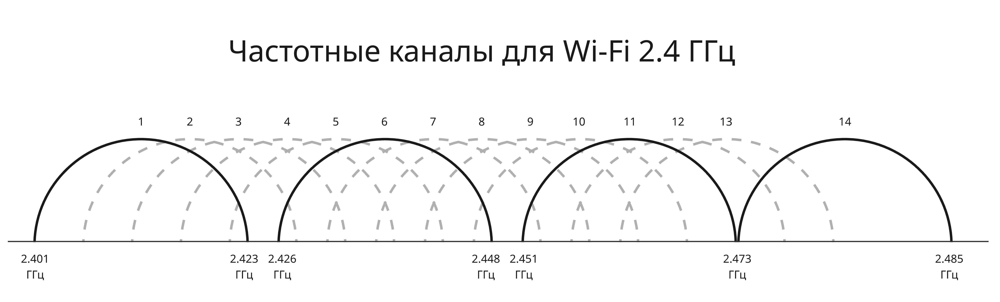
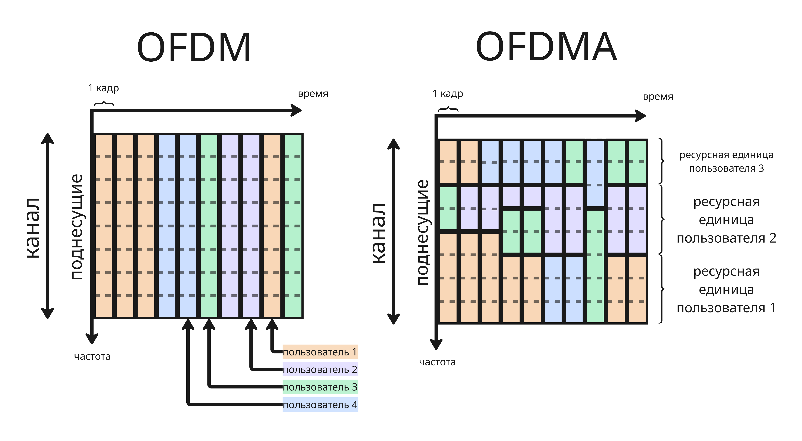
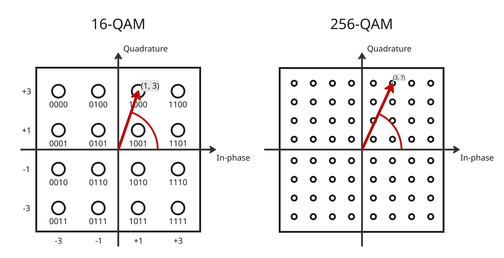
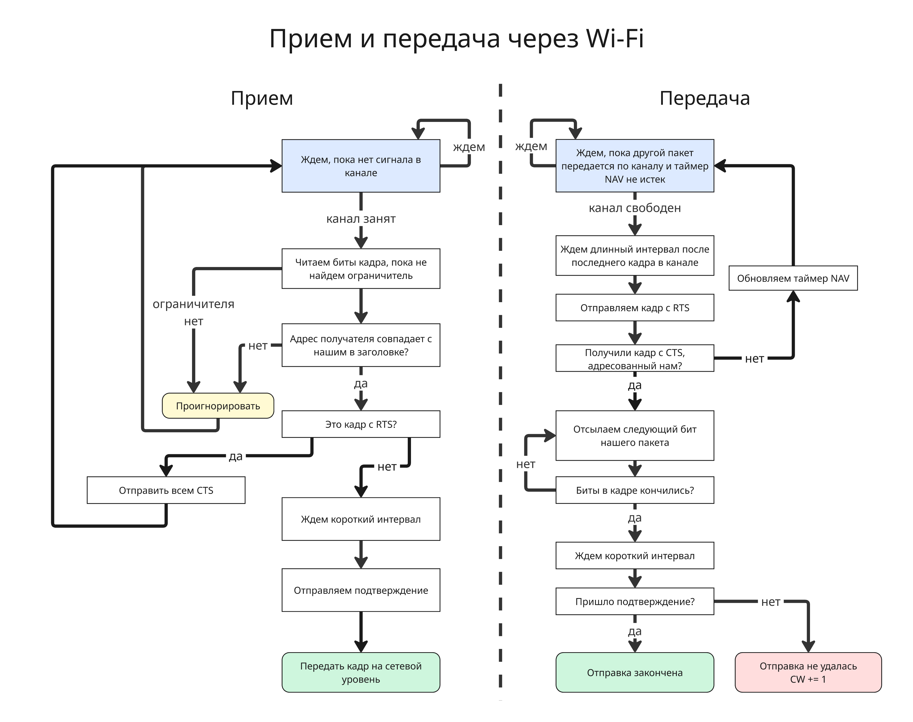
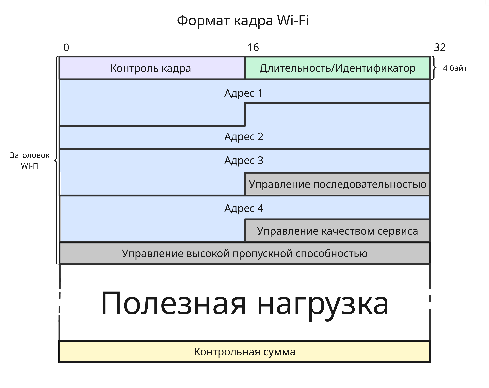

## Extra 1. Технология Wi-Fi

Wi-Fi - семейство беспроводных сетевых протоколов, основанных на семействе стандартов IEEE 802.11

Wi-Fi был создан в 1991 году компаниями NCR Corporation и AT&T и предназначался для систем кассового обслуживания. Создатель Wi-Fi, Вик Хейз, был одним из разработчиков стандартов IEEE 802.11b, IEEE 802.11a и IEEE 802.11g

11 сентября 2009 года был утвержден стандарт IEEE 802.11n. Позднее новые стандарты выходили в 2012, 2015, 2019 годах

Wi-Fi использует радиоволны (то есть электромагнитные волны) в воздушной среде. Тут появляются множество проблем, которых нет при передаче по медных кабелям или оптоволокну:

* Сигнал быстро затухает, так как мощность уменьшается пропорционально квадрату расстояния от источника, радиоволны поглощаются проводником
* Теневые зоны: электромагнитные волны плохо проходят через бетон, металлы, землю, воду и так далее 
* Замирание сигнала - ситуация, при которой вследствие отражения и задержки в других средах сигнал доходит до приемника разными путями, из-за чего в ходе интерференции амплитуда уменьшается 
* Временные задержки, на передачу сигнала на один метр уходит 3.3 нс

| IEEE стандарт       | Максимальная пропускная способность | Год  | Частоты         | Дальность |
| ------------------- | ---------------------- | ---- | --------------- | ------------------- |
| 802.11              | 2 Мбит/с               | 1997 | 2.4 ГГц         | 20–30 м             |
| 802.11b             | 11 Мбит/с              | 1999 | 2.4 ГГц         | 30–50 м             |
| 802.11a             | 54 Мбит/с              | 1999 | 5 ГГц           | 15–30 м             |
| 802.11g             | 54 Мбит/с              | 2003 | 2.4 ГГц         | 30–50 м             |
| 802.11n (Wi-Fi 4)   | до 600 Мбит/с          | 2009 | 2.4 / 5 ГГц     | 30–70 м             |
| 802.11ac (Wi-Fi 5)  | до 6.9 Гбит/с          | 2013 | 5 ГГц           | 20–40 м             |
| 802.11ad (WiGig)    | до 6.8 Гбит/с          | 2012 | 60 ГГц          | 1–10 м              |
| 802.11ax (Wi-Fi 6)  | до 9.6 Гбит/с          | 2019 | 2.4 / 5 ГГц     | 30–70 м             |
| 802.11ax (Wi-Fi 6E) | до 9.6 Гбит/с          | 2021 | 6 ГГц           | 20–40 м             |
| 802.11be (Wi-Fi 7)  | до 46 Гбит/с (источники разнятся)          | 2024 | 2.4 / 5 / 6 ГГц | 20–40 м             |
| 802.11bn (Wi-Fi 8)  | до 46 Гбит/с (источники разнятся)          | еще не вышел( | 2.4 / 5 / 6 ГГц | неизвестно             |

---

Стандарты Wi-Fi определяют множество вещей:

* Поддерживаемые полосы частот
* Ширина полос канала
* Расстояние между поднесущими частотами
* Мощностные характеристики
* Длительность символа
* Длительность защитного интервала 
* Схема передачи (OFDM или OFDMA) 
* Схема модуляции
* Количество пространственных каналов (MIMO)

Всего Wi-Fi использует 4 частотных диапазона: 

* 2.4 ГГц - 2.4-2.4835 ГГц
* 5 ГГц - 5.15-5.825 ГГц
* 6 ГГц для Wi-Fi 6/6E/7 - 5.925-7.125 ГГц
* ну и 60 ГГц (57-71 ГГц) для WiGig, который используется реже и для соединения близлежащих устройств 

Выбор частот связан с соблюдением требований законодательств. На эти частоты также действуют ограничения по мощности. Также нужно учитывать, что, чем ниже частота, тем длиннее волны и тем лучше они проходят через среду. Но также с понижением частоты понижается пропускная способность радиоканала

Далее диапазоны делятся на каналы. Диапазон 2.4 ГГц делится на 14 каналов длиной 20-22 МГц (22 МГц было в старых стандартах). Очевидно, что каналы перекрываются, из-за этого используются чаще всего каналы 1, 6, 11, 14 (14 канал разрешен только в Японии)

Каждый канал - это отдельная Wi-Fi сеть. Для роутера с точкой доступа можно указать свой канал. Можно использовать программу, которая просканирует диапазон и скажет, какой канал менее всего занят, чтобы избежать конкуренции

В Wi-Fi 5 ГГц таких каналов 20-25 (в зависимости от законодательства). Ширина каналов также может быть больше

---

Далее, чтобы увеличить пропускную способность, используется метод OFDM (Orthogonal Frequency Division Multiplexing, мультиплексирование с ортогональным частотным разделением каналов):

* Поток данных делится на несколько потоков
* Далее набор битов кодируется и модулируются 
* Частотный канал делится на так называемые поднесущие. Канал шириной 20 МГц делится на 64 поднесущих (по 312.5 КГц), некоторые из которых используются не для передачи данных, а для разделения других поднесущих друг от друга. В них будут параллельно передаваться данные внутри одной сети. Они находятся в разных частотных диапазонах, поэтому не мешают друг другу
* Далее сигнал проходит обратное быстрое преобразование Фурье, которое разделяет ортогональные компоненты
* И, пройдя через цифро-аналоговый преобразователь, передается как радиоволна

В OFDM для Wi-Fi все поднесущие выделены только одному пользователю в один момент времени. Расширенный алгоритм OFDMA (Orthogonal Frequency Division Multiple Access) объединяет поднесущие в ресурсные единицы. По ресурсным единицам передается информация одному пользователю в один момент времени, то есть получатель данных от конкретной ресурсной единицы меняется в ходе работы

Для OFDMA канал 20 МГц делится на 256 поднесущих (по 78.125 КГц), а ресурсная единица представляется из числа поднесущих, кратного 26. QFDMA появился в стандарте Wi-Fi 6

---

Сигнал перед обратным быстрым преобразованием Фурье кодируется помехозащищенным кодом и модулируется. Модуляция может быть:

* BPSK (Binary Phase Shift Keying) - для 0 используется один фазовый сдвиг, а для 1 другой сдвиг
* QPSK (Quadrature Phase Shift Keying) - аналогично BPSK два бита модулируются разными фазовыми сдвигами
* QAM (Quadrature Amplitude Modulation) - набор битов модулируется фазовым сдвигом и амплитудой. В стандарте IEEE 802.11ac появился 256-QAM (8 битов модулируются в 256 комбинаций фазы и амплитуды), а в 802.11ax 1024-QAM

    

---

Большинство роутеров в наше время имеют больше одной антенны для передачи. Такие роутеры используют технологию MIMO (Multiple Input Multiple Output), в которой полоса пропускания увеличивается за счет приема и передачи несколькими антеннами

Оборудование, поддерживающее MIMO, имеет характеристику `TxR:S`, где `T` - число антенны для передачи, `R` - число антенна для приема, а `S` - число пространственных потоков. От количества пространственных потоков зависит максимальная канальная скорость

Изначально все антенны передавали данные одному пользователю (Single User MIMO), но позже появилась возможность передачи и приема одному пользователю от одной или нескольких антенн

Также несколько антенны позволяют усиливать сигнал устройству пользователя в зависимости от его положения. Несмотря на то, что антенны всенаправленные, пробная передача позволяет определить фазу и амплитуду сигнала на устройстве, которое передает эту информацию обратно роутеру. Далее роутер корректирует фазу и амплитуду для антенн так, что бы волны в ходе интерференции сложились, давая улучшенное покрытие и снижение помех. Такая технология известна как Beamforming

---

В Ethernet используется CSMA/CD, тогда как в Wi-Fi используется CSMA/CA (Carrier Sense Multiple Access with Collision Avoidance). В беспроводных сетях:

* Нельзя передавать и слушать одновременно на одной частоте
* Коллизию нельзя обнаружить на стороне передатчика
* Два устройства могут не слышать друг друга, но передатчик может

Поэтому в Wi-Fi используется избегание коллизий:

* Если радиопространство занято, то есть прослеживается радиосигнал или внутренний таймер NAV (Network Allocation Vector) прошлых передачи других узлов истек, то передатчик ждет
* Если радиопространство не занято, то передатчик ждет межкадровый интервал DIFS (DCF InterFrame Space, обычно 34 мкс), а затем еще случайный промежуток времени `random(0, CW) * T`, где `CW` - это размер конкурентного окна (Contention Window), а `T` - размер слота ожидания (обычно 9 мкс)
* Передается кадр с данными
* Приемник, получив кадр с данными, ждет короткий межкадровый интервал SIFS (Short InterFrame Space, обычно 16 мкс)
* И отправляет кадр с подтверждением передачи
* Если передатчик не получил подтверждение, то передача считается неудачной и конкурентное окно увеличивается на 1

Проблема двух скрытых узлов решается так: передатчик отправляет сигнал RTS (Request To Send) с длительностью передачи приемнику, если приемник видит свободность радиопространства, то он отправляет сигнал CTS (Clear To Send), дублируя длительность передачи. Получивший его приемник начинает передачу, а другие устанавливают таймер NAV и не мешают передаче

---

В итоге, последние стандарты Wi-Fi сочетают MU MIMO, модуляцию 1024-QAM, OFDMA, направленный сигнал и до 8 пространственных потоков, что позволяет достичь передачи до 10 гигабит в секунду

Оборудование для беспроводных сетей может работать в разных режимах:

* Ad-Hoc - объединение двух узлов во временную беспроводную сеть для обмена данных
* Точка доступа (Access Point, AP) - точка доступа Wi-Fi для передачи данных. Большинство роутеров работают в таком режиме. В Linux точку доступа можно включить с помощью утилиты `hostapd`, а в Windows и в Android с помощью графического интерфейса

    Также точка доступа может работать как повторитель другого беспроводного сигнала для его усиления в другом месте

    Роутер же помимо выполнения в режиме точки доступа также работает как сетевой переключатель и компьютер, выполняющий функции сервера для DHCP и другого

* Мост (Bridge) - беспроводной мост между двумя сетями в местах, где проводное подключение невозможно (например, через дорогу между зданиями)

* Беспроводная распределенная система (Wireless Distribution System, WDS) - режим работы для воссоздания практически любой топологии из комбинации типов "Точка-Точка" и "Точка-Многоточка"

Также беспроводное оборудование может выполнять авторизацию пользователей с помощью пароля или веб-страницу, групповую конфигурацию других точек доступа и другого

---

Формат кадра Wi-Fi состоит из этих полей:

* Поля контроля кадра, 16 бит, а именно

    * Версия протокола, 2 бита, `00` - это WLAN (PV0), а `01` - это PV1
    * Тип кадра, 2 бита, и субтип кадра, 4 бита

        Используются для обозначения типа сообщений с данными и служебных сообщений, таких как подтверждение, RTS и CTS
    
    * Флаг "В распределенную систему", 1 бит
    * Флаг "Из распределенной системы", 1 бит

        Эти флаги используются в WDS

    * Флаг "Больше фрагментов", 1 бит - установлен, если за этим кадром последуют еще кадры в пределах фрагмента
    * Флаг "Повтор", 1 бит - установлен при повторной передачи кадра, подтверждение приема которого передатчик не получил
    * Флаг "Управление питанием", 1 бит - установлен приемник, если используется энергосбережение. Тогда передатчик будет использовать буферизацию кадров
    * Флаг "Больше данных", 1 бит - установлен, если буфер передатчик для отправки не пуст, а приемник не должен закрывать прием
    * Флаг "Защищенный кадр", 1 бит - установлен, если кадр зашифрован
    * Флаг "HTC", 1 бит - установлен, если есть управление высокой пропускной способности (HT, High Throughput)

* Длительность последующей передачи в мкс для таймера NAV или идентификатор энергосберегающего приемника, 16 бит
* Адрес 1, 48 бит
* Адрес 2, 48 бит
* Адрес 3, 48 бит
* Контроль последовательности, 16 бит. Первые 4 бита - номер фрагмента, последние 12 бит - номер последовательности
* Адрес 4, 48 бит
* Контроль качества сервиса для классификации очереди кадров, 16 бит
* Контроль высокой пропускной способности, 32 бита. Используется для направленной передачи и выбора антенны
* Полезная нагрузка
* Контрольная сумма кадра, 32 бита

В зависимости от флагов "В распределенную систему" и "Из распределенной системы" назначение адресов меняется:

| Режим работы | Значение "В распределенную систему" | Значение "Из распределенной системы" | Адрес 1 | Адрес 2 | Адрес 3 | Адрес 4 |
|-|-|-|-|-|-|-|
| Управляющие кадры | 0 | 0 | Адрес получателя | Адрес отправителя | Пусто | Пусто |
| Ad-Hoc        | 0 | 0 | Адрес получателя | Адрес отправителя | Идентификатор сети | Пусто |
| Клиент -> Точка доступа | 1 | 0 | Адрес получающей точки доступа | Адрес конечного получателя | Адрес отправителя | Пусто |
| Точка доступа -> Клиент | 0 | 1 | Адрес конечного получателя | Адрес отправляющей точки доступа | Адрес исходного отправителя | Пусто |
| Беспроводной мост | 1 | 1 | Адрес получающей точки доступа | Адрес отправляющей точки доступа | Адрес конечного получателя | Адрес исходного отправителя |

> Источники: [http://www.dcrwireless.com/2018/03/chapter-3-80211ac-frame-fields.html](http://www.dcrwireless.com/2018/03/chapter-3-80211ac-frame-fields.html), [https://en.wikipedia.org/wiki/802.11_frame_types](https://en.wikipedia.org/wiki/802.11_frame_types)

---

Так как сигнал Wi-Fi не ограничен средой, то для защиты данных используются следующие технологии:

* WEP (Wired Equivalent Privacy)

    Здесь используется симметричное шифрование. Ключ делится на секретную часть, 40 или 104 бита, известную пользователю, и вектором инициализации - 24 рандомных бита, которые открыто передаются в пакете

    На основе ключа алгоритмом RC4 генерируется псевдослучайная последовательность, с которой берется побитовое исключающее ИЛИ с исходными данными

    Сейчас WEP считается небезопасным, так как вектор инициализации слишком маленький, псевдослучайный, и WEP можно взломать с помощью статистики (например, с помощью программы WEPcrack)

* WPA (Wi-Fi Protected Access) появился как временное решение для WEP. В нем используются протокол смены ключей TKIP (Temporal Key Integrity Protocol), проверка целостности MIC (Message Integrity Check), размер вектора инициализации увеличивается

    Авторизация происходит по мастер-ключу (Pairwise Master Key) от хеша пароля (от 8 до 63 символов) и 4-стороннему рукопожатию, в ходе которого происходит генерация сессионного ключа

    Далее по сессионному ключу и 48-битному вектору инициализации (который является счетчиком пакетов) генерируется последовательность по алгоритму RC4, вычисляется код MIC и производится исключающее ИЛИ от пакета + MIC + вектор и сгенерированной последовательности

    Также WPA реализует стандарт 802.1x IEEE 802.1x, основанный на протоколе EAP (Extensible Authentication Protocol), сервере доступа RADIUS (Remote Access Dial-in User Server) и протоколе защиты транспортного уровня TLS (Transport Layer Security)

* WPA2 пришел как замена WPA и реализация стандарта IEEE 802.11i

    В нем используется CCMP (Counter Mode with Cipher Block Chaining Message Authentication Code Protocol). Пакеты шифруются с помощью потокового ассиметричного алгоритма AES (Advanced Encryption Standard)

    Для каждого пакета генерируется 48-битный номер, на основе его, адресов и других пакетов генерируется поток для шифрования, вычисляется CBC-MAC, аналогичный MIC, а исходный пакет шифруется

    Для авторизации используется 4-стороннее шифрование. Поддерживается 2 режима авторизации: с помощью общего пароля (WPA2-Personal) или с помощью логина/пароля или сертификата (WPA2-Enterprise) по стандарту IEEE 802.1x
