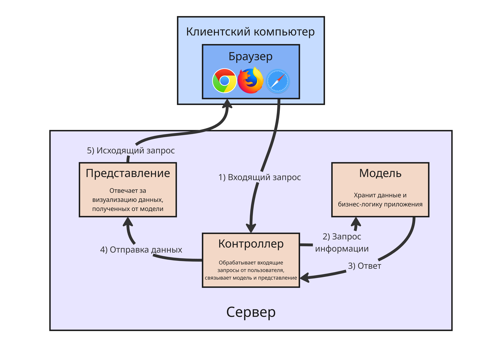

## Лекция 2. Подходы к разработке веб-приложений

Все подходы к разработке веб-приложений можно разделить на 3 категории:

* Программные подходы, основанные на программировании и скриптах, например, плагины для nginx или скрипты на Lua
* Подходы, основанные на использовании шаблонов веб-страниц, включающих вставки кода скриптов, например, скрипты на PHP
* Объектные среды, то есть полноценные веб-фреймворки с ООП, паттернами, абстракцией и прочим

### Программные подходы

Программные подходы состояли в создании программой на универсальном языке высокого уровня (или скрипта, который исполнялся с помощью интерпретатора)

Для этого разметка HTML и другие конструкции форматирования встраивались прямо в логику работы программы с помощью операторов вывода

Такой подход ограничивал возможность дизайнерам вносить изменения в оформление или расположение элементов, так как им пришлось открывать исходный код, знать язык программирования и другие инструменты (или помощь программиста🧑‍💻)

С помощью такого подхода можно динамически формировать содержимое страницы на HTTP-запрос. Первой такой технологией, которая позволила независимо от типа веб-сервера, была Common Gateway Interface (CGI, не путать с Computer-generated imagery), определявшая набор правил для программы, чтобы она могла выполняться для разных ОС и HTTP-серверов

Технология работала так:

1. При поступлении HTTP-запроса определялась, какая программа должна быть запущена (чтобы обеспечивать доступ к разным ресурсам)
2. Запускался новый процесс этой программы, переменные окружения которой содержали параметры HTTP-запроса
3. Запускалась функция `main()`, которая в стандартный поток вывода выводила HTML-страницу

Выглядела она так:

```c
#include <stdio.h>
#include <stdlib.h>
#include <string.h>

int main() {
    // Получение переменных окружения
    char *method = getenv("REQUEST_METHOD");
    char *query  = getenv("QUERY_STRING");     // данные запроса

    // HTTP-заголовок
    printf("Content-Type: text/html; charset=utf-8\r\n\r\n");

    printf("<html><body>\n");
    printf("<h1>CGI Example in C</h1>\n");

    // Информация о методе запроса
    printf("<p>Request method: %s</p>\n", method ? method : "unknown");

    // Обработка GET
    if (method && strcmp(method, "GET") == 0 && query) {
        printf("<h2>GET parameters:</h2>\n");
        printf("<pre>%s</pre>\n", query);
    }
    else {
        printf("<p>No data received or unsupported method.</p>\n");
    }

    printf("</body></html>\n");
    return 0;
}
```

Технология CGI позволяла использовать любой язык программирования (в том числе скриптовые, такие как Python или Perl), но были недостатки:

* При новом подключении создавался новый процесс - а создание новое процесса обходится ОС намного дороже, чем содержание текущего (надо захватить ресурсы, оперативную память, потом освободить это все)
* Содержать и обновлять такой код рядовому фронтенд-разработчику или дизайнеру было тяжело, так как требовалось знание языка

Следующей попыткой стала технология FastCGI - в ней вместо создания нового процесса появилась возможность использования существующего

---

Далее для веб-сервера Internet Information Server (IIS) от Microsoft, который поставлялся с операционной системой Windows Server, был разработан интерфейс ISAPI

Этот интерфейс позволял расширить стандартные возможности веб-сервера. ISAPI представлял библиотеку функций, с помощью которой программисты могли создавать веб-приложения в виде DLL-модулей (Dynamic-Link Library), что работало намного быстрее CGI-приложений

ISAPI-расширения могут связываться с вызовом файлов, имеющих специальные расширения или содержащимися в заданных каталогах. Также были фильтры, которые использовались для изменения функциональности сервера ISS

Такие приложения обычно использовали языки С++, Delphi или платформу .NET

---

Потом компания Sun Microsystems (разработчик Java) создала прикладной интерфейс Java Servlet API, который связывал веб-сервер с JVM. Виртуальная машина отвечала за выполнение сервлетов (компонент расширения функционала) и программы, которая управляла данными

В отличии от ISAPI-расширений сервлеты являются переносимыми между разными серверами, ОС и компьютерными архитектурами. Сервлеты могут исполняться одинаково в любой среде, если в ней был совместимый контейнер сервлетов (такой, как Apache Tomcat)

### Подходы, основанных на шаблонах

Подходы на основе шаблонов используют в качестве объектов, доступных по URL, не скрипты, а шаблоны

Шаблоны представляют HTML-страницы, но в которых динамический контент заменен на особые теги. Сервер обрабатывает запрос, исполняет бизнес-логику и решает, что подставить вместо этих особых тегов (например, имя аккаунта или новостную ленту)

Первым таким подход стал Server Side Includes (SSI), которая позволяла встраивать особые инструкции в HTML-код:

```html
<html>
<head><title>hello</title></head>
<body>
    <! -- #exec cgi http://mysite.org/cgi-bin/example.cgi -- >
</body>
</html>
```

Здесь внутри `<body>` встраивался контент, полученный CGI-программой

---

Позднее компания Macromedia (разработчик почившей платформы Flash), выкупила технологию Cold Fusion у компании Allaire Corporation братьев Аллейров

Она использовала в качестве особых тегов теги с приставкой `cf`:

```html
<!DOCTYPE html>
<html>
<head>
    <title>Пример</title>
</head>
<body>
    <h1>Добро пожаловать!</h1>

    <!--- Получаем параметр name из строки запроса --->
    <cfparam name="url.name" default="гость">

    <p>Привет, <cfoutput>#url.name#</cfoutput>!</p>
</body>
</html>
```

---

Далее появился скриптовый язык PHP (рекурсивный акроним от PHP: Hypertext Preprocessor), который мог содержать вставки кода с логикой

```php
<b>
<?php
if ($xyz >= 3) {
    $output = $myHeading;
} else {
    $output = 'DEFAULT HEADING';
}
echo $output;
?>
</b>
```

Такие вставки обрабатывались препроцессором PHP на стороне сервера

---

Далее Microsoft разрабатывает Action Server Pages (или ASP), которая объединила шаблоны и доступ к наборам OLE (Object Linking and Embedding - встраивание и линковка объектов) и COM (Component Object Model - модель компонентных объектов). Они уже позволяли получать данные из базы данных по интерфейсу ODBC (Open Database Connectivity)

В отличие от РНР, ASP не связан с одним конкретным скриптовым языком - в качестве стандартного языка используется язык Visual Basic Scripting Edition (VBScript), но может использоваться и JavaScript

Вставки в ASP оформляются в тегах `<% ... %>`:

```html
<%@ Language=VBScript %>
<html>
<head>
    <title>Пример</title>
</head>
<body>
    <h1>Данные из базы данных (ODBC)</h1>

    <%
    ' Создаём объект Connection
    Dim conn, rs, sql
    Set conn = Server.CreateObject("ADODB.Connection")
    conn.Open "DSN=MyDSN;UID=blablabla;PWD=blablabla67;"

    ' SQL‑запрос
    sql = "SELECT EmployeeID, FirstName, LastName, Title FROM Employees WHERE EmployeeID = 127"

    ' Выполняем запрос, получаем Recordset
    Set rs = conn.Execute(sql)

    If Not rs.EOF Then
        For Each field In rs.Fields
            Response.Write "<p>" & field.Value & "</p>"
        Next
    Else
        Response.Write "<p>Нет записей.</p>"
    End If

    ' Закрываем объекты и освобождаем ресурсы
    rs.Close
    Set rs = Nothing
    conn.Close
    Set conn = Nothing
    %>
</body>
</html>
```

ASP позволял писать логику и обращение к базе данных прямо в HTML-странице и была встроена в веб-сервер ISS, что делало основным выбором для создания веб-приложения на Windows

---

SUN в ответ создает Java Server Pages (JSP) для экосистемы Java. Она позволяла встраивать Java-код внутрь HTML-страницы:

```html
<%@ page import="java.io.*" %>
<%! private CustomObject myObject; %>
<h1>My Heading</h1>
<%
    for(int i = 0; i < myObject.getCount(); i++) { %>
        <p>Item #<%= i %> is '<%= myObject.getItem(i) %>' . </p>
<% } %>
```

Такой код преобразуется в код сервлета, а HTML-разметка - в операторы вывода. Позже появилась возможность использовать JSP-теги, такие как `<jsp:useBean>` для внедрения зависимостей и `<jsp:getProperty>` для получения значения свойства

### Подходы на основу объектных сред

Потом придумали объектные среды, такие как фреймворки. Фреймворки представляют платформу, определяющую структуру

Фреймворк разделяет программные модули, ответственные за создание контента (непосредственно бизнес-логика), от модулей, который ответственны за показ этого контента в определенном формате

Сейчас есть два подхода:

* Подходы, основанные на наборе специальных веб-страниц, связанных с описаниями классов, объекты которых будут создаваться и использоваться при их вызове (например, ASP.Net Web Forms и JSP)

    Для их создания используются специальные теги, обрабатываемые на стороне сервера

* Подходы на основе использования классов, соответствующих архитектурному шаблону MVC - Модель-Представление-Контроллер (Model-View-Controller)

Шаблон MVC состоит из трех модулей:

* Модель - это набор классов, реализующих бизнес-логику

    Эти классы отвечают за обработку сущностей и операции с базой данных

* Представление - набор шаблонов, отвечающих за взаимодействие с пользователем через интерфейс пользователя

    Модуль представления формирует HTML-страницы, в которых тем или иным способом представлены сущности модели

* Контроллер - связка между модулями модели и представления

    Контроллер получает данные HTTP-запроса, передает их в модуль модели для обработки. Далее контроллер выбирает нужный модуль представления и передает ему данные от модели



Такое разделение веб-приложения упрощает структуру за счет более строго разделения его уровней

Таким образом, разработчик получает полный контроль над формируемым HTML-документом, и облегчается задача выполнения тестирования приложения

Примерами технологий разработки на основе MVC являются:

* Spring Framework для языка Java
* Технология ASP.Net MVC для платформы .Net Framework
* Технология Ruby on Rails для языка Ruby
