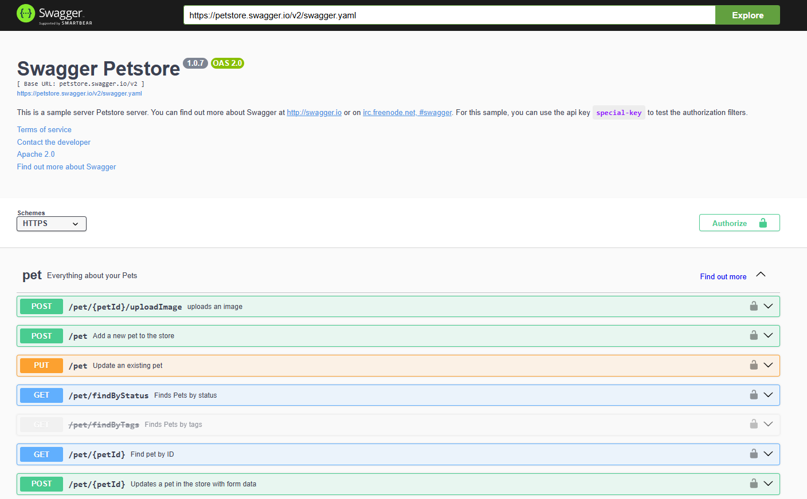

<!-- This file is generated by assets.build.markdown.superconspect_builder. All changes to it will be lost -->


# <a name="web-%D1%80%D0%B0%D0%B7%D1%80%D0%B0%D0%B1%D0%BE%D1%82%D0%BA%D0%B0%3A-backend"></a> Web-разработка: Backend

* [Web-разработка: Backend](#web-%D1%80%D0%B0%D0%B7%D1%80%D0%B0%D0%B1%D0%BE%D1%82%D0%BA%D0%B0%3A-backend)
  * [Лекция 1. Введение](#%D0%BB%D0%B5%D0%BA%D1%86%D0%B8%D1%8F-1.-%D0%B2%D0%B2%D0%B5%D0%B4%D0%B5%D0%BD%D0%B8%D0%B5)
  * [Лекция 2. Подходы к разработке веб-приложений](#%D0%BB%D0%B5%D0%BA%D1%86%D0%B8%D1%8F-2.-%D0%BF%D0%BE%D0%B4%D1%85%D0%BE%D0%B4%D1%8B-%D0%BA-%D1%80%D0%B0%D0%B7%D1%80%D0%B0%D0%B1%D0%BE%D1%82%D0%BA%D0%B5-%D0%B2%D0%B5%D0%B1-%D0%BF%D1%80%D0%B8%D0%BB%D0%BE%D0%B6%D0%B5%D0%BD%D0%B8%D0%B9)
    * [Программные подходы](#%D0%BF%D1%80%D0%BE%D0%B3%D1%80%D0%B0%D0%BC%D0%BC%D0%BD%D1%8B%D0%B5-%D0%BF%D0%BE%D0%B4%D1%85%D0%BE%D0%B4%D1%8B)
    * [Подходы, основанных на шаблонах](#%D0%BF%D0%BE%D0%B4%D1%85%D0%BE%D0%B4%D1%8B%2C-%D0%BE%D1%81%D0%BD%D0%BE%D0%B2%D0%B0%D0%BD%D0%BD%D1%8B%D1%85-%D0%BD%D0%B0-%D1%88%D0%B0%D0%B1%D0%BB%D0%BE%D0%BD%D0%B0%D1%85)
    * [Подходы на основу объектных сред](#%D0%BF%D0%BE%D0%B4%D1%85%D0%BE%D0%B4%D1%8B-%D0%BD%D0%B0-%D0%BE%D1%81%D0%BD%D0%BE%D0%B2%D1%83-%D0%BE%D0%B1%D1%8A%D0%B5%D0%BA%D1%82%D0%BD%D1%8B%D1%85-%D1%81%D1%80%D0%B5%D0%B4)
  * [Лекция 3. Предметно-ориентированное проектирование](#%D0%BB%D0%B5%D0%BA%D1%86%D0%B8%D1%8F-3.-%D0%BF%D1%80%D0%B5%D0%B4%D0%BC%D0%B5%D1%82%D0%BD%D0%BE-%D0%BE%D1%80%D0%B8%D0%B5%D0%BD%D1%82%D0%B8%D1%80%D0%BE%D0%B2%D0%B0%D0%BD%D0%BD%D0%BE%D0%B5-%D0%BF%D1%80%D0%BE%D0%B5%D0%BA%D1%82%D0%B8%D1%80%D0%BE%D0%B2%D0%B0%D0%BD%D0%B8%D0%B5)
  * [Лекция 4. Разработка API](#%D0%BB%D0%B5%D0%BA%D1%86%D0%B8%D1%8F-4.-%D1%80%D0%B0%D0%B7%D1%80%D0%B0%D0%B1%D0%BE%D1%82%D0%BA%D0%B0-api)
  * [Лекция 5. Бэкенд для фронтенда](#%D0%BB%D0%B5%D0%BA%D1%86%D0%B8%D1%8F-5.-%D0%B1%D1%8D%D0%BA%D0%B5%D0%BD%D0%B4-%D0%B4%D0%BB%D1%8F-%D1%84%D1%80%D0%BE%D0%BD%D1%82%D0%B5%D0%BD%D0%B4%D0%B0)
    * [Базовые элементы Nest](#%D0%B1%D0%B0%D0%B7%D0%BE%D0%B2%D1%8B%D0%B5-%D1%8D%D0%BB%D0%B5%D0%BC%D0%B5%D0%BD%D1%82%D1%8B-nest)
    * [Продвинутые элементы Nest](#%D0%BF%D1%80%D0%BE%D0%B4%D0%B2%D0%B8%D0%BD%D1%83%D1%82%D1%8B%D0%B5-%D1%8D%D0%BB%D0%B5%D0%BC%D0%B5%D0%BD%D1%82%D1%8B-nest)
  * [Лекция 6. GraphQL и Prisma](#%D0%BB%D0%B5%D0%BA%D1%86%D0%B8%D1%8F-6.-graphql-%D0%B8-prisma)
    * [Prisma](#prisma)
    * [GraphQL](#graphql)

<!-- begin webbackend_2026_02_07.md -->
## <a name="%D0%BB%D0%B5%D0%BA%D1%86%D0%B8%D1%8F-1.-%D0%B2%D0%B2%D0%B5%D0%B4%D0%B5%D0%BD%D0%B8%D0%B5"></a> Лекция 1. Введение

Как ранее обсуждалось на курсе [фронтенд-разработки](https://pelmesh619.github.io/itmo_conspects/webfrontend/webfrontend_superconspect.html), сейчас документный обмен через сеть Интернет преимущественно с помощью веб-технологий

Так браузер на компьютере клиента, используя URL, посылает запрос по HTTP-протоколу на сервер, который отвечает набором файлов, которые задает веб-страницу с помощью языков HTML, CSS и JavaScript

Все ресурсы веб-сайтов делятся на два типа:

* Статические ресурсы - файлы данных, к которым есть доступ из сети интернет:
    * HTML-документы
    * Изображения
    * Мультимедиа файлы

* Динамические ресурсы - программные объекты, которые по запросу генерируют ресурс:
    * Web-приложения
    * Программные модули (exe, dll)
    * Шаблоны web-страниц
    * Скрипты (.php, .pl и пр.)

Работа веб-сети основана на пяти ключевых стандартах:

1. URL - способ задания адресов ресурсов сети
2. HTTP - протокол взаимодействия между клиентами и серверами
3. HTML - язык описания гипертекстовых документов
4. CSS - язык форматирования гипертекстовых документов
5. JavaScript - язык описания программ, выполняемых на стороне клиента

Протокол HTTP (HyperText Transfer Protocol, Протокол передачи гипертекста) является ключевым участником взаимодействия всех участников веб-сети

Протокол HTTP:

* является протоколом прикладного уровня на стеке TCP/IP
* повсеместно используется в формате версии HTTP/1.1 и HTTP/2
* имеет серверный порт по умолчанию 80 (или 443 для защищенных соединений)

Веб-серверы ещё называют HTTP-серверами, браузеры - HTTP-клиентами, но клиентами могут быть и другие программы: прокси-серверы, поисковые агенты и тому подобное

HTTP работает по принципу запрос-ответ (Request-Response): клиент отправляет запрос, сервер возвращает ответ

HTTP-запрос имеет такую структуру:

```txt
МЕТОД /[имя-ресурса][?параметры-запроса] HTTP/номер-версии
Имя-заголовка-1: значение
Имя-заголовка-2: значение

[тело запроса, может отсутствовать]
```

Здесь:

* `МЕТОД` - один из поддерживаемых методов. Всего есть 8 методов с разным назначением:

    | Метод | Назначение |
    |---|---|
    | `GET` | Получение ресурса. Не имеет тела, а параметры передаются в строке URL |
    | `POST` | Отправка данных на сервер, такой метод имеет тело запроса |
    | `PUT` | Полное обновление существующего ресурса |
    | `DELETE` | Удаление ресурса |
    | `HEAD` | Аналог `GET`, но без тела ответа - только заголовки |
    | `OPTIONS` | Запрос информации о доступных методах для ресурса |
    | `TRACE` | Диагностика пути запроса |
    | `CONNECT` | Установка туннеля к серверу |

    Метод `GET` - cамый простой и распространённый метод, использующийся при вводе URL в адресную строку и переходе по ссылке. Метод не имеет тела - данные передаются в строке запроса, например:

    ```http
    GET /search?query=http&lang=ru HTTP/1.1
    Host: example.com
    ```

    Другой распространенный метод `POST` используется для отправки форм и создания ресурсов. Метод имеет тело запроса - данные передаются внутри сообщения, а не в URL:

    ```http
    POST /q HTTP/1.1
    Host: finance.yahoo.com
    User-Agent: Mozilla/4.75
    Content-Type: application/json
    Content-Length: 16

    {"key": "value"}
    ```

* `/имя-ресурса` - путь к запрашиваемому ресурсу на сервере
* `[?параметры-запроса]` - параметры запросы, хранящиеся в URL, например, `https://www.youtube.com/watch?v=dQw4w9WgXcQ&list=RDdQw4w9WgXcQ&start_radio=1` -- здесь три параметра `v`, `list` и `start_radio`
* `номер-версии` - версия протокола (1.0, 1.1 или 2.0)
* `Имя-заголовка-1: значение` - заголовок

Пример запроса:

```http
GET / HTTP/1.1
Host: httpforever.com
Connection: keep-alive
Upgrade-Insecure-Requests: 1
User-Agent: Mozilla/5.0 (Windows NT 10.0; Win64; x64) AppleWebKit/537.36 (KHTML, like Gecko) Chrome/145.0.0.0 Safari/537.36 Edg/145.0.0.0
Accept: text/html,application/xhtml+xml,application/xml;q=0.9,image/avif,image/webp,image/apng,*/*;q=0.8,application/signed-exchange;v=b3;q=0.7
Accept-Encoding: gzip, deflate
Accept-Language: ru
```

Запрос пишется в текстовом формате, причем конец блока заголовков обозначается последовательностью `\r\n\r\n`. Запрос также содержит информацию о клиенте - его операционную систему (здесь это 64-битная Windows 10/11), его браузер (здесь это Microsoft Edge на базе Chromium), движок рендера (здесь это `AppleWebKit`), и принимаемые кодировки (например, можно заархивировать контент), форматы документов и язык контента

Некоторые строки пишутся для соблюдения совместимости. Например, `Mozilla/5.0` отправляется потому, что серверы отдавали расширенный контент только браузерам Mozilla

---

HTTP-ответ выглядит так:

```txt
HTTP/1.1 200 OK
Server: nginx/1.18.0 (Ubuntu)
Date: Sun, 08 Mar 2026 15:13:19 GMT
Content-Type: text/html
Last-Modified: Wed, 22 Mar 2023 14:54:48 GMT
Transfer-Encoding: chunked
Connection: keep-alive
ETag: W/"641b16b8-1404"
Referrer-Policy: strict-origin-when-cross-origin
X-Content-Type-Options: nosniff
Feature-Policy: accelerometer 'none'; camera 'none'; geolocation 'none'; gyroscope 'none'; magnetometer 'none'; microphone 'none'; payment 'none'; usb 'none'
Content-Security-Policy: default-src 'self'; script-src cdnjs.cloudflare.com 'self' 'report-sha256'; style-src cdnjs.cloudflare.com 'self' fonts.googleapis.com 'unsafe-inline'; font-src fonts.googleapis.com fonts.gstatic.com cdnjs.cloudflare.com; frame-ancestors 'none'; report-uri https://scotthelme.report-uri.com/r/d/csp/enforce
Content-Encoding: gzip

[[HTML-документ]]
```

Здесь содержится информация о типе контента, сервере (`nginx/1.18.0 (Ubuntu)`), нужных для сайту разрешений браузера (например, геолокация - `geolocation 'none'`)

Первая строка HTTP-ответа содержит трёхзначный код состояния, который сообщает клиенту о результате обработки запроса. Коды делятся на пять категорий:

* `1xx` - информационные

    Используются в поясняющих целях, не сообщают об успехе/неуспехе. Чаще всего встречаются при обновлении протокола (например, при подключении веб-сокета)

* `2xx` - успешная обработка

    Самые популярные из категории:

    * `200 OK` - запрос успешно выполнен, ресурс отправлен клиенту
    * `201 Created` - запрос успешно выполнен, на сервере создан новый ресурс (для методов `PUT`/`POST`)
    * `204 No Content` - запрос выполнен, но тело ответа отсутствует

* `3xx` - перенаправление

    Клиенту нужно выполнить дополнительные действия (обычно - повторить запрос по другому URL)

    * `301 Moved Permanently` - ресурс перемещён постоянно на новый адрес
    * `302 Found` - временное перенаправление
    * `303 See Other` - ресурс доступен по другому URI методом `GET`
    * `304 Not Modified` - ресурс не изменился с последнего запроса (то есть кэш актуален)
    * `307 Temporary Redirect` - ресурс временно перемещён

* `4xx` - ошибки клиента

    * `400 Bad Request` - запрос неправильно сформирован
    * `401 Unauthorized` - требуется аутентификация (нужен заголовок `Authorization`)
    * `403 Forbidden` - доступ к ресурсу запрещён
    * `404 Not Found` - ресурс не найден на сервере

* `5xx` - ошибки сервера

    * `500 Internal Server Error` - внутренняя ошибка сервера
    * `501 Not Implemented` - сервер не поддерживает запрашиваемый метод
    * `505 HTTP Version Not Supported` - версия протокола не поддерживается сервером

---

Помимо информации в URL и теле запроса также есть заголовки - метаданные HTTP-сообщений. Они позволяют управлять сессиями, кэшированием, аутентификацией и авторизацией. Заголовки делятся на четыре группы:

* Общие заголовки. Могут использоваться как в запросах, так и в ответах. Примером может быть заголовок `Connection`, у которого есть два значение: `keep-alive` - сохранить соединение (используется по умолчанию в HTTP/1.1), и `close` - закрыть соединение (поведение по умолчанию в HTTP/1.0)

* Заголовки запроса. Клиент передаёт дополнительную информацию о себе и о запросе. Примеры:

    | Заголовок | Описание |
    |---|---|
    | `Host` | Указывает, какой сайт запрашивается (нужен для виртуального хостинга) |
    | `User-Agent` | Описывает программу, отправившую запрос (браузер, версия ОС) |
    | `Referer` | URL страницы, с которой пришёл запрос |
    | `Authorization` | Данные авторизации (имя/пароль). Отправляется после ответа `401` |

* Заголовки ответа. Сервер передаёт дополнительную информацию об ответе. Например:

    | Заголовок | Описание |
    |---|---|
    | `Server` | Информация о веб-сервере (необязательный) |
    | `Location` | URL для перенаправления. Используется с кодами 301, 302, 303, 307 |
    | `WWW-Authenticate` | Задаётся вместе с кодом `401`. Браузер запрашивает у пользователя логин/пароль |

* Заголовки содержания. Описывают тело сообщения - тип данных, длину, кодировку и так далее

---

Для работы веб-приложения нужен веб-сервер - серверная программа, работающая в фоновом режиме, которая принимает HTTP-запросы от клиентов и возвращает HTTP-ответы (обычно HTML-документы)

Современные веб-серверы состоят из модулей, каждый из которых отвечает за свою задачу:

1. Модуль разрешения запроса (или роутер, Router)
    * Определяет тип контента: статический или динамический
    * Преобразует URL-адрес в реальный путь в файловой системе
    * Проверяет аутентификацию для защищённых ресурсов

2. Модуль обработки запроса
    * Обрабатывает статический контент (отдаёт файлы напрямую)
    * Обрабатывает динамический контент (передаёт запрос на выполнение приложению)
    * Управляет состоянием сеанса, очередями, кэшем

3. Модуль формирования HTTP-ответа
    * Формирует заголовки ответа
    * Объединяет заголовки с результатом обработки
    * Передаёт ответ клиенту

Важно, что HTTP не поддерживает состояние сеанса. Вся информация о запросе содержится только в самом запросе (заголовках и теле)

---

Веб-сервер, как программе, нужно оборудование, на котором он будет работать. В качестве такого оборудования, где веб-сервер может хоститься (от host) могут выступать:

* Выделенный сервер (Dedicated server) - физический сервер в полном единоличном использовании. Для простеньких проектов выделенным сервером может быть старый ноутбук или одноплатный компьютер, например, Raspberry Pi

    К нему есть полный доступ управления, но выделенный сервер имеет высокую стоимость и требует навыков для правильной настройки, чтобы соблюсти надежность и безопасность

* Виртуальный приватный сервер (Virtual Private Server, VPS) - виртуальный сервер с выделенными ресурсами

    Виртуальный приватный сервер - это оборудование, доступ к которому осуществляется через операционную систему с помощью виртуализации или контейнеризации

    У виртуального приватного сервера есть выделенные ресурсы (то есть соседние процессы не влияют на производительность), полный доступ в качестве суперпользователя, высокая гибкость настройки, однако такое решение все еще требует квалификации для настройки и поддержки

* Разделенный сервер (Shared Hosting): несколько клиентов используют один физический сервер совместно

    Самое дешёвое решение, часто идут бесплатные домены, не требует технических знаний, но сильные ограничения - нельзя настраивать порты и выбирать нестандартные решения

* Управляемый сервер (Managed Hosting): провайдер предоставляет конкретное веб-приложение с административным доступом, но управление сервером остается за провайдером. Примером управляемого сервера может быть сервис Tilda

    Здесь не нужно разбираться в сервере, но сервер ограничен только возможностями конкретного приложения

* Провайдеры, специфичные для приложений (App-specific providers) - платформы для разработчиков с готовыми компонентами (такими как базы данных, репозитории, деплой, мониторинг). Примеры: Google AppEngine, Heroku, Render, VMware Pivotal Cloud Foundry

    У таких платформ нижний порог входа по сравнению с VPS, есть автоматизация многих процессов, но функционал ограничен функциями платформы, а при росте приложения может стать дорого и тяжело мигрировать

Рассмотрим платформу Render, основанную в 2018 году. Render позиционируется как современная замена Heroku и поддерживает Node.js, Python, Go, Ruby, Java, PHP и другие языки

Render используется для:

* Размещения приложений и веб-сервисов без ручной настройки сервера
* Упрощения и ускорения цикла разработки
* Быстрого масштабирования проектов
* Работы с нагруженными приложениями

Приложения запускаются в изолированных контейнерах, при этом одно приложение может использоваться несколькими контейнерами, что обеспечивает лёгкое масштабирование
<!-- end webbackend_2026_02_07.md -->

<!-- begin webbackend_2026_02_14.md -->
## <a name="%D0%BB%D0%B5%D0%BA%D1%86%D0%B8%D1%8F-2.-%D0%BF%D0%BE%D0%B4%D1%85%D0%BE%D0%B4%D1%8B-%D0%BA-%D1%80%D0%B0%D0%B7%D1%80%D0%B0%D0%B1%D0%BE%D1%82%D0%BA%D0%B5-%D0%B2%D0%B5%D0%B1-%D0%BF%D1%80%D0%B8%D0%BB%D0%BE%D0%B6%D0%B5%D0%BD%D0%B8%D0%B9"></a> Лекция 2. Подходы к разработке веб-приложений

Все подходы к разработке веб-приложений можно разделить на 3 категории:

* Программные подходы, основанные на программировании и скриптах, например, плагины для nginx или скрипты на Lua
* Подходы, основанные на использовании шаблонов веб-страниц, включающих вставки кода скриптов, например, скрипты на PHP
* Объектные среды, то есть полноценные веб-фреймворки с ООП, паттернами, абстракцией и прочим

### <a name="%D0%BF%D1%80%D0%BE%D0%B3%D1%80%D0%B0%D0%BC%D0%BC%D0%BD%D1%8B%D0%B5-%D0%BF%D0%BE%D0%B4%D1%85%D0%BE%D0%B4%D1%8B"></a> Программные подходы

Программные подходы состояли в создании программой на универсальном языке высокого уровня (или скрипта, который исполнялся с помощью интерпретатора)

Для этого разметка HTML и другие конструкции форматирования встраивались прямо в логику работы программы с помощью операторов вывода

Такой подход ограничивал возможность дизайнерам вносить изменения в оформление или расположение элементов, так как им пришлось открывать исходный код, знать язык программирования и другие инструменты (или помощь программиста🧑‍💻)

С помощью такого подхода можно динамически формировать содержимое страницы на HTTP-запрос. Первой такой технологией, которая позволила независимо от типа веб-сервера, была Common Gateway Interface (CGI, не путать с Computer-generated imagery), определявшая набор правил для программы, чтобы она могла выполняться для разных ОС и HTTP-серверов

Технология работала так:

1. При поступлении HTTP-запроса определялась, какая программа должна быть запущена (чтобы обеспечивать доступ к разным ресурсам)
2. Запускался новый процесс этой программы, переменные окружения которой содержали параметры HTTP-запроса
3. Запускалась функция `main()`, которая в стандартный поток вывода выводила HTML-страницу

Выглядела она так:

```c
#include <stdio.h>
#include <stdlib.h>
#include <string.h>

int main() {
    // Получение переменных окружения
    char *method = getenv("REQUEST_METHOD");
    char *query  = getenv("QUERY_STRING");     // данные запроса

    // HTTP-заголовок
    printf("Content-Type: text/html; charset=utf-8\r\n\r\n");

    printf("<html><body>\n");
    printf("<h1>CGI Example in C</h1>\n");

    // Информация о методе запроса
    printf("<p>Request method: %s</p>\n", method ? method : "unknown");

    // Обработка GET
    if (method && strcmp(method, "GET") == 0 && query) {
        printf("<h2>GET parameters:</h2>\n");
        printf("<pre>%s</pre>\n", query);
    }
    else {
        printf("<p>No data received or unsupported method.</p>\n");
    }

    printf("</body></html>\n");
    return 0;
}
```

Технология CGI позволяла использовать любой язык программирования (в том числе скриптовые, такие как Python или Perl), но были недостатки:

* При новом подключении создавался новый процесс - а создание новое процесса обходится ОС намного дороже, чем содержание текущего (надо захватить ресурсы, оперативную память, потом освободить это все)
* Содержать и обновлять такой код рядовому фронтенд-разработчику или дизайнеру было тяжело, так как требовалось знание языка

Следующей попыткой стала технология FastCGI - в ней вместо создания нового процесса появилась возможность использования существующего

---

Далее для веб-сервера Internet Information Server (IIS) от Microsoft, который поставлялся с операционной системой Windows Server, был разработан интерфейс ISAPI

Этот интерфейс позволял расширить стандартные возможности веб-сервера. ISAPI представлял библиотеку функций, с помощью которой программисты могли создавать веб-приложения в виде DLL-модулей (Dynamic-Link Library), что работало намного быстрее CGI-приложений

ISAPI-расширения могут связываться с вызовом файлов, имеющих специальные расширения или содержащимися в заданных каталогах. Также были фильтры, которые использовались для изменения функциональности сервера ISS

Такие приложения обычно использовали языки С++, Delphi или платформу .NET

---

Потом компания Sun Microsystems (разработчик Java) создала прикладной интерфейс Java Servlet API, который связывал веб-сервер с JVM. Виртуальная машина отвечала за выполнение сервлетов (компонент расширения функционала) и программы, которая управляла данными

В отличии от ISAPI-расширений сервлеты являются переносимыми между разными серверами, ОС и компьютерными архитектурами. Сервлеты могут исполняться одинаково в любой среде, если в ней был совместимый контейнер сервлетов (такой, как Apache Tomcat)

### <a name="%D0%BF%D0%BE%D0%B4%D1%85%D0%BE%D0%B4%D1%8B%2C-%D0%BE%D1%81%D0%BD%D0%BE%D0%B2%D0%B0%D0%BD%D0%BD%D1%8B%D1%85-%D0%BD%D0%B0-%D1%88%D0%B0%D0%B1%D0%BB%D0%BE%D0%BD%D0%B0%D1%85"></a> Подходы, основанных на шаблонах

Подходы на основе шаблонов используют в качестве объектов, доступных по URL, не скрипты, а шаблоны

Шаблоны представляют HTML-страницы, но в которых динамический контент заменен на особые теги. Сервер обрабатывает запрос, исполняет бизнес-логику и решает, что подставить вместо этих особых тегов (например, имя аккаунта или новостную ленту)

Первым таким подход стал Server Side Includes (SSI), которая позволяла встраивать особые инструкции в HTML-код:

```html
<html>
<head><title>hello</title></head>
<body>
    <! -- #exec cgi http://mysite.org/cgi-bin/example.cgi -- >
</body>
</html>
```

Здесь внутри `<body>` встраивался контент, полученный CGI-программой

---

Позднее компания Macromedia (разработчик почившей платформы Flash), выкупила технологию Cold Fusion у компании Allaire Corporation братьев Аллейров

Она использовала в качестве особых тегов теги с приставкой `cf`:

```html
<!DOCTYPE html>
<html>
<head>
    <title>Пример</title>
</head>
<body>
    <h1>Добро пожаловать!</h1>

    <!--- Получаем параметр name из строки запроса --->
    <cfparam name="url.name" default="гость">

    <p>Привет, <cfoutput>#url.name#</cfoutput>!</p>
</body>
</html>
```

---

Далее появился скриптовый язык PHP (рекурсивный акроним от PHP: Hypertext Preprocessor), который мог содержать вставки кода с логикой

```php
<b>
<?php
if ($xyz >= 3) {
    $output = $myHeading;
} else {
    $output = 'DEFAULT HEADING';
}
echo $output;
?>
</b>
```

Такие вставки обрабатывались препроцессором PHP на стороне сервера

---

Далее Microsoft разрабатывает Action Server Pages (или ASP), которая объединила шаблоны и доступ к наборам OLE (Object Linking and Embedding - встраивание и линковка объектов) и COM (Component Object Model - модель компонентных объектов). Они уже позволяли получать данные из базы данных по интерфейсу ODBC (Open Database Connectivity)

В отличие от РНР, ASP не связан с одним конкретным скриптовым языком - в качестве стандартного языка используется язык Visual Basic Scripting Edition (VBScript), но может использоваться и JavaScript

Вставки в ASP оформляются в тегах `<% ... %>`:

```html
<%@ Language=VBScript %>
<html>
<head>
    <title>Пример</title>
</head>
<body>
    <h1>Данные из базы данных (ODBC)</h1>

    <%
    ' Создаём объект Connection
    Dim conn, rs, sql
    Set conn = Server.CreateObject("ADODB.Connection")
    conn.Open "DSN=MyDSN;UID=blablabla;PWD=blablabla67;"

    ' SQL‑запрос
    sql = "SELECT EmployeeID, FirstName, LastName, Title FROM Employees WHERE EmployeeID = 127"

    ' Выполняем запрос, получаем Recordset
    Set rs = conn.Execute(sql)

    If Not rs.EOF Then
        For Each field In rs.Fields
            Response.Write "<p>" & field.Value & "</p>"
        Next
    Else
        Response.Write "<p>Нет записей.</p>"
    End If

    ' Закрываем объекты и освобождаем ресурсы
    rs.Close
    Set rs = Nothing
    conn.Close
    Set conn = Nothing
    %>
</body>
</html>
```

ASP позволял писать логику и обращение к базе данных прямо в HTML-странице и была встроена в веб-сервер ISS, что делало основным выбором для создания веб-приложения на Windows

---

SUN в ответ создает Java Server Pages (JSP) для экосистемы Java. Она позволяла встраивать Java-код внутрь HTML-страницы:

```html
<%@ page import="java.io.*" %>
<%! private CustomObject myObject; %>
<h1>My Heading</h1>
<%
    for(int i = 0; i < myObject.getCount(); i++) { %>
        <p>Item #<%= i %> is '<%= myObject.getItem(i) %>' . </p>
<% } %>
```

Такой код преобразуется в код сервлета, а HTML-разметка - в операторы вывода. Позже появилась возможность использовать JSP-теги, такие как `<jsp:useBean>` для внедрения зависимостей и `<jsp:getProperty>` для получения значения свойства

### <a name="%D0%BF%D0%BE%D0%B4%D1%85%D0%BE%D0%B4%D1%8B-%D0%BD%D0%B0-%D0%BE%D1%81%D0%BD%D0%BE%D0%B2%D1%83-%D0%BE%D0%B1%D1%8A%D0%B5%D0%BA%D1%82%D0%BD%D1%8B%D1%85-%D1%81%D1%80%D0%B5%D0%B4"></a> Подходы на основу объектных сред

Потом придумали объектные среды, такие как фреймворки. Фреймворки представляют платформу, определяющую структуру

Фреймворк разделяет программные модули, ответственные за создание контента (непосредственно бизнес-логика), от модулей, который ответственны за показ этого контента в определенном формате

Сейчас есть два подхода:

* Подходы, основанные на наборе специальных веб-страниц, связанных с описаниями классов, объекты которых будут создаваться и использоваться при их вызове (например, ASP.Net Web Forms и JSP)

    Для их создания используются специальные теги, обрабатываемые на стороне сервера

* Подходы на основе использования классов, соответствующих архитектурному шаблону MVC - Модель-Представление-Контроллер (Model-View-Controller)

Шаблон MVC состоит из трех модулей:

* Модель - это набор классов, реализующих бизнес-логику

    Эти классы отвечают за обработку сущностей и операции с базой данных

* Представление - набор шаблонов, отвечающих за взаимодействие с пользователем через интерфейс пользователя

    Модуль представления формирует HTML-страницы, в которых тем или иным способом представлены сущности модели

* Контроллер - связка между модулями модели и представления

    Контроллер получает данные HTTP-запроса, передает их в модуль модели для обработки. Далее контроллер выбирает нужный модуль представления и передает ему данные от модели


Такое разделение веб-приложения упрощает структуру за счет более строго разделения его уровней

Таким образом, разработчик получает полный контроль над формируемым HTML-документом, и облегчается задача выполнения тестирования приложения

Примерами технологий разработки на основе MVC являются:

* Spring Framework для языка Java
* Технология ASP.Net MVC для платформы .Net Framework
* Технология Ruby on Rails для языка Ruby
<!-- end webbackend_2026_02_14.md -->

<!-- begin webbackend_2026_02_21.md -->
## <a name="%D0%BB%D0%B5%D0%BA%D1%86%D0%B8%D1%8F-3.-%D0%BF%D1%80%D0%B5%D0%B4%D0%BC%D0%B5%D1%82%D0%BD%D0%BE-%D0%BE%D1%80%D0%B8%D0%B5%D0%BD%D1%82%D0%B8%D1%80%D0%BE%D0%B2%D0%B0%D0%BD%D0%BD%D0%BE%D0%B5-%D0%BF%D1%80%D0%BE%D0%B5%D0%BA%D1%82%D0%B8%D1%80%D0%BE%D0%B2%D0%B0%D0%BD%D0%B8%D0%B5"></a> Лекция 3. Предметно-ориентированное проектирование

Домен (или предметная область) — это реальная сфера деятельности бизнеса. Модель — это абстракция, которая упрощённо описывает домен, предметы в нем и их взаимоотношений

На этом строится ключевая идея предметно-ориентированного проектирования (Domain-Driven Design, DDD) - приложение должно быть точной моделью реального бизнеса

Такой подход требует дополнительных ресурсов при проектировании архитектуры, однако полученная архитектура получается понятной для разработчиков, которые знакомы с языком домена, и позволяет бизнес-логике не зависеть от технических деталей и реализации

---

Для начала нужно обеспечить единый, "вездесущий" язык между разработчиками и бизнес-экспертами

Единый язык представляет из себя описание терминов, концептов и того, как бизнес должен работать

Для того, чтобы создать такой язык, для начала нужно посмотреть, как работать бизнес, определить ключевые бизнес-события, команды и процессы, и задокументировать это, используя диаграммы

Иногда домен разделяют и получают ограниченные контексты - четкие границы, внутри которых у модели и понятий единого языка есть точное значение. Так самолет в контексте продажи имеет смысл модели и количество мест в нем; для техобслуживания - это серийный номер и дата последней проверки

Далее из единого языка выделяют сущности - представления вещей в нашей проблемной области

Например, для того, чтобы сделать карту метро, помогающую составить маршрут, нужны сущности:

* Станция
* Линия из станций
* Пассажир
* И маршрут пассажира

Сущность обладает некоторыми свойствами:

* Сущность должна значить что-то клиенту
* Сущность определена с помощью идентичности, которая должна что-то значит клиенту, например, имя станции
* Сущность может изменяться и должна сохранять своей состояние
* Сущность имеет жизненный цикл

Сущности - ключевое понятие в предметно-ориентированном дизайне, но чаще всего на уровне кода разработчики оперируют с объектами со значениеми (Value Object). Они:

* Определены по их значениям
* Неизменяемы, просты
* Обычно не существуют без сущности, контрпримеры - дата, адрес, денежная сумма

Также сущности содержат бизнес-логику. Модель, где бизнес-логика содержится в сервисах, а не сущностях, называется анемичной и считается анти-паттерном

Также выделяют агрегат - группу сущностей и объектов со значениями, которая должна оставаться последовательно при сохранении

Далее идут сервисы - представления бизнес-процессов в предметной области. Сервис представляют поведения сущностей, у них нет внутреннего состояния, и чаще всего они соединяют множество объектов

Для сохранения состояния сущностей используют:

* Data Mapper - класс, который передает объекты базе данных и изолирует предметную область от базы данных
* Для сохранения агрегатов лучше всего использовать объектно-реляционное отображение (Object Relational Mapping, ORM), которая умеет работать с графами объектов

Также используют репозиторий для связи с агрегатом

---

Далее идет прикладной слой, который включает прикладные сервисы - они координируют управлением, то есть вызывают репозитории, запускают доменные сервисы, управляют транзакциями

За ним идет инфраструктурный слой. Инфраструктурные сервисы не содержат бизнес-логики, а только базовые инструменты для поддержания инфраструктуры (например, сервис для отправки сообщения по электронной почте)
<!-- end webbackend_2026_02_21.md -->

<!-- begin webbackend_2026_02_28.md -->
## <a name="%D0%BB%D0%B5%D0%BA%D1%86%D0%B8%D1%8F-4.-%D1%80%D0%B0%D0%B7%D1%80%D0%B0%D0%B1%D0%BE%D1%82%D0%BA%D0%B0-api"></a> Лекция 4. Разработка API

API (Application Programming Interface) - программный интерфейс приложения

Здесь интерфейс - это способы взаимодействия с этим приложением, то есть то, что нужно делать, чтобы обменяться данными с приложением или совершить какое-либо действие

Такие способы принято называть контрактом - соглашение, что сторонний разработчик, придерживаясь этих способов, сможет получить то, что предоставляет приложение

Вследствие этого появились 2 подхода к разработке приложения:

* Сначала код (Code first) - сначала создается бизнес-логика, а потом к ней добавляется контракт
* Сначала контракт (Contract first) - сначала описываются способы взаимодействия, а затем пишется код

До появления веб-приложений API были только у программных библиотек: разработчики библиотек на языке программирования задавали интерфейс в виде сигнатур функций и описания классов, благодаря которым, другие разработчики могли воспользоваться функционалом. Такой подход не требует доступа к сети, но требует знания языка программирования

Когда появились веб-сервисы, развитие получили интерфейсы веб-приложений, доступ к которым осуществлялся через Интернет и протокол HTTP, что позволило не зависеть от языка программирования, на котором было создано веб-приложение

Всего выделилось несколько форматов веб-интерфейсов:

* SOAP API (Simple Object Access Protocol, дословно "Протокол доступа к простым объектами") - протокол, по которому веб-сервисы используют XML-документы для обмена запросами и ответами

* RPC (Remote Procedure Call, Удаленный вызов процедуры) - способ вызвать функцию на удаленном компьютере так, будто она вызывается локально

    Сам вызов передается в формате XML (тогда интерфейс называется XML-RPC), JSON (тогда JSON-RPC) или другом удобном

    Среди реализаций RPC выделяют фреймворк gRPC, созданный Google. В нем данные передаются в формате буферов протокола (Protocol Buffer, или сокращенно protobuf) через протокол HTTP/2, что позволяет сделать передаваемые данные компактнее

* REST API (REpresentational State Transfer) - стиль, по которому веб-сервисы позволяют отправлять запросы к ресурсам по URL. Нужная операция указывается как HTTP-метод (`GET`, `POST` и так далее), а путь (так называемая конечная точка или эндпоинт) указывает тип ресурса

    В качестве формата данных используется JSON или XML

* GraphQL API (от Graph Query Language) - технология, разработанная в Facebook, которая позволяет пользователям получать именно те данные, которые им нужны (например, статьи, созданные пользователями с 1000 или более подписчиками) через один запрос

Чтобы сторонние разработчики могли воспользоваться каким-либо API, нужно им рассказать то, как интерфейс устроен. Для этого существует документация - описание того, что и куда нужно отправить, чтобы получить желаемый результат

---

Сейчас большинство веб-интерфейсов представлено в архитектурном стиле REST (так называемые RESTful API), который был описан Роем Филдингом в 2000 году

Ключевая идея REST в том, что у всех доступных ресурсов (таких как пользователи, статьи, продукты и так далее) есть свой URL, и над каждым таким ресурсом действие делается через HTTP-метод по соответствующему URL

Например, `GET`-запрос по URL `http://example.com/users?limit=100` вернет первых 100 пользователей приложения. Здесь:

* `http://example.com` - домен
* `http://example.com/users` - URL ресурса
* `?limit=100` - параметры запроса

В качестве формата передачи данных для REST чаще всего используют JSON (так как он удобен для обработки JavaScript-кодом), но ничего не мешает использовать другие форматы

Также Рой Филдинг описал 5 требований к архитектуре REST API:

1. Модель "Клиент-Сервер" - отделение потребности интерфейса клиента от потребностей сервера, хранящего данные, повышает переносимость кода клиентского интерфейса на другие платформы, а упрощение серверной части улучшает масштабируемость.

2. Отсутствие состояния (сессии клиента) - между запросами сервер не должен хранить состояние клиента, то есть запрос сам по себе должен содержать всю необходимую информацию

3. Кэширование - должно быть явное обозначение кэшируемых и некэшируемых ответов, чтобы клиент получал актуальную информацию

4. Унифицированный интерфейс - все ресурсы идентифицируются в запросах; каждое сообщение содержит достаточно информации, чтобы понять, каким образом его обрабатывать; если клиент хранит представление ресурса, включая метаданные, то он обладает достаточной информацией для модификации или удаления ресурса

5. Прозрачность слоев - клиент не способен определить, общается он напрямую с сервером или с промежуточным слоем

Для упрощения документирования REST-интерфейсов разработали спецификации OpenAPI и RAML. Благодаря им, можно описать, что делает каждый метод, какие параметры ему нужны и так далее, а затем сгенерировать готовый документ

Рассмотрим OpenAPI - спецификация позволяет описать API на языке YAML или JSON:

```yml
openapi: 3.0.0
info:
  version: 1.0.0
  title: Swagger Petstore
  license:
    name: MIT
servers:
  - url: http://petstore.swagger.io/v1
paths:
  /pets:
    get:
      summary: List all pets
      operationId: listPets
      tags:
        - pets
      parameters:
        - name: limit
          in: query
          description: How many items to return at one time (max 100)
          required: false
          schema:
            type: integer
            maximum: 100
            format: int32
      responses:
        '200':
          description: A paged array of pets
          headers:
            x-next:
              description: A link to the next page of responses
              schema:
                type: string
          content:
            application/json:
              schema:
                $ref: '#/components/schemas/Pets'
        default:
          description: unexpected error
          content:
            application/json:
              schema:
                $ref: '#/components/schemas/Error'
    # ...
components:
  schemas:
    Pet:
      type: object
      required:
        - id
        - name
      properties:
        id:
          type: integer
          format: int64
        name:
          type: string
        tag:
          type: string
    Pets:
      type: array
      maxItems: 100
      items:
        $ref: '#/components/schemas/Pet'
    Error:
      type: object
      required:
        - code
        - message
      properties:
        code:
          type: integer
          format: int32
        message:
          type: string
```

Здесь описаны:

* URL запросов
* Описание запроса
* Тип данных параметров и моделей
* Возможные ответы (в том числе содержащие ошибку)

Затем такие инструменты, как Swagger, могут сгенерировать HTML-страницу с документацией:


<!-- end webbackend_2026_02_28.md -->

<!-- begin webbackend_2026_03_07.md -->
## <a name="%D0%BB%D0%B5%D0%BA%D1%86%D0%B8%D1%8F-5.-%D0%B1%D1%8D%D0%BA%D0%B5%D0%BD%D0%B4-%D0%B4%D0%BB%D1%8F-%D1%84%D1%80%D0%BE%D0%BD%D1%82%D0%B5%D0%BD%D0%B4%D0%B0"></a> Лекция 5. Бэкенд для фронтенда

Простейшая архитектура веб-приложения часто выглядит так: есть сервер, который отдает готовые HTML-страницы, и есть дополнительные сервисы, например база данных, очередь сообщений, внешние API и файловое хранилище

Такой подход работает, но со временем у него появляются ограничения:

* Один и тот же сервер одновременно отвечает и за бизнес-логику, и за представление данных
* Потребности веб-клиента, мобильного клиента и других интерфейсов начинают смешиваться
* Сервер часто превращается в промежуточный слой, который просто собирает данные из других сервисов
* Фронтенду бывает неудобно получать данные в нужной форме

Но можно внести ряд улучшений:

1. Заменить JSON на GraphQL. Таким образом, мы убираем лишнюю логику, отвечающую за представление данных, а клиенты могут выбирать, какие именно данные им нужны
2. Вынести рендеринг HTML-документов на отдельный сервер, который будет обращаться за данными к бэкенд-серверу
3. Разбить бэкенд на множество микросервисов

В итоге получаем, что в каждом сервисе нет зависимости от языка и от фреймворка, а бэкенд-разработчик не взаимодействует с сервисами, которые ему не требуются

Так появляется архитектурный паттерн "бэкенд для фронтенда" - в нем для каждого уникального фронтенда есть свой бэкенд. Этот бэкенд будет заниматься:

* аутентификацией и авторизацией
* валидацией входных данных
* агрегацией данных из нескольких сервисов
* преобразованием ответа в удобный для клиента формат
* кэшированием
* логированием и трассировкой запросов

Серверный фреймворк Nest для Node.js отлично подходит для этой задачи. Его архитектура включает:

* модули
* контроллеры и сервисы
* контейнер внедрения зависимостей
* промежуточное ПО (middleware), пайпы, охраняющие декораторы (guard), интерцепторы и фильтры
* интеграция с OpenAPI (то есть возможность сгенерировать готовую документацию для Swagger), WebSocket, GraphQL, микросервисами
* удобная структура для тестирования

Также Nest концептуально похож на Angular:

* используется модульность
* активно применяются декораторы
* есть внедрение зависимостей

### <a name="%D0%B1%D0%B0%D0%B7%D0%BE%D0%B2%D1%8B%D0%B5-%D1%8D%D0%BB%D0%B5%D0%BC%D0%B5%D0%BD%D1%82%D1%8B-nest"></a> Базовые элементы Nest

Архитектура Nest строится вокруг модулей. Модуль объединяет связанные части приложения:

* контроллеры
* сервисы
* другие провайдеры

Контроллер принимает HTTP-запрос и возвращает ответ. В нем не стоит хранить сложную бизнес-логику: обычно он лишь принимает параметры, вызывает сервис и возвращает результат.

```ts
import { Controller, Get, Param, ParseIntPipe } from '@nestjs/common';
import { UsersService } from './users.service';

@Controller('users')
export class UsersController {
  constructor(private readonly usersService: UsersService) {}

  @Get(':id')
  findOne(@Param('id', ParseIntPipe) id: number) {
    return this.usersService.findOne(id);
  }
}
```

Здесь:

* `@Controller('users')` задает базовый путь
* `@Get(':id')` связывает метод с `GET /users/:id`
* `ParseIntPipe` преобразует параметр строки в число и выбросит ошибку, если преобразование невозможно

---

Сервис обычно содержит прикладную или бизнес-логику:

```ts
import { Injectable, NotFoundException } from '@nestjs/common';

@Injectable()
export class UsersService {
  private readonly users = [
    { id: 1, name: 'Alice' },
    { id: 2, name: 'Bob' },
  ];

  findOne(id: number) {
    const user = this.users.find((item) => item.id === id);

    if (!user) {
      throw new NotFoundException('Пользователь не найден');
    }

    return user;
  }
}
```

`@Injectable()` означает, что класс можно зарегистрировать в контейнере зависимостей и внедрять в другие классы

---

Модуль описывает, какие контроллеры и провайдеры относятся к одной области приложения.

```ts
import { Module } from '@nestjs/common';
import { UsersController } from './users.controller';
import { UsersService } from './users.service';

@Module({
  controllers: [UsersController],
  providers: [UsersService],
})
export class UsersModule {}
```

---

Запуск HTTP-приложения обычно происходит в `main.ts`:

```ts
import { NestFactory } from '@nestjs/core';
import { ValidationPipe } from '@nestjs/common';
import { AppModule } from './app.module';

async function bootstrap() {
  const app = await NestFactory.create(AppModule);

  app.useGlobalPipes(
    new ValidationPipe({
      whitelist: true,
      transform: true,
    }),
  );

  await app.listen(3000);
}

bootstrap();
```

Глобальный `ValidationPipe` здесь:

* удаляет лишние поля (`whitelist`)
* преобразует типы на основе DTO (`transform`)

---

Одна из ключевых идей Nest - внедрение зависимостей. Если сервису нужен другой сервис, его можно не создать вручную, а получить от контейнера:

```ts
constructor(private readonly usersService: UsersService) {}
```

Плюсы такого подхода:

* код слабее связан
* классы проще тестировать
* зависимости удобно подменять

В Nest зависимости обычно называются провайдерами

---

Для описания входных данных обычно используют DTO (Data Transfer Object)

```ts
import { IsEmail, IsString, MinLength } from 'class-validator';

export class CreateUserDto {
  @IsEmail()
  email: string;

  @IsString()
  @MinLength(2)
  name: string;
}
```

Использование в контроллере:

```ts
import { Body, Controller, Post } from '@nestjs/common';

@Controller('users')
export class UsersController {
  @Post()
  create(@Body() dto: CreateUserDto) {
    return dto;
  }
}
```

Валидация в Nest обычно строится так:

* декораторы из `class-validator` описывают правила
* `ValidationPipe` запускает проверку и преобразование

Пайпы в Nest - это специальные классы, которые могут:

* валидировать данные
* преобразовывать данные
* отклонять некорректный запрос до входа в метод контроллера

Примеры встроенных pipe: `ValidationPipe`, `ParseIntPipe`, `ParseBoolPipe`, `ParseUUIDPipe`

### <a name="%D0%BF%D1%80%D0%BE%D0%B4%D0%B2%D0%B8%D0%BD%D1%83%D1%82%D1%8B%D0%B5-%D1%8D%D0%BB%D0%B5%D0%BC%D0%B5%D0%BD%D1%82%D1%8B-nest"></a> Продвинутые элементы Nest

Охраняющие декораторы (или гуарды, от guard) проверяют, можно ли вообще выполнять обработчик запроса

Типичный пример - это проверка JWT (JSON Web Token) для авторизации и ролей пользователя

```ts
import { CanActivate, ExecutionContext, Injectable } from '@nestjs/common';

@Injectable()
export class AuthGuard implements CanActivate {
  canActivate(context: ExecutionContext): boolean {
    const request = context.switchToHttp().getRequest();
    return Boolean(request.headers.authorization);
  }
}
```

Использование:

```ts
@UseGuards(AuthGuard)
@Get('profile')
getProfile() {
  return { ok: true };
}
```

---

Интерцептор оборачивает вызов обработчика. Он может:

* логировать время выполнения
* менять формат ответа
* добавлять кэширование
* работать с потоками данных через `Observable`

```ts
import {
  CallHandler,
  ExecutionContext,
  Injectable,
  NestInterceptor,
} from '@nestjs/common';
import { map, Observable } from 'rxjs';

@Injectable()
export class ResponseInterceptor implements NestInterceptor {
  intercept(
    context: ExecutionContext,
    next: CallHandler,
  ): Observable<unknown> {
    return next.handle().pipe(
      map((data) => ({
        data,
        timestamp: new Date().toISOString(),
      })),
    );
  }
}
```

---

Фильтры перехватывают исключения и преобразуют их в HTTP-ответ:

```ts
import {
  ArgumentsHost,
  Catch,
  ExceptionFilter,
  HttpException,
} from '@nestjs/common';

@Catch(HttpException)
export class HttpErrorFilter implements ExceptionFilter {
  catch(exception: HttpException, host: ArgumentsHost) {
    const response = host.switchToHttp().getResponse();
    const status = exception.getStatus();

    response.status(status).json({
      statusCode: status,
      message: exception.message,
    });
  }
}
```

Это полезно, например, для создания шаблонных страниц с ошибками, такими как HTTP 404

---

Промежуточное ПО (Middleware) выполняется раньше, чем гуарды и контроллер. Он удобен для:

* логирования
* добавления данных в объект запроса
* общих сквозных действий

```ts
import { Injectable, NestMiddleware } from '@nestjs/common';
import { NextFunction, Request, Response } from 'express';

@Injectable()
export class LoggerMiddleware implements NestMiddleware {
  use(req: Request, res: Response, next: NextFunction) {
    console.log(`${req.method} ${req.originalUrl}`);
    next();
  }
}
```

---

Nest хорошо интегрируется с ORM и драйверами баз данных. Часто используют библиотеки:

* TypeORM
* Prisma
* Sequelize
* Mongoose для MongoDB

Для этого реализуют репозиторий - абстракцию доступа к данным. Репозиторий скрывает детали хранения и предоставляет понятный интерфейс для предметной области. Например:

```ts
interface UsersRepository {
  findById(id: number): Promise<User | null>;
  save(user: User): Promise<void>;
}
```

При работе с базой данных часто различают два подхода:

* Сначала код (Code first) - сначала описываются сущности и модели в коде, затем по ним создается схема БД
* Сначала база данных (Database first) - сначала существует схема базы данных, а код и модели подстраиваются под нее

Nest поддерживает оба подхода через выбранный инструмент доступа к данным

---

Кэширование в бэкенде для фронтенда особенно полезно, если один и тот же клиент часто запрашивает одинаковые агрегированные данные. В Nest кэширование можно подключать через менеджер кэширования, а в качестве внешнего хранилища часто используют Redis

Redis полезен, когда нужно:

* хранить кэш между несколькими экземплярами приложения
* быстро читать часто используемые данные
* задавать время жизни для автоматического истечения кэша

---

Для документирования HTTP API в Nest часто используют Swagger-модуль, который строит OpenAPI-описание

Пример настройки:

```ts
import { NestFactory } from '@nestjs/core';
import { DocumentBuilder, SwaggerModule } from '@nestjs/swagger';
import { AppModule } from './app.module';

async function bootstrap() {
  const app = await NestFactory.create(AppModule);

  const config = new DocumentBuilder()
    .setTitle('Users API')
    .setDescription('Документация сервиса пользователей')
    .setVersion('1.0')
    .build();

  const document = SwaggerModule.createDocument(app, config);
  SwaggerModule.setup('api', app, document);

  await app.listen(3000);
}

bootstrap();
```

Для описания DTO используют декораторы:

```ts
import { ApiProperty } from '@nestjs/swagger';

export class CreateUserDto {
  @ApiProperty({ example: 'user@example.com' })
  email: string;
}
```

---

В Nest можно создавать свои декораторы, чтобы повторно использовать типичную логику. Например, чтобы получать текущего пользователя из запроса:

```ts
import { createParamDecorator, ExecutionContext } from '@nestjs/common';

export const CurrentUser = createParamDecorator(
  (_data: unknown, ctx: ExecutionContext) => {
    const request = ctx.switchToHttp().getRequest();
    return request.user;
  },
);
```

Использование:

```ts
@Get('me')
getMe(@CurrentUser() user: User) {
  return user;
}
```

---

На практике Nest часто используется как API-слой для фронтенда. Он может:

* отдавать REST API
* отдавать GraphQL API
* агрегировать ответы нескольких внутренних сервисов
* выполнять серверную валидацию
* обеспечивать авторизацию

Для фронтенда это удобно, потому что:

* клиент получает данные в ожидаемом формате
* чувствительная логика не уходит в браузер
* меняется внутреннее устройство сервисов, но контракт BFF можно сохранить стабильным
<!-- end webbackend_2026_03_07.md -->

<!-- begin webbackend_2026_03_14.md -->
## <a name="%D0%BB%D0%B5%D0%BA%D1%86%D0%B8%D1%8F-6.-graphql-%D0%B8-prisma"></a> Лекция 6. GraphQL и Prisma

### <a name="prisma"></a> Prisma

Prisma - объектно-реляционное отображение (Object Relational Mapping, ORM) с открытым исходным кодом для экосистемы Node.js и TypeScript

Prisma состоит из следующих компонентов:

* Prisma Client - автогенерируемый клиент базы данных
* Prisma Migrate - декларативное моделирование данных и миграций с возможностью пользовательского редактирования
* Prisma Studio - пользовательский интерфейс для просмотра и редактирования данных

Prisma упрощает работу с базой данных, а именно моделированием данных, миграцией и написанием запросов

Моделирование данных указывается в файле с расширением `.prisma`:

```prisma
generator client {
  provider = "prisma-client-js"
}

datasource db {
  provider = "postgresql"
  url      = env("DATABASE_URL")
}

model User {
  id Int @id @default(autoincrement()) @id @default(autoincrement())
  email String @unique
  name String?
  createdAt DateTime? @default(now()) @map("created_at")
  posts Post[]
@@map("users")
}

model Post {
  id Int @id @default(autoincrement()) @id @default(autoincrement())
  title String
  content String?
  user User @relation(fields: [authorId], references: [id])
  authorId Int? @map("author_id")
  published Boolean? @default(false)
  createdAt DateTime? @default(now()) @map("created_at")
@@map("posts")
}
```

Каждая из этих моделей описывает таблицу в соответствующей базе данных и служит основой для сгенерированного доступа к данным с интерфейсом, который предоставляет Prisma Client

Далее Prisma Migrate преобразует эту схему в SQL-запросы, необходимые для создания и изменения таблиц в базе данных. Чтобы сделать миграцию на базе данных, нужно применить команду `npx prisma migrate`

Например, схема выше превратится в такие запросы на диалекте PostgreSQL:

```sql
CREATE TABLE users (
  id SERIAL PRIMARY KEY,
  email VARCHAR(255) NOT NULL UNIQUE,
  name VARCHAR(100),
  created_at TIMESTAMP DEFAULT NOW()
);

CREATE TABLE posts (
  id SERIAL PRIMARY KEY,
  title VARCHAR(200) NOT NULL,
  content TEXT,
  author_id INTEGER REFERENCES users(id),
  published BOOLEAN DEFAULT false,
  created_at TIMESTAMP DEFAULT NOW()
);
```

Основным преимуществом работы с Prisma Client является то, что он позволяет разработчикам мыслить объектами и поэтому предлагает привычный и естественный способ рассуждать о своих данных. Prisma Client помогает сформировать запросы к базе данных, которые всегда возвращают простые объекты JavaScript

Помимо этого, если использовать TypeScript, результаты запросов получаются типизированными, что повышает типобезопасность

Отдельное приложение Prisma Studio позволяет управлять базой данных из интерфейса

### <a name="graphql"></a> GraphQL

GraphQL - это язык запросов данных, который позволяет клиенту явно указать, какие данные ему нужны, облегчает агрегацию данных и использует систему типов для описания данных

GraphQL был создан в Facebook в 2012 году и был публично выпущен в 2015. Его основная цель - решить проблемы и ограничения, связанные с интерфейсами в стиле REST

Допустим, что есть авторская статья и список людей, которые лайкнули ее. До появления GraphQL, чтобы получить этот список, нужно было:

* либо сделать эндпоинт, который вместе со статьей выдавал список лайков - тогда при большом числе лайков приложение может работать медленно
* либо сделать два разных эндпоинта, один из которых выдает информацию о статье без списка лайков, а второй - статью со списком лайков (или отдельно сам список)

Такие проблемы, когда сервис возвращает больше данных, чем клиенту нужно (избыточность или overfetching), и когда клиенту нужно несколько запросов, чтобы получить нужные данные (недостаточность или underfetching), присуще REST API

GraphQL способен по схеме запроса, переданной лишь по одному эндпоинту, понимать, какие данных из каких источников нужно взять, и возвращать их

GraphQL API обычно построен из трех компонентов:

* Запросы

    Запросы позволяют клиенту указать, какие данные ему нужны. Такой запрос передает в теле HTTP-запроса, например:

    ```gql
    query {
      post(id: 1) {
        title
        author {
          name
        }
      }
    }
    ```

    Запросы поддерживают вложенность, массивы, фильтрацию

    ```gql
    query {
      posts(onlyPublished: true) {
        id
        title
        author {
          id
          name
        }
      }
    }
    ```

    А также можно сделать параметры фильтрации динамическими:

    ```gql
    query GetPost($postId: Int!) {
      post(id: $postId) {
        id
        title
        content
      }
    }
    ```

* Распознаватели

    Распознаватели (Resolver) дают понять, откуда брать запрашиваемые запросом данные

    ```ts
    import { Args, Int, Query, Resolver } from '@nestjs/graphql';
    import { PrismaService } from '../prisma/prisma.service';

    @Resolver()
    export class PostsResolver {
        constructor(private readonly prisma: PrismaService) {}

        @Query(() => Post, { nullable: true })
        post(@Args('id', { type: () => Int }) id: number) {
            return this.prisma.post.findUnique({
                where: { id },
                include: {
                    author: true,
                },
            });
        }
    }
    ```
    

* Схема

    Схема описывает, какие типы данных вообще существуют в API, какие поля у них есть и какие запросы доступны клиенту. Пример схемы:

    ```graphql
        type User {
        id: Int!
        email: String!
        name: String
    }

    type Post {
        id: Int!
        title: String!
        content: String
        published: Boolean!
        author: User!
    }

    type Query {
        post(id: Int!): Post
        posts(onlyPublished: Boolean): [Post!]!
    }
    ```

Кроме чтения данных, GraphQL поддерживает изменение данных через мутации. Пример мутации для создания поста:

```gql
mutation {
  createPost(
    title: "Новый пост"
    content: "Текст поста"
    authorId: 1
  ) {
    id
    title
    published
  }
}
```

На практике GraphQL часто используют вместе с Prisma:

* GraphQL отвечает за удобный контракт API для клиента
* Prisma отвечает за удобный и типобезопасный доступ к базе данных
<!-- end webbackend_2026_03_14.md -->

