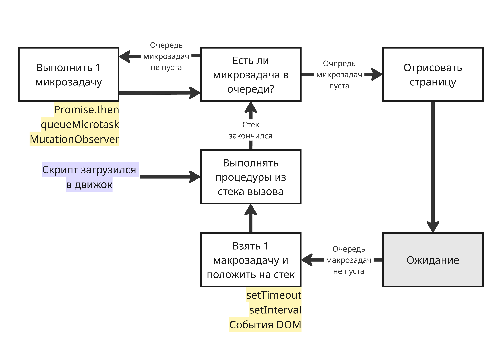

## Лекция 10. Асинхронность в JavaScript

События в JavaScript могут возникать не только по очереди, но и множество одновременно. Возможно и такое, что во время обработки одного события возникают другие

В каждом окне выполняется только один главный поток, который занимается выполнением скриптов JavaScript, отрисовкой и работой с DOM. Этот поток выполняет команды последовательно, может делать только одно дело одновременно и блокируется при выводе модальных окон, с помощью таких методов как `window.alert()`

Если главный поток прямо сейчас занят, то он не может срочно выйти из середины одной функции и прыгнуть в другую. Отладка при этом могла бы превратиться в кошмар, потому что пришлось бы разбираться с совместным состоянием нескольких функций сразу. Поэтому, когда происходит событие, оно попадает в очередь

Внутри браузера непрерывно работает внутренний событийный цикл (Event Loop), который следит за состоянием очереди и обрабатывает события, запускает соответствующие обработчики. В нем движок JavaScript ожидает задачи, исполняет их и снова ожидает появления новых

Иногда события добавляются в очередь сразу набором, например, при клике на элементе генерируется несколько событий - `mousedown` при нажатии и `mouseup` при отпуске кнопки

Но в тех случаях, когда событие инициируется не посетителем, а кодом, то оно, как правило, обрабатывается синхронно, то есть прямо сейчас. Например, когда посетитель фокусируется на элементе, возникает событие `onfocus`, например, при нажатии на поле ввода. Но ту же фокусировку можно вызвать и явно методом `elem.focus()`

Движок JavaScript большую часть времени ничего не делает и работает, только если требуется исполнить скрипт или обработать событие. Может так случиться, что задача поступает, когда движок занят чем-то другим, тогда она ставится в очередь. Очередь, которую формируют такие задачи, называют очередью макрозадач (Macrotask Queue)

При этом:

* Рендеринг страницы никогда не происходит во время выполнения задачи движком, то есть не имеет значения, сколь долго выполняется задача. Изменения в дереве DOM отрисовываются только после того, как задача выполнена
* Если задача выполняется очень долго, то браузер не может выполнять другие задачи, обрабатывать пользовательские события, поэтому спустя некоторое время браузер предлагает прервать долго выполняющуюся задачу. Такое возможно, когда в скрипте много сложных вычислений или ошибка, ведущая к бесконечному циклу

Допустим, у нас есть задача, требующая значительных ресурсов процессора. Пока движок JavaScript занят этой задачей, он не может делать ничего, связанного с DOM, не может обрабатывать пользовательские события и так далее. Можно избежать этого, разбив задачу на части

---

Помимо макрозадач существуют микрозадачи. Микрозадачи приходят только из кода и обычно они создаются объектами обещаний (или промисами, от promise). Сразу после каждой макрозадачи движок исполняет все задачи из очереди микрозадач перед тем, как выполнить следующую макрозадачу или отобразить изменения на странице

Объект обещания `Promise` в JavaScript - это объект, представляющий результат асинхронной операции, которая еще не завершилась. Они нужны для управления асинхронным кодом - вместо того чтобы ждать ответа (например, от сервера), программа продолжает работу, а объект `Promise` "обещает" вернуть результат позже:

```js
const fetchData = new Promise((resolve, reject) => {
  setTimeout(() => {
    const success = true;
    if (success) resolve("Данные получены ✅");
    else reject("Ошибка ❌");
  }, 1000);
});

fetchData
  .then(result => console.log(result))
  .catch(error => console.error(error))
  .finally(() => console.log('Конец'))
```

`Promise` принимает функцию от двух аргументов - других функций, которые вызываются в случае успеха или неудачи выполнения

Ключевые слова `async` и `await` являются синтаксическим сахаром над `Promise` и делают код более читаемым:

```js
async function loadData() {
  try {
    const result = await fetchData;
    console.log(result);
  } catch (error) {
    console.error(error);
  }
}
```

Слово `await` приостанавливает выполнение текущей функции до завершения выполнения `Promise`

У объекта `Promise` есть внутренние свойства:

* `state` - состояние. Состояние может быть `pending` (ожидание), `fulfilled` (удовлетворено) и `rejected` (отклонено)
* `result` - результат. Вначале `result` имеет значение `undefined`, далее он изменяется на `value` при вызове `resolve(value)` или на `error` при вызове `reject(error)`

Также у `Promise` есть продвинутые статические методы:

```js
// Ждёт завершения всех функций
Promise.all([fetch('/a'), fetch('/b')]).then(([a, b]) => ...)

// Возвращает первый завершившийся
Promise.race([slowRequest, timeout]).then(...)
```

Все микрозадачи завершаются до обработки каких-либо событий или рендеринга, или перехода к другой макрозадаче. Это важно, так как гарантирует, что общее окружение остаётся одним и тем же между микрозадачами - то есть, например, не изменены координаты мыши, не получены новые данные по сети и так далее

Если мы хотим запустить функцию асинхронно (после текущего кода), но до отображения изменений и до новых событий, то можно запланировать это через `queueMicrotask` и через `MutationObserver`



### Fetch API

Fetch API — это современный браузерный интерфейс для выполнения HTTP-запросов к серверу. Он пришёл на смену устаревшему объекту XMLHttpRequest и предоставляет более удобный синтаксис, основанный на `Promise`

`fetch()` возвращает `Promise`, который разрешается в объект `Response`:

```js
fetch(url, options)
  .then(response => response.json())
  .then(data => console.log(data))
  .catch(error => console.error('Ошибка:', error));
```

`fetch()` принимает адрес запроса `url` и опции `options` (метод, заголовки, тело и так далее)

* GET используется по умолчанию, если не указать метод явно, например:

    ```js
    fetch('https://api.example.com/users')
    .then(response => {
        if (!response.ok) {
        throw new Error('Ошибка: ' + response.status);
        }
        return response.json();
    })
    .then(users => console.log(users))
    .catch(err => console.error(err));
    ```

* POST-запрос:

    ```js
    fetch('https://api.example.com/users', {
        method: 'POST',
        headers: {
            'Content-Type': 'application/json',
        },
        body: JSON.stringify({
            name: 'Иван',
            age: 25
        })
    })
    .then(response => response.json())
    .then(data => console.log('Создан:', data));
    ```

После получения ответа нужно его распарсить с помощью нужного метода: 

| Метод | Описание |
|---|---|
| `response.json()` | Парсит тело как JSON → возвращает объект |
| `response.text()` | Возвращает тело как строку |
| `response.blob()` | Возвращает бинарные данные (файлы, изображения) |
| `response.formData()` | Парсит тело как FormData |
| `response.arrayBuffer()` | Возвращает сырые бинарные данные |

Иногда нужно отменить запрос, например при смене страницы. Тогда можно воспользоваться `AbortController`:

```js
const controller = new AbortController();

fetch('/api/data', { signal: controller.signal })
  .then(res => res.json())
  .then(data => console.log(data))
  .catch(err => {
    if (err.name === 'AbortError') {
      console.log('Запрос отменён');
    }
  });

// Отмена запроса через 3 секунды
setTimeout(() => controller.abort(), 3000);
```
