# <a name="web-%D1%80%D0%B0%D0%B7%D1%80%D0%B0%D0%B1%D0%BE%D1%82%D0%BA%D0%B0%3A-frontend"></a> Web-разработка: Frontend


* [Web-разработка: Frontend](#web-%D1%80%D0%B0%D0%B7%D1%80%D0%B0%D0%B1%D0%BE%D1%82%D0%BA%D0%B0%3A-frontend)
  * [Лекция 1. Как устроен Web?](#%D0%BB%D0%B5%D0%BA%D1%86%D0%B8%D1%8F-1.-%D0%BA%D0%B0%D0%BA-%D1%83%D1%81%D1%82%D1%80%D0%BE%D0%B5%D0%BD-web%3F)
  * [Лекция 2. HTML и CSS](#%D0%BB%D0%B5%D0%BA%D1%86%D0%B8%D1%8F-2.-html-%D0%B8-css)
    * [Язык верстки HTML](#%D1%8F%D0%B7%D1%8B%D0%BA-%D0%B2%D0%B5%D1%80%D1%81%D1%82%D0%BA%D0%B8-html)
    * [Таблицы стилей CSS](#%D1%82%D0%B0%D0%B1%D0%BB%D0%B8%D1%86%D1%8B-%D1%81%D1%82%D0%B8%D0%BB%D0%B5%D0%B9-css)
  * [Лекция 3. Блочная модель](#%D0%BB%D0%B5%D0%BA%D1%86%D0%B8%D1%8F-3.-%D0%B1%D0%BB%D0%BE%D1%87%D0%BD%D0%B0%D1%8F-%D0%BC%D0%BE%D0%B4%D0%B5%D0%BB%D1%8C)
  * [Лекция 4. Типы верстки](#%D0%BB%D0%B5%D0%BA%D1%86%D0%B8%D1%8F-4.-%D1%82%D0%B8%D0%BF%D1%8B-%D0%B2%D0%B5%D1%80%D1%81%D1%82%D0%BA%D0%B8)
    * [Единицы в CSS](#%D0%B5%D0%B4%D0%B8%D0%BD%D0%B8%D1%86%D1%8B-%D0%B2-css)
  * [Лекция 5. Продвинутый CSS](#%D0%BB%D0%B5%D0%BA%D1%86%D0%B8%D1%8F-5.-%D0%BF%D1%80%D0%BE%D0%B4%D0%B2%D0%B8%D0%BD%D1%83%D1%82%D1%8B%D0%B9-css)
    * [Каскадность и приоритет селекторов](#%D0%BA%D0%B0%D1%81%D0%BA%D0%B0%D0%B4%D0%BD%D0%BE%D1%81%D1%82%D1%8C-%D0%B8-%D0%BF%D1%80%D0%B8%D0%BE%D1%80%D0%B8%D1%82%D0%B5%D1%82-%D1%81%D0%B5%D0%BB%D0%B5%D0%BA%D1%82%D0%BE%D1%80%D0%BE%D0%B2)
    * [Методологии CSS](#%D0%BC%D0%B5%D1%82%D0%BE%D0%B4%D0%BE%D0%BB%D0%BE%D0%B3%D0%B8%D0%B8-css)
      * [БЭМ](#%D0%B1%D1%8D%D0%BC)
      * [SMACSS](#smacss)
      * [eCSS](#ecss)
  * [Лекция 6. Основы JavaScript](#%D0%BB%D0%B5%D0%BA%D1%86%D0%B8%D1%8F-6.-%D0%BE%D1%81%D0%BD%D0%BE%D0%B2%D1%8B-javascript)
* [X. Программа экзамена](#x.-%D0%BF%D1%80%D0%BE%D0%B3%D1%80%D0%B0%D0%BC%D0%BC%D0%B0-%D1%8D%D0%BA%D0%B7%D0%B0%D0%BC%D0%B5%D0%BD%D0%B0)


## <a name="%D0%BB%D0%B5%D0%BA%D1%86%D0%B8%D1%8F-1.-%D0%BA%D0%B0%D0%BA-%D1%83%D1%81%D1%82%D1%80%D0%BE%D0%B5%D0%BD-web%3F"></a> Лекция 1. Как устроен Web?

Всемирная паутина (World Wide Web, или же просто Web) - распределенная система компьютеров, предоставляющая доступ к связанным между собой документам

Сейчас же веб используется для просмотра веб-страниц с контентом, таким как текст, видео, музыка и другое, но что же происходит, когда мы вводим адрес веб-сайта в строке браузера?

Для этого браузер, специальная программа для доступа и обработки веб-страниц, отправляет запрос DNS-серверу

В сети Интернет для непосредственного доступа к другому компьютеру не используются URL-адреса (Uniform Resource Locator), которыми мы пользуемся и которые мы легко понимаем, например `itmo.ru`. Вместо них используются IP-адреса (например, `247.207.70.150`), которые присвоены каждому компьютеру в Интернете

Чтобы по URL-адресу получить IP-адрес, браузер делает запрос DNS-серверу, который возвращает IP-адрес сервера

> Подробнее про DNS - [https://pelmesh619.github.io/itmo_conspects/telecomm/telecomm_superconspect.html#-%D0%BB%D0%B5%D0%BA%D1%86%D0%B8%D1%8F-12-dns](https://pelmesh619.github.io/itmo_conspects/telecomm/telecomm_superconspect.html#-%D0%BB%D0%B5%D0%BA%D1%86%D0%B8%D1%8F-12-dns) 

Далее браузер делает запрос этому серверу на получение веб-страницы. Основным протоколом в обмене веб-страниц и совершении других запросов является HTTP, HyperText Transfer Protocol (Протокол передачи гипертекста). HTTP работает поверх протокола TCP. Сейчас использует более безопасная версия HTTPS (HTTP Secured). Для создания запроса браузер создает TCP-соединение между текущим компьютером и сервером. Для браузеры выбирается случайный TCP-порт больше 1024, а для сервера порт заранее известен: 80 для HTTP и 443 для HTTPS. Имя протокола указывается в начале полного адреса, например, `https://itmo.ru`

Веб-сервер, компьютер, принявший запрос, имеет специальное программное обеспечение, которое обрабатывает запрос. Основной функцией веб-сервера является хранение, обработка и передача веб-страниц. Имя страницы представляет собой путь после доменного имени и в простейшем случае может быть файлом на веб-сервере, например, `https://itmo.ru/promo/itmo-logo-dark.svg`

Если веб-страница по данному адресу существует, то сервер отправляет ее. Ответ содержит HTTP-код, например, 200, что означает успешный запрос. Если запрошенной страницы нет, то отправляется ответ с кодом 404 и страница-заглушка. Дополнительно, сервер может отправить код 304, что означает, что страница не изменилась, и браузер может загрузить ее из своего кеша

Далее TCP-соединение закрывается, и полученный контент обрабатывается. Сейчас все веб-страницы представляют из себя набор документов из HTML-файла, стилей и скриптов. Браузер обрабатывает HTML-код, обнаруживает дополнительные ресурсы, которые нужны для работы страницы, такие, как изображения, стили, скрипты и прочее, и загружает их, делая дополнительные запросы

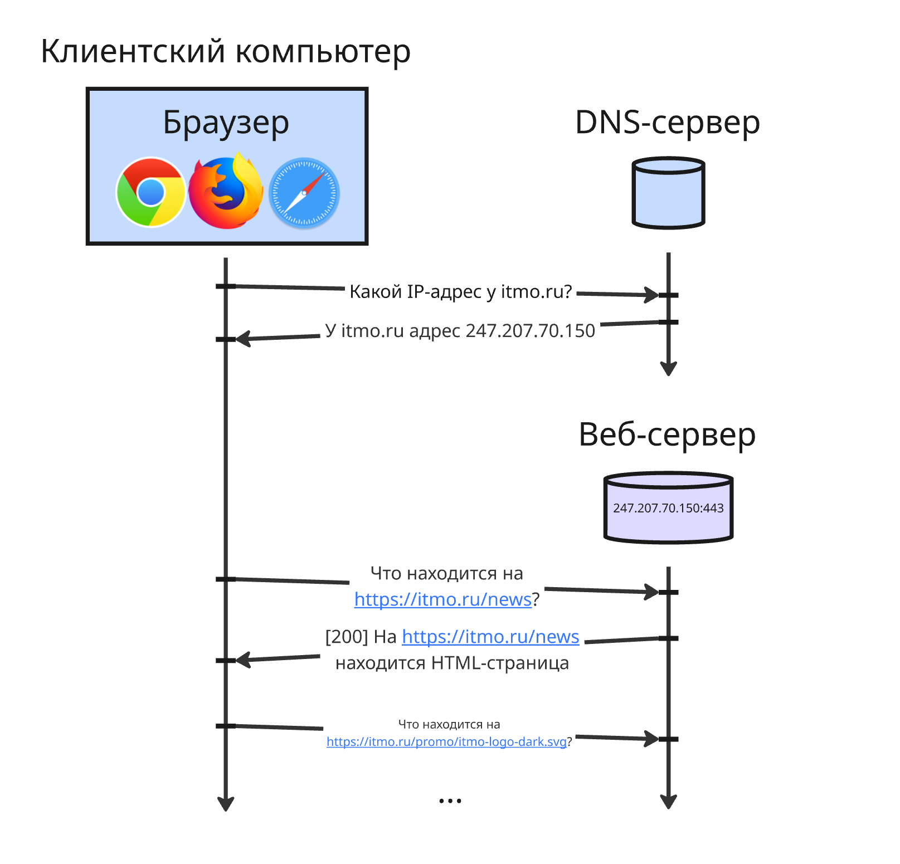

После этого браузер дополнительно анализируется HTML-код, содержащий в себе структуру страницы. HTML-код, состоящий из тегов, парсится, создается документно-объектная модель страницы

Далее обрабатываются стили, задающие обертку блоков, форматирование текста и другую стилизацию страницы, после чего страница рендерится в окне браузера. Затем запускаются скрипты, написанные на языке JavaScript, которые делают страницу интерактивной 

---

Основная задача фронтенд-разработчика - создать надежный, быстрый и удобный мост между бэкендом и пользователем, реализовав весь сложный интерфейс, который работает на стороне клиента, несмотря на то, какое устройство имеет пользователь, телефон с маленьким экраном и широкий дисплей

## <a name="%D0%BB%D0%B5%D0%BA%D1%86%D0%B8%D1%8F-2.-html-%D0%B8-css"></a> Лекция 2. HTML и CSS

### <a name="%D1%8F%D0%B7%D1%8B%D0%BA-%D0%B2%D0%B5%D1%80%D1%81%D1%82%D0%BA%D0%B8-html"></a> Язык верстки HTML

Структура веб-страницы создается с помощью языка верстки HTML (HyperText Markup Language, язык гипертекстовой разметки). В основе этого языка лежат теги в формате `<tag></tag>` или `<tag>`, которые указывают семантику содержимого внутри себя контента и содержат дополнительные атрибуты `<tag key="value">`

Каждый HTML-документ начинается с определения его типа, чтобы браузер мог понимать, как его обрабатывать:

```html
<!DOCTYPE html>
```

В старой версии HTML до его общего принятия тип документа определялся так:

```html
<!DOCTYPE HTML PUBLIC "-//W3C//DTD HTML 4.01//EN"
    "http://www.w3.org/TR/html4/strict.dtd">
```

Далее идет тег `<html></html>`. В нем указываются теги `<head></head>` и `<body></body>`. Тег `head` содержит служебную информацию о странице, такую как:

* ссылки на сторонние файлы, которые нужно загрузить до обработки контента c помощью тега `<link>`, например, CSS-файлы со стилями или скрипты на JavaScript
* ключевые слова страницы для упрощенного поиска в поисковых движках
* язык и кодировка контента на странице
* заголовок страницы, который отображается вверху в браузере и определяется тегом `<title></title>`

```html
<!DOCTYPE html>

<html>

<head>
    <!-- Заголовок -->
    <title>Web программирование</title>

    <!-- Подключение стилей -->
    <link href="styles.css" rel="stylesheet">
    <!--        ^ ссылка         ^ типа файла (то есть таблица стилей) -->

    <meta charset="utf-8">
    <!--           ^ кодировка -->

    <meta name="keywords" content="web, веб, программирование">
    <!--                           ^ ключевые слова -->
    
    <meta name="description" content="краткое описание"> 
    <!--                              ^ описание -->
</head>

<body>
</body>

</html>
```

В общем случае теги в `head` не отображаются непосредственно на странице, но влияют на ее обработку в браузере и поиск в поисковых движках

Далее идет тег `<body></body>`. Он представляет тело страницы и обычно имеет такую структуру:

```html
<body>
    <header></header>
    <main></main>
    <footer></footer>
</body>
```

Тег `main` выделяет основное содержание страницы. На странице должен быть только один видимый `main`. Дополнительные блоки `main` возможны только если они скрыты (например, с помощью атрибута `hidden`) или не участвуют в рендеринге

Тег `main` окружается тегами `header` и `footer`. Первый предназначенный для вводной части страницы (так называемой шапки), где представлены логотип компании и главные ссылки на другие страницы ("Каталог", "О нас" и прочее)

Тег `footer` предназначен для заключительной части (так называемого подвала), где представлены дополнительные ссылки (например, на юридические документы) и контактная информация

Примерная HTML-страница выглядит так:


```html
<!DOCTYPE html>

<html>

<head>
    <title>Рога и копыта</title>
</head>

<body>
    <header>Компания "Рога и копыта"</header>
    <main></main>
    <footer>+7 (777) 77-77-77</footer>
</body>

</html>
```

Помимо них также существуют эти теги, обозначающие другие блоки страницы:

* `<section></section>` - секция текста, то есть крупный фрагмент текста, схожий по смыслу, например, главы одной книги или "Каталог". Если текст можно осмысленно назвать одним словосочетанием, которое не определяет его положение на странице или не является перечислением, то ему явно подходит тег `section`
* `<nav></nav>` (от navigation) - навигация страницы, то есть группа ссылок на другие страницы или на раздел в текущей
* `<article></article>` - статья, цельный и законченный фрагмент текста. В отличие от секции содержимое внутри `article` можно скопировать из этой страницы и вставить в другое место без потери смысла и контекста
* Теги `<h1></h1>`, `<h2></h2>`, `<h3></h3>`, `<h4></h4>`, `<h5></h5>` и `<h6></h6>` обозначают заголовки (от heading) разных уровней. Заголовок первого уровня самый важный, и лучше всего, чтобы он был один на странице (обычно в шапке), тогда как шестого - очень не важный. На практике используются только `h1`, `h2` и `h3`
* `<p></p>` обозначает параграф (от paragraph) или абзац. По умолчанию параграфы отделяются отступами сверху и снизу от другого контента. Текст может существовать и снаружи тегов `p`, но он позволяет явно выделять параграфы
* `<ul></ul>` обозначает неупорядоченный список (от unordered list), а `<ol></ol>` обозначает упорядоченный список (от ordered list). Внутри них элементы списка находятся в теге `<li></li>` (от list item) 

    Тег `ol` может иметь дополнительные атрибуты: `reversed` для смены направления нумерации, `start="67"` для установки стартового числа и `type="1"` для указания типа нумерации (`1` для чисел, `a` и `A` для латинских букв, `i` и `I` для римских чисел)

    Также списки можно вкладывать внутри других списков

* Другой список `<dl></dl>` (от description list) позволяет перечислять термины в тегах `<dt></dt>` (от description term) и их определения в `<dd></dd>` (от description definition). Обычно определения переносятся на новую строку, и браузер добавляет к ним отступ слева

* `<pre></pre>` обозначает предварительно отформатированный текст (preformatted text). На странице он отображается моноширинным шрифтом и с сохранением пробелов и переносов, что чаще всего используется для вставок с кодом

* `<code></code>` обозначает вставку с кодом. На странице он отображается моноширинным шрифтом, но в отличии от `pre` в теге `code` пробелы схлопываются, а переносы игнорируются, поэтому теги используют вместе: `<pre><code></code></pre>`

    Чтобы экранировать знаки меньше и больше во вставке с кодом, используются мнемоники - наборы символов, позволяющие в браузере отображать специальные символы, использующиеся в HTML. Так "&lt;" - это `&lt;`, "&gt;" - это `&gt;`, "&amp;" - это `&amp;`, "&euro;" - это `&euro;`, "&copy;" - это `&copy;` и так далее

* В тег `<q></q>` (от quote) вкладывается цитата из стороннего источника. В атрибут `cite` указывается адрес цитаты: `<q cite="https://ru.wikiquote.org/wiki/%D0%A3%D0%B8%D0%BD%D1%81%D1%82%D0%BE%D0%BD_%D0%A7%D0%B5%D1%80%D1%87%D0%B8%D0%BB%D0%BB%D1%8C">Сильный, молчаливый мужчина слишком часто лишь потому молчалив, что ему нечего сказать.</q>`. Дополнительно в теге `<cite>` указывается автор: `<cite>Уинстон Черчилль</cite>`

* В тег `<blockquote></blockquote>` тоже указывается цитата, но вместо текста как в теге `q` она представляет из себя отдельный блок

* Тег `<br>` (от line BReak) обозначает перенос строки. По умолчанию новая строка в HTML-файле не рендерится в браузере, поэтому переносы создаются либо тегом `<br>`, либо тегами, которые автоматически переносят последующий контент на новую строку

    Однако для разделения тексты на абзацы лучше использовать не его, а отдельные теги `<p>`

* Теги `<sub></sub>` и `<sup></sup>` создают нижние и верхние индексы соответственно, например, в формулах: `H<sub>2</sub>O` - H<sub>2</sub>O

* Тег `<time></time>` содержит в себе текст, означающий дату и время, но его атрибутом могут быть указаны дата и время в формате ISO 8601 для машинной обработки: `<time datetime="2020-11-15T09:54">09:54 утра</time>`

* Теги форматирования текста:

    * Курсив задается тегами `<i></i>` (от italic) и `<em></em>` (от emphasis), тег `em` используется для логического акцента, а `i` для визуального выделения без смыслового акцента (например, термины)
    * Жирное написание задается тегами `<b></b>` (от bold) и `<strong></strong>`, тегом `strong` выделяется семантически супер важный и серьезный текст
    * Зачеркнутый текст задается тегом `<del></del>` (от delete), используется для удаленного текста
    * Подчеркнутый текст задается тегами `<ins></ins>` (от insert) и `<u></u>` (от underline), `ins` используется преимущественно для выделения добавленного текста

Наконец, если подходящего тега с нужной семантикой нет, то используют два общих тега: `<div></div>` и `<span></span>`

Тег `div` используется для блока, а `span` - для текстовой фразы или ее фрагмента. Теги `div` и `span` используется только в тех случаях, в который не нашлось других тегов с подходящей семантикой и смыслом

### <a name="%D1%82%D0%B0%D0%B1%D0%BB%D0%B8%D1%86%D1%8B-%D1%81%D1%82%D0%B8%D0%BB%D0%B5%D0%B9-css"></a> Таблицы стилей CSS

Чтобы придать стиля веб-странице, используют таблицы стилей, написанные на языке CSS (Cascading Style Sheets, каскадные таблицы стилей). Обычно они пишутся в отдельном файле, подключаемом с помощью тега `<link>`, но также и могут находиться в исходной HTML-странице в теге `<style></style>`

Правила стилей состоят из селектора, который определяет теги, к которым применяются стили, и блок объявлений, состоящих из свойства и значения:

```css
селектор {
    свойство1: значение1;
    свойство2: значение2;
    свойство3: значение3;
    /* ... */
}
```

Так селектором могут быть:

* `*`, указывающий на все элементы
* название тега, указывающее на все элементы такого типа, например, `p`, `div`, `h1`
* идентификатор, указывающий на один уникальный элемент страницы и определяющийся атрибутом тега, например `<p id="my-paragraph"></p>`, в таком случае селектор указывается `#my-paragraph`
* имя класса, указывающего на набор элементов и определяющегося атрибутом тега, например `<p class="my-sections"></p>`, в таком случае селектор указывается `.my-sections`

Далее к ним применяются могут применяться особые условия:

* указатель на элементы, расположенные относительно другого селектора, например:
    * `div:first-child` - первый ребенок внутри `div`
    * `div:last-child` - последний ребенок внутри `div`
    * `div:nth-child(i)` - `i`-ый ребенок внутри `div`
* псевдо-классы, указывающие на элементы со специальным состоянием, например, `p:hover` указывает на параграф, на который наведен курсор
* псевдо-элементы, указывающие на части контента внутри элемента, например, правила с `p::first-letter` применяются на первую букву параграфа
* комбинации селекторов:

    * `div, p` - все параграфы `p` и все блоки `div`
    * `div p` - все параграфы `p` внутри блока `div`
    * `div > p` - все параграфы `p`, которые являются непосредственными детьми блока `div`
    * `div + p` - параграф `p`, которые стоит непосредственно после блока `div`
    * `div ~ p` - все параграфы `p`, которые стоят после блока `div`
* элемент, атрибут которого равен указанному значению, например, `div[foo="bar"]` - блоки `div` с атрибутом `foo="bar"`

CSS-стили могут выглядеть так:

```css
/* для всех элементов цвет текста оранжевый */
* {              
    color: orange;
}

/* для всех блоков div фоновый цвет серый */
div {
    background-color: gray;
}

/* 
    для параграфов с классами `mytext` и `quote` 
    цвет текста красный 
*/
p.mytext.quote {
    color: red;
}

/* 
    для элементов с идентификатором example 
    цвет текста зеленый 
*/
#example {
    color: green;
}
```

Приоритет правил определяется специфичностью селектора, а при равной специфичности - последним объявлением в коде.

Свойств и значений для них в CSS есть огромное множество. Хорошей практикой является использование классов для применения стилей к элементам, а не идентификаторов

По умолчанию, каждый браузер применяет свои собственные стили для элементов (например, использует свой шрифт), поэтому контент может по-разному отображаться в разных браузерах. В таком случае имеет смысл применять сброс CSS - специальный набор правил, которые упраздняют их. Один из самых популярных от [Эрика Мейера](https://meyerweb.com/eric/tools/css/reset/) выглядит так:

```css
html, body, div, span, applet, object, iframe,
h1, h2, h3, h4, h5, h6, p, blockquote, pre,
a, abbr, acronym, address, big, cite, code,
del, dfn, em, img, ins, kbd, q, s, samp,
small, strike, strong, sub, sup, tt, var,
b, u, i, center,
dl, dt, dd, ol, ul, li,
fieldset, form, label, legend,
table, caption, tbody, tfoot, thead, tr, th, td,
article, aside, canvas, details, embed, 
figure, figcaption, footer, header, hgroup, 
menu, nav, output, ruby, section, summary,
time, mark, audio, video {
	margin: 0;
	padding: 0;
	border: 0;
	font-size: 100%;
	font: inherit;
	vertical-align: baseline;
}
/* HTML5 display-role reset for older browsers */
article, aside, details, figcaption, figure, 
footer, header, hgroup, menu, nav, section {
	display: block;
}
body {
	line-height: 1;
}
ol, ul {
	list-style: none;
}
blockquote, q {
	quotes: none;
}
blockquote:before, blockquote:after,
q:before, q:after {
	content: '';
	content: none;
}
table {
	border-collapse: collapse;
	border-spacing: 0;
}
```

Также используется сброс стилей [normilize.css](https://necolas.github.io/normalize.css/)

## <a name="%D0%BB%D0%B5%D0%BA%D1%86%D0%B8%D1%8F-3.-%D0%B1%D0%BB%D0%BE%D1%87%D0%BD%D0%B0%D1%8F-%D0%BC%D0%BE%D0%B4%D0%B5%D0%BB%D1%8C"></a> Лекция 3. Блочная модель

Каждому HTML-элементу соответствует прямоугольная область, или бокс. Боксы бывают _блочными_ и _строчными_

Блочные бокс представляется собой крупную неразрывную область. Блочными боксами обладают теги `<p>`, `<h1>`, `<h2>`, `<ul>` и так далее. В частности, тег `<div>`, благодаря которому можно создать сетку элементов, обозначает простой прямоугольный контейнер и обладает блочным боксом

Блочные боксы:

* Занимают все доступное пространство по горизонтали
* Имеют задаваемые ширину, высоту, внутренние отступы (padding) и внешние отступы (margin)

    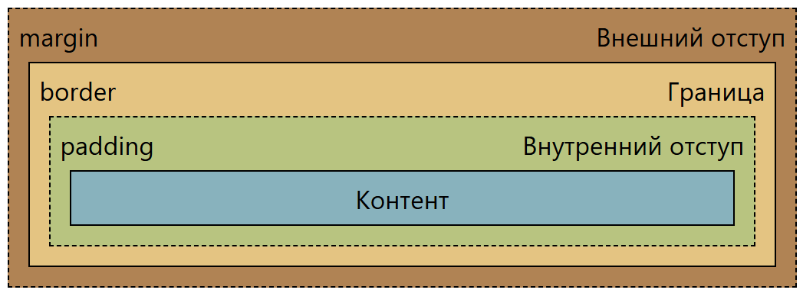

* До и после блочного бокса существует перенос строки

Строчные боксы располагаются друг за другом в одной строке, могут разрываться и находиться на нескольких строках. Строчными боксами обладают такие элементы, как `<span>`, `<a>`, `<i>`, `<em>`, `<b>`, `<strong>`, и предназначены для оформления текста

Строчные боксы не имеют переносов до и после бокса, а также для строчных боксов можно задавать только горизонтальные отступы

При рендере HTML-страницы создает поток элементов - порядок их отображения на странице. Блочные элементы располагаются в поток сверху вниз, а строчные - слева направо. Элемент считается выпавшим из потока, если он не влияет на расположение последующих блоков

---

По умолчанию, блочные боксы имеют ширину родительского блока, а высота зависит от содержимого (если бокс пустой, то `0px`). Ширина и высота боксов задаются с помощью свойств `width` и `height`, например:

```css
selector {
    width: 100px;
    height: 100px;
}
```

Чтобы вернуть значения по умолчанию, можно воспользоваться значением `auto`:

```css
selector {
    width: auto;
    height: auto;
}
```

Строчные боксы имеют ширину и высоту ровно столько, сколько занимает контент внутри, и не реагируют на свойства `width` и `height`

Внутренние отступы (или поля) задаются свойством `padding`:

```css
selector {
    padding: 10px; /* отступ 10 пикселей со всех сторон */
}
```

Есть 4 формы записи:

* `padding: 10px;` - 10 пикселей со всех сторон
* `padding: 10px 50px;` - 10 пикселей сверху и снизу, 50 пикселей слева и справа
* `padding: 10px 50px 30px;` - 10 пикселей сверху, 30 пикселей слева и справа, 30 пикселей снизу
* `padding: 10px 50px 30px 80px;` - 10 пикселей сверху, 50 пикселей справа, 30 пикселей снизу, 80 пикселей слева

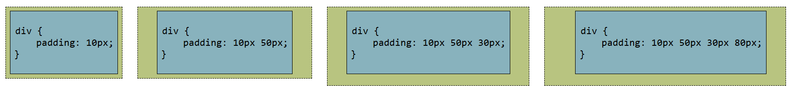

Можно задать отступ для каждой стороны:

```css
selector {
    padding-left: 10px;   /* слева  */
    padding-right: 10px;  /* справа */
    padding-top: 10px;    /* сверху */
    padding-bottom: 10px; /* снизу  */
}
```

Аналогично задаются внешние отступы от границы с помощью свойств `margin`, `margin-top`, `margin-bottom`, `margin-left`, `margin-right`

Также для боксов можно указать границу (или рамку), а именно:

* её стиль с помощью `border-style`, существуют сплошная `solid`, пунктирная `dashed`, точками `dotted`, двойная `double`
* её ширину с помощью `border-width`
* её цвет с помощью `border-color`

У этих свойств также есть конкретные для каждой стороны, например `border-left-width`. С помощью свойства `border` можно указать сокращенную запись этих параметров в любой порядке:

```css
selector {
    border: 20px solid red;
    border-left: 20px dashed green;
    border-bottom: 10px solid blue;
}
```

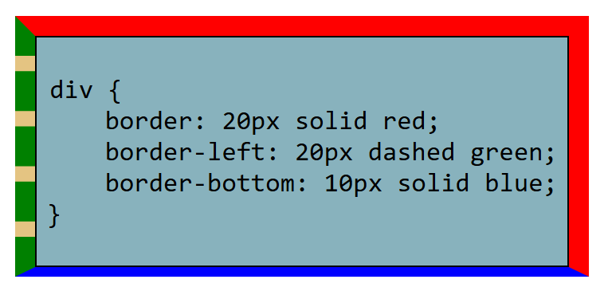

Также углы рамок можно скруглять под определенным радиусом с помощью свойств `border-radius`, `border-top-radius`, `border-left-radius`, `border-right-radius`, `border-bottom-radius`

Занимаемое место бокса на странице вычисляется как сумма 

* ширины/высоты, которые занимает контент или которые установлены в свойствах
* внутренние отступы
* толщина границ
* внешние отступы

Вертикальные отступы двух соседних элементов имеют свойство [схлопываться](https://developer.mozilla.org/ru/docs/Web/CSS/CSS_box_model/Mastering_margin_collapsing), тогда интервал между ними становится равным максимуму отступов этих элементов

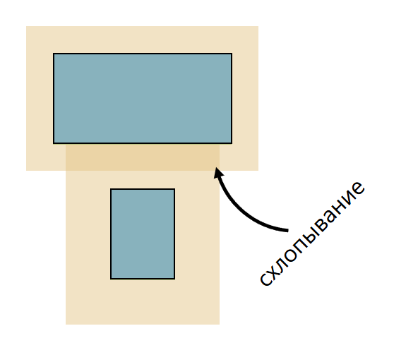

Также внешние отступы схлопываются, если у родительского элемента есть внешний отступ, нет внутреннего, а у первого (или последнего) элемента есть внешний отступ, тогда этот отступ будет выпадать за пределы родительского элемента. Фиксится такой прикол при помощи внутреннего отступа у родителя с нужной стороны

---

Теперь можно научиться базовому приему центрирования элемента:

1. Делаем ширину дочернего элемента меньше ширины родителя
2. Делаем внешние отступы слева и справа `auto`

Получаем:

```css
div {
    width: 70%;
    margin: 0 auto;
}
```

Ширину для элемента можно указать в процентах от ширины родительского элемента. Нужно быть аккуратным, так как если родительский элемент имеет внутренний отступ слева и справа, то `width: 100%` может привести к выпаданию элемента за пределы

Кроме `auto` такое исправить можно с помощью изменения свойства `box-sizing`. По умолчанию, оно равно `content-box`, что определяет ширину и высоту для области с контентом. Значение `border-box` установит, что ширина и высота задана для области контента, внутренних отступов и границ

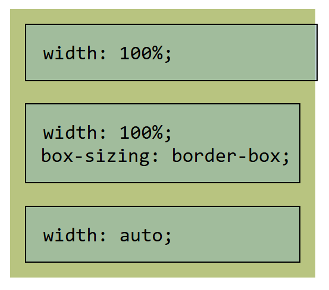

---

Тип бокса можно изменить с помощью свойства `display`

* `display: block;` установит блочный тип бокса
* `display: inline;` установит строчный тип бокса
* `display: inline-block;` установит блочно-строчный тип бокса

    Блочно-строчному типу бокса можно задавать размеры и отступы, их ширина зависит от содержания, но такой тип не порождает переносы строки до и после себя

* `display: none;` сделает так, что элемент перестанет рендериться и не повлияет на расположение других (в отличии от `visibility: hidden`, при котором элемент не выпадает из потока)
* `display: table;` задает табличный бокс - он похож на блочный, только ширина зависит от контента внутри

Позиционирование элемента также можно изменить. Тип позиционирования можно выбрать с помощью свойства `position`:

* `position: static;` задает статичное позиционирование и стоит по умолчанию, при нем свойства `top`, `left`, `right`, `bottom` не оказывают эффект
* `position: relative` задает позиционирование относительно исходного положения блока
* `position: absolute` задает позиционирование абсолютное, при этом блок выходит из потока, тем самым не влияя на расположение других, а свойства `top`, `left`, `right`, `bottom` указывают положение относительно ближайшего предка, имеющего `position != static`
* `position: fixed` задает положение относительно окна браузера, при этом блок выходит из потока
* `position: sticky` не меняет исходного положения, но при прокрутке вместо того, чтобы выйти за границы окна браузера, элемент остается на указанное расстоянии

Позиционирование задается с помощью свойств `top`, `left`, `right`, `bottom`. Например, `top: 10px; position: relative;` сделает элемент на 10 пискелей ниже исходного положения, а `right: 20px; position: relative;` сделает его на 20 пикселей правее от исходного положения. Также можно применять отрицательные значения

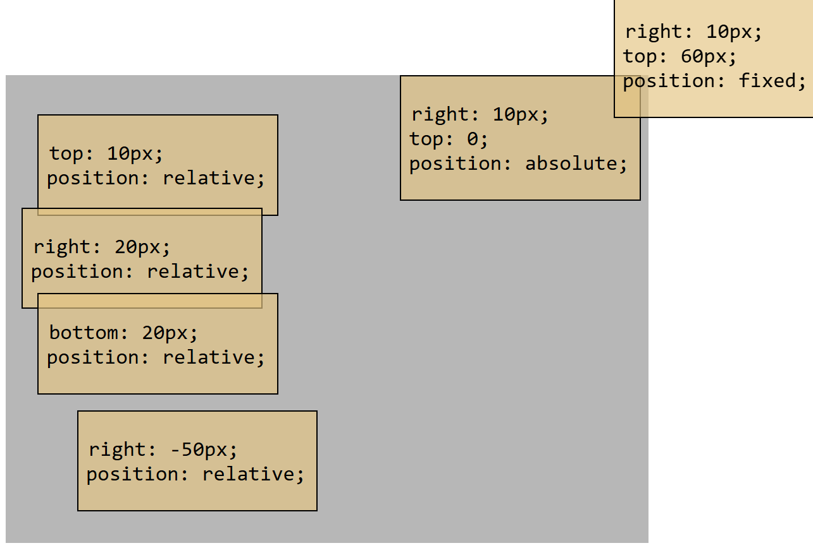

Как можно заметить в примере, элементы перекрывают друг друга. Чтобы изменить порядок перекрытия, нужно указать свойства `z-index` для элемента. Чем больше число `z-index`, тем выше приоритет того, что элемент окажется выше других

Также элементу можно включить обтекание с помощью свойства `float`:

* `float: left;` прижимает элемент к левому краю родителя, другие строчные элементы обтекают его справа
* `float: right;` - то же самое, но с правой стороны
* `float: none;` - отключает обтекание, по умолчанию

Если `float` указан у строчного, то его поведение проявляется как у блочного. Блоки с `float` выпадают их потока. Если у нескольких обтекаемых элементов нет места, то они переносятся на следующих строчки - таким образом создавались сетки элементов в 2000-ых до появления `display: flex` и `display: grid`. Сейчас для сеток лучше использовать `flex` или `grid`, так как поведение переноса обтекаемых элементов может быть неочевидным

Свойство `clear: left` запрещает обтекание слева, `clear: right` - справа, `clear: both` - с обеих сторон

Помимо `display: block` и `display: inline` для выравнивания можно использовать `display: flex`. Значение `flex` превращает блоки во флекс-контейнеры, внутри которых можно менять направление потока элементов

Внутри флекс-контейнера существует главная ось, вдоль которой следует поток, и которая задается с помощью свойства `flex-direction`:

* `flex-direction: row` задает главную ось слева направо, что используется по умолчанию
* `flex-direction: row-reverse` задает главную ось справа налево
* `flex-direction: column` задает главную ось сверху вниз
* `flex-direction: column-reverse` задает главную ось снизу вверх

С помощью свойства `justify-content` можно выравнять элементы относительно главной оси:

* `justify-content: flex-start` располагает все элементы в начале оси
* `justify-content: flex-end` располагает все элементы в конце оси
* `justify-content: center` располагает все элементы в центре оси
* `justify-content: space-between` располагает все элементы равномерно, оставляя между ними равные промежутки
* `justify-content: space-around` располагает все элементы равномерно, оставляя между ними равные промежутки, но до первого и после последнего выделяется половина пространства от того, что уходит между элементами
* `justify-content: space-evenly` располагает равные промежутки между элементами, до первого элемента и после последнего

Поперечная ось расположена перпендикулярно и направлена вниз или направо в зависимости от направления главной. Вдоль поперечной оси работает выравнивание элементов с помощью свойства `align-items`:

* `align-items: flex-start` располагает все элементы в начале оси
* `align-items: flex-end` располагает все элементы в конце оси
* `align-items: center` располагает все элементы в центре оси
* `align-items: stretch` растягивает все элементы так, что бы вдоль поперечной оси не было пустого пространства
* `align-items: baseline` располагает все элементы так, что базовая линия текста элементов одинакова

Если нужно другое выравнивание по поперечной оси для отдельного элемента, для него применяют свойство `align-self` с теми же значениями, что и `align-items`

## <a name="%D0%BB%D0%B5%D0%BA%D1%86%D0%B8%D1%8F-4.-%D1%82%D0%B8%D0%BF%D1%8B-%D0%B2%D0%B5%D1%80%D1%81%D1%82%D0%BA%D0%B8"></a> Лекция 4. Типы верстки

Верстка сайта - этап разработки, когда макет дизайна, на котором указаны расположения элементов на странице, становится функциональным, то есть превращается в HTML-структуру

Верстка включает также в себя подготовку изображений и прочей графики, подключение шрифтов, подключение JavaScript-библиотек, создание динамического поведения элементов и тестирования страницы на различных устройствах

Рассмотрим виды верстки:

* Фреймовая верстка

    Фрейм - специальный блок, который позволял рендерить в нем отдельный HTML-документ. С помощью них до версии HTML 5 создавались независимые секции из повторно используемых компонентов

    ```html
    <!DOCTYPE HTML PUBLIC "-//W3C//DTD HTML 4.01 Frameset//EN">
    <html>
    <head><title>Website with Frames</title></head>

    <body>
    <frameset cols="25%,75%">
        <frame src="navigation.html" name="nav">
        <frame src="content.html" name="main">
    </frameset>
    <body>

    </html>
    ```

    Проблем с ними было много:

    * Поисковые оптимизации плохо работали, так как весь контент скрыт за тегом `<frame src="content.html" name="main">`
    * Проблема с печатью страницы
    * Читатели экранов для слабо видящих с трудностями обрабатывали такие страницы
    * Такие страницы были не дружелюбны к мобильным телефонам

* Табличная верстка

    Табличная верстка заключалась в том, что бы использовать невидимые таблицы для размещения контента. Такая таблица фактически представляла собой модульную сетку, в которой размещались отдельные элементы веб-страницы

    Достоинства:

    * Содержимое ячеек можно одновременно выравнивать по горизонтали и по вертикали
    * Браузеры по-разному интерпретируют некоторые параметры CSS, а таблицы везде выглядели одинаково

    Недостатки:

    * Громоздкий код из вложенных структур
    * Нет разделения содержимого и оформления. В идеале HTML-код должен содержать только теги с классами, которые используются для оформления. Табличная верстка из-за обилия тегов такое не позволяет
    * Спецификация утверждает, что таблицы созданы в первую очередь для размещения табличных данных

* Блочная верстка

    В блочной верстки страница делится на блоки, которые содержат в себе контент. Они вкладываются друг в друга, таким образом уменьшается нагромождение кода, структура понятна, а править верстку легко

    Сейчас преимущественно применяется блочная верстка

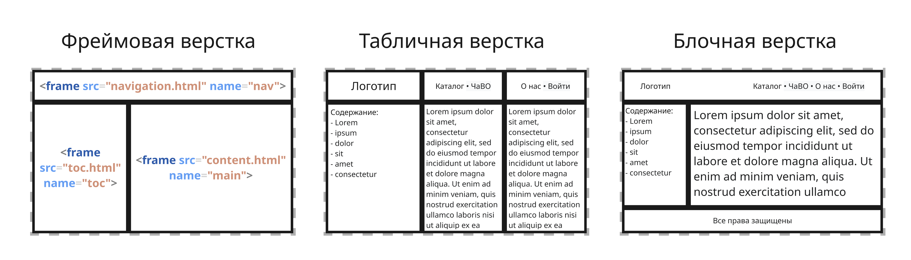

Далее верстка делится по степени адаптивности:

* Статическая или фиксированная верстка (Static)

    Ширина элементов задается жестко в пикселях, из-за чего сайт выглядит одинаково на любом мониторе. Если контент не влезает по горизонтали, то появляется полоса прокрутки

    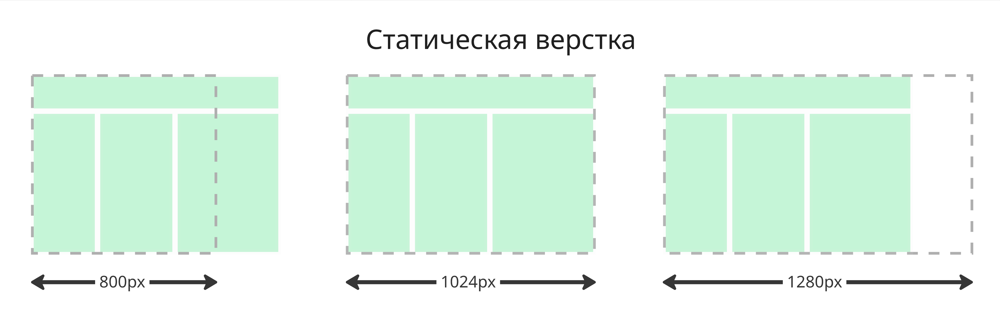

* Резиновая (Liquid или Fluid)

    Размеры элементов указываются в процентах от ширины родительского контейнера, поэтому контент растягивается или сжимается вместе с окном браузера, заполняя всё доступное пространство. Однако, если окно браузера слишком маленькое, контент ужимается в узкие полосы

    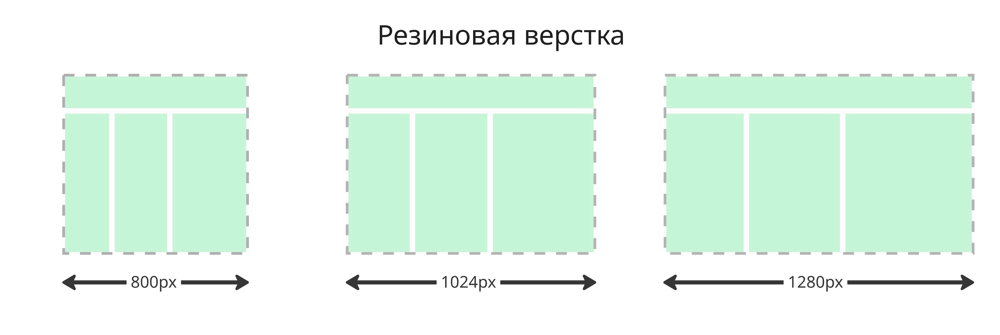

* Гибкая или адаптивная (Adaptive)

    В адаптивной верстке используются медиа-запросы (через `@media`), что позволяет для разных устройств (смартфон, планшет, компьютера) создавать отдельные фиксированные макеты. При достижении определенной ширины дизайн переключается "скачком"

    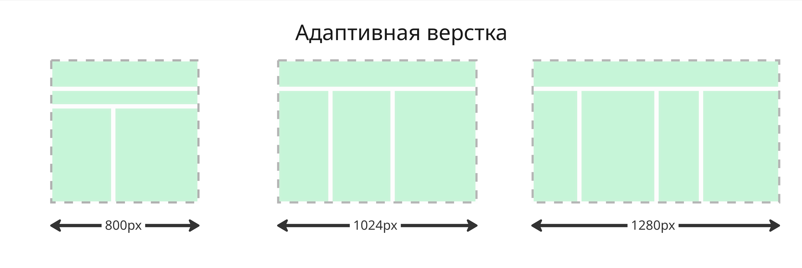

* Отзывчивая (Responsive)

    Отзывчивая верстка - это комбинация резиновой и адаптивной верстки. В ней сайт плавно меняет размеры элементов, а в ключевых точках меняет структуру макета, например, выстраивая блоки из нескольких колонок в одну

Верстка считается правильной, если соответствует нескольким критериям:

* Кроссбраузерность - способность отображаться во всех популярных браузерах: Google Chrome, Mozilla Firefox, Opera, Safari и так далее
* Адаптивность - способность отображаться на всех устройствах
* Качество кода - специальные HTML-валидаторы могут провести проверку на наличие синтаксических ошибок, соответствие стандарту и на посторонние элементы

Хорошими практиками являются:

* Гибкие изображения, меняющиеся под разрешение окна
* Настраиваемая структура макета страницы
* Принцип "Mobile First" - сначала сайт верстается для мобильных устройств, а потом с помощью медиа-запросов макет масштабируется для больших экранов

---

CSS-фреймворки могут помочь достичь хорошой верстки. Они содержат готовый набор стилей, компонентов и утилит. Разберем популярные:

1. Bootstrap - классический CSS-фреймворк с готовыми компонентами. В нем есть сетка на флекс-блоках, готовые компоненты и JavaScript-плагины

    Лучше всего использовать для админ-панели, минимально жизнеспособного продукта или учебных проектов

2. Tailwind CSS. В нем почти нет готовых компонентов, и всё собирается из классов, поэтому тут полный контроль над дизайном, минимальный итоговый CSS, но HTML перегружен классами

    Лучше использовать для одностраничных приложений, современных фронтенд-проектов и для кастомного дизайна

3. Framework7 - фреймворк для мобильных и прогрессивных веб-приложений. Создает стили iOS- или Android-приложений, имеет мобильные компоненты, работает с Vue, React, Svelte

4. Material Design - дизайн-система от Google, имеющая строгие правила дизайна, тени, уровни, анимации и консистентный опыт пользователя

    Лучше использовать для Android-ориентированных продуктов и больших приложений

### <a name="%D0%B5%D0%B4%D0%B8%D0%BD%D0%B8%D1%86%D1%8B-%D0%B2-css"></a> Единицы в CSS

В CSS для указания длины есть разные единицы

Самая базовая из них - это пиксели `px`. Пиксели - абсолютная величина, браузер переводит все остальные единицы в пиксели, поэтому пиксели являются понятной величиной, однако с помощью пикселей трудно создать адаптивную веб-страницу

Другая величина `em` обозначает высоту текущего шрифта и определяются по текущему контексту. Например, в таком примере:

```html
<div style="font-size:2em">
  Арбуз
  <div style="font-size:2em">Абрикос</div>
</div>
```

второе слово будет иметь шрифт высотой в два раза больше, чем первое

Проценты `%` - еще одна относительная единица. `1%` - это одна сотая от ширины/высоты родительского элемента. Для свойства `line-height`, определяющего высоту пространства, занимаемого текстом, `1%` - это одна сотая от размера шрифта. Однако, если `position: fixed`, то `1%` - это одна сотая от ширины/высоты окна браузера

Другая величина `rem` (от root-em) задается как размер шрифта элемента `html` и не определяется другими родительскими тегами, поэтому ее пользоваться удобнее, чем другими

Наконец, есть величины `vw` и `vh`, которые зависят от ширины и высоты окна браузера соответственно. `1vw` - это одна сотая от ширина окна и аналогично для `vh`. Таким образом, стало проще создавать верстку для мобильных устройств

## <a name="%D0%BB%D0%B5%D0%BA%D1%86%D0%B8%D1%8F-5.-%D0%BF%D1%80%D0%BE%D0%B4%D0%B2%D0%B8%D0%BD%D1%83%D1%82%D1%8B%D0%B9-css"></a> Лекция 5. Продвинутый CSS

### <a name="%D0%BA%D0%B0%D1%81%D0%BA%D0%B0%D0%B4%D0%BD%D0%BE%D1%81%D1%82%D1%8C-%D0%B8-%D0%BF%D1%80%D0%B8%D0%BE%D1%80%D0%B8%D1%82%D0%B5%D1%82-%D1%81%D0%B5%D0%BB%D0%B5%D0%BA%D1%82%D0%BE%D1%80%D0%BE%D0%B2"></a> Каскадность и приоритет селекторов

В CSS свойства для одного элемента могут накладываться друг на друга. Допустим, что есть такой элемент:

```html
<p class="bold dark">
Lorem ipsum dolor sit amet, consectetur adipiscing elit, sed do eiusmod tempor incididunt ut labore et dolore magna aliqua.
</p>
```

с такими стилями:

```css
p {
    font-size: 20px;
}

.bold {
    font-weight: bold;
}

.dark {
    color: #666666;
}
```

<style>
p.example-rule-cascade {
    font-size: 20px;
}

.bold.example-rule-cascade {
    font-weight: bold;
}

.dark.example-rule-cascade {
    color: #666666;
}
</style>

> <p class="example-rule-cascade dark bold"> Lorem ipsum dolor sit amet, consectetur adipiscing elit, sed do eiusmod tempor incididunt ut labore et dolore magna aliqua.</p>

Элемент имеет два класса, CSS-правила к нему применяются, поэтому в итоге свойства для элемента будут такими:

```css
{
    color: #666666;
    font-weight: bold;
    font-size: 20px;
}
```

Это и называется каскадностью правил. При этом у правил действует приоритет селекторов. Рассмотрим такой пример:

```css
p {
    color: green;
}

#blue {
    color: blue;
}

.red {
    color: red;
}
```

Цвет текста такого элемента:

```html
<p class="red" id="blue">Бургер</p>
```

будет синим:

<style>
p.example-selector-priority {
    color: green;
}

#blue.example-selector-priority {
    color: blue;
}

.red.example-selector-priority {
    color: red;
}
</style>

> <p class="example-selector-priority red" id="blue">Бургер</p>

Связано это с тем, что правила имеют следующий приоритет:

* Встроенные стили в самом теге, например, `<p style="color: red;">`
* Селектор с идентификатором
* Селектор с классом, атрибутом, псевдоклассом
* Селектор с тегом или псевдоэлементом
* Универсальный селектор `*`

---

Если элемент имеет несколько классов, свойства для которых противоречат друг другу, то применяться будут те свойства, что стоят последними - браузер просто перезапишет правила, которые стояли перед ним:

```css
.my-text {
    color: blue;
}

.your-text {
    color: red;
}
```

```html
<p class="your-text my-text">Яблоко лежало на поляне</p>
```

<style>
.my-text.example-rule-overwrite {
    color: blue;
}

.your-text.example-rule-overwrite {
    color: red;
}
</style>

> <p class="example-rule-overwrite your-text my-text">Яблоко лежало на поляне</p>

---

Если два правила, то приоритет вычисляет немного сложнее. Для этого составляется кортежи из 4 чисел:

* Число встроенных стилей в тег
* Число идентификаторов в селекторе
* Число классов, атрибутов и псевдоклассов в селекторе
* Число тегов и псевдоэлементов в селекторе

Затем эти кортежи сравниваются. Так селектор `p.my-text.bold-text#this-id` `(0, 1, 2, 1)` имеет больший приоритет, чем `p.your-text#that-id` `(0, 1, 1, 1)`

---

Помимо этого существует еще один список приоритетов:

* Правила пользовательского агента (User Agent), то есть браузера. Это включает стили по умолчанию, которые поставляются с браузером, например, синий цвет у ссылок
* Правила пользователя (User Normal), такие как размер шрифта, выставленный в настройках браузер
* Правила автора (Author Normal), то есть разработчика стилей, которые загружаются вместе с веб-страницей
* Важные правила автора (Author `!important`)
* Важные правила пользователя (User `!important`)

Важные правила в коде обозначаются с помощью `!important`:

```css
p {
    color: red !important;
}
```

Такие правила имеют больший приоритет, а наибольший имеют пользовательские важные правила, чтобы обеспечивать доступность для пользователей с ограничениями

### <a name="%D0%BC%D0%B5%D1%82%D0%BE%D0%B4%D0%BE%D0%BB%D0%BE%D0%B3%D0%B8%D0%B8-css"></a> Методологии CSS

Часто CSS-код разрастается до таких масштабов, что его становится трудно поддерживать. По этой причине начали создаваться методологии - практики организации кода для его лучшей читаемости и изменения

#### <a name="%D0%B1%D1%8D%D0%BC"></a> БЭМ

Методология БЭМ (Блок-Элемент-Модификатор) была создана в Яндексе. Основная ее концепция заключается в том, чтобы легко поддерживать проекты и повторно использовать компоненты

Для этого в БЭМ есть три понятия:

* Блок - функционально независимый компонент страницы, который может быть повторно использован

    Блоки можно использовать в любом месте на странице, поэтому в CSS-коде для блоков не должно быть никаких внешних отступов и правил позиционирования. При выборе имени нужно убедиться, что оно описывает назначение блока, а не его внешний вид или состояние

* Элемент - составная часть блока, которая не может использоваться в отрыве от него

    То есть элементы живут только в блоках, не могут принадлежать другим элементам. Также имена элементов описывают их назначение, а не внешний вид

* Модификатор - сущность, определяющая внешний вид, состояние или поведение блока либо элемента

    Примером модификатора может быть фиксация в верхней части страницы для шапки

Плюсы БЭМ:

* Новые разработчики могут быстро понять связь между компонентами в разметке и CSS
* Методология способствует повышению производительности в команде. Преимущества особенно заметны в крупных проектах
* Система именования снижает риски коллизий с классами и утечку стилей
* CSS несильно привязан к разметке в определенном месте на странице
* CSS становится повторно используемым

Подробнее ознакомиться можно на сайте <https://bem.info/>

#### <a name="smacss"></a> SMACSS

Методология SMACSS (Scalable and Modular Architecture for CSS) создана Джонатаном Снуком и основана на разделении правил на категории:

* Base - базовые правила, определяющие внешний вид элементов по умолчанию
* Layout - правила, с помощью которых страница разделяется на секции
* Module - правила, которые применяются к повторно используемым модулям
* State - правила для макета или модулей, которые применяются в определенном состоянии
* Theme - правила, отвечающие за внешний вид макетов и модулей при определенно заданном стиле

Для классов правил Layout добавляется префикс `l-`, `grid-` или `layout-`, а для правил State префиксы состояния `is-` или `has-`

Для модулей используются имена компонентов. Связанные элементы внутри модуля и вариации модуля должны использовать базовое имя модуля в качестве префикса

В отличие от БЭМ, SMACSS не предписывает слишком строгое соглашение об именовании

Преимущества SMACSS:

* Подход предлагает правильные рекомендации для модульного и поддерживаемого CSS-кода, избегая при этом излишних предписаний
* Система именования SMACSS менее подробна и проще БЭМ
* Система достаточно гибкая, чтобы работать с крупными и маленькими проектами

Подробнее о SMACSS: <https://smacss.com/>

#### <a name="ecss"></a> eCSS

Методология eCSS (Enduring CSS) была создана Беном Фрейном и состоит в изоляции компонентов, чтобы повторно их использовать

Это достигается за счет инкапсуляции всего кода (не только CSS), необходимых для постройки всех компонентов, в своих общих папках и создания совершенно нового компонента каждый раз, когда нужен компонент, похожий на уже существующий, но в котором будут некоторые незначительные изменения

eCSS отходит от таких методологий, как БЭМ и SMACSS, которые расширяют и абстрагируются от существующих компонентов, тем самым избегая или пытаясь как можно сильнее избежать повторения кода

Бен Фрейн пришел к выводу, что современные алгоритмы сжатия хорошо сжимают повторяющийся CSS-код, поэтому разница в весе файлов незначительна

Преимущества eCSS:

* Изоляция всех визуальных шаблонов облегчает обслуживание CSS-кода
* Несмотря на повторяющиеся свойства и значения, размер файла в долгосрочной перспективе почти не увеличится. Это происходит потому, что модули являются автономными, и их можно быстро удалить без страха поломать дизайн, если они больше не нужны
* Все языковые и технические файлы, необходимые для создания модуля, расположены в одной папке

## <a name="%D0%BB%D0%B5%D0%BA%D1%86%D0%B8%D1%8F-6.-%D0%BE%D1%81%D0%BD%D0%BE%D0%B2%D1%8B-javascript"></a> Лекция 6. Основы JavaScript

JavaScript - это 

* скриптовый
* объектно-ориентированный
* динамически типизированный
* со сборкой мусора

язык программирования, который реализует стандарт ECMAScript

Когда язык создавался в 1995 году для добавления интерактивности веб-страницам, у него было множество других названий. Остановились на JavaScript, так как в 90-ых был очень популярен язык Java

JavaScript нужен для добавления интерактивности веб-страницам, проверки ввода пользователя и отображения диалоговых окон, сообщений

JavaScript - язык интерпретируемый, поэтому для его исполнения нужен интерпретатор. В браузерах на движке Chromium используется интерпретатор V8, в Mozilla Firefox - интерпретатор SpiderMonkey, в Safari - JavaScriptCore

Интерпретаторы в большинстве современных браузеров поддерживают JIT-компиляцию (преобразования языка в машинные инструкции) и язык WebAssembly, который представляет низкоуровневый бинарный формат байткода, предназначенный для быстрого исполнения в браузере

Для добавления скрипта в HTML-страницу используется тег `<script>`:

```html
<script>
    window.alert("Boo");
</script>

<!-- или -->

<script src="./script.js"></script>
```

JavaScript имеет C-подобный синтаксис, является регистрозависимым

Переменные в JavaScript объявляются с помощью ключевых слов:

* `var`, тогда имеет функциональную область видимости
* `let`, тогда переменная доступна только внутри блока
* `const`, тогда запрещается переназначение переменной

В JavaScript всего существует 8 типов:

* Число `number`. В JavaScript все числа - 64-битные числа с плавающей точкой по стандарту IEEE 754, поэтому появляются такие приколы:

    ```js
    > console.log(0.1 + 0.2);

    0.30000000000000004
    ```

    Чтобы избежать этого, можно хранить мантиссу и при чтении умножать на экспоненту, либо округлять

    Так как `number` - число с плавающей точкой, то существуют `NaN`, `Infinity` и `-Infinity`

* Строки `string` представляют собой последовательность 16-битных значений в Unicode. Строки являются иммутабельными, поэтому при конкатенации строк `a + b` создается новая. Строки объявляются в одинарных или двойных кавычках

* Логический тип `boolean`, принимающий два значения `true` и `false`

* Пустое значение `null` (при этом `typeof null` выдает `"object"`)

* Неопределенное значение `undefined`

    Отличие `undefined` от `null` в том, что `undefined` предполагает, что значение не существует вообще, а `null` указывает на явное намеренное отсутствие значения

* Символьное значение `symbol`

    Символьное значение `Symbol()` используется как примитивный тип для создания уникальных идентификаторов, в том числе для создания скрытых полей

* Целые числа произвольной длины `bigint`

    Целые числа указываются с постфиксом `n`, например, `123456789n`

* Объект `object`

    Объекты представляют из себя неупорядоченные коллекции типа "ключ-значение":

    ```js
    var user = {
        name: "Jeffrey",
        age: 67,
        account_ids: {
            bank: 137921,
            facebook: 2472374
        }
    }
    ```

    Доступ к значениям осуществляется через квадратные скобки `user['name']` или через точку `user.name`

    Все сложные структуры (массивы, функции и так далее) реализованы с помощью объектов

    Массивы же объявляются с помощью `[]` и имеют индексацию с 0:

    ```js
    var arr = [];
    arr = ["Apple", "Orange", "Pear"];
    
    console.log(arr[1]); // "Orange"
    ```

---

Для управления потоком исполнения используют следующие структуры:

* Оператор `if`:

    ```js
    if (условие1) {
        // код выполняется, если условие1 истинно
    } else if (условие2) {
        // код выполняется, если условие2 истинно
    } else {
        // код выполняется, если условия выше ложны
    }
    ```

    Для создания условий JavaScript имеет привычные операторы `<`, `==`, `!=`, `>`, `>=`, `<=`, `!`, `&&` и `||`, но также и `===`, `!==`, которые сравнивают и тип, и значение. Таким образом, `"1" == 1` истинно, но `"1" === 1` ложно

* Оператор `switch`:

    ```js
    switch (переменная) {
        case значение1:
            // код выполняется, если переменная == значение1
            break;
        case значение2:
        case значение3:
            // код выполняется, если переменная == значение2
            // или переменная == значение3
            break;
        default:
            // код выполняется, если условия выше не подошли
    }
    ```

* Оператор `for`:

    ```js
    for (начало; условие; шаг) {
        // код выполняется, пока условие истинно
    }
    ```

    Прерывание цикла осуществляется с помощью `break`, а переход на следующую итерацию с помощью `continue`

    Для прохода по объекту существует другой синтаксис:

    ```js
    for (const key in person) {
        console.log(`${key}: ${person[key]}`); 
    }
    ```

    А для прохода по массиву такой:

    ```js
    for (const number of numbers) {
        console.log(number);
    }
    ```

* Оператор `while`:

    ```js
    while (условие) {
        // код выполняется, пока условие истинно
    }
    ```

* Оператор `try`:

    ```js
    try {
        // код с потенциальными ошибками
    }
    catch (err) {
        // обработка ошибки
        // выполняется в случае ошибке в try
    }
    finally {
        // выполняется в любом случае
    }
    ```

---

Взаимодействие с пользователем осуществляется с помощью API:

* `console.log(сообщение)` выводит сообщение в консоль отладки
* `window.alert(сообщение)` создает диалоговое окно с сообщение с кнопкой "Ок"
* `window.confirm(сообщение)` создает диалоговое окно с сообщение с кнопками "Ок" и "Отмена", возвращает булевое значение в зависимости от того, какая кнопка нажата
* `window.prompt(сообщение, пример_ввода)` создает диалоговое окно с сообщение с кнопками "Ок" и "Отмена" и полем ввода текста, возвращает содержимое поле или `null`

---

Функцию в JavaScript можно объявить несколькими способами:

* Объявление функции:

    ```js
    function sum(a, b) {
        return a + b;
    }
    ```

    Так предпочтительнее всего объявлять функцию, так как она становится доступной для вызова в коде перед ней

* Функциональное выражение:

    ```js
    const sum = function(a, b) {
        return a + b;
    };
    ```

* Именованное выражение:

    ```js
    const factorial = function fact(n) {
        if (n <= 1) return 1;
        return n * fact(n - 1);
    };
    ```

* Стрелочная функция:

    ```js
    const sum = (a, b) => a + b;
    ```

    Полезно для анонимных функций

---

JavaScript предлагает набор встроенных объектов:

* `Array` предназначен для работы с массивами
* `Date` предназначен для работы с датой и временем
* `String` предназначен для работы со строками
* `Math` предназначен для выполнения математических функций, например: `Math.pow(x, y)` возводит `x` в степень `y`, `Math.sqrt(x)` находит квадратный корень, а `Math.sin(x)` находит синус
* `RegExp` предназначен для работы с регулярными выражениями

Помимо этого браузер предлагает свои объекты:

* `window` предназначен для работы с окном браузера
* `document` предназначен для работы с html-документами
* `history` предназначен для работы с историей
* `console` предназначен для отладки программного кода

# <a name="x.-%D0%BF%D1%80%D0%BE%D0%B3%D1%80%D0%B0%D0%BC%D0%BC%D0%B0-%D1%8D%D0%BA%D0%B7%D0%B0%D0%BC%D0%B5%D0%BD%D0%B0"></a> X. Программа экзамена

1. Как устроен браузер, в чем заключается его задача. Назовите какие внутренние программные компоненты есть внутри и какие задачи они решают.
2. Что такое URL? Расскажите из каких частей состоит URL? Как браузер понимает по URL на какой сервер должен пойти ваш HTTP запрос?
3. В каком виде представлен документ внутри вашего браузера? Какие вы знаете способы взаимодействия с элементами, представленными в разметке страницы.
4. Из каких обязательных тэгов должна состоять веб страница? Какая секция для чего предназначена? Какие отличия будут, если мы будет размещать скрипты в начале документа, а не в конце?
5. Что такое CSS? Как применять различные правила и по каким признакам мы можем выбирать элементы на странице.
6. Какие виды вёрстки вы знаете? Какие подходы для верстки страниц существуют? Назовите плюсы и минусы данных подходов.
7. Какие средства реализации объектно-ориентированного програмирования существуют в JavaScript. С помощью каких вспомогательные классов, добавленных в последних стандартах языка, можно достичь полноценной инкапсуляции?
8. Как устроен Event Loop, какие типы задач бывают, в какие очереди выполнения они попадают?
9. С помощью каких встроенных возможностей языка JS происходит взаимодействие между клиентом и сервером? В каком виде обычно предоставляются данные и как их десериализовать?
10. Подходы применяемых при разработке приложений (страниц) для устаревших браузеров. Назовите пример решения ситуации, когда технология, которую вы решили использовать на странице, может быть вдруг недоступна.
11. Устройство нативных веб компонентов. Какие инструменты позволяют нам создать свой собственный компонент для дальнейшего переиспользования? Какие могут вылезти подводные при использовании нативных веб компонентов?
12. Web-Framework’и. Какие типы фреймворков бывают? В чём отличие фреймворка от библиотеки? Какие обязательные компоненты идут из коробки в современных фреймворках? Назовите несколько примеров

